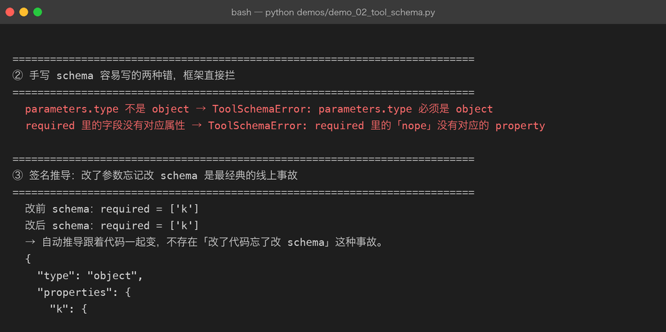
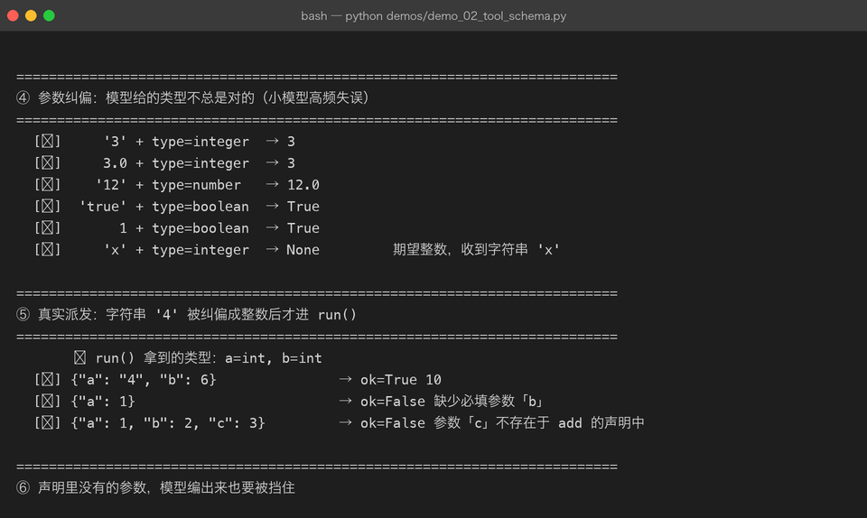

# Milestone 02 — Tool Schema：模型看到的「函数说明书」

> Milestone 01 把工具建出来了。但**模型不知道这些工具长什么样**，它只看到一组 JSON。这一章讲清三件事：一段合格的 schema 长什么样、模型给错参数时怎么办、以及「声明」和「代码」怎么保持一致。

## 1. 模型真正看到的东西

```json
{
  "type": "function",
  "function": {
    "name": "calculator",
    "description": "计算算术表达式（支持 + - * / // % 与括号，不支持变量和函数）。",
    "parameters": {
      "type": "object",
      "properties": {
        "expression": {"type": "string", "description": "算术表达式，例如 (12+8)*3/7"}
      },
      "required": ["expression"]
    }
  }
}
```

四层结构，一层都不能少：工具对象 → `type: "function"` → `function` 对象 → `parameters`。

`description` 不是装饰。它直接决定模型会不会用这个工具——写成「算数」的工具，模型问「今天几号」时也可能去调它；写成「返回当前 UTC 时间」的精确描述，误调用会明显下降。**工具描述是提示词的一部分。**

## 2. 两种手写错误，框架直接拦

```python
function_schema("broken1", "描述", {"type": "string"})
# → ToolSchemaError: parameters.type 必须是 object

function_schema("broken2", "描述", {"type": "object", "properties": {}, "required": ["nope"]})
# → ToolSchemaError: required 里的「nope」没有对应的 property
```

第二条尤其关键：`required` 里写了一个不存在的字段，在离线测试里**永远测不出来**，只有真调服务时才会 400。放在构造阶段拦，是最便宜的位置。



## 3. 签名推导：消灭「改了代码忘了改 schema」

```python
def search_old(k: int) -> str: ...          # required = ['k']
def search_new(k: int, mode: str = "fast") -> str: ...   # required = ['k']，新增 mode 且非必填
```

`function_to_schema()` 用 `inspect.signature` 读注解，映射规则：

| Python 注解 | JSON type |
|---|---|
| `str` | `string` |
| `int` | `integer` |
| `float` | `number` |
| `bool` | `boolean` |
| `list` / `list[str]` | `array` |

**有默认值的参数自动不进 `required`。** 手写 schema 时最常见的疏漏就是把所有参数都写进 `required`，导致模型被要求填一个明明有默认值的字段。

## 4. 参数纠偏：小模型的高频失误

模型给的参数不总是对的。真实项目里最常见的修法是**自动纠偏**，而不是报错：

```
[✓]     '3' + type=integer  → 3
[✓]     3.0 + type=integer  → 3
[✓]    '12' + type=number   → 12.0
[✓]  'true' + type=boolean  → True
[✓]       1 + type=boolean  → True
[✗]     'x' + type=integer  → None  期望整数，收到字符串 'x'
```

为什么纠偏比报错划算：模型把整数写成 `"3"` 时，如果直接抛错，它会陷入「重试—报错—重试」的空转，把步数烧光；而纠偏是**不改变语义**的修复，一次就过。

两个必须注意的边界：

- **布尔不是整数。** `True` 是 `int` 的子类，不拦的话 `True` 会被纠偏成 `1`。
- **纠不动就报类型错误**，不要猜。猜错的参数比不猜更糟。



## 5. 真实派发：纠偏发生在 run() 之前

```python
result = reg.call(ToolCall(id="c", name="add", arguments={"a": "4", "b": 6}))
#   ↳ run() 拿到的类型：a=int, b=int
#   [✓] {"a": "4", "b": 6}          → ok=True  10
#   [✗] {"a": 1}                    → ok=False 缺少必填参数「b」
#   [✗] {"a": 1, "b": 2, "c": 3}    → ok=False 参数「c」不存在于 add 的声明中
```

三类失败各有各的回灌文案，因为它们对模型的含义不同：

| 情况 | 回灌文案 | 模型该怎么做 |
|---|---|---|
| 未知工具 | `未知工具「x」。当前可用：…` | 换成真实工具名 |
| 缺必填 | `缺少必填参数「b」` | 补上 |
| 参数不存在 | `参数「c」不存在于 add 的声明中` | 删掉，别编 |

**文案里带上「当前可用工具列表」是关键**——否则模型只能瞎猜。

## 6. 坑与结论

**坑 1：`schemas()` 返回的是工具对象，不是内层 function。**
早期实现里 `schema_of()` 返回的是内层 `{name, description, parameters}`，`schemas()` 直接把它当数组发出去。服务端一直回 `422 missing field 'type'`，而且**离线 mock 完全复现不出来**。修法：

```python
def schemas(self):
    return [{"type": "function", "function": self.schema_of(n)} for n in self.names()]
```

**坑 2：中文检索不能用 `\w+` 切词。**
`\w` 在 Python 里能匹配汉字，所以「会话怎么落盘」会被当成**一个整串**，和语料里的「会话与多轮」永远对不上。本项目对连续汉字段额外切**二元组**（会话/话怎/怎么/么落/落盘），命中一个即部分相关。这是不引入分词库时的最小可行方案。

**坑 3：英文词要做前缀匹配，但不能子串匹配。**
输入 `project` 要能命中 `project01` 这类标记；但查询里的 `in` 绝不能被 `em**bedding**` 命中——否则任何噪声查询都永远有结果，检索工具就废了。

**结论：**
1. schema 是给模型看的说明书，`description` 属于提示词的一部分。
2. 参数纠偏优先于报错，但布尔 ≠ 整数。
3. 自动推导 schema 让「代码和声明不一致」从根上消失。

## 7. 代码位置

| 文件 | 职责 |
|---|---|
| `src/agent/tools.py` | `function_schema()` / `function_to_schema()` |
| `src/agent/registry.py` | `_coerce()` / `_prepare_kwargs()` / `assert_valid_schema()` |

## 8. 版本

v0.2 → **v0.3**，新增 12 项 schema 与纠偏相关测试，截图 2 张。
