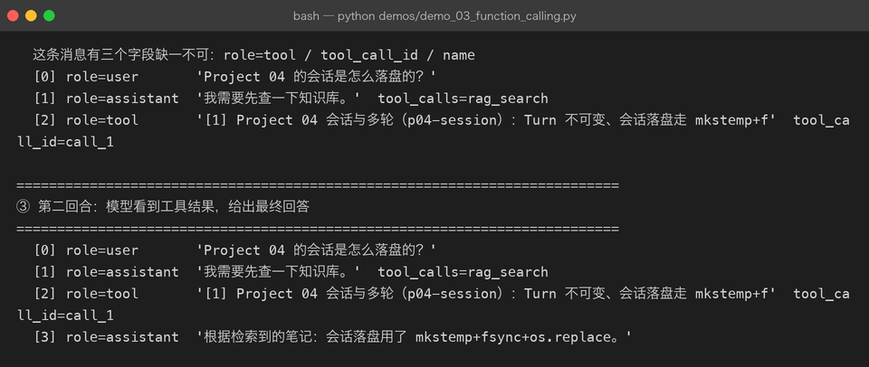
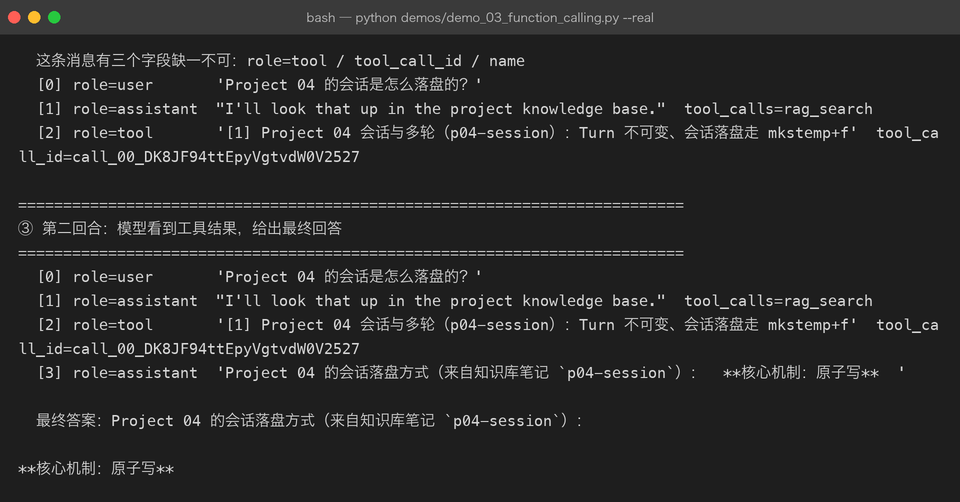

# Milestone 03 — Function Calling：模型提出调用，宿主决定执行

> Milestone 01/02 建好了工具。**但工具不会自己被调用**——它们只是死在注册表里的一段代码。这一章讲清「谁决定执行」这个问题。
>
> 答案是：**模型只提出要求，宿主负责执行。** 模型返回的是一段 `tool_calls` 声明，它不知道、也不需要知道这个工具怎么实现。

## 1. 一个完整的往返

```
[0] role=user        'Project 04 的会话是怎么落盘的？'
[1] role=assistant   "I'll look that up in the project knowledge base."  tool_calls=rag_search

   → 宿主解析出调用：id='call_00_ffDb…' name='rag_search' arguments={"query": "Project 04 的会话是怎么落盘的？", "k": 5}

[2] role=tool        '[1] Project 04 会话与多轮（p04-session）：Turn 不可变…'  tool_call_id=call_00_ffDb…

[3] role=assistant   'Project 04 的会话落盘方式（来自知识库笔记 `p04-session`）：核心机制：原子写 …'
```

上面是**真实 DeepSeek** 跑出来的结果。注意几个细节：

- 模型的思考是英文的，答案是中文的——它自由决定用哪种语言思考。
- `k: 5` 是模型自己加的参数，schema 里声明了所以它可以填。
- `id` 由模型侧生成，宿主必须原样带回。

## 2. tool 消息：三个字段缺一不可

```python
LLMMessage(role="tool", content=result.render(),
           tool_call_id=call.id, name=call.name).to_dict()
# → {"role": "tool", "content": …, "tool_call_id": …, "name": …}
```

`role` / `tool_call_id` / `name` 一个都不能少。少 `tool_call_id` 服务端直接 400，而且这种错误**在离线 mock 里永远复现不出来**——这是本项目坚持「离线测试 + 真实链路 demo」两条腿的原因之一。

## 3. 关键顺序：assistant 必须在 tool 之前

```
role 序列 = ['user', 'assistant', 'tool', 'assistant']
assistant 在索引 1，tool 在索引 2 → 顺序正确 ✓
```

协议对 tool 消息的前置条件是有对应的 assistant tool_calls。实现上就是**先追加 assistant，再追加工具结果**：

```python
messages.append(LLMMessage(role=ASSISTANT, content=reply.content, tool_calls=reply.tool_calls))
for call in reply.tool_calls:
    result = registry.call(call)
    messages.append(LLMMessage(role=TOOL, content=result.render(),
                               tool_call_id=call.id, name=call.name))
```

顺序写反的话，真实服务会报错——**离线剧本一条都测不出来**，因为它压根不发请求。



## 4. 真实链路：一次工具失败不该打死整轮任务

模型偶尔会编一个不存在的工具。正确处理是把它当成工具的一次「说话」：

```
ok = False
回灌给模型 → [工具执行失败] search_online: 未知工具「search_online」。当前可用：calculator, now, rag_search
```

模型下一轮自己会换成 `rag_search`。Milestone 04 会看到这条路径真的被用起来——连续失败三次后 Agent 才主动放弃。

## 5. LLM 抽象：为什么必须有 FakeLLM

Agent 循环里最需要确定性的是「少调用几次模型」，而不是「调用得有多酷」。如果代码里直接 `requests.post(...)`，离线测试就只能靠 mock 网络，而 mock 出来的路径和真实路径往往不是同一条。

所以这一层只定一个极小的接口：

```python
class LLM(ABC):
    def chat(self, messages, tools=None) -> LLMMessage
```

两个实现：`FakeLLM`（纯离线、脚本驱动，测试用它）和 `DeepSeekLLM`（真实 HTTP）。Agent 只认接口，换实现不动一行代码。

`FakeLLM` 会把每次输入记进 `self.calls`，这是断言「工具结果确实回灌了」的唯一依据——**接口通不等于链路对**，不记录就永远证明不了。

## 6. 真实调用踩到的三个坑

**坑 1：忘了带 Authorization 头。**
服务端回 `401 Authentication Fails`。修复后加了断言，防止再犯：

```python
assert client.calls[0]["headers"].get("Authorization", "").startswith("Bearer sk-test")
```

**坑 2：把 `tools` 拆掉外层再发。**
本来想「简化」成 `[t["function"] for t in tools]`，服务端回 `422 missing field 'type'`。正确做法是**原样透传**：

```python
payload["tools"] = [dict(t) for t in tools]   # 保留 {"type": "function", "function": {...}}
```

**坑 3：`schemas()` 返回内层对象。**
这和上面那条是同一个问题的两面。工具声明必须完整经过 `{"type": "function", "function": {...}}` 两层外壳。

三个坑有同一个特征：**都是真实 HTTP 才暴露的，本地 mock 全绿**。



## 7. 结论

1. Function Calling 的分工是「模型声明意图，宿主执行」——模型拿不到执行权。
2. tool 消息的三个字段和 assistant/tool 的先后顺序，是协议硬约束。
3. 离线测试负责「链路对」，真实链路负责「协议对」，两条都不能省。

## 8. 代码位置

| 文件 | 职责 |
|---|---|
| `src/agent/llm.py` | `LLMMessage` / `LLM` / `FakeLLM` / `ScriptedLLM` / `DeepSeekLLM` |
| `demos/demo_03_function_calling.py` | 离线剧本 + `--real` 真实链路对照 |

## 9. 版本

v0.3 → **v0.4**，真实链路跑通（DeepSeek `deepseek-chat`），截图 2 张。
