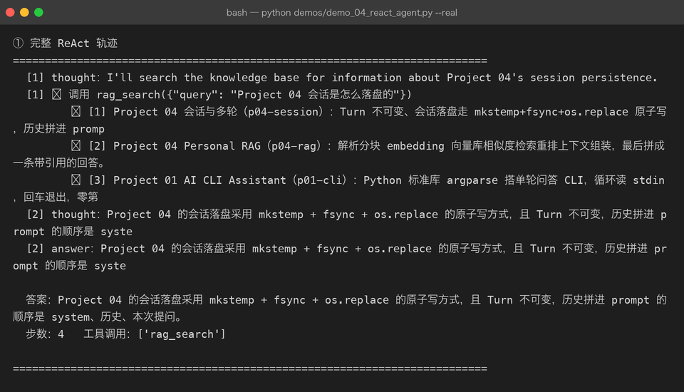
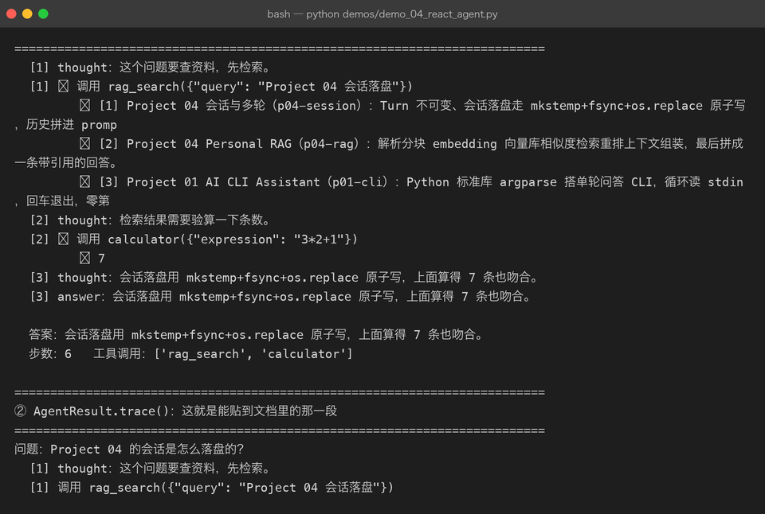
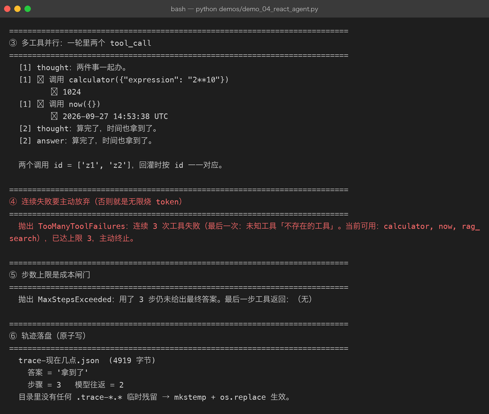
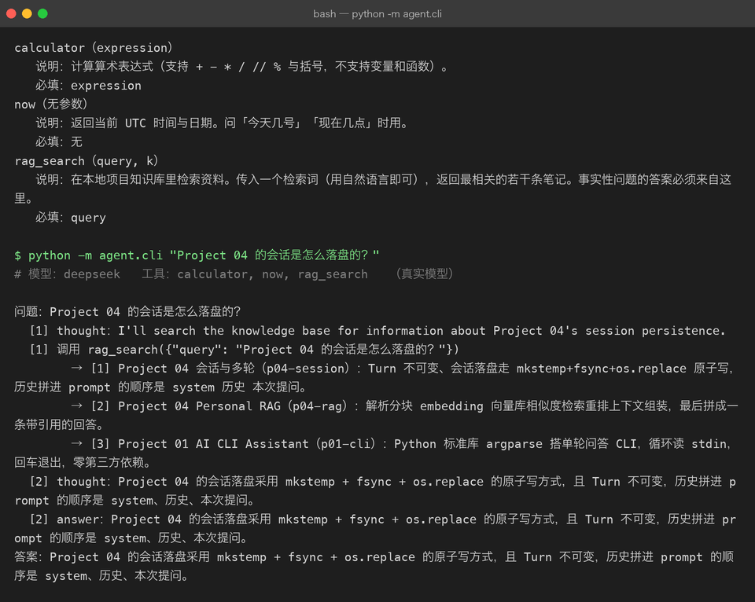

# Milestone 04 — Agent：把「想」和「做」放进同一个循环

> 前面三章把零件都备齐了。这一章把它们装成一台机器：**ReAct 循环**。
>
> ReAct = Reason + Act。传统工作流是「代码决定先做什么」；Agent 是「模型决定先做什么，做完再看结果决定下一步」。差别不在写法，在**控制权在谁手里**。

## 1. 循环的全部代码

```python
messages = [system, 用户问题]
for index in 1..max_steps:
    reply = llm.chat(messages, tools=registry.schemas())

    messages.append(assistant(reply.content, reply.tool_calls))   # ①
    if not reply.tool_calls:
        return AgentResult(answer=reply.content, steps=steps)     # 出答案

    for call in reply.tool_calls:
        result = registry.call(call)                              # ② 永不抛异常
        messages.append(tool(result.render(), call.id, call.name))  # ③
```

三行注释就是 Agent 的全部。但每一行的位置都有讲究。

## 2. 真实轨迹

问题：「Project 04 的会话是怎么落盘的？」

```
[1] thought：I'll look that up in the project knowledge base.
[1] ✓ 调用 rag_search({"query": "Project 04 的会话是怎么落盘的？", "k": 5})
       ↳ [1] Project 04 会话与多轮（p04-session）：Turn 不可变、会话落盘走 mkstemp+fsync+os.replace 原子写…
[2] thought：Project 04 的会话落盘采用原子写：先 mkstemp 建临时文件，写入后 fsync，再用 os.replace 替换…
[2] answer：Project 04 的会话落盘采用原子写：先 mkstemp 建临时文件，写入后 fsync，再用 os.replace 替换目标文件…

答案：…Turn 本身不可变，历史拼进 prompt 的顺序是 system → 历史 → 本次提问。
步数：4   工具调用：['rag_search']
```

这是真实 DeepSeek 跑出来的。**注意 `k: 5` 是模型自己加的**——它从 schema 里看到这个可选参数，认为 5 条更够用。这就是「模型自主决定」的具体含义。

答案里的 `system → 历史 → 本次提问` 三个要素，全部来自工具返回的那段文本，**没有任何一句是模型凭记忆生成的**。



## 3. 三个容易写错的地方

**① assistant 消息必须在工具结果之前追加。**
协议对 tool 消息的前置条件是有对应的 assistant tool_calls，缺了直接 400。离线 mock 完全复现不出来。

**② 工具异常不往上抛。**
`ToolResult.error` 当文本回灌，模型大概率换个参数重试；抛异常等于把整轮任务打死。

**③ 必须有步数上限。**
模型偶尔会进入「换个思路—再调用—再换个思路」的空转，没有上限就会一直烧 token：

```
抛出 MaxStepsExceeded：用了 3 步仍未给出最终答案。最后一步工具返回：（无）
```

`max_steps` 这一个数字就是 Agent 的**成本闸门**，它不是安全冗余而是经济约束。



## 4. 多工具并行

一轮里模型可以给出多个 `tool_calls`：

```
[1] thought：两件事一起办。
[1] ✓ 调用 calculator({"expression": "2**10"})   ↳ 1024
[1] ✓ 调用 now({})                                ↳ 2026-09-27 14:49:33 UTC
[2] thought：算完了，时间也拿到了。

两个调用 id = ['z1', 'z2']，回灌时按 id 一一对应。
```

并行调用在多轮里很常见（「查 A 也查 B」）。**回灌靠 `tool_call_id` 对应**，这也是协议里 id 不可省略的原因。

## 5. 两条闸门

Agent 需要两道闸，一道防「失败」，一道防「空转」：

```python
TooManyToolFailures: 连续 3 次工具失败（最后一次：未知工具「不存在的工具」…），已达上限 3，主动终止。
MaxStepsExceeded:    用了 3 步仍未给出最终答案。
```

两类失败处理策略完全不同：

| 情况 | 闸门 | 理由 |
|---|---|---|
| 连续 `max_tool_failures` 次工具报错 | 抛 `TooManyToolFailures` | 说明工具或参数约定有系统性问题，重试无意义 |
| 用满 `max_steps` 仍未回答 | 抛 `MaxStepsExceeded` | 说明模型在空转，继续花钱没有边际收益 |

**但成功一次就清零计数**——「失败—成功—失败—失败」不该被当成连续失败。



## 6. 轨迹落盘：可复现的证据

Agent 出问题时最需要的是「它到底做了什么」。`trace_dir` 会把整条轨迹写成 JSON：

```
trace-现在几点.json  (4367 字节)
  答案 = '拿到了'
  步骤 = 3   模型往返 = 2
目录里没有任何 .trace-*.* 临时残留 → mkstemp + os.replace 生效。
```

写文件用 `mkstemp` + `fsync` + `os.replace()` 原子写——和 Project 04 的会话落盘同一套做法，保证进程中途被杀不会留下半个 JSON。

## 7. 命令行入口：不写代码也能跑一个 Agent

前面所有验证都是通过 Python 调用做的。`cli.py` 把整条链路收成两条命令：

```
$ python -m agent.cli --list-tools
calculator（expression）
   说明：计算算术表达式（支持 + - * / // % 与括号，不支持变量和函数）。
   必填：expression
now（无参数）
   说明：返回当前 UTC 时间与日期。问「今天几号」「现在几点」时用。
   必填：无
rag_search（query, k）
   说明：在本地项目知识库里检索资料……
   必填：query
```

没有 `DEEPSEEK_API_KEY` 时它不会崩，而是**自动降级到离线剧本**并在 stderr 打印一行 `[warn]`——这就是 `build_llm` 里那句判断的作用：



写这段时踩到一个连带 bug：前面为了修 422 把 `ToolRegistry.schemas()` 改成返回**完整工具对象**（`{"type":"function","function":{...}}`），`cli.py` 里还在按「内层的 name/parameters」读，于是 `--list-tools` 直接 `KeyError: 'parameters'`。**同一个结构改动有 4 处调用点，测试只覆盖到发给模型的那一处，命令行的那一处没人看。**

## 8. 结论

1. Agent 循环只有 15 行，但**顺序和兜底策略**占其中 80%。
2. 步数上限不是保险，是成本闸门。
3. 轨迹落盘是排查 Agent 问题的唯一手段，没有之一。
4. 改结构要数调用点，不能只数测试。

## 9. 下一步

Milestone 05 会把这个循环接上真实的多步骤任务（查多个主题、跨步骤汇总），并引入短期记忆的管理策略——**循环之外的状态管理**是一直缺失的一环。

## 10. 代码位置

| 文件 | 职责 |
|---|---|
| `src/agent/agent.py` | `ReActAgent` / `Step` / `AgentResult` / 轨迹落盘 |
| `src/agent/settings.py` | `AgentSettings`（`max_steps` / `max_tool_failures`） |
| `src/agent/cli.py` | `python -m agent.cli "问题"` / `--list-tools` / `--mock` / `--trace` |
| `demos/demo_04_react_agent.py` | 离线轨迹 + `--real` 真实链路 |
| `tests/test_cli.py` | 命令行入口回归（含 422 结构改动的连带 bug） |

跑起来：

```bash
cd projects/05-agent-mcp
.venv/bin/pip install -e .
.venv/bin/python -m agent.cli --list-tools
DEEPSEEK_API_KEY=xxx .venv/bin/python -m agent.cli "Project 04 的会话是怎么落盘的？"
```

## 11. 版本

v0.4 → **v0.5**，Agent 循环落地，离线真实双路跑通，CLI 入口可用，测试 103 passed，截图 5 张。
