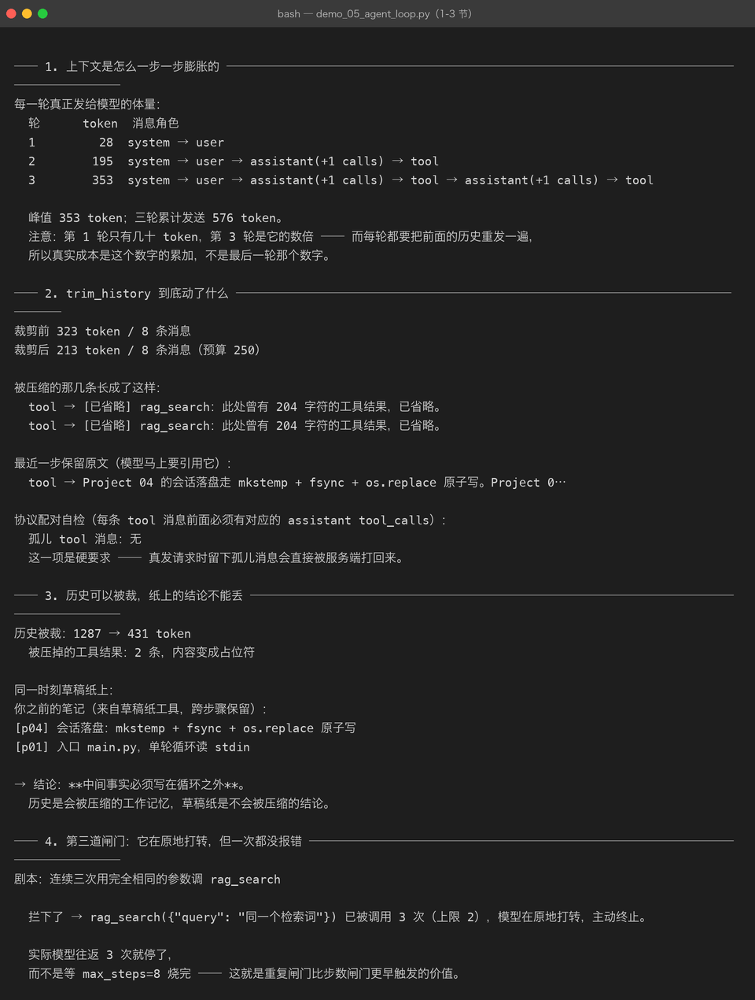
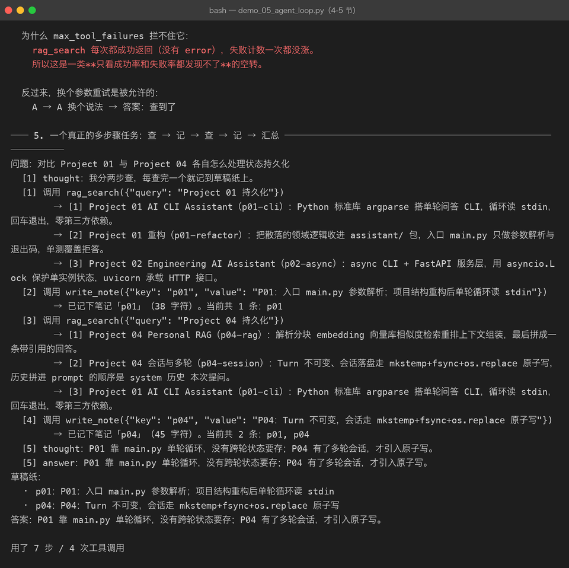
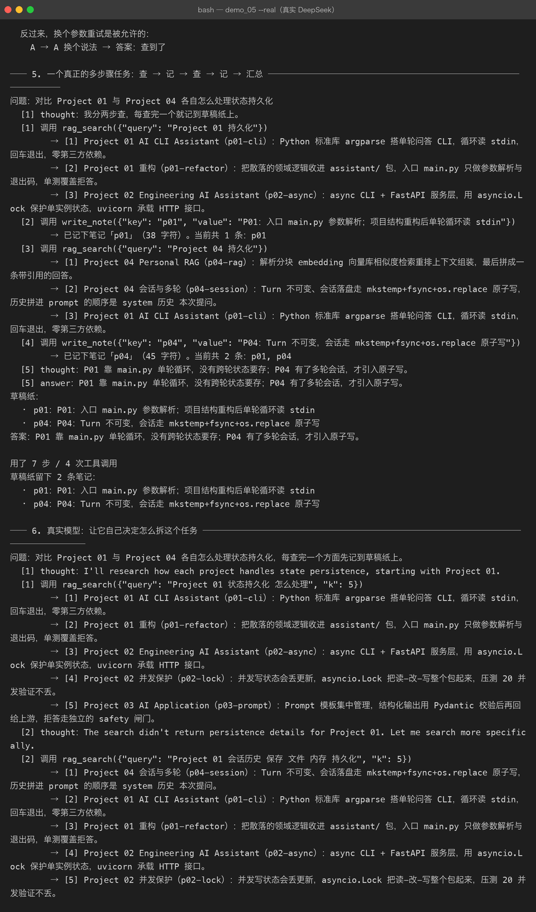

# Milestone 05 — Agent Loop：循环之外的状态管理

Milestone 04 把 ReAct 循环写出来了：想一步、调一次工具、把结果塞回对话、再想一步。它跑得通单步任务，也跑得通「问一句答一句」的简单多轮。但真把它拿去做**多步骤任务**的时候，三个问题立刻浮出水面：

1. **上下文在膨胀** —— 每一步的工具结果都堆进同一个 messages 列表，而每一轮都要把整段历史**重发一遍**
2. **中间结论没地方放** —— 模型第 2 步查到的事实只活在 assistant 的 content 里，一旦为了省 token 把历史裁掉，结论跟着没了
3. **多出的空转形态拦不住** —— 反复用同样的参数调同一个工具，每次都成功，失败闸门一次都没涨

这一章就是补这三件事：`memory.py`（工作记忆 + 草稿纸）、第三道闸门（`max_repeats`）、以及一个真的跑完的多步骤任务。

---

## 1. 先看清成本：每一轮都在重发历史

真实一次多步骤任务跑下来，每一轮**发出去的体量**是这样（用 `estimate_messages_tokens` 量的）：

```
轮      token     消息数      其中占位
1        244       2         0
2        530       4         0
3        829       6         0
4        848       9         2
5        882      11         4
6        951      13         5
7        847       8         2

累计发送 5131 token
```

关键不是「峰值 951」而是「**累计 5131**」。多步骤任务的账单按累计算：第 N 轮要把前 N-1 轮的全部历史再付一遍钱。所以降成本的杠杆有两个：少走几步、把历史压薄。这一章管第二个。



---

## 2. trim_history：压缩历史，但不能破坏协议

裁剪规则（优先级从高到低）：

| 优先级 | 内容 | 理由 |
|---|---|---|
| 1 | `system` 永不裁剪 | 工作规则丢了，Agent 就退化成裸模型 |
| 2 | 第一条 `user` 问题永不裁剪 | 模型不知道自己在回答什么 |
| 3 | 最近 `keep_recent_steps` 轮保留原文 | 那几步是它马上要引用的内容 |
| 4 | 更早的工具结果替换成占位行 | 模型知道「有过但读不到」，不会以为没查过 |
| 5 | **assistant(tool_calls) 与它的 tool 消息同进同出** | 协议要求的是**配对**，不是先后 |

第 5 条是最容易写错、而且**只有真发请求才会暴露**的一类 bug：只砍掉 assistant、留下它的 tool 消息，服务端直接打回来；本地 mock 一句怨言都没有。这和 Milestone 03 讲的顺序坑是同一个根因。

占位行长这样：

```
[已省略] rag_search：此处曾有 204 字符的工具结果，已省略。
```

**写明被省略了多少字符**是刻意的 —— 模型看到「有过 204 字符」和看到「什么都没有」，后续的决策不一样。

裁剪真的会生效，看第 4 轮开始出现占位就知道：

```
裁剪前 323 token / 8 条消息
裁剪后 213 token / 8 条消息（预算 250）
  被压缩：tool → [已省略] rag_search：此处曾有 204 字符的工具结果，已省略。
  最近一步保留原文：tool → Project 04 的会话落盘走 mkstemp + fsync + os.replace 原子写。…
  协议配对自检 → 孤儿 tool 消息：无
```

另外两个实现细节值得记：

- **trim 返回新列表，不原地改**。`RecordingLLM.transcript` 存的是同一批对象的引用，原地改写会让「日志里看到的历史」和「实际发出去的历史」对不上，排查时看到的就不是真相
- **token 估算只用来做决策，不用来做计费**。中文是这条铁律最容易被忽略的地方：1 个汉字接近 1 个 token，按「字符数 // 4」的英文经验公式会严重低估

---

## 3. Scratchpad：历史会被裁，纸上的结论不会

这是整章的立论。做一次实验：

```
历史被裁：1287 → 431 token
  被压掉的工具结果：2 条，内容变成占位符

同一时刻草稿纸上：
[p04] 会话落盘：mkstemp + fsync + os.replace 原子写
[p01] 入口 main.py，单轮循环读 stdin
```

历史是**会被压缩的工作记忆**，草稿纸是**不会被压缩的结论**。

实现上它被做成两个工具（`write_note` / `read_notes`）而不是 prompt 里的一个字段 —— 记什么、什么时候读，由模型自己决定，控制权还在它手上。同时给 `Scratchpad` 的 `render()` 常驻在 system 提示里，省掉一轮 `read_notes` 的往返（多步骤任务里省一轮就是实打实省钱）。

**这里踩了一个真坑**：给 `Scratchpad` 加了 `__len__` 之后，**空草稿纸在布尔判断里是假值**：

```python
pad = Scratchpad()      # 刚建好，一张空纸
assert bool(pad) is False   # ← 因为 __len__ == 0
```

于是 `build_agent` 里那句 `if scratchpad:` 把刚建好的空纸当成「没传」，草稿纸工具一个都没注册上。这个 bug 离线测试看不出来（测试都是直接传 Registry，从没走过空纸这条分支），是给 CLI 加 `--notes` 入口时才暴露的。修法是调用点一律写 `is not None`，并用 `test_empty_pad_is_falsy` 把这条约定钉住。

同一张纸必须被两个工具共享，所以纸在 `cli.py` / `build_agent` 里建一次再往下分发 —— 让两个工具各 `new` 一张，就变成两张互不相通的纸。

---

## 4. 第三道闸门：它没报错，只是在原地打转

Milestone 04 有两道闸门：`max_steps`（成本）和 `max_tool_failures`（连续失败）。多步骤任务补上第三种失效形态：

```
剧本：连续三次用完全相同的参数调 rag_search

拦下了 → rag_search({"query": "同一个检索词"}) 已被调用 3 次（上限 2），
        模型在原地打转，主动终止。

实际模型往返 3 次就停了，而不是等 max_steps=8 烧完。
```

为什么 `max_tool_failures` 拦不住它：`rag_search` **每次都成功返回**，没有 error，失败计数一次都没涨。这是一类只看成功率/失败率都为正常的空转，必须靠签名计数识别。

两个实现细节：

- 签名用 `json.dumps(arguments, sort_keys=True)`。模型可能把 `{"a":1,"b":2}` 写成 `{"b":2,"a":1}`，那是同一次调用 —— 不做排序，换个键顺序就能绕过闸门
- 它在 `max_steps` **之前**触发才有意义，否则只是多烧几次钱的装饰品（有测试专门钉这一条）



三道闸门对照：

| 闸门 | 拦什么 | 触发信号 |
|---|---|---|
| `max_steps=8` | 兜底的成本天花板 | 轮数用尽 |
| `max_tool_failures=3` | 报错型空转 | 连续 `ToolResult.error`（成功一次清零） |
| `max_repeats=2` | **成功型空转** | 同一「工具名 + 参数」被调用太多次 |

---

## 5. 一个真的跑完的多步骤任务

离线剧本（确定性，截图对得上）：查 P01 → 记笔记 → 查 P04 → 记笔记 → 汇总。

```
问题：对比 Project 01 与 Project 04 各自怎么处理状态持久化
  [1] thought：我分两步查，每查完一个就记到草稿纸上。
  [1] 调用 rag_search({"query": "Project 01 持久化"})
        → [1] Project 01 AI CLI Assistant（p01-cli）…
        → [2] Project 01 重构（p01-refactor）…
  [2] 调用 write_note({"key": "p01", ...})
        → 已记下笔记「p01」（38 字符）。当前共 1 条：p01
  [3] 调用 rag_search({"query": "Project 04 持久化"})
  [4] 调用 write_note({"key": "p04", ...})
        → 已记下笔记「p04」（45 字符）。当前共 2 条：p01, p04
  [5] answer：P01 靠 main.py 单轮循环，没有跨轮状态要存；P04 有了多轮会话，才引入原子写。

用了 7 步 / 4 次工具调用 / 草稿纸 2 条
```

真实 DeepSeek 跑同一个问题时，模型的行为更值得看：



- 它自己决定**分两次检索**（第 1 轮查 P01，第 2 轮一轮里并行发两个 `rag_search`）
- 第 4 轮才写笔记，而且**写在比较之后** —— 「先记下来」和「先比对再挑重点记」是两种策略，模型选了后者
- 最后一步直接给答案，没有再调 `read_notes`（笔记常驻在 system 里，省掉了这一轮）
- 12 步 / 7 次工具调用 / 草稿纸 2 条，答案里同时用上了两条笔记的内容

这就是 Plan → Act → Observe 的完整闭环：** Observe 的结果落在草稿纸上，而不是留在随时会被裁的对话流里。**

---

## 6. 这一章踩到的坑与结论

| # | 坑 | 怎么发现的 | 修法 |
|---|---|---|---|
| 1 | 空 `Scratchpad` 在布尔判断里是假值（`__len__` 导致） | 跑 `build_agent(scratchpad=True)` 发现工具没注册 | 调用点一律 `is not None` + 钉测试 |
| 2 | `build_agent()` 的默认分支 `FakeLLM` 没 import | 第一次真的调用 `build_agent()` | 补导入 + 加测试覆盖默认值分支 |
| 3 | 剧本里给了 content 却没给 tool_calls | demo 第 1 步就被当成最终答案结束了 | 思考与调用要写在同一条 assistant 消息里 |
| 4 | 加了重复闸门后，老的 `max_steps` 测试语义变了 | `test_max_steps_exceeded` 开始抛 `RepeatedToolCall` | 测试里每步参数改成不一样 —— 新闸门不是 bug，是它拦住了原本要靠烧满步数才停的空转 |

结论：

1. 多步骤任务的成本 = **每轮重发历史的累加**，不是最后一轮那个数字。
2. 裁剪必须**整轮配对**地裁，留下孤儿 tool 消息会被服务端打回。
3. 中间结论必须写在**循环之外**（草稿纸），写在历史里迟早被裁掉。
4. 空转分两种：报错的（失败闸门管）和**成功但原地打转的**（重复闸门管）。
5. 改结构要数调用点 —— 这一章新加的东西，每个入口（CLI / build_agent / 测试）都要跑到。

## 7. 代码位置

| 文件 | 职责 |
|---|---|
| `src/agent/memory.py` | `estimate_tokens` / `estimate_messages_tokens` / `trim_history` / `Scratchpad` |
| `src/agent/tools.py` | `WriteNoteTool` / `ReadNotesTool` / `default_tools(pad)` |
| `src/agent/agent.py` | 循环里的三处新增：重复计数、工作记忆裁剪、system 注入笔记 |
| `src/agent/errors.py` | `RepeatedToolCall` |
| `src/agent/settings.py` | `max_repeats` / `context_budget` / `keep_recent_steps` |
| `src/agent/cli.py` | `--notes` 开关（挂载草稿纸工具并在末尾打印笔记） |
| `tests/test_memory.py` | 23 项：估算 / 裁剪 / 孤儿消息 / 草稿纸 |
| `tests/test_agent_loop.py` | 19 项：重复闸门 / 循环内裁剪 / 多步骤组合 |
| `demos/demo_05_agent_loop.py` | 6 节真实演示，支持 `--real` |

```bash
cd projects/05-agent-mcp
.venv/bin/python demos/demo_05_agent_loop.py
DEEPSEEK_API_KEY=xxx .venv/bin/python demos/demo_05_agent_loop.py --real
.venv/bin/python -m agent.cli --notes --real "对比 Project 01 与 Project 04 的持久化方式"
```

## 8. 下一步

Milestone 06 做**任务分解**：这一章的拆解是模型在 thought 里自己想出来的，下一步要把它变成结构化的东西 —— 一个显式的 `Plan`（子任务 + 依赖 + 完成状态），让多个 Agent 能各自领走一部分，也就是 Multi-Step Task 到 Agent Workflow 的那一步。

## 9. 版本

v0.5 → **v0.6**，工作记忆 + 草稿纸 + 第三道闸门落地，离线真实双路跑通，`python -m agent.cli --notes` 可用，测试 103 → **146 passed**，截图 12 → **15 张**。
