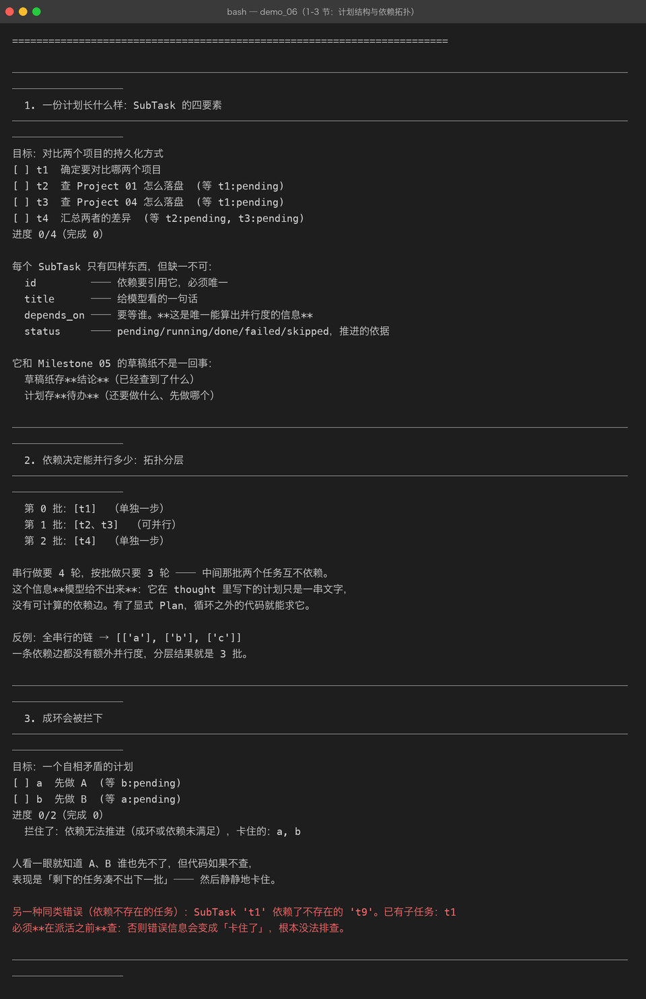
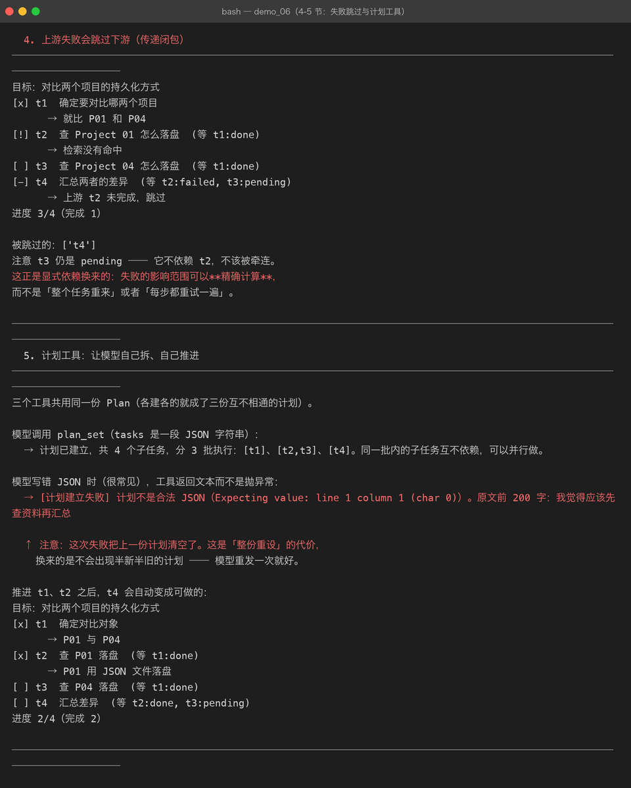
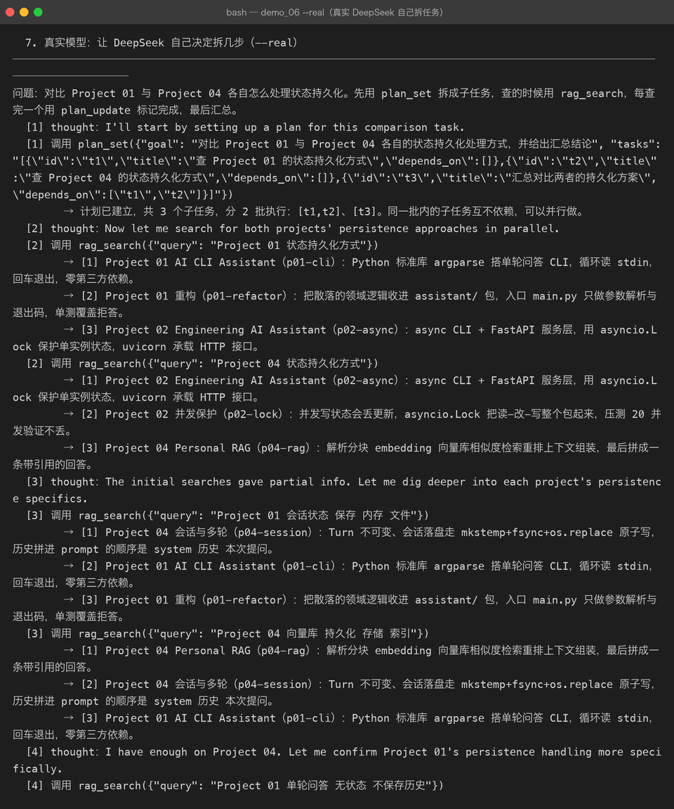
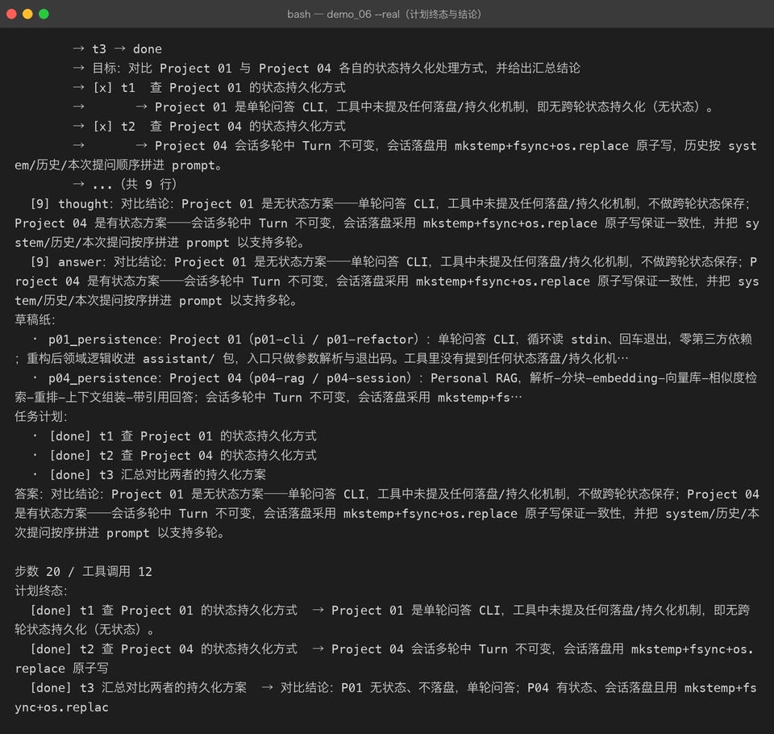

# Milestone 06 — Multi-Step Task：把计划从模型脑子里拿出来

> 上一章（Milestone 05）解决了「中间结论往哪放」——草稿纸。
> 但草稿纸记的是**已经查到的东西**，它回答不了一个更要紧的问题：
> **还要做什么、先做哪个、哪些能同时做。**

## 1. M05 留下的缺口

Milestone 05 的多步骤任务跑通了，但那份「计划」只存在于模型的 thought 里：

```
[1] thought：我先查 P01，再查 P04，最后对比。
[2] 调用 rag_search(...)
[3] thought：接下来查 P04。
```

短任务没问题。步骤一多，三件事就开始出错：

1. **忘记自己列过什么** —— 第 5 步时已经不记得第 1 步说要做的第三件事。
2. **重复做已经做完的** —— 历史被 token 预算裁掉后，它以为还没查过。
3. **依赖没满足就硬做** —— 「汇总」需要两个查询结果，但它只查了一个就开始写结论。

前两个 Milestone 05 已经用草稿纸和裁剪缓解了。第三个是这一章要解决的：
**把计划变成显式的、可检查的数据结构**。

## 2. Plan / SubTask

```python
@dataclass
class SubTask:
    id: str
    title: str
    depends_on: tuple[str, ...] = ()   # 要等谁
    status: str = PENDING              # pending/running/done/failed/skipped
    result: str = ""
```

四个字段，缺一不可。`depends_on` 是**唯一能算出并行度的信息** —— 其余三个字段只是给模型看的。

它和草稿纸的区别必须说清楚，两者很容易被合成一个：

| | 存什么 | 谁在读 |
|---|---|---|
| `Scratchpad`（M05） | **结论** ——「P01 用 JSON 落盘」 | 模型读回来用 |
| `Plan`（M06） | **待办** ——「还要查 P04」 | 循环之外的代码用来推进 |

`demos/out/demo_06_multi_step.txt` 第 1 节的真实输出：



## 3. 依赖决定能并行多少

有了显式的依赖边，`Plan.batches()` 就能做 Kahn 分层 —— **这是模型给不出来的信息**。
它在 thought 里写下的计划只是一串文字，没有可计算的边。

菱形依赖（t1 → (t2 ∥ t3) → t4）的真实分层结果：

```
第 0 批：[t1]  （单独一步）
第 1 批：[t2、t3]  （可并行）
第 2 批：[t4]  （单独一步）
```

串行做要 4 轮，按批做只要 3 轮。全串行的链则退化成 3 批 —— 一条依赖边都没有额外并行度。

## 4. 成环会被拦下

模型真会写出 A→B→A。人一眼看出不对，代码不查就会**静静地卡住**：
剩下的任务凑不出下一批，循环结束但任务没做完 —— 而且日志里看不出原因。

```
拦住了：依赖无法推进（成环或依赖未满足），卡住的：a, b
```

还有一类同源错误：**依赖指向不存在的任务**（`depends_on=["t9"]` 而没有 t9）。
必须在**派活之前** `validate()`，否则错误信息会变成「卡住了」，根本没法排查。

## 5. 上游失败会跳过下游（传递闭包）

这是显式依赖换来的第二个好处：**失败的影响范围可以精确计算**。

t2 失败时，`skip_downstream("t2")` 会沿依赖边一路传下去 —— 菱形里 t4 被跳过，
**但 t3 不受影响**（它不依赖 t2）：

```
[x] t1  确定要对比哪两个项目  → 就比 P01 和 P04
[!] t2  查 Project 01 怎么落盘  → 检索没有命中
[ ] t3  查 Project 04 怎么落盘
[-] t4  汇总两者的差异  → 上游 t2 未完成，跳过
```

不是「整个任务重来」，也不是「每步都重试一遍」—— 上游失败了，下游的输入根本不存在，
重试只会再失败一次。

## 6. 三个计划工具

计划由**模型自己维护**，不是一个写死的流程：

| 工具 | 作用 |
|---|---|
| `plan_set` | 整份重设计划（tasks 是一段 JSON），返回分了几批 |
| `plan_update` | 推进某个子任务的状态；标 failed 会连带跳过下游 |
| `plan_view` | 查看当前计划与进度 |

两个设计选择值得记下来：

**为什么是「整份重设」而不是「逐个 add」**：增量操作一旦中间某步失败，
就留下半新半旧的计划。代价是模型写坏 JSON 时会把计划清空 —— 但重发一次就好。

**工具层不抛异常**：和本项目其它地方一致，错误变成模型看得见的文本，它才知道要改：

```
→ [计划建立失败] 计划不是合法 JSON（Expecting value: line 1 column 1 (char 0)）。
   原文前 200 字：我觉得应该先查资料再汇总
```

`parse_tasks()` 会宽容地提取 ```json 代码块里的 JSON —— 模型十次有八次会这么包。

计划**每一轮都会重新渲染进 system 提示**（`_system_text()`），所以模型看到的永远是最新进度，
不会因为照着开局那份过时的计划而重复做事。



## 7. 真实模型：它自己决定拆几步

用 DeepSeek 跑「对比 P01 与 P04 的状态持久化」，提示词里只说「先用 plan_set 拆成子任务」，
**没告诉它拆几步、哪些能并行**。

它自己建了 3 个子任务，并且正确识别出前两个互不依赖：

```
[1] 调用 plan_set({...})
    → 计划已建立，共 3 个子任务，分 2 批执行：[t1,t2]、[t3]。
      同一批内的子任务互不依赖，可以并行做。
[2] 调用 rag_search({"query": "Project 01 状态持久化方式"})
    调用 rag_search({"query": "Project 04 状态持久化方式"})      ← 自己并行发了两个
[5] 调用 write_note({"key": "p01_persistence", ...})
    调用 write_note({"key": "p04_persistence", ...})
[6] 调用 plan_update({"id": "t1", "status": "done", ...})
```



最终 20 步、12 次工具调用，三个子任务全部 done：



结论本身也对：P01 是无状态（单轮 CLI，不落盘），P04 是有状态（会话 `mkstemp+fsync+os.replace` 原子写）。

## 8. 踩到的坑

**坑 1：`PlanViewTool.schema()` 传了 `{}`。**
没有参数的工具也要写完整的 object 壳：

```python
# 错：会被 M02 那条校验拦下（parameters.type 必须是 object）
function_schema(self.name, self.description, {})
# 对
function_schema(self.name, self.description, {"type": "object", "properties": {}, "required": []})
```

这个错是在**跑 demo 时**才炸的，单测没覆盖到 —— 因为它只在「工具真的被注册进 registry」
这条路径上才会触发。教训：**schema 校验要在构造时就做，而不是等发出去。**

**坑 2：离线剧本里忘了更新 t1，计划终态出现 `[pending] t1`。**
这不是 bug，是**真实会发生的现象**：模型也会漏更状态。
所以 `AgentResult.plan` 存的是**快照**，事后能看出「它说要做 4 件，实际只标了 3 件」。

**坑 3：`skip_downstream` 一开始只跳一层。**
A 失败 → B 跳过 → 但 C（依赖 B）还在 pending。改成 while 循环的传递闭包后才对。

## 9. 结论

1. **计划是数据，不是想法。** 只有变成数据，循环之外的代码才能算并行度、查环、做失败传播。
2. **依赖边是并行度的唯一来源。** 模型写不出可计算的边，这就是显式 Plan 的价值。
3. **计划由模型维护，由代码保障。** 它自己拆、自己推进；代码负责别让它写出成环的计划、
   别让失败沿着依赖边污染下游。

## 10. 代码位置

| 文件 | 职责 |
|---|---|
| `src/agent/plan.py` | `Plan` / `SubTask` / `batches()` / `skip_downstream()` / 环检测 |
| `src/agent/tools.py` | `PlanSetTool` / `PlanUpdateTool` / `PlanViewTool` / `plan_tools()` |
| `src/agent/agent.py` | `ReActAgent.plan`；计划每轮渲染进 system；`AgentResult.plan` 快照 |
| `tests/test_plan.py` | 41 项：拓扑分层、环检测、传递闭包跳过、工具共享 |
| `demos/demo_06_multi_step.py` | 6 节离线演示 + `--real` 真实链路 |

## 11. 版本

v0.6 → **v0.7**，Multi-Step Task 落地：显式计划 + 依赖拓扑 + 计划工具，
离线真实双路跑通（真实 20 步 / 12 次工具调用 / 3 个子任务全 done），
测试 146 → 187 passed，截图 15 → 19 张。
