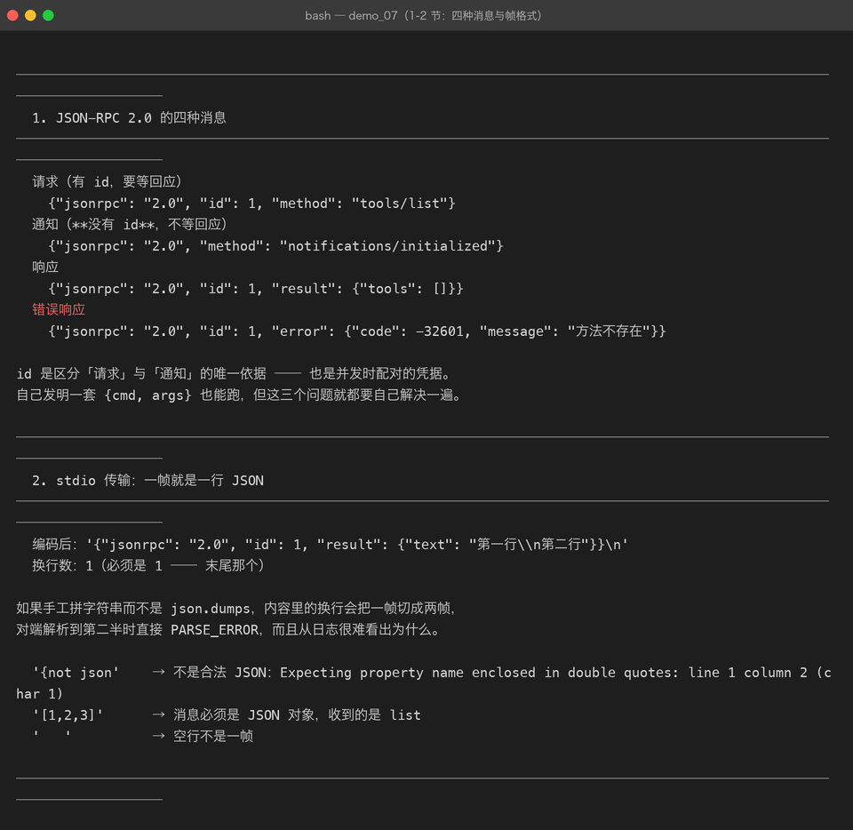
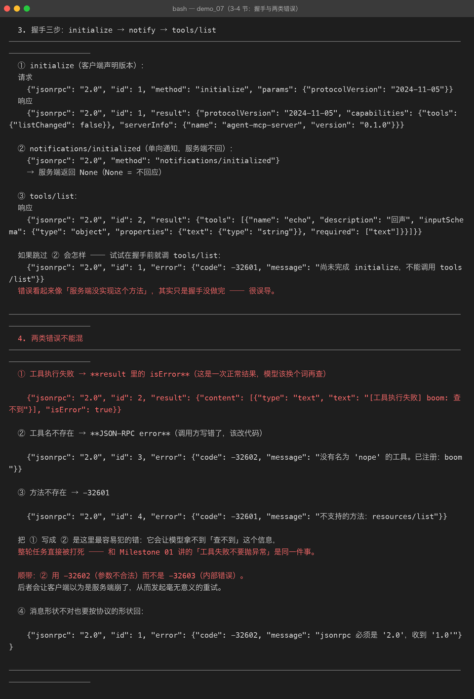

# Milestone 07 — MCP 协议：把工具从进程里拿出来

> 到这里为止（Milestone 01–06），工具都是**写在进程里的类**：
> Agent 和工具同一个 Python 进程，调用就是一次函数调用。
> 这带来一个很实际的限制：工具换个项目就要复制一份代码，
> 想用别人写的工具就得把他的源码搬进来。

## 1. 为什么要 MCP

MCP（Model Context Protocol）解决的是这一件事：

```
Agent ──（MCP over stdio / HTTP）──> MCP Server（工具真正所在的地方）
```

Server 可以是 Python 写的、Node 写的、Go 写的 —— 客户端不需要知道。
这一章只做**协议层**，Milestone 08/09 才是两端。

## 2. 为什么是 JSON-RPC 2.0

自己发明一套 `{cmd: "search", args: [...]}` 也能跑，但三个问题本来不用自己解决：

| 问题 | JSON-RPC 的答案 |
|---|---|
| 并发时响应怎么配对 | `id` |
| 「方法不存在」和「参数不对」怎么区分 | 标准错误码 |
| 有些消息不需要回应 | notification（**不带 id**） |

## 3. 四种消息

```
请求    {"jsonrpc":"2.0","id":1,"method":"tools/list","params":{}}
通知    {"jsonrpc":"2.0","method":"notifications/initialized"}          ← 没有 id
响应    {"jsonrpc":"2.0","id":1,"result":{...}}
错误    {"jsonrpc":"2.0","id":1,"error":{"code":-32601,"message":"..."}}
```

`id` 是区分请求与通知的**唯一依据**。解析失败时我们根本不知道对方想问什么，
协议允许这种时候回 `"id": null`。

标准错误码：

| 码 | 含义 |
|---|---|
| -32700 | 解析失败（不是合法 JSON） |
| -32600 | 请求不合法 |
| -32601 | 方法不存在 |
| -32602 | 参数不合法 |
| -32603 | 服务端内部错误 |



## 4. stdio 的帧格式：一行一个 JSON

为什么不用 HTTP：Server 是客户端**自己拉起来的子进程**，用 stdin/stdout 最省事 ——
不用挑端口、不用处理防火墙、进程退出连接自然就没了。

代价只有一个：**消息内部不能有裸换行**。

```
编码后：'{"jsonrpc": "2.0", "id": 1, "result": {"text": "第一行\\n第二行"}}\n'
换行数：1（必须是 1 —— 末尾那个）
```

只要走 `json.dumps` 就是安全的，因为 `\n` 会被转义成 `\\n`。
**手工拼字符串**的话，一条带换行的工具输出会把一帧切成两帧，
对端解析到第二半时直接 PARSE_ERROR —— 而且从日志很难看出为什么。

## 5. MCP 的三个核心方法

| 方法 | 作用 | 要回应吗 |
|---|---|---|
| `initialize` | 握手，协商协议版本、交换双方能力 | 要 |
| `tools/list` | 列出可用工具 | 要 |
| `tools/call` | 调用一个工具 | 要 |
| `notifications/initialized` | 客户端初始化完成 | **不要**（notification） |

握手顺序是 `initialize` → `notifications/initialized` → 其它方法。
本项目服务端会在握手前拒绝一切调用，这不是刁难：服务端需要知道客户端的能力才能正确工作。

跳过 notify 那一步的表现是「tools/list 返回 method not found」——
错误信息看起来像服务端没实现这个方法，**非常误导**。



## 6. 协议版本

```
PROTOCOL_VERSION = "2024-11-05"        # 第一个被广泛实现的版本
SUPPORTED_VERSIONS = ("2024-11-05", "2025-03-26")
```

`initialize` 时客户端声明自己能用的版本，服务端回它选的。
版本不一致时本项目**不报错而是回服务端支持的**，由客户端自己决定要不要继续 ——
对教学实现来说，协商比拒绝有用。

## 7. 踩到的坑

**坑 1：校验要做在分发之前。**
一个缺 `method` 的消息如果直接走到 dispatch，抛出来的是 `KeyError`
而不是「请求不合法」，排查方向完全错了。所以 `handle()` 第一件事是 `parse_message()`。

**坑 2：通知也要走校验，但规则不同。**
通知只需要有 `method`，没有 `id`。一开始我把两者用同一套规则查，
结果是所有 notification 都被判为非法。

**坑 3：协议错误也要按协议的形状回。**
`handle()` 里 `parse_message` 抛异常时不能让异常往外冒 ——
要回一条 `make_error(req_id, INVALID_PARAMS, ...)`，否则对端收到的是连接断开，
完全不知道自己哪里错了。

## 8. 结论

1. 用 JSON-RPC 而不是自创格式，省下的是**配对、错误语义、单向消息**这三件事。
2. stdio 帧的唯一铁律是**一帧一行**，靠 `json.dumps` 保证。
3. 握手顺序不能省，否则错误信息会把你引向完全错误的方向。

## 9. 代码位置

| 文件 | 职责 |
|---|---|
| `src/agent/mcp/protocol.py` | 消息构造 / 判别 / 帧编解码 / 形状校验 |
| `src/agent/mcp/__init__.py` | 协议层导出 |
| `tests/test_mcp.py` | 43 项（协议 17 + Server 15 + Client 11）—— 07/08/09 三章共用这一个文件 |
| `demos/demo_07_mcp.py` | 第 1–4 节演示协议层 |

## 10. 版本

v0.7 → **v0.8**，MCP 协议层落地（`src/agent/mcp/`）。
07/08/09 三章共用 `tests/test_mcp.py`，一并从 187 加到 230 passed。
Server（08）与 Client（09）建立在这一层之上。
