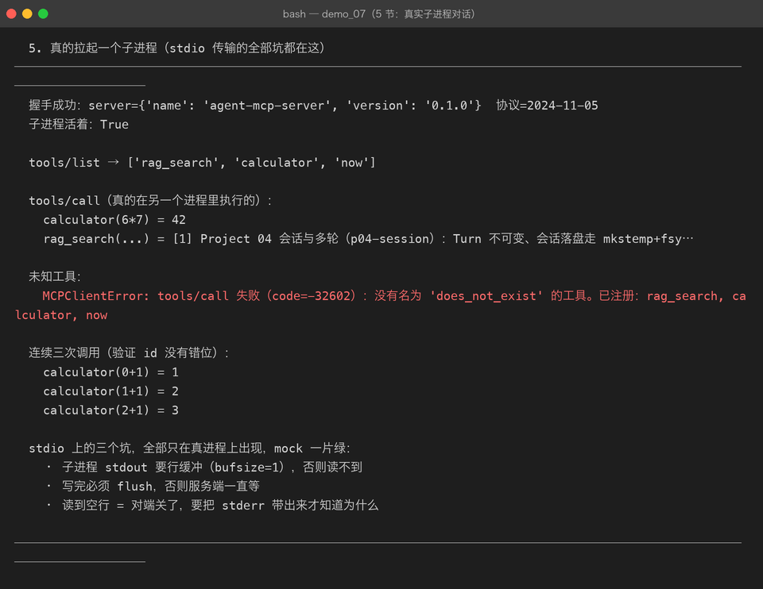

# Milestone 08 — MCP Server：把工具提供出去

> Milestone 07 只管消息长什么样。这一章是**真的把工具提供出去**：
>
> ```bash
> python -m agent.mcp.server      # 它就挂在 stdio 上等人来问
> ```

## 1. 一个必须想清楚的设计：错误分两类

MCP 把错误分成两路，**混用会让客户端完全没法处理**：

| 类型 | 含义 | 例子 |
|---|---|---|
| JSON-RPC error | 协议 / 调用层面的问题：调用方该改代码 | 方法不存在、参数不合法、工具名没注册 |
| `result.isError` | **工具本身执行了但失败了**：这是工具的一次正常结果 | 查不到、算式非法、超时 |

第二条很容易被写成第一条。区别在哪：

```
工具名不存在 → 调用方该改代码（是 bug），走 JSON-RPC error
查不到内容   → 这是工具的一次正常结果，模型看到后应该换个词再查
```

所以 `tools/call` 的实现里，工具抛异常要**包成 `isError=True` 的 content 返回**，
而不是往外抛 JSON-RPC error。否则就退化成 Milestone 01 讲过的那件事：
把「一次失败」变成「整轮任务被打死」。

真实输出（`demos/out/demo_07_mcp.txt` 第 4 节）：

```json
{  "result": {"content": [{"type": "text", "text": "[工具执行失败] boom: 查不到"}],
              "isError": true}   }      ← 工具执行失败：走 result

{  "error": {"code": -32602, "message": "没有名为 'nope' 的工具..."} }  ← 工具名不存在：走 error
```

## 2. 错误码也要选对

「工具名不存在」一开始我抛的是 `ValueError`，被统一兜底成 **-32603（内部错误）**。
这是个会误导客户端的错误码：

```
-32603  服务端内部错误  →  客户端以为服务端崩了，于是重试
-32602  参数不合法      →  客户端正确地知道「改我的参数」
```

所以专门加了 `CallError(code, message)`，让调用方能明确区分「你错了」和「我错了」。

## 3. stdio 主循环的两个坑

```python
for line in inp:                 # ① 逐行读
    ...
    out.write(encode_frame(response))
    out.flush()                  # ② 必须 flush
```

**① 不能一次 `read()` 全读再处理** —— 客户端是「发一条、等一条」，
你等 EOF 就等于永远等不到（它的 stdin 还开着）。

**② 不 flush 客户端会一直等** —— stdio 是块缓冲的，写满 4KB 才真正发出去。
这个错的表现是「客户端卡住不动」，而不是报错，非常难查。

退出时机：stdin 关闭（EOF）就该退出。客户端进程没了，服务端留着没意义。

## 4. 真实跑起来



`default_server()` 把 Project 05 的内置工具（`rag_search` / `calculator` / `now`）
全部通过 MCP 暴露。这一步的意义：**这些工具不再只能被同一个进程里的 Agent 调用了**。

## 5. 踩到的坑

**坑 1：`Tool.schema()` 返回的是完整外壳。**
本项目的约定是 `{"type": "function", "function": {...}}`（Milestone 03 修 422 时定的）。
MCP 要的是**内层的纯 JSON Schema**，所以要剥掉外壳：

```python
outer = tool.schema()
inner = outer.get("function", outer)   # 剥壳
```

一开始直接取 `schema["parameters"]` 拿到的是 `None`，注册出来的工具参数全空。
**服务端不该把 LLM 的形状泄漏到协议里** —— 它可能同时服务于别的客户端，
那些客户端根本不知道 "function" 是什么。

**坑 2：`lambda **kw, _t=tool: ...` 是语法错误。**
关键字参数必须放在 `**kwargs` **之前**：`lambda _t=tool, **kw: _t.run(**kw)`。

## 6. 结论

1. **协议错误与工具失败是两回事**，前者让调用方改代码，后者让模型换个参数。
2. **错误码要选对**，否则客户端会对着不该重试的错误发起重试。
3. stdio 主循环必须**逐行读 + 每次 flush**。

## 7. 代码位置

| 文件 | 职责 |
|---|---|
| `src/agent/mcp/server.py` | `MCPToolSpec` / `MCPServer` / `CallError` / `run_stdio` / `default_server` |
| `tests/test_mcp.py` | `TestServerHandshake` / `TestServerTools` / `TestServerStdio`（15 项） |
| `demos/demo_07_mcp.py` | 第 3–5 节 |

## 8. 版本

v0.8 → **v0.9**，MCP Server 落地，工具跨进程可用；测试 230 passed。
