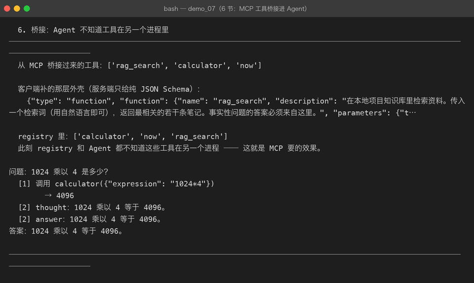
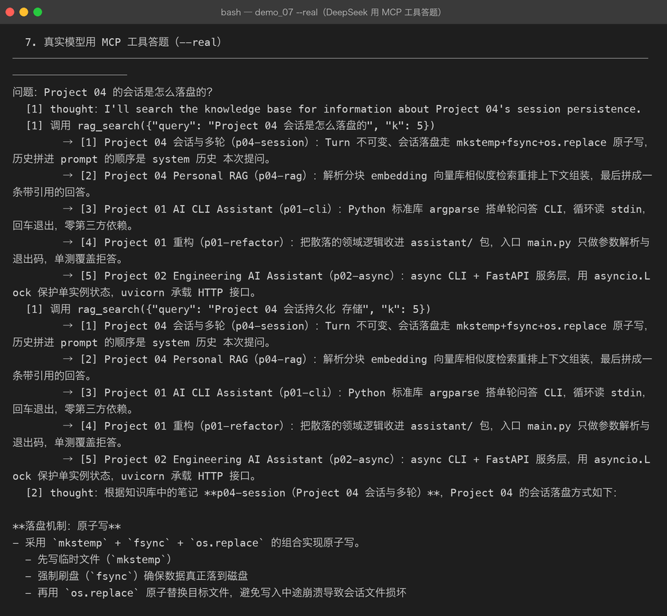

# Milestone 09 — MCP Client：让 Agent 用上别人的工具

> Milestone 08 把工具提供出去了，这一章是**真正去用它**。
> 目标只有一个：让 Agent 调用 MCP 工具时，和调用本地工具**没有任何区别**。

## 1. 三步接进来

```python
client = spawn_default_server()      # [sys.executable, "-m", "agent.mcp.server"]
client.start()
client.initialize()                  # 握手
registry = ToolRegistry(mcp_tools(client))
```

做完这三步，Agent 甚至不知道工具在另一个进程里 —— 这就是 MCP 要的效果。

## 2. 两个形状不一样：客户端负责转换

MCP 的 `tools/list` 返回的是**纯 JSON Schema**：

```json
{"name": "rag_search", "description": "...", "inputSchema": {...}}
```

而 LLM 的 function calling 要的是**两层外壳**：

```json
{"type": "function", "function": {"name": ..., "parameters": {...}}}
```

转换只能由客户端做：

- **服务端**不该知道 LLM 的存在（它可能同时服务于别的客户端）
- **LLM** 也不该知道 MCP 的存在

这个转换层是 MCP 能接进任意模型的关键。

顺带一提：Milestone 03 真机踩过的那个 422（`tools[0]: missing field 'type'`）
就是漏了这层转换 —— 当时是手写 schema 漏了，这里是协议形状不同。道理一样：
**发给模型的东西，形状一定要照模型的规矩来。**



## 3. 握手顺序不能省

```
initialize  →  notifications/initialized  →  其它方法
```

服务端会在握手前拒绝一切其它调用。跳过 notify 那一步，
表现是「tools/list 返回 method not found」—— 看起来像服务端没实现这个方法，非常误导。

所以 `initialize()` 内部自己把 notify 发了，调用方不用记得。

## 4. 真实模型用 MCP 工具答题

用 DeepSeek 问「Project 04 的会话是怎么落盘的？」，工具全部来自 MCP 子进程：



5 步、2 次工具调用，答案准确（`mkstemp + fsync + os.replace` 原子写、
Turn 不可变、prompt 拼装顺序）。每一次「调用」都是一次跨进程 JSON-RPC 往返，
**模型完全不知情**。

## 5. 踩到的坑

**坑 1：`MCPTool.schema()` 返回了内层，导致 `registry` 报 `KeyError: 'function'`。**
本项目的 `Tool.schema()` 约定是返回**完整外壳**，因为 `ToolRegistry.schema_of()`
取的是 `tool.schema()["function"]`。我一开始照 MCP 的形状返回内层 → KeyError。

这个坑的本质是：**两个系统对同一个概念的形状约定不同**，而边界上没有统一。
修法是在桥接层补齐外壳，两边都不越界。

**坑 2：`spawn_default_server()` 必须用 `sys.executable`。**
写死 `"python3"` 会拉起一个没装依赖的解释器，子进程秒退，
而错误信息只是「服务端关闭了连接」—— 现在 `_recv()` 会把 stderr 一起带出来，才知道为什么。

**坑 3：子进程 stdout 要 `bufsize=1`（行缓冲）。**
默认块缓冲会让服务端写完但客户端读不到，表现为双方互相干等。

**坑 4：fixture 里忘了 initialize。**
测试用 module-scoped fixture 复用一个 client，但只在 `start()` 后就交给测试用，
结果 9 个测试全报「尚未完成 initialize」。握手必须在 fixture 里完成。

## 6. 结论

1. **客户端是形状转换层**：MCP 的纯 Schema ↔ LLM 的 function 外壳，只在这里转换。
2. **握手封装进 `initialize()`**，别指望调用方记得发 notify。
3. stdio 的三个坑（行缓冲 / flush / 读空带 stderr）**只在真进程上出现**，mock 一片绿 ——
   所以 Client 的测试必须是真子进程，本项目的 `live_client` fixture 就是这么做的。

## 7. 代码位置

| 文件 | 职责 |
|---|---|
| `src/agent/mcp/client.py` | `MCPClient` / `MCPTool` / `mcp_tools` / `spawn_default_server` |
| `tests/test_mcp.py` | `TestClientAgainstRealServer` / `TestBridge` / `TestClientLifecycle`（11 项，真子进程） |
| `demos/demo_07_mcp.py` | 第 5–7 节，`--real` 跑真实模型 |

## 8. 版本

v0.9 → **v0.10**，MCP Client 落地，Agent 可跨进程调用工具；
真实 DeepSeek 通过 MCP 答对问题；测试 230 passed。
