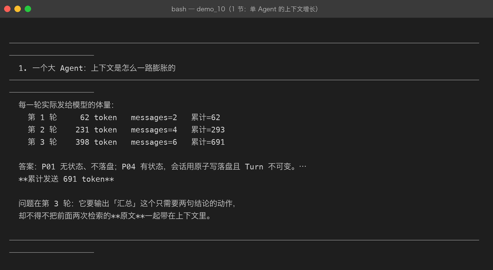
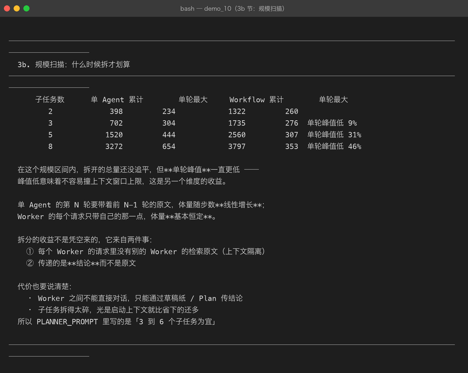
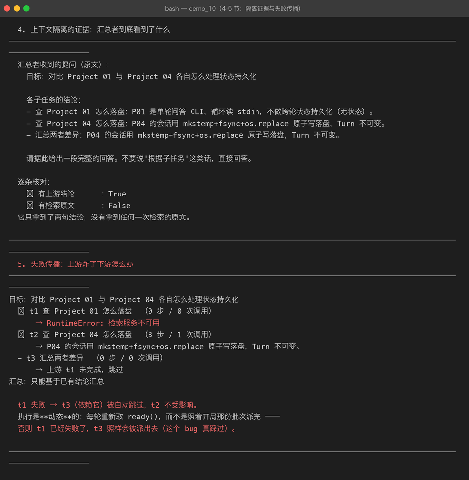
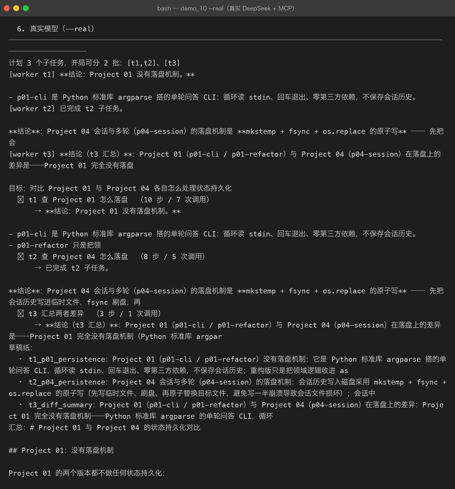

# Milestone 10 — Agent Workflow：把计划派给多个 Worker

> 到 Milestone 09 为止，一个任务始终是**一个 Agent 从头跑到尾**。
> 它有了计划（06）、草稿纸（05）、还能用别人的工具（09），
> 但所有步骤仍挤在同一段对话里。

## 1. 一个大 Agent 的问题

一个跑了 N 步的 Agent，第 N 步做「汇总」时，前面 N-1 步的检索**原文**全还在上下文里 ——
而它真正需要的只是那 N-1 步各自的**结论**。

Milestone 05 的裁剪能压掉一部分，但压掉的是"早的"，不是"无关的"。

真实测量（`demos/out/demo_10_workflow.txt` 第 1 节）：



## 2. Workflow 的做法

```
Plan 的每个子任务 → 派给一个独立的 Worker（自己的 ReActAgent、自己的 messages）
Worker 只拿到    → 这个子任务是什么 + 它依赖的那些子任务的结论
Worker 做完后    → 结论写进共享草稿纸 + 在 Plan 上标 done
```

三条好处：

1. **上下文隔离** —— 每个 Worker 只看自己需要的那一点
2. **失败不扩散** —— 一个子任务炸了，只影响 Plan 算好的下游
3. **同批可并行** —— Milestone 06 算出的 `batches()` 在这里派上用场

代价也要说清楚：**Worker 之间不能直接对话**，只能通过草稿纸 / Plan 传结论。
所以「子任务的结论该写多详细」是个真问题 —— 写少了汇总时信息不够，写多了又回到膨胀。

## 3. 但拆开真的划算吗？—— 规模扫描

诚实的结果：**3 个子任务时，拆开反而更贵**（691 → 1758 token）。
每个 Worker 都要重新带一遍 system 提示和自己的提问，这笔固定开销在短任务上压过了省下的历史。

所以真正该问的是「什么时候拆才划算」。规模扫描给出了答案：



| 子任务数 | 单 Agent 累计 | **单轮最大** | Workflow 累计 | **单轮最大** |
|---:|---:|---:|---:|---:|
| 2 | 398 | 234 | 1322 | 260 |
| 3 | 702 | 304 | 1735 | 276 |
| 5 | 1520 | 444 | 2560 | 307 |
| 8 | 3272 | **654** | 3797 | **353** |

结论不是「拆开省钱」，而是：

**单 Agent 的单轮体量随步数线性增长（234 → 654），Worker 的基本恒定（260 → 353）。**

8 个子任务时峰值低 46%。峰值低意味着不容易撞上下文窗口上限 —— 这是总量之外的另一个维度，
而且往往是更关键的那个：**上下文窗口是硬上限，超了就直接失败，不是多花点钱的事。**

所以 `PLANNER_PROMPT` 里写的是「3 到 6 个子任务为宜」——太碎不划算，太少又压不住峰值。

## 4. 上下文隔离的证据

汇总者收到的提问里**只有结论、没有原文**：



```
✓ 有上游结论      ：True
✗ 有检索原文      ：False
```

这条有专门的测试锁着（`tests/test_workflow.py::TestContextIsolation`）——
没有断言的话，「隔离」就只是一句口号。

## 5. 真实模型跑通整个 Workflow

用 DeepSeek + MCP 子进程跑「对比 P01 与 P04 的状态持久化」：



- 3 个子任务**全部完成**（t1 用 10 步 / 7 次调用，t2 用 8 步 / 5 次，t3 用 3 步 / 1 次）
- 模型**自己**往草稿纸写了 3 条笔记（`t1_p01_persistence`、`t2_p04_persistence`、`t3_diff_summary`）
- 汇总输出了完整对比，还带一张表格

## 6. 踩到的坑

**坑 1：批次不能预先派完 —— 计划是静态的，执行是动态的。**
一开始 `run()` 直接 `for batch in plan.batches()` 派活。但某个子任务失败后，
它的下游会被 `skip_downstream` 标成 SKIPPED，**而照开局的批次派，它们照样会被派出去**。
（测试 `test_failed_task_skips_downstream` 就是这么挂的：t1 失败了，t3 还在跑。）

改成每轮动态取 `ready()`：

```python
while True:
    ready = self.plan.ready()
    if not ready:
        break
    for task in ready:
        self._run_task(task)
```

**坑 2：草稿纸工具不能走 MCP。**
`use_mcp=True` 时把工具全部换成 MCP 的，结果 Worker 想写笔记却发现没有 `write_note` ——
它反复调用一个不存在的工具直到步数耗尽，而错误信息只是「用了 6 步仍未给出最终答案」，
**完全看不出原因**。

草稿纸是 Agent **自己的状态**，不是外部能力，必须留在本地：

```python
registry = ToolRegistry(list(mcp_tools(client)) + [WriteNoteTool(pad), ReadNotesTool(pad)])
```

**坑 3：`_stats` 差点写成类属性。**
`Workflow` 不是 dataclass，`_stats: dict = field(default_factory=dict)` 得到的是一个
`Field` 对象而不是字典。统计必须每个实例一份，初始化放在 `__init__` 里。

## 7. 结论

1. **Workflow 的价值不是省钱，是让单轮体量恒定** —— 撞不撞上下文窗口是硬约束。
2. **计划静态、执行动态** —— 失败会改变后面的派活。
3. **本地状态不要走 MCP** —— 草稿纸是 Agent 自己的，检索才是外部能力。

## 8. 代码位置

| 文件 | 职责 |
|---|---|
| `src/agent/workflow.py` | `Workflow` / `WorkflowResult` / `build_workflow` / Planner 与 Worker 提示词 |
| `tests/test_workflow.py` | 14 项，其中 `TestContextIsolation` 锁住隔离主张 |
| `demos/demo_10_workflow.py` | 6 节，`--real` 跑真实 DeepSeek + MCP |

## 9. 版本

v0.10 → **v1.0**，Project 05 收官：10/10 Milestone 全部落地。
测试 230 → **244 passed**，真实链路全部跑通，截图 24 → 28 张。
