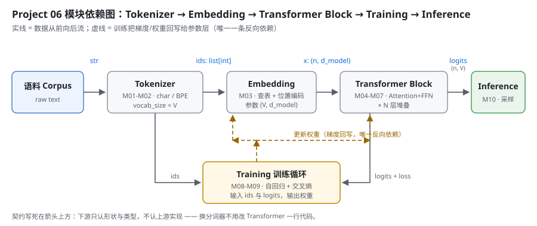

# Milestone 01 — 项目架构：把「黑盒」拆成五层契约

Project 05 结束时，我有一个能跑的 Agent：它会拆任务、会调工具、会把中间结论记在草稿纸上。但它有一个绕不过去的事实 —— **模型对我来说是个黑盒**。我给它一段 messages，它给我一段文本；中间发生了什么，我一个字都说不出来。

「会调 API」和「懂 LLM」之间的差距，就在这一层。所以 Project 06 做的事很直接：**不用 PyTorch，从零把 Decoder-Only Transformer 的每一层都自己写出来**，写不出来就是没懂。

这一章不写模型，先把**怎么拆**定下来。理由很实际：Transformer 的代码里，任何一个模块都能单独写错且「看起来能跑」——Attention 的 mask 写反了照样出数字，位置编码忘了加照样收敛（只是收敛到垃圾）。唯一能提前挡住这类错误的，是**把每一层的输入/输出契约先钉死**。

---

## 1. 拆分顺序：为什么是 Tokenizer → Embedding → Block → Training → Inference

一句话：**沿着数据流动的方向拆，从最外层往里走**。

```
语料(text)
   ↓  Tokenizer      —— 文本 → id
ids(list[int])
   ↓  Embedding      —— id → 向量，加位置
x(n, d_model)
   ↓  Transformer Block —— 注意力 + FFN，堆 N 层
logits(n, vocab_size)
   ↓  Training       —— 自回归 + 交叉熵，回写权重
权重
   ↓  Inference      —— 采样下一个 token
下一个 token
```

按这个顺序的理由有三条，每条都对应一次真实的返工风险：

1. **下游的形状由上游决定**。Embedding 矩阵的行数 = `vocab_size`，输出头最后一维也是 `vocab_size`。Tokenizer 不定，后面每一层的维度都是猜的。
2. **越靠前越容易验证**。Tokenizer 有「往返一致性」这种硬指标（`decode(encode(s)) == s`），错了一眼看得见；Attention 错了只表现为 loss 下不去，排查成本高一个数量级。
3. **唯一的反向依赖只有一条**。训练循环要把梯度回写给 Embedding 和 Block 的参数 —— 这是整张图里唯一一条从后往前的箭头，提前看见它，就不会在设计数据结构时把「参数」和「激活值」混在一起。



---

## 2. 五层的输入输出契约

契约写死在接口上：**下游只认形状与类型，不认上游实现**。这条是硬约束 —— 它带来的直接好处是，把 `CharTokenizer` 换成 `BPETokenizer`，Transformer 那边一行代码都不用改（因为两者都实现了同一个 `Tokenizer` 抽象）。

| 层 | Milestone | 输入 | 输出 | 自己的参数 |
|---|---|---|---|---|
| Tokenizer | 02 | `str` | `list[int]`，值域 `[0, V)` | 词表 `vocab` + `merges` |
| Embedding | 03 | `list[int]` → `(n,)` | `(n, d_model)` | `W_e (V, d_model)`、位置编码 |
| Transformer Block | 04–07 | `(n, d_model)` | `(n, d_model)` | `W_q/W_k/W_v/W_o`、FFN 两层 |
| Training | 08–09 | `ids`、`logits` | 更新后的权重 + loss 曲线 | 优化器状态 |
| Inference | 10 | 权重 + 前缀 | 下一个 token（循环采样） | 无（复用训练权重） |

两条贯穿全部五层的约定：

- **id 的四个特殊值固定**：`<pad>`=0、`<unk>`=1、`<bos>`=2、`<eos>`=3。训练时 pad 的位置不计入 loss，`<bos>` 开头、`<eos>` 结尾，推理时见到 `<eos>` 就停。
- **落盘的东西必须能被读回来且行为一致**。词表、merges、权重都是「训一次、用无数次」，读回来和训练时不一致 = 全部错位，而且日志上什么都看不出来。

---

## 3. 技术栈：故意不用 PyTorch

README 里原来写的技术栈是 PyTorch。这一版改了：**核心实现用纯 Python 标准库**，numpy 允许但不必需。

理由是「从零构建」这四个字。用 `nn.MultiheadAttention` 一行就能跑通的东西，是不可能让我理解 Attention 的 —— 我要的是那个 `softmax(QKᵀ/√d_k)V` 真的被我用手写出来，包括 mask 怎么加、维度怎么 reshape。等手写的版本能跑，再看 PyTorch 就是「哦，它也是这么做的」，而不是「它会，我不会」。

代价我先认了：纯 Python 训练不了真模型，只能训玩具规模。这正好 —— 玩具规模才能把每一步的中间结果打印出来看。

---

## 4. 这一版真实跑起来的东西

Milestone 01 定架构、Milestone 02 落地第一层，所以「真实运行」的当前状态是：Tokenizer 跑通 + 目录骨架就位 + 51 项测试全绿。

```
projects/06-mini-transformer-llm
├── README.md                  # 10 个 milestone 的勾选表
├── pyproject.toml             # src/ 布局，pytest pythonpath=["src"]
├── src/tokenizer/             # Milestone 02：base / char_tokenizer / bpe / sample_corpus
├── tests/                     # conftest + test_char_tokenizer + test_bpe
├── demos/demo_01_tokenizer.py # 真实可跑，输出落 demos/out/
└── milestones/01, 02
```

自检命令与真实结果：

```bash
cd projects/06-mini-transformer-llm
.venv/bin/python -m pytest -q
# 51 passed in 1.65s

.venv/bin/python demos/demo_01_tokenizer.py
# 语料 1224 字符 / 295 个唯一字符 / 25 行
# 字符级 vocab_size=299，BPE vocab_size=500（基础 299 + 201 次合并）
# 同一句样本：字符级 35 token → BPE 20 token
```

Milestone 03 及之后的目录（`src/model/`、`src/training/`）现在**故意不存在** —— 空目录占位是最容易自欺的一种「已完成」。契约先写在这里，代码到了再建。

---

## 5. 这一章踩到的坑

**坑 1：汉字逐字切分，BPE 永远学不到中文合并。**

第一版预切分规则把每个汉字切成一个独立 word（想着「中文没有空格，逐字最稳」）。结果 —— 语料里明明「模型」出现 4 次，训练出来的 201 条合并里**中文合并 0 条**。原因是每个汉字都是独立 word，word 内部长度恒为 1，压根没有相邻 pair 可统计。

修法是照 GPT-2 的做法：**一整串连续汉字当成一个 word**，让 BPE 在串内自己学。改完之后中文合并 48 条，`模型`、`注意力`、`分词器`、`网络` 都出来了。这条不是「调参」，是**概念性错误**：以为切得越细越好，实际是把要学的东西切没了。

**坑 2：测试里的 `tmp_path` 在这个沙箱里直接 PermissionError。**

本仓库的开发沙箱里 `/private/var/.../pytest-of-unknown` 不可写，`pytest` 内置的 `tmp_path` 一用就崩。沿用 Project 05 的做法：fixture 里改用**仓库内**目录（`tests/.tmp/`）+ 自己 `shutil.rmtree` 清理。顺带一个好处：词表落盘测试看到的是仓库内的相对路径，和 demo 真实运行的环境一致。

**坑 3：`vocab_size` 写成常量，换语料就炸。**

`BPETokenizer.train(corpus, 260)` 在第一版语料（128 个唯一字符）上没问题；Milestone 02 把语料换成 1224 字符之后，光基础字符就有 299 个，260 直接 `ValueError`。这条暴露的是**测试写法的坏味道**：依赖具体数字，不依赖结构。改成从 `CharTokenizer.build(corpus).vocab_size` 动态推出来之后，换语料不用改测试。

---

## 6. 结论

1. 拆 Transformer 要**沿数据流的方向**拆：上游不定，下游的维度全是猜的。
2. 契约的价值在于**实现可替换**：换分词器不改 Transformer 一行代码，这条已经用抽象基类 + 51 项测试验证过了。
3. 图里**只有一条反向依赖**（训练回写权重），它必须在设计阶段就被看见，否则参数与激活值会混在一起。
4. 空目录不是进度。没写的层就让它不存在。
5. 从零 = 不用 `nn.*`。慢，但每一步的中间结果都能打印出来看。

## 7. 代码位置

| 文件 | 职责 |
|---|---|
| `src/tokenizer/base.py` | `Tokenizer` 抽象：五件套契约 + 特殊 token 常量 + JSON 读写工具 |
| `src/tokenizer/char_tokenizer.py` | 字符级分词器（基线） |
| `src/tokenizer/bpe.py` | 从零实现的 BPE 训练循环 |
| `src/tokenizer/sample_corpus.py` | 离线语料（不联网下载），测试与 demo 共用同一份 |
| `tests/conftest.py` | 仓库内临时目录 fixture（规避 `tmp_path` 权限问题） |
| `tests/test_char_tokenizer.py` | 24 项：词表构造 / 往返一致性 / 特殊 token / 落盘 |
| `tests/test_bpe.py` | 27 项：合并优先级 / 压缩率 / 优雅停止 / 落盘 |
| `demos/demo_01_tokenizer.py` | 8 节真实演示，输出落 `demos/out/demo_01_tokenizer.txt` |
| `assets/architecture.svg` | 本章的模块依赖图 |

```bash
cd projects/06-mini-transformer-llm
python3 -m venv .venv && .venv/bin/pip install -q pytest numpy
.venv/bin/python -m pytest -q
.venv/bin/python demos/demo_01_tokenizer.py
```

## 8. 下一步

Milestone 02 落地第一层：**Tokenizer**。为什么 LLM 都用子词而不是字符或词、四个特殊 token 各自管什么、以及 `decode(encode(s)) == s` 为什么是一条不能让步的硬指标。

## 9. 版本

v0.0 → **v0.1**，项目骨架 + 五层契约 + Tokenizer 落地，测试 0 → **51 passed**，演示 1 个（真实可跑，输出落 `demos/out/`），配图 3 张（均为手写 SVG）。
