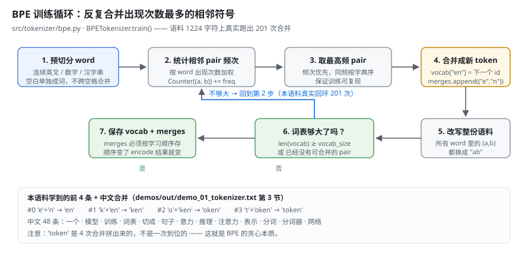
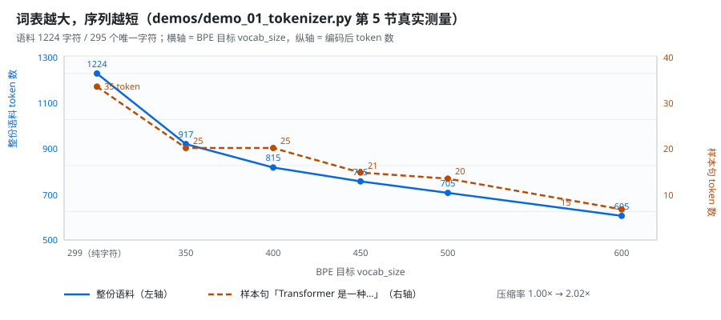
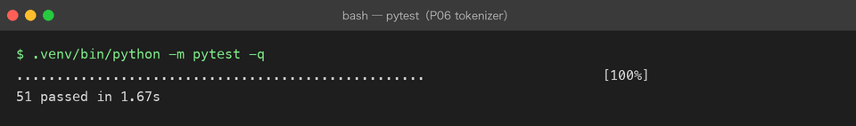
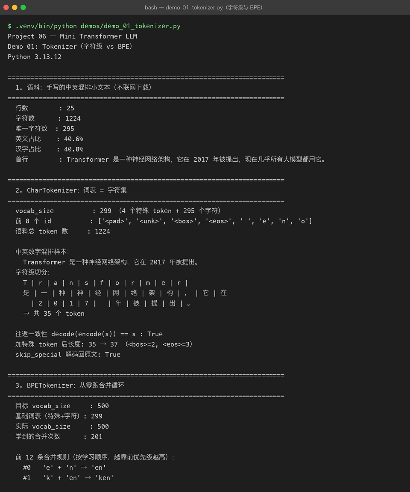

# Milestone 02 — Tokenizer：文本变成 id 的那一步

Milestone 01 把五层契约钉完了，第一块砖就是 Tokenizer。

在 Project 05 里，token 只是**账单单位** —— 我用 `estimate_messages_tokens` 估这一轮要花多少钱，历史超预算了就裁。那时候它是个外部概念，模型对我来说是黑盒，token 只是黑盒上的刻度。

现在不一样了：token 是**模型真正的输入**。Embedding 矩阵的第 `i` 行就是 id 为 `i` 的那个 token 的向量。词表错了，后面全部错位，而且这种错位**不会报错** —— loss 照样在降，模型照样在生成，只是生成的东西越来越没道理。

这一章回答三个问题：字符级和 BPE 怎么取舍、四个特殊 token 各自管什么、以及为什么 `decode(encode(s)) == s` 是一条不能让步的硬指标。

---

## 1. 三种切法：词级 / 字符级 / 子词

| 切法 | 词表 | 序列长度 | `<unk>` |
|---|---|---|---|
| 词级 | 几十万起，永远收不住 | 最短 | 满地都是（没见过的词全废） |
| 字符级 | 很小（= 字符集） | **最长** | 几乎没有 |
| 子词（BPE） | 可控（几万） | 中等 | 罕见字才出现 |

选子词的理由只有一条，但足够硬：**Attention 是 O(n²)**。序列长度翻一倍，计算量翻四倍。字符级那点「词表小」的好处，在序列长度面前根本不够看。

反过来说，字符级也不是没用 —— 它是**基线**。没有它，「BPE 压缩了 1.74 倍」这句话就没有参照物。所以两个都写了，用同一个 `Tokenizer` 抽象撑着。

## 2. 四个特殊 token 各自管什么

| token | id | 管什么 |
|---|---|---|
| `<pad>` | 0 | 把 batch 里的句子补齐到一样长，**它的位置不计入 loss** |
| `<unk>` | 1 | 词表外的字符塌到这里 —— 出现一次就丢一次信息 |
| `<bos>` | 2 | 句子开始。没有它，模型不知道「第一个 token 前面没有上下文」 |
| `<eos>` | 3 | 句子结束。推理时见到它就停 —— 没有它，模型会一直生成下去 |

顺序写死在 `base.py` 的 `SPECIAL_TOKENS` 里，子类不许改。理由很笨也很实在：id 是**跨模块共享的常量**，`<eos>` 在训练侧写进去、在推理侧读出来，两边只要有一边顺序不对，模型就永远学不会停。

## 3. 往返一致性：为什么这条不能让步

```python
assert tok.decode(tok.encode(s)) == s      # 对词表内的输入必须成立
```

它不是「顺手加的断言」，它是**唯一能在离线阶段抓住分词器 bug 的指标**。

理由是分词器的 bug 有一类特别恶心：**它不报错**。少切了一个字符、合并规则应用反了顺序、decode 时漏掉了空白 —— 这些都不会让程序崩，只会让训练数据静默地烂掉。等你在 loss 曲线上看见异常，已经跑了几万步，而且根本不知道该往回查哪一层。

往返一致性把这件事提前到「写完立刻能验」：

```
往返一致性 decode(encode(s)) == s : True
逐行往返一致性（25 行全部自检）：True
```

代价是设计上的两个约束，都写进实现了：

- **预切分规则必须覆盖全部字符**。正则最后那个 `.` 是兜底，任何字符都不许被丢掉 —— 丢一个字符，解码就永远回不去。
- **空白单独成 token，绝不参与合并**。所以 `merges` 里永远不会有含空格的 token，也就不存在「合并把两个词粘成一个」这种事故。

## 4. BPE 训练循环

真从零写的，核心就是一句话：**反复合并出现次数最多的那对相邻符号**。

```python
while len(vocab) < vocab_size:
    pairs = cls._count_pairs(symbols)          # 统计相邻 pair 的加权频次
    if not pairs:
        break                                  # 没有可合并的了 —— 优雅停止
    best = min(pairs.items(), key=lambda kv: (-kv[1], kv[0]))[0]
    vocab[best[0] + best[1]] = len(vocab)      # 新 token 进词表
    merges.append(best)                        # 顺序写进 merges
    symbols = cls._merge_everywhere(symbols, best, best[0] + best[1])
```



两个细节值得写下来：

- **同频次时按字典序取小的那个**（`key=lambda kv: (-kv[1], kv[0])`）。不做这个，同一份语料训练两次可能给出两套词表，而「训练不可复现」在排查时是最难的一类问题 —— 因为它只在两次运行之间出现。
- **`merges` 必须按学习顺序存**。encode 时是靠「优先级越高越先合并」把字符串拼回去的，顺序存错了，落盘的 JSON 读回来就是另一个分词器。

真实跑出来的前 4 条合并：

```
#0  'e' + 'n'     → 'en'
#1  'k' + 'en'    → 'ken'
#2  'o' + 'ken'   → 'oken'
#3  't' + 'oken'  → 'token'
```

注意 `token` 是**四次合并拼出来的**，不是一次到位的 —— 这就是 BPE 的贪心本质：它只看当前最高频的那一对，看不到「这四个字母合起来是个词」。

## 5. 中英混排的真实 token 片段

同一句样本，两种切法并排（`demos/out/demo_01_tokenizer.txt` 第 4 节）：

```
样本：Transformer 是一种神经网络架构，它在 2017 年被提出。

[字符级] 共 35 个 token
    T | r | a | n | s | f | o | r | m | e | r |
    是 | 一 | 种 | 神 | 经 | 网 | 络 | 架 | 构 | ， | 它 | 在
      | 2 | 0 | 1 | 7 |   | 年 | 被 | 提 | 出 | 。

[BPE] 共 20 个 token
    Transformer |   | 是 | 一种 | 神 | 经 | 网络 | 架 | 构 | ， | 它 | 在
      | 2017 |   | 年 | 被 | 提 | 出 | 。
```

三个能看出来的东西：

1. `Transformer` 和 `2017` 各自被并成了**一个** token —— 这是 BPE 最值钱的部分，一个 11 字符的词从 11 个位置压到 1 个。
2. 中文这边 `一种`、`网络` 被并起来了，但 `神`、`经`、`架`、`构` 还是单字 —— 语料只有 1224 字符，出现次数不够，BPE 学不到那么多。**小语料上 BPE 对中文的收益明显不如英文**，这是真实的结论，不是实现没写好。
3. 空格是独立 token，两个方案都一样 —— 它永远不会被并进别的 token。

整份语料：**1224 token → 705 token，压缩率 1.74×**。

## 6. 词表越大，序列越短

这是 BPE 唯一的设计旋钮，所以把它量出来了：

```
  目标vocab   实际vocab   合并数   语料token   样本token   压缩率
       299        299        0       1224         35   1.00x
       350        350       51        917         25   1.33x
       400        400      101        815         25   1.50x
       450        450      151        755         21   1.62x
       500        500      201        705         20   1.74x
       600        600      301        605         15   2.02x
```



曲线是**明显边际递减**的：前 51 次合并就把序列砍掉 25%，后面 100 次合并只再砍 15%。所以「词表越大越好」是错的 —— 词表每大一行，Embedding 就多 `d_model` 个参数，而且输出头的 softmax 也更贵。真实 LLM 选几万的词表，是在**序列长度 × 词表大小**之间取的一个平衡点，不是越大越好。

## 7. 词表外字符、优雅停止、落盘

**词表外字符只能塌成 `<unk>`**，信息在这里就丢了：

```
词表外的句子：GPT-4 在 2023 年发布，参数量约 1.8T，中文支持也不错。
BPE 编码后 token 数：35，其中 <unk>(id=1) 出现 9 次
```

9 个 `<unk>` 就是 9 个「模型永远看不到的字」。这就是为什么**训练和推理必须用同一份词表** —— 换一份，输入就变成一堆 `<unk>`，模型还在认真算，算的是垃圾。

**优雅停止**是刻意做成不报错的：

```
请求 vocab_size=5000，可合并的 pair 只够用 490 次
实际 vocab_size=789（小于 5000，不抛异常，安静停下）
反过来请求 10：直接报错 —— vocab_size=10 太小：光基础字符就有 299 个
```

方向不同处理不同：**上限超了就安静停**（小语料上是常态），**下限不够就报错**（说明调用方把参数传错了，静默通过只会让后面的维度对不上）。

**落盘**存两套东西，缺一不可：

```
字符级词表 → demos/out/char_vocab.json（4648 字节）
BPE 词表   → demos/out/bpe_vocab.json（15689 字节，含 201 条有序 merges）
读回后 vocab_size: 500（与原对象一致：True）
读回后 merges 顺序一致: True
读回后编码结果一致    : True
```

---

## 8. 这一章踩到的坑

| # | 坑 | 怎么发现的 | 修法 |
|---|---|---|---|
| 1 | 汉字逐字切分 → 中文合并 0 条 | demo 第 3 节打印「中文合并（共 0 条）」，而样本里明明有「模型」 | 预切分改成「连续汉字串整体当一个 word」（照 GPT-2 的做法），中文合并 48 条 |
| 2 | `tmp_path` 在沙箱里 PermissionError | 一跑测试就崩，报 `/private/var/.../pytest-of-unknown` 不可写 | fixture 改用仓库内 `tests/.tmp/` + 自己 `rmtree` 清理（沿用 P05 的做法） |
| 3 | `vocab_size` 在测试里写成常量 260 | 语料换成 1224 字符后，基础字符 299 个，`train(corpus, 260)` 直接 ValueError | 测试改成从 `CharTokenizer.build(corpus).vocab_size` 动态推导 |
| 4 | 合并优先级的同频次分支不确定 | 两次 `train` 结果可能不一致，只在「跑两次」时才出现 | `min(key=(-频次, 字典序))`，同频取小的那个，钉进 `test_training_is_deterministic` |
| 5 | 断言用了语料里没有的字 | `decode(encode("你好"))` 返回 `<unk>好` —— 语料里压根没「你」 | 测试文本一律取自语料（或先 train 进去），不凭空写字 |

坑 1 值得单独说一句：它不是调参问题，是**概念性错误**。我以为「切得越细越稳」，实际是把要学的东西切没了 —— 每个汉字独立成 word，word 内长度恒为 1，压根没有相邻 pair 可统计。这类错误只有**把中间结果打印出来**才会暴露，单测断言「vocab_size 对不对」是抓不到的。

## 9. 结论

1. LLM 用子词不是为了优雅，是因为 **Attention 是 O(n²)**，序列长度比词表大小贵得多。
2. `decode(encode(s)) == s` 是唯一能在离线阶段抓住分词器 bug 的指标，必须钉成测试。
3. 特殊 token 的 id 是**跨模块共享的常量**，顺序写死，两边不许各写一套。
4. BPE 是**贪心的**：`token` 要 4 次合并才拼得出来，它看不到「这是个词」。
5. 词表大小是**边际递减**的旋钮，不是越大越好。
6. `<unk>` 出现的次数 = 丢掉的信息量。训练和推理必须用同一份词表。
7. 参数约束要分方向：**上限超了安静停，下限不够就报错**。

## 10. 代码位置

| 文件 | 职责 |
|---|---|
| `src/tokenizer/base.py` | `Tokenizer` 抽象（vocab_size / encode / decode / save / load）+ `SPECIAL_TOKENS` + `pieces()` |
| `src/tokenizer/char_tokenizer.py` | `CharTokenizer.build(corpus, min_freq=)`：字符级基线 |
| `src/tokenizer/bpe.py` | `BPETokenizer.train(corpus, vocab_size)`：预切分 / pair 统计 / 合并循环 / 优雅停止 |
| `src/tokenizer/sample_corpus.py` | 1224 字符的离线中英混排语料（不联网下载） |
| `tests/conftest.py` | `workdir` fixture（仓库内临时目录）、共用语料与分词器 fixture |
| `tests/test_char_tokenizer.py` | 24 项 |
| `tests/test_bpe.py` | 27 项 |
| `demos/demo_01_tokenizer.py` | 8 节演示，输出落 `demos/out/demo_01_tokenizer.txt` |
| `assets/bpe-merge-loop.svg` | BPE 训练循环图 |
| `assets/tokenizer-vocab-growth.svg` | 词表增长 / 序列压缩曲线（数据来自 demo 第 5 节） |

```bash
cd projects/06-mini-transformer-llm
.venv/bin/python -m pytest -q                  # 51 passed
.venv/bin/python demos/demo_01_tokenizer.py    # 输出落 demos/out/demo_01_tokenizer.txt
```

## 11. 真实运行截图

截图来自**真实终端**（非伪造）：图 1 是 51 项 pytest 全绿，图 2 是 demo 真实跑通的输出（压缩率 1.74×、BPE 前 4 条合并、词表增长表都来自这里）。





## 12. 下一步

Milestone 03 用这里的 id 序列去查 Embedding 矩阵：`(V, d_model)` 的一张表，加上让模型知道「第几个位置」的位置编码。Tokenizer 决定了 `V` 是 500，Embedding 那层就得老老实实建 500 行 —— 这就是 Milestone 01 说的「下游形状由上游决定」。

## 13. 版本

v0.0 → **v0.1**，`src/tokenizer/` 四个文件落地，字符级 + BPE 双实现测试 **51 passed**，demo 真实跑通并落盘，配图 5 张（3 张手写 SVG：架构图 / BPE 循环 / 词表增长曲线 + 2 张真实终端截图：pytest 全绿 / demo 输出）。
