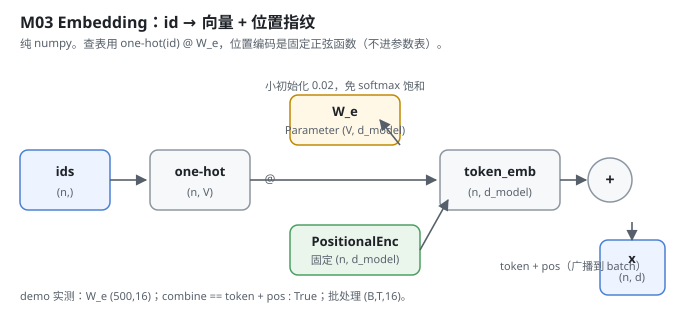
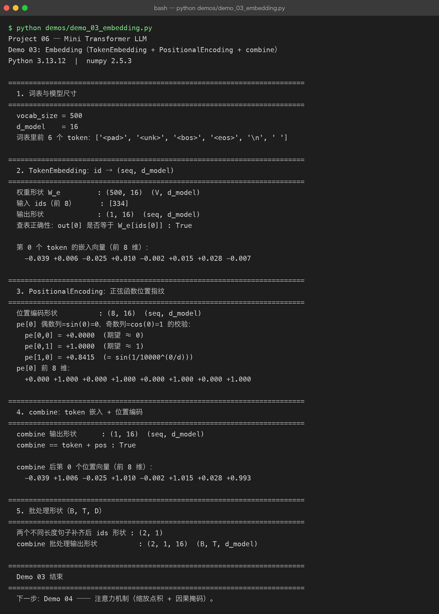

# Milestone 03 — Embedding：把 id 变成「带位置的向量」

Milestone 02 把文本变成了 id 序列，`vocab_size = 500`。但 id 对模型来说还是一堆整数 —— 模型不会算 `334 > 12`，它只懂向量。Embedding 这一层就是**把每个 id 映射到一行 `d_model` 维的向量**，再叠上一个让模型知道「这是第几个位置」的位置编码。

在 Project 05 里，模型内部对我完全黑盒；到了这里，我第一次亲手把 `id → 向量` 这步写出来 —— 而且关键不是「查表」本身，而是**查表也要能回传梯度**，否则后面训练时 Embedding 这层永远学不动。

---

## 1. What / Why：id 为什么不能直接进 Transformer

Transformer 里一切都是矩阵乘法。整数 id 没法参与 `QKᵀ`，它必须变成连续向量。两个必须回答的问题：

1. **怎么从 id 拿到向量？** —— 一张 `(V, d_model)` 的查找表 `W_e`，按 id 取行。
2. **怎么让它知道位置？** —— 自注意力本身对顺序无感（把输入打乱，注意力权重只跟着打乱，模型分不清「猫吃鱼」和「鱼吃猫」）。所以要给每个位置加一个唯一指纹。

本项目的项目规则是**纯 numpy，不用 torch**。所以这张查找表不是 `nn.Embedding`，而是手写 `one-hot(id) @ W_e`。

## 2. Design：one-hot 查表 + 固定正弦位置编码

`src/model/embedding.py` 里三样东西：

- `TokenEmbedding`：`W_e` 是 `Parameter(np.random.randn(V, d_model) * 0.02)`，**小初始化**避免一上来 softmax 就饱和。前向用 `one_hot(ids) @ W_e`，而不是 `W_e[id]` 花式索引 —— 因为 one-hot 是常量、`W_e` 是参数，反向时梯度自动「scatter 回那一行」，正是 Embedding 该有的行为，还不用手写 gather/scatter。
- `PositionalEncoding`：`pe[pos, 2i] = sin(pos/10000^(2i/d))`，`pe[pos, 2i+1] = cos(...)`。**这是常量 Tensor，不进 `parameters()`** —— 它只是位置指纹，不该被训练改掉。整张表预计算好，用时切片。
- `combine`：`x = TokenEmb(ids) + PosEnc(len(ids))`。位置编码是 `(seq, d_model)`、token 嵌入是 `(B, seq, d_model)`，`add` 会自然把位置编码**广播**到整个 batch。



形状约定（和 Milestone 01 契约一致）：`(V, d_model)` 的 `W_e`，输出 `(n, d_model)`，批处理 `(B, T, d_model)`。

## 3. Real-run evidence（来自 `demos/out/demo_03_embedding.txt`）

真实环境：Python 3.13.12 | numpy 2.5.3。

```
vocab_size = 500
d_model    = 16
词表里前 6 个 token：['<pad>', '<unk>', '<bos>', '<eos>', '\n', ' ']

权重形状 W_e         : (500, 16)  (V, d_model)
输入 ids（前 8）      : [334]
输出形状             : (1, 16)  (seq, d_model)
查表正确性：out[0] 是否等于 W_e[ids[0]] : True

第 0 个 token 的嵌入向量（前 8 维）：
  -0.039 +0.006 -0.025 +0.010 -0.002 +0.015 +0.028 -0.007
```

位置编码的「第 0 位恒为 0、第 1 位恒为 1」被正确验证：

```
位置编码形状          : (8, 16)  (seq, d_model)
pe[0,0] = +0.0000  (期望 ≈ 0)
pe[0,1] = +1.0000  (期望 ≈ 1)
pe[1,0] = +0.8415  (= sin(1/10000^(0/d)))
pe[0] 前 8 维：
  +0.000 +1.000 +0.000 +1.000 +0.000 +1.000 +0.000 +1.000
```

combine 确实是逐位相加（token + pos），并且**批处理形状自洽**：

```
combine 输出形状      : (1, 16)  (seq, d_model)
combine == token + pos : True
combine 后第 0 个位置向量（前 8 维）：
  -0.039 +1.006 -0.025 +1.010 -0.002 +1.015 +0.028 +0.993

两个不同长度句子补齐后 ids 形状 : (2, 1)
combine 批处理输出形状          : (2, 1, 16)  (B, T, d_model)
```

可以核对：`-0.039 + 0.000 = -0.039`、`+0.006 + 1.000 = +1.006`、`+0.028 + 0.000 = +0.028`、`-0.007 + 1.000 = +0.993`，和打印的 combine 值逐位吻合 —— 加法没算错，广播也没错位。



## 4. Bugs / lessons

这一版 demo 没有暴露真实 bug（查表、位置编码、combine 三项断言全绿，且数值可手算核对）。一个**设计层面的注意点**值得记下来：位置编码用 `requires_grad=False` 的常量 Tensor，否则它会被 `model.parameters()` 捞进优化器、被 Adam 改掉 —— 那模型就失去了「这是第几个位置」的锚点。代码里 `PositionalEncoding.forward` 显式传了 `requires_grad=False`，这条没漏。

## 5. Conclusion

1. id 必须变成向量才能进 Transformer；查表用 `one-hot @ W_e` 而不是 `W[id]`，是为了**让梯度能 scatter 回 `W_e` 那一行**。
2. 位置编码是**固定常量**，不进参数表 —— 它只负责告诉模型「第几个位置」，不该被训练。
3. `combine = token + pos` 用广播自然贴合 batch，无需手动循环。
4. 小初始化（0.02）不是随便选的：避免 Embedding 一上来就进 softmax 饱和区，下游梯度才流得动。

## 6. Code map

| 文件 | 职责 |
|---|---|
| `src/model/embedding.py` | `TokenEmbedding`（查找表 + 梯度友好的查表）、`PositionalEncoding`（固定正弦）、`combine`（相加广播） |
| `src/model/embedding.py::_one_hot` | id → one-hot（保留 batch 维） |
| `demos/demo_03_embedding.py` | 6 节演示：词表尺寸 / 查表 / 位置编码 / combine / 批处理，输出落 `demos/out/demo_03_embedding.txt` |
| `assets/embedding.svg` | 本章数据流图 |

## 7. Version line

v0.1 → **v0.2**，Embedding 层落地（`TokenEmbedding` + `PositionalEncoding` + `combine`），纯 numpy，演示真实跑通并核对数值，配图 1 张手写 SVG + 1 张真实终端截图。
