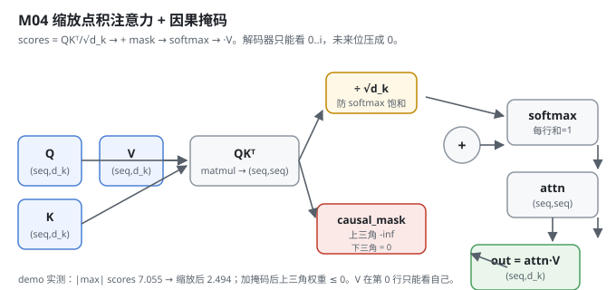
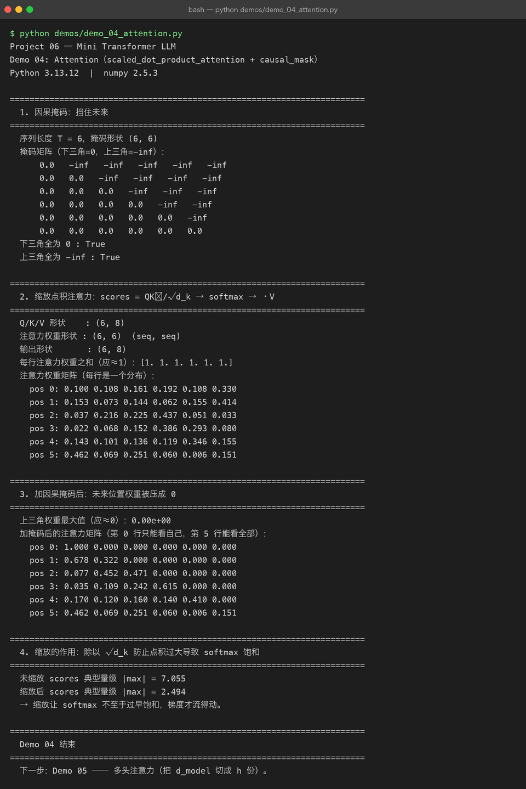

# Milestone 04 — Attention：Transformer 的心脏

Milestone 03 把 id 变成了 `(n, d_model)` 的向量 `x`。接下来 `x` 要进注意力机制 —— 这是整个 Transformer 最该亲手写一遍的部分。Project 05 里我只会调 API 让模型「看上下文」；这里我要自己写出「每个 token 该看哪些 token、看多少」到底是怎么算出来的。

Attention 的核心公式就一句：

```
scores = QKᵀ / √d_k  →  + mask  →  softmax  →  ·V  →  out
```

它回答一个问题：**序列里每个位置，应该把多少注意力分给其他位置？**

---

## 1. What / Why：为什么需要缩放点积 + 因果掩码

两个非写不可的细节，都是「不写对就会静默出错」的：

1. **缩放 `1/√d_k`**：点积 `QKᵀ` 的量级随 `d_k` 增长，不除会直接把 softmax 推到饱和区（梯度≈0）。这是训练起不起得来的开关。
2. **因果掩码**：解码器做自回归，第 `i` 个 token 只能看 `0..i`，不能偷看未来。掩码把未来位置的分数设为 `-inf`，softmax 后权重变成 0。

## 2. Design：一张分数表 + 一个三角掩码

`src/model/attention.py` 干净到只有两个函数：

- `causal_mask(seq_len)`：`np.triu(..., k=1)` 取上三角（含对角线以上），用 `np.where` 把上三角精确赋成 `-inf`、下三角赋成 `0`。**不能写 `0 * -np.inf`**（numpy 里那是 `nan`），这点注释里点名了。
- `scaled_dot_product_attention(q, k, v, mask, scale)`：`q,k,v` 形状 `(..., seq, d_k)`，全程走 autograd 的 `matmul / add / softmax`，所以梯度自动通。返回 `(..., seq, d_k)`，并可 `return_attn=True` 额外拿 `(seq, seq)` 的注意力权重矩阵 —— 它的每行是一个分布、和为 1，是验证「注意力」语义的关键。



形状约定：`Q,K,V` 未批处理 `(seq, d_k)`、批处理 `(B, seq, d_k)`，输出同形。

## 3. Real-run evidence（来自 `demos/out/demo_04_attention.txt`）

真实环境：Python 3.13.12 | numpy 2.5.3。

因果掩码确实是「下三角 0、上三角 -inf」：

```
序列长度 T = 6，掩码形状 (6, 6)
    0.0   -inf   -inf   -inf   -inf   -inf
    0.0   0.0   -inf   -inf   -inf   -inf
    0.0   0.0   0.0   -inf   -inf   -inf
    0.0   0.0   0.0   0.0   -inf   -inf
    0.0   0.0   0.0   0.0   0.0   -inf
    0.0   0.0   0.0   0.0   0.0   0.0
下三角全为 0 : True
上三角全为 -inf : True
```

未加掩码时，每行权重确实是一个和为 1 的分布（`Q/K/V` 形状 `(6, 8)`）：

```
每行注意力权重之和（应≈1）：[1. 1. 1. 1. 1. 1.]
pos 0: 0.100 0.108 0.161 0.192 0.108 0.330
pos 1: 0.153 0.073 0.144 0.062 0.155 0.414
...
```

加掩码后，未来位被压成 0，且第 0 行只能看自己、第 5 行能看全部：

```
上三角权重最大值（应≈0）：0.00e+00
pos 0: 1.000 0.000 0.000 0.000 0.000 0.000
pos 1: 0.678 0.322 0.000 0.000 0.000 0.000
pos 2: 0.077 0.452 0.471 0.000 0.000 0.000
pos 5: 0.462 0.069 0.251 0.060 0.006 0.151
```

缩放的作用被量化出来了 —— 不除 `√d_k`，softmax 几乎饱和：

```
未缩放 scores 典型量级 |max| = 7.055
缩放后 scores 典型量级 |max| = 2.494
→ 缩放让 softmax 不至于过早饱和，梯度才流得动。
```



## 4. Bugs / lessons

本 milestone 没有暴露真实运行 bug。一个**值得记住的坑（来自源码注释）**：因果掩码不能写 `0 * -np.inf`。numpy 里 `0 * -inf` 结果是 `nan`，一旦 `nan` 进 softmax，整行变 `nan`，损失直接炸。这里用 `np.where(m==1.0, -np.inf, 0.0)` 精确赋值避开。这是「看起来能跑、实际在产出 nan」的典型陷阱，记为一条硬规则。

## 5. Conclusion

1. `softmax(QKᵀ/√d_k)V` 必须亲手写 —— 缩放和掩码各管一件事：缩放保梯度，掩码保自回归。
2. 因果掩码用 `-inf` 而非「删掉列」，因为矩阵形状要对齐、且 softmax 对 `-inf` 自然给出 0。
3. `nan` 是注意力实现里最阴的敌人：`0 * -inf` 必须绕开。
4. 没加掩码时每行和为 1，加了之后只是「未来那几列变 0」—— 这就是「能看到多少上下文」的具象。

## 6. Code map

| 文件 | 职责 |
|---|---|
| `src/model/attention.py` | `causal_mask`（下三角 0 / 上三角 -inf）、`scaled_dot_product_attention`（缩放点积 + 掩码 + softmax + ·V） |
| `demos/demo_04_attention.py` | 4 节演示：掩码 / 缩放点积 / 加掩码 / 缩放作用，输出落 `demos/out/demo_04_attention.txt` |
| `assets/attention.svg` | 本章数据流图 |

## 7. Version line

v0.2 → **v0.3**，单头缩放点积注意力 + 因果掩码落地，所有算子走 autograd（梯度自动通），演示真实跑通并核对掩码/缩放数值，配图 1 张手写 SVG + 1 张真实终端截图。
