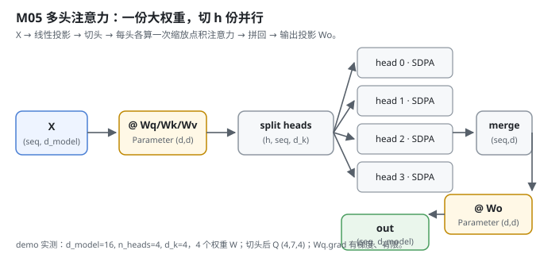
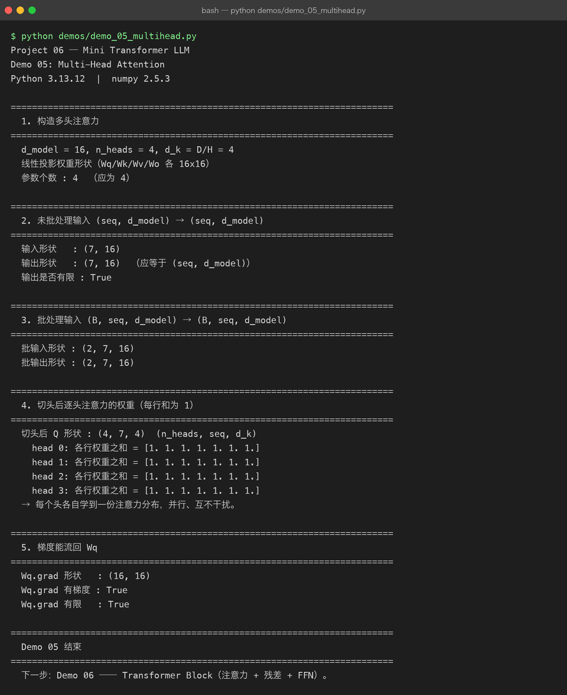

# Milestone 05 — Multi-Head Attention：把 d_model 切成 h 份并行看

Milestone 04 写通了单头注意力：每个位置学**一种**「该看哪里」的模式。但语言里要同时关注的东西很多 —— 语法依存、指代、远近、语义相似。单头注意力一次只能学一个模式。Multi-Head Attention 的解法很朴素：**把 `d_model` 切成 `h` 份，每份各自算一次注意力，再拼回去**。

在 Project 05 里 `nn.MultiheadAttention` 一行搞定；这里我必须自己写「线性投影 → 切头 → 逐头注意力 → 拼回 → 输出投影」整个过程，而且要保证**每个 reshape/transpose 都有正确的反向**，否则 `Wq` 的梯度回不来。

---

## 1. What / Why：为什么要多头，而不是把单头做大

单头注意力只有一个 `(seq, d_k)` 的「注意力视角」。多头让模型在**不同的子空间**并行学不同的关系：头 0 可能盯着就近的语法、头 1 盯着远距离指代…… 实现上不用 `h` 套独立权重 —— 一份大 `Wq` 切分即可，参数没变多，只是「看的角度」多了。

关键工程点：**切头/拼头全是 reshape + transpose，这些算子必须带反向**，否则拼回去之后梯度对不上。本项目所有 reshape/transpose 都挂在 autograd 上（`src/model/autograd.py` 里 `reshape`/`transpose` 都写了 `_backward`）。

## 2. Design：一份大权重，切 h 份

`src/model/multihead.py` 的 `MultiHeadAttention`：

- 构造时检查 `d_model % n_heads == 0`，否则直接 `ValueError`（下游维度就对齐不了）。
- 四个线性投影 `Wq/Wk/Wv/Wo`，都是 `Parameter(np.random.randn(d_model, d_model) * 0.02)`（共享一份大权重，再切头）。
- `_split_heads`：`(B, seq, d_model) → (B, n_heads, seq, d_k)`，先 reshape 再 transpose；未批处理时先补 batch 维。
- `_merge_heads`：反过来，`(B, n_heads, seq, d_k) → (B, seq, d_model)`。
- `forward`：`q = split(linear(x, Wq))` → 对每头 `scaled_dot_product_attention` → `merge` → `linear(ctx, Wo)`。



## 3. Real-run evidence（来自 `demos/out/demo_05_multihead.txt`）

真实环境：Python 3.13.12 | numpy 2.5.3。

```
d_model = 16, n_heads = 4, d_k = D/H = 4
线性投影权重形状（Wq/Wk/Wv/Wo 各 16x16）
参数个数 : 4  （应为 4）

未批处理输入 (seq, d_model) → (seq, d_model)
  输入形状   : (7, 16)
  输出形状   : (7, 16)  （应等于 (seq, d_model)）
  输出是否有限 : True

批处理输入 (B, seq, d_model) → (B, seq, d_model)
  批输入形状 : (2, 7, 16)
  批输出形状 : (2, 7, 16)
```

切头后 `Q` 形状 `(4, 7, 4)`，且**每个头各自学到一份注意力分布（每行和为 1）**：

```
切头后 Q 形状 : (4, 7, 4)  (n_heads, seq, d_k)
  head 0: 各行权重之和 = [1. 1. 1. 1. 1. 1. 1.]
  head 1: 各行权重之和 = [1. 1. 1. 1. 1. 1. 1.]
  head 2: 各行权重之和 = [1. 1. 1. 1. 1. 1. 1.]
  head 3: 各行权重之和 = [1. 1. 1. 1. 1. 1. 1.]
→ 每个头各自学到一份注意力分布，并行、互不干扰。
```

最重要的是 —— **梯度真的流回了 `Wq`**：

```
Wq.grad 形状   : (16, 16)
Wq.grad 有梯度 : True
Wq.grad 有限   : True
```

这说明切头/拼头的 reshape+transpose 反向写对了：反向传播能一路乘回 `Wq`，训练时这层才学得到东西。



## 4. Bugs / lessons

本 milestone demo 没有暴露真实运行 bug。一个**设计层面要注意的坑**：切头前必须保证 `d_model` 能被 `n_heads` 整除。源码在 `__init__` 里直接 `raise ValueError`，而不是让它静默算出一个怪形状 —— 否则 `(B, T, n_heads, d_k)` 的 reshape 会数组长度对不上，报一个很难定位的 `ValueError`。把这条约束**前置到构造期**而不是前向期，排查成本最低。

## 5. Conclusion

1. 多头 = 「把 `d_model` 切成 `h` 份，各自看一种关系」，参数没多，视角多了。
2. 不需要 `h` 套独立权重：一份大 `Wq` 切分即可，拼回靠 reshape+transpose。
3. reshape/transpose **必须带反向**，否则 `Wq` 梯度回不来 —— 这里 `Wq.grad` 有限且非零，证明反向写对了。
4. `d_model % n_heads != 0` 要在构造期就报错，别拖到前向 reshape 才炸。

## 6. Code map

| 文件 | 职责 |
|---|---|
| `src/model/multihead.py` | `MultiHeadAttention`（4 个投影 Parameter + `_split_heads` / `_merge_heads` + `forward`） |
| `src/model/attention.py` | 复用 `scaled_dot_product_attention` / `causal_mask` |
| `demos/demo_05_multihead.py` | 5 节演示：构造 / 未批处理 / 批处理 / 逐头权重 / 梯度，输出落 `demos/out/demo_05_multihead.txt` |
| `assets/multihead.svg` | 本章数据流图 |

## 7. Version line

v0.3 → **v0.4**，多头注意力落地（切头/拼头 reshape+transpose 反向正确，梯度可回写 `Wq`），演示真实跑通并核对每头分布与梯度，配图 1 张手写 SVG + 1 张真实终端截图。
