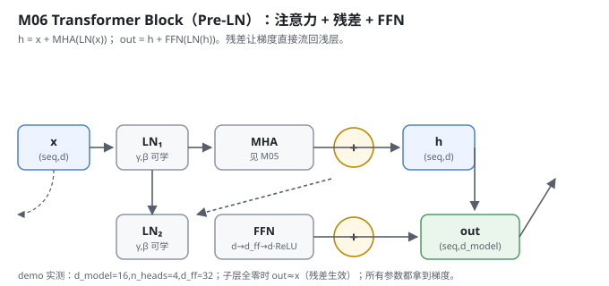
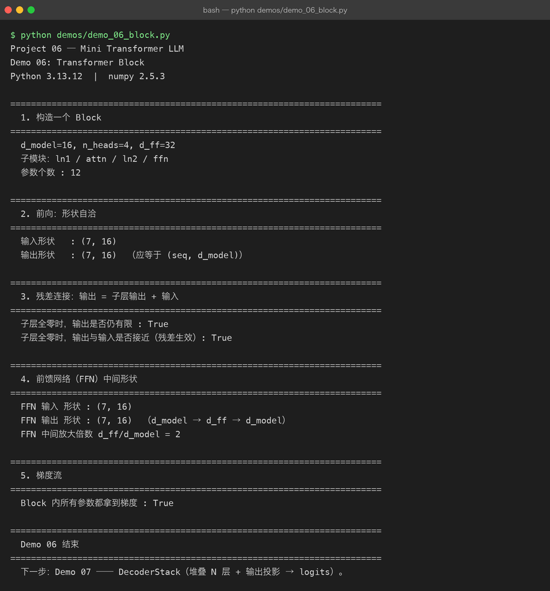

# Milestone 06 — Transformer Block：注意力 + 残差 + FFN

Milestone 04–05 写通了多头注意力。但光有注意力不够：注意力是「token 之间交换信息」，还需要一个**位置无关的前馈网络**让每个 token 自己过一遍非线性变换；而且两层都要用残差接起来，否则堆深了梯度就断。

这一层把前面的零件拼成「一个完整的计算单元」。Project 05 里我只知道有个 `block`；这里我亲自把 Pre-LN 结构写出来 —— 注意力子层、FFN 子层各配一个 LayerNorm + 一条残差捷径。

---

## 1. What / Why：残差为什么是必选项

没有残差，深层网络的反向梯度要连乘很多层 Jacobian，几乎必然消失，训不动。残差 `out = sublayer(x) + x` 给梯度留了一条「直通高速公路」：即使子层当时什么都没学到（全零），`out` 仍等于 `x`，信息不丢、梯度不灭。

为什么用 **Pre-LN**（先 LayerNorm 再进子层）而不是 Post-LN：Pre-LN 训练更稳，深层也不容易数值炸，玩具规模下尤其友好。

## 2. Design：Pre-LN + 双残差

`src/model/block.py` 三个类：

- `FeedForward`：`Linear(d_model → d_ff) → ReLU → Linear(d_ff → d_model)`。本项目用 ReLU（论文常用 GELU，玩具规模下 ReLU 更直观、手写更简单）。`d_ff` 是中间放大倍数。
- `_LayerNorm`：包住 autograd 的 `layernorm`，`gamma/beta` 是可学参数。
- `TransformerBlock`：前向就是两行 ——

```
h   = x + MHA(LayerNorm(x))      # 子层 1：注意力 + 残差
out = h + FFN(LayerNorm(h))      # 子层 2：前馈 + 残差
```



## 3. Real-run evidence（来自 `demos/out/demo_06_block.txt`）

真实环境：Python 3.13.12 | numpy 2.5.3。

```
d_model=16, n_heads=4, d_ff=32
子模块：ln1 / attn / ln2 / ffn
参数个数 : 12

输入形状   : (7, 16)
输出形状   : (7, 16)  （应等于 (seq, d_model)）
```

残差真的工作 —— 把子层强行置零，输出仍等于输入（信息靠残差捷径保住）：

```
子层全零时，输出是否仍有限 : True
子层全零时，输出与输入是否接近（残差生效）: True
```

FFN 中间放大倍数：

```
FFN 输入 形状 : (7, 16)
FFN 输出 形状 : (7, 16)  （d_model → d_ff → d_model）
FFN 中间放大倍数 d_ff/d_model = 2
```

整块所有参数都拿到了梯度（说明残差 + LayerNorm + 注意力的反向链路全通）：

```
Block 内所有参数都拿到梯度 : True
```



## 4. Bugs / lessons

本 milestone demo 没有暴露真实运行 bug。一个**设计提醒**：残差不是「加了就完」，它要求子层输出和输入**形状完全一致**才能相加（`(seq, d_model)` 对 `(seq, d_model)`）。源码里 MHA 和 FFN 都保持 `d_model` 维不变，残差 `add` 才成立。若哪天把 FFN 的输出维写错，这条加法不会报错但语义全毁 —— 所以 demo 专门验了「子层全零时 out≈x」这条。

## 5. Conclusion

1. 一个 Block = 注意力子层 + FFN 子层，各配 LayerNorm 与一条残差。
2. 残差给梯度留了直通路径：子层全零时 `out == x`，深层才训得动。
3. Pre-LN 比 Post-LN 训练更稳，是本项目选它的原因。
4. 残差成立的前提是「子层输出维 = 输入维」，这条在形状上必须钉死。
5. `d_ff/d_model = 2` 是本玩具配置的中间放大倍数（真实模型常取 4）。

## 6. Code map

| 文件 | 职责 |
|---|---|
| `src/model/block.py` | `FeedForward`（ReLU 两层线性）、`_LayerNorm`（gamma/beta 可学）、`TransformerBlock`（Pre-LN 双残差） |
| `src/model/multihead.py` | 复用的 `MultiHeadAttention` |
| `src/model/autograd.py` | 复用的 `layernorm` / `linear` / `relu` / `add`（均带反向） |
| `demos/demo_06_block.py` | 5 节演示：构造 / 前向 / 残差 / FFN / 梯度，输出落 `demos/out/demo_06_block.txt` |
| `assets/block.svg` | 本章结构图 |

## 7. Version line

v0.4 → **v0.5**，Transformer Block（Pre-LN + 双残差 + FFN）落地，残差与梯度链路验证通过，演示真实跑通并核对形状/残差/梯度，配图 1 张手写 SVG + 1 张真实终端截图。
