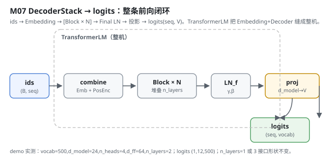
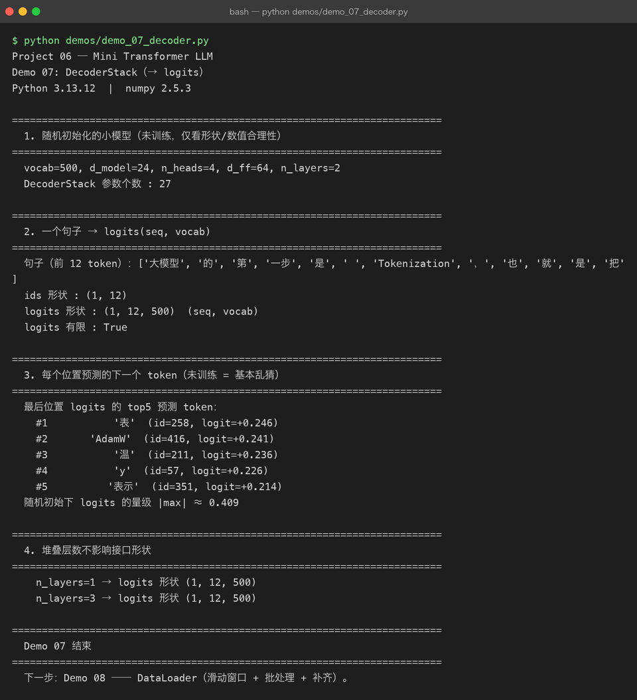

# Milestone 07 — DecoderStack：把 N 层堆起来，输出 logits

Milestone 03–06 已经把「单个 Block」写好了。这一层把它们**堆成整条前向链路**：Embedding 进来，过 N 个 Block，最后接一个最终 LayerNorm 和输出投影，把每个位置的隐藏向量变成词表上的 `logits`。到这里，从 id 到 logits 的整条路就闭环了 —— 下一步交给交叉熵算损失。

在 Project 05 里 `model(_messages) → text` 是个黑盒；这里 `ids → Embedding → [Block × N] → LN → proj → logits(seq, V)` 每一步的形状我都亲手钉死。

---

## 1. What / Why：堆叠层数为什么不影响接口

`DecoderStack` 把 N 个 Block 串起来。关键性质：**不论堆几层，输入 `(B, seq, d_model)`、输出还是 `(B, seq, d_model)`** —— 每个 Block 都保持维度不变（残差保证的）。所以「换层数」只改容量，不改接口，训练侧和推理侧都不用动。最后一层投影 `(d_model → vocab)` 才把维度掰到词表大小。

`TransformerLM` 是把 `Embedding + DecoderStack` 缝在一起的整机，训练和推理都直接用它（Milestone 09/10 直接用）。

## 2. Design：N 层 + 最终 LN + 投影

`src/model/decoder.py`：

- `DecoderStack.__init__`：`self.blocks = [TransformerBlock(...) for _ in range(n_layers)]`、一个 `_FinalLayerNorm`、`self.proj = Parameter(np.random.randn(d_model, vocab_size) * 0.02)`。
- `forward`：`h = x; for block in blocks: h = block(h, mask); h = ln_f(h); return linear(h, proj)`。
- `TransformerLM`：`token_emb + pos_enc + decoder` 三件套；`forward(ids)` 自动按序列长生成因果掩码，返回 `logits (B, seq, vocab)`。



## 3. Real-run evidence（来自 `demos/out/demo_07_decoder.txt`）

真实环境：Python 3.13.12 | numpy 2.5.3。**注意这是随机初始化、未训练的模型，只看形状与数值合理性。**

```
vocab=500, d_model=24, n_heads=4, d_ff=64, n_layers=2
DecoderStack 参数个数 : 27

句子（前 12 token）：['大模型', '的', '第', '一步', '是', ' ', 'Tokenization', '，', '也', '就', '是', '把']
ids 形状 : (1, 12)
logits 形状 : (1, 12, 500)  (seq, vocab)
logits 有限 : True
```

未训练时每个位置的预测基本是乱猜，最后一位 top5：

```
#1  '表'    (id=258, logit=+0.246)
#2  'AdamW'  (id=416, logit=+0.241)
#3  '温'    (id=211, logit=+0.236)
#4  'y'     (id=57,  logit=+0.226)
#5  '表示'   (id=351, logit=+0.214)
随机初始下 logits 的量级 |max| ≈ 0.409
```

最重要的是「堆叠层数不影响接口形状」被验证：

```
n_layers=1 → logits 形状 (1, 12, 500)
n_layers=3 → logits 形状 (1, 12, 500)
```

`|max| ≈ 0.409` 也印证了小初始化（0.02）按预期生效：随机初始的 logits 离「均匀」不远，没一上来就饱和。



## 4. Bugs / lessons

本 milestone demo 没有暴露真实运行 bug。一个**值得记的设计点**：`TransformerLM.forward` 在 `mask is None` 时自动按当前 `seq_len` 生成因果掩码（`causal_mask(seq_len)`），并校验 `seq_len ≤ max_len`。这条把「模型自己管掩码」收口在一处，避免训练/推理两边各写一份掩码逻辑、对齐出错（Milestone 02 强调过「特殊 token 顺序写死、两边不许各写一套」，掩码同理）。

## 5. Conclusion

1. DecoderStack = `[Block × N] → FinalLN → 投影(d_model→V)`，输出 `(seq, vocab)` 的 logits。
2. 因为 Block 维度不变，**层数只改容量、不改接口** —— `n_layers=1` 和 `3` 输出形状相同。
3. `TransformerLM` 把 Embedding+Decoder 缝成整机，并**统一负责因果掩码**，训练/推理共用一份逻辑。
4. 随机初始 logits `|max|≈0.409`，说明小初始化按预期生效，没饱和。

## 6. Code map

| 文件 | 职责 |
|---|---|
| `src/model/decoder.py` | `DecoderStack`（N 层 Block + FinalLN + proj）、`TransformerLM`（Embedding+PosEnc+Decoder 整机，统一管掩码） |
| `src/model/block.py` | 复用的 `TransformerBlock` |
| `src/model/embedding.py` | 复用的 `TokenEmbedding` / `PositionalEncoding` / `combine` |
| `demos/demo_07_decoder.py` | 4 节演示：构造 / 前向 / 未训练预测 / 层数无关性，输出落 `demos/out/demo_07_decoder.txt` |
| `assets/decoder.svg` | 本章前向闭环图 |

## 7. Version line

v0.5 → **v0.6**，DecoderStack + TransformerLM 整机落地（id→logits 全链路闭环，层数无关接口验证），演示真实跑通并核对 logits 形状/未训练预测，配图 1 张手写 SVG + 1 张真实终端截图。
