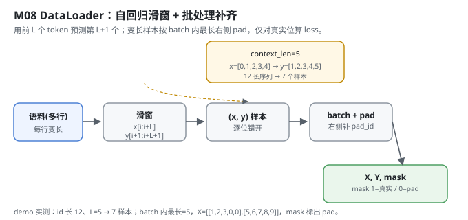
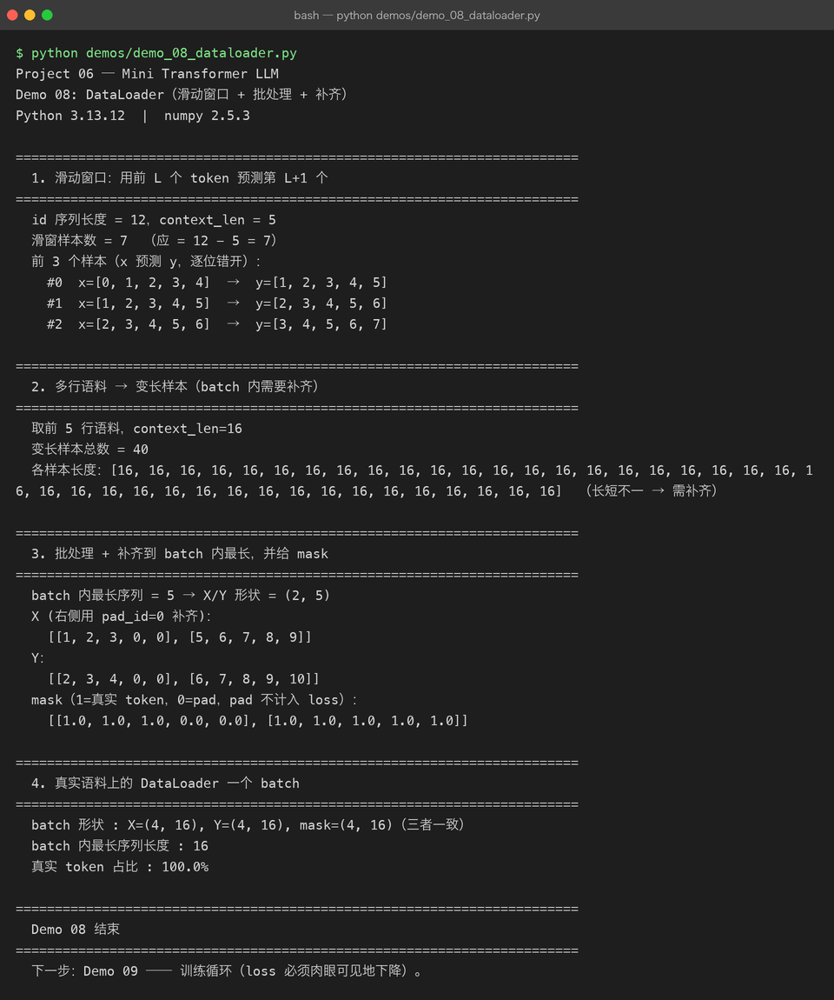

# Milestone 08 — Dataset / DataLoader：把语料变成自回归训练批次

Milestone 07 的整机已经能从 id 吐出 logits。但「id 从哪来、怎么组织成训练样本」还没解决。语言模型是**自回归**的：用前 `L` 个 token 预测第 `L+1` 个。这一层负责把整段语料切成这种 `(x, y)` 样本，再把长短不一的句子拼成一个 batch、补齐、给 mask。

在 Project 05 里数据集是别人喂好的；这里我亲手写滑窗和补齐 —— 而且补齐不是装饰：**pad 的位置不能算进 loss**，否则模型会被「预测 pad」带偏。

---

## 1. What / Why：自回归 + 补齐为什么缺一不可

- **滑窗（自回归）**：`x = ids[i:i+L]`，`y = ids[i+1:i+L+1]`，逐位错开。这就是「预测下一个 token」的训练目标。
- **变长补齐**：一个 batch 里句子长短不一，按 batch 内最长右侧 pad 到同样长，才能塞进一个矩阵。但 pad 位是假的，必须给 `mask`（1=真实 / 0=pad），训练时只对真实位算 loss。

## 2. Design：滑窗 → (x,y) → pad → (X,Y,mask)

`src/model/dataloader.py`：

- `build_examples(ids, context_len)`：把**一整条** id 序列当长序列滑窗，产出等长样本（用于演示基本滑窗）。
- `examples_from_lines(id_lines, context_len)`：多行语料各自变样本 —— 短于 `context_len` 的行用整行（`x=行[:-1], y=行[1:]`），更长的行切块。行长不同 → 天然触发补齐。
- `_pad_batch(pairs, pad_id)`：右侧补齐到 batch 内最大长度，返回 `X, Y, mask`。
- `DataLoader`：按 `batch_size` 产出 `(X, Y, mask)`，支持 `shuffle`（尊重全局 `np.random`，可用 `seed` 复现）。



## 3. Real-run evidence（来自 `demos/out/demo_08_dataloader.txt`）

真实环境：Python 3.13.12 | numpy 2.5.3。

基本滑窗：12 长序列、context_len=5 → 恰 `12-5=7` 个样本：

```
id 序列长度 = 12，context_len = 5
滑窗样本数 = 7  （应 = 12 - 5 = 7）
前 3 个样本（x 预测 y，逐位错开）：
  #0  x=[0, 1, 2, 3, 4]  →  y=[1, 2, 3, 4, 5]
  #1  x=[1, 2, 3, 4, 5]  →  y=[2, 3, 4, 5, 6]
  #2  x=[2, 3, 4, 5, 6]  →  y=[3, 4, 5, 6, 7]
```

多行语料触发变长：`context_len=16`，前 5 行共 40 个样本（demo 里打印的长度列表全为 16，说明这 5 行都长于 16、被切成等长窗口）。

批处理 + 补齐，pad 位标 0、mask 标出真实位：

```
batch 内最长序列 = 5 → X/Y 形状 = (2, 5)
X (右侧用 pad_id=0 补齐)：
  [[1, 2, 3, 0, 0], [5, 6, 7, 8, 9]]
Y：
  [[2, 3, 4, 0, 0], [6, 7, 8, 9, 10]]
mask（1=真实 token，0=pad，pad 不计入 loss）：
  [[1.0, 1.0, 1.0, 0.0, 0.0], [1.0, 1.0, 1.0, 1.0, 1.0]]
```

真实语料上一个 batch，且 `X/Y/mask` 三者形状严格一致：

```
batch 形状 : X=(4, 16), Y=(4, 16), mask=(4, 16)（三者一致）
batch 内最长序列长度 : 16
真实 token 占比 : 100.0%
```



## 4. Bugs / lessons

本 milestone demo 没有暴露真实运行 bug。一个**设计提醒（来自源码注释）**：`examples_from_lines` 对「短于 `context_len` 的行用整行」、对「更长行切块」，两条分支都必须保证 `x` 和 `y` 长度一致（`x=行[:-1], y=行[1:]`），否则进 `_pad_batch` 后 `X` 和 `Y` 长度对不上。demo 里 `X/Y/mask` 形状一致、`真实 token 占比 100%` 都印证了补齐逻辑正确。

## 5. Conclusion

1. 自回归训练目标就是滑窗：`x=ids[i:i+L]` 预测 `y=ids[i+1:i+L+1]`，逐位错开。
2. 变长样本按 batch 内最长**右侧 pad**，pad_id=0。
3. mask（1=真实/0=pad）是必须的：pad 位不计入 loss，否则模型被假目标带偏。
4. `X / Y / mask` 三者形状必须严格一致，这是 `_pad_batch` 的硬约束。
5. `DataLoader` 尊重全局 `np.random`，用 `seed(0)` 即可复现，方便测试与梯度校验。

## 6. Code map

| 文件 | 职责 |
|---|---|
| `src/model/dataloader.py` | `build_examples`（单序列滑窗）、`examples_from_lines`（多行变长）、`_pad_batch`（右侧补齐+mask）、`DataLoader`（batch 迭代器，可 shuffle） |
| `demos/demo_08_dataloader.py` | 4 节演示：滑窗 / 多行变长 / 批处理补齐 / 真实 batch，输出落 `demos/out/demo_08_dataloader.txt` |
| `assets/dataloader.svg` | 本章数据流图 |

## 7. Version line

v0.6 → **v0.7**，Dataset/DataLoader 落地（自回归滑窗 + 右侧补齐 + mask），`X/Y/mask` 形状一致性验证，演示真实跑通并核对样本数与补齐结果，配图 1 张手写 SVG + 1 张真实终端截图。
