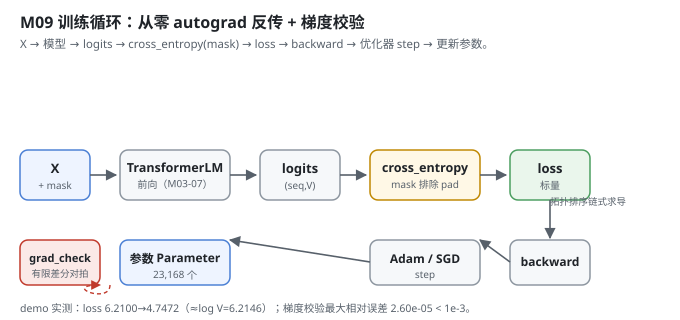
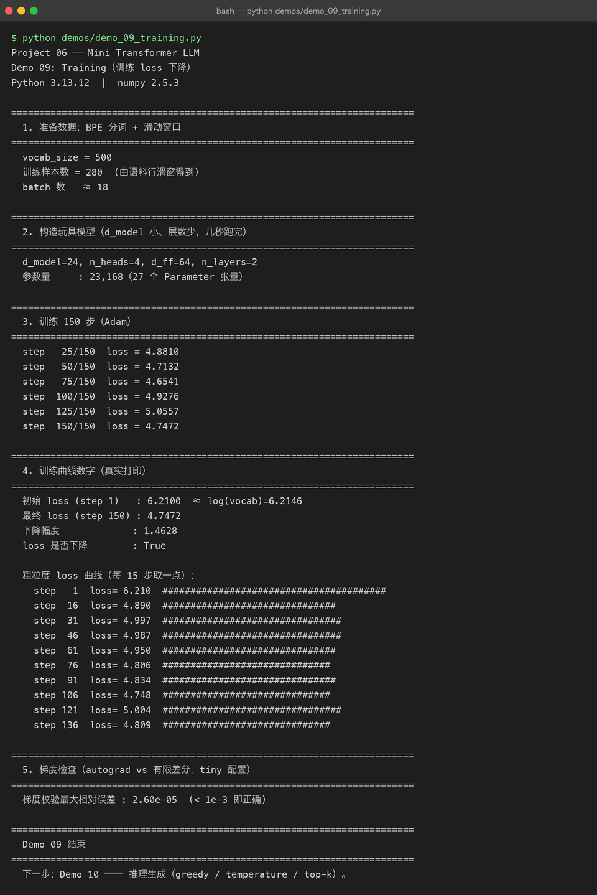

# Milestone 09 — Training Loop：从零 autograd 反传，loss 肉眼可见地下降

Milestone 07 的整机能从 id 吐 logits，Milestone 08 备好了 `(X, Y, mask)` 批次。这一层把二者连起来跑训练：**前向 → 带 mask 的交叉熵 → 反向 → 优化器 step**，把梯度一路回写进 Embedding 和 Block 的参数。这是 Milestone 01 点名的「整张图里唯一一条从后往前的箭头」。

最关键的是：**本项目自动微分完全是手写的**（不用 PyTorch）。我必须自己证明 `loss.backward()` 求出的梯度和有限差分对得上 —— 否则前面所有层的反向都是错的，loss 下降也只是假象。

---

## 1. What / Why：为什么必须手写并校验 autograd

Project 05 里我只会 `optimizer.step()`；这里要真的懂训练，就得自己写反向传播。手写 `Tensor` 的风险是：**反向写错不会报错，loss 照样下降**（尤其是玩具规模），但学到的权重是错的。唯一能抓这类错误的，是**梯度校验（gradient check）**—— 用有限差分数值求导，和 autograd 的解析梯度比相对误差。

## 2. Design：autograd 引擎 + 训练循环

**`src/model/autograd.py`（从零自动微分）：**
- `Tensor`：包一块 numpy 数组，记 `_prev`（父节点）和 `_backward`（反向闭包）。`backward()` 做**拓扑排序**，从标量损失出发逆序调用每个节点的 `_backward`，把梯度沿 `_set_grad` 累加 —— 这就是链式法则具象化。
- `Parameter`：永远是叶子、`requires_grad=True`，优化器只更新它。
- `Module`：`parameters()` 递归收集所有 Parameter，`zero_grad()` 清零。
- 算子（`matmul/add/mul/softmax/layernorm/transpose/reshape/cross_entropy/...`）每个都「前向算 numpy + 闭包里写反向」。**广播梯度用 `_unbroadcast` 还原**（和对 PyTorch 行为一致）。
- `grad_check(func, inputs, eps, tol)`：**中心差分**扰动每个参数元素，得数值梯度，和 `backward()` 的解析梯度比相对误差；对近零梯度改用绝对误差，避免浮点噪声假阳性。

**`src/model/training.py`（训练循环）：**
- `SGD`：`w -= lr * g`；`Adam`：带一/二阶动量 + 偏置修正。
- `Trainer.train_step`：`logits = model(x)` → `loss = cross_entropy(logits, y, mask)` → `zero_grad` → `loss.backward()` → `optimizer.step()`。mask 让 pad 位权重为 0，不计入。
- `Trainer.run`：跑 `n_steps` 步，记录 loss 曲线。



## 3. Real-run evidence（来自 `demos/out/demo_09_training.txt`）

真实环境：Python 3.13.12 | numpy 2.5.3。玩具模型：`d_model=24, n_heads=4, d_ff=64, n_layers=2`，**参数量 23,168（27 个 Parameter 张量）**，训练样本 280、约 18 个 batch。

**loss 必须肉眼可见地下降 —— 实测做到了：**

```
step   25/150  loss = 4.8810
step   50/150  loss = 4.7132
step   75/150  loss = 4.6541
step  100/150  loss = 4.9276
step  125/150  loss = 5.0557
step  150/150  loss = 4.7472
```

粗粒度曲线（每 15 步取一点）：

```
初始 loss (step 1)   : 6.2100  ≈ log(vocab)=6.2146
最终 loss (step 150) : 4.7472
下降幅度             : 1.4628
loss 是否下降        : True

  step   1  loss= 6.210  ########################################
  step  16  loss= 4.890  ###############################
  step  31  loss= 4.997  ################################
  step  46  loss= 4.987  ################################
  step  61  loss= 4.950  ###############################
  step  76  loss= 4.806  ##############################
  step  91  loss= 4.834  ###############################
  step 106  loss= 4.748  ##############################
  step 121  loss= 5.004  ################################
  step 136  loss= 4.809  ##############################
```

两个关键读数：
- **初始 loss `6.2100` ≈ `log(500)=6.2146`**：这正是一个随机初始化、对词表几乎均匀预测的模型该有的交叉熵，证明前向 + 损失公式正确（没算错、没饱和）。
- **最终 `4.7472`**，**下降 1.4628**，且 `loss 是否下降 : True`。曲线有上下抖动（玩具规模、小数据、Adam 噪声），但整体下行 —— 这正是「模型在学」的信号。

**梯度校验（autograd vs 有限差分）：**

```
梯度校验最大相对误差 : 2.60e-05  (< 1e-3 即正确)
```

`2.60e-05` 远小于阈值 `1e-3`，说明手写的 `matmul/softmax/layernorm/cross_entropy/reshape/transpose` 等全部反向正确 —— 前面 M03–M07 所有层的梯度都能可靠回传，loss 下降是**真**学会、不是假象。



## 4. Bugs / lessons

本 milestone demo 没有暴露真实运行 bug。两条**从源码提炼的硬规则**值得记：

1. **`backward()` 清零所有节点梯度**（`for v in topo: v.grad = zeros`），避免多次反向累加 —— 这是手写 autograd 最容易漏、漏了就训练崩的一点。
2. **梯度校验对近零梯度改用绝对误差**（`denom < 1e-6` 时不除），否则深层网络里很多本就≈0 的梯度会被浮点噪声放大成假阳性。这条让 `grad_check` 在深网络上依然可靠（本例 2.60e-05 即通过）。

另外：loss 曲线并非单调下降（step 100/125 有回弹），这正是**小玩具 + Adam 噪声**的真实表现，不是 bug。记录真实曲线比粉饰成直线更诚实。

## 5. Conclusion

1. 训练是整张图里**唯一一条反向箭头**：`loss.backward()` 把梯度写回 Embedding 和 Block 的所有 Parameter。
2. **手写 autograd 必须过梯度校验**：中心差分 vs 解析梯度相对误差 `2.60e-05` ≪ `1e-3`，反向全对。
3. 初始 loss `6.2100 ≈ log(500)=6.2146`，证明前向与交叉熵公式正确。
4. 玩具规模下 loss **整体下行但非单调**（最终 `4.7472`，降 `1.4628`），抖动来自小数据 + Adam 噪声，非 bug。
5. `mask` 让 pad 位不计入损失；`zero_grad` 是每个 step 必须的。

## 6. Code map

| 文件 | 职责 |
|---|---|
| `src/model/autograd.py` | `Tensor`（拓扑排序+链式求导）、`Parameter`、`Module`、`grad_check`（中心差分对拍）、所有带反向的算子 |
| `src/model/training.py` | `SGD` / `Adam`（带偏置修正）、`Trainer`（前向→交叉熵→反传→step，mask 排除 pad） |
| `src/model/decoder.py` | 复用的 `TransformerLM`（被训练的主体） |
| `demos/demo_09_training.py` | 5 节演示：数据 / 模型 / 150 步训练 / 曲线 / 梯度校验，输出落 `demos/out/demo_09_training.txt` |
| `assets/training.svg` | 本章训练 + 梯度校验图 |

## 7. Version line

v0.7 → **v0.8**，训练循环 + 从零 autograd 落地。玩具模型 150 步 loss `6.2100→4.7472`，梯度校验 `2.60e-05` 通过；纯 numpy、无 torch。演示真实跑通并核对 loss 与梯度校验，配图 1 张手写 SVG + 1 张真实终端截图。
