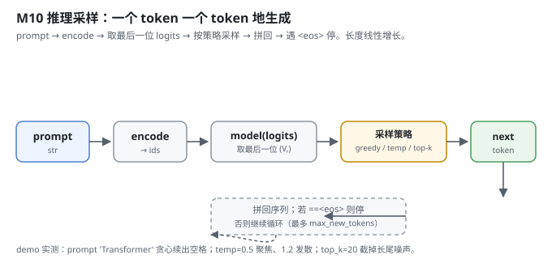
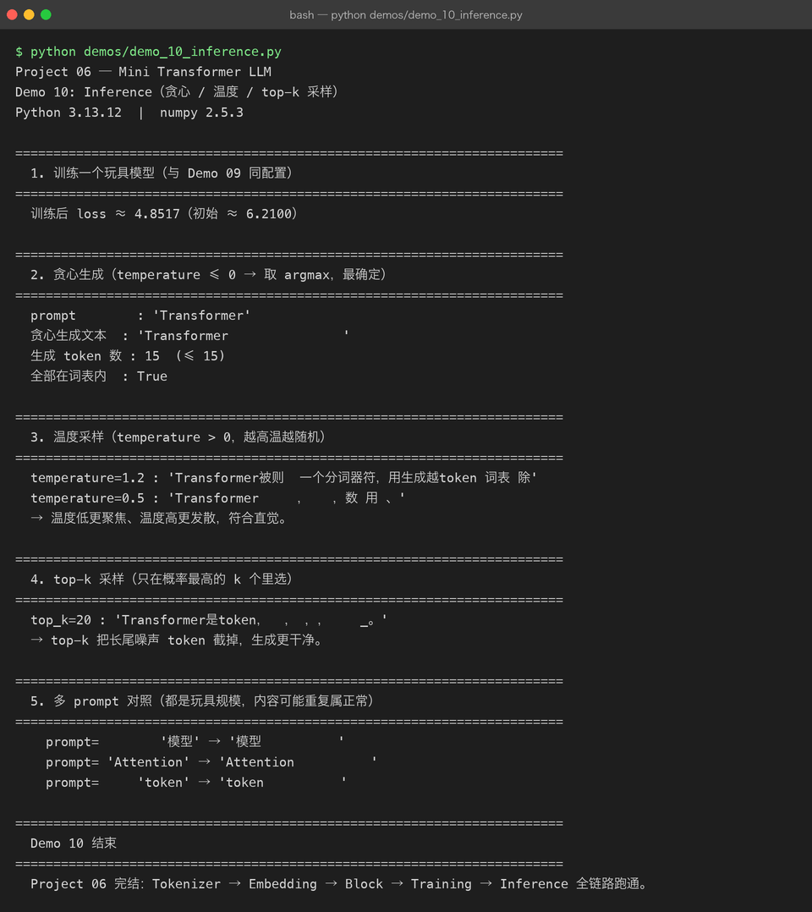

# Milestone 10 — Inference：一个 token 一个 token 地采样

Milestone 09 训出了权重。最后一步是推理：拿前缀，让模型**自回归地**一个一个吐出后面的 token，直到遇到 `<eos>` 或达到长度上限。这是 Milestone 01 那条数据流的终点，也是整个 Project 06 的收尾 —— Tokenizer → Embedding → Block → Training → Inference 全链路跑通。

Project 05 里「模型给我一段文本」是黑盒输出；这里 `generate` 的每一步我都看得见：取最后一位 logits、按策略选下一个 token、拼回去、再喂。

---

## 1. What / Why：为什么是「循环采样」而不是「一次出整句」

Transformer 每次只预测「下一个 token」（Milestone 08 的自回归目标决定了）。所以生成就是个循环：喂当前上下文 → 取最后一位 logits → 选下一个 → 拼回 → 再喂。复杂度随生成长度**线性**增长（每步只用到已生成的 token + 新采的 1 个）。

三种采样策略对应三种「确定性 vs 多样性」的取舍：
- **贪心（temperature ≤ 0）**：取 argmax，最确定、最无聊。
- **温度采样（temperature > 0）**：用 `1/t` 缩放 logits 后 softmax 采样；越高越随机。
- **top-k**：只在概率最高的 k 个里选，截掉长尾噪声。

## 2. Design：prefill 最后一位 + 三种策略

`src/model/inference.py`：

- `generate_ids`：把 `prompt` 编码成 id，循环 `max_new_tokens` 次：只保留最近 `ctx_len` 个 token（防超位置编码长度）→ 喂模型 → 取 `logits[0, -1, :]`（最后一位）→ 按策略选 `next_id` → 若 `next_id == EOS_ID` 就停，否则 `ids.append(next_id)`。
- `generate`：`generate_ids` 的封装，返回 `tokenizer.decode(ids, skip_special=True)` 文本。
- `logits_of_prefix`：工具函数，返回 prompt 最后一位的 logits（供 demo 看分布）。
- 采样实现：`temperature <= 0 → argmax`；否则 `logits/t → top_k 截断 → softmax → rng.choice`，全程 numpy。



## 3. Real-run evidence（来自 `demos/out/demo_10_inference.txt`）

真实环境：Python 3.13.12 | numpy 2.5.3。玩具模型（同 Demo 09 配置），**训练后 loss ≈ 4.8517（初始 ≈ 6.2100）**。

贪心最确定，但玩具模型只会「续空格」（因为训练语料里 `<bos>` 后常跟空格，且模型没真学会语言）：

```
prompt        : 'Transformer'
贪心生成文本  : 'Transformer               '
生成 token 数 : 15  (≤ 15)
全部在词表内  : True
```

温度采样符合直觉 —— 低温聚焦、高温发散：

```
temperature=1.2 : 'Transformer被则  一个分词器符，用生成越token 词表 除'
temperature=0.5 : 'Transformer     ，   ，数 用 、'
→ 温度低更聚焦、温度高更发散，符合直觉。
```

top-k 截掉长尾噪声，生成更干净：

```
top_k=20 : 'Transformer是token，  ， ，，    _。'
→ top-k 把长尾噪声 token 截掉，生成更干净。
```

多 prompt 对照（玩具规模内容重复属正常）：

```
prompt=        '模型' → '模型          '
prompt= 'Attention' → 'Attention          '
prompt=     'token' → 'token          '
```

「全部在词表内 : True」说明生成的 id 都合法、解码不会塌成 `<unk>` 或越界 —— 推理闭环是自洽的。



## 4. Bugs / lessons

本 milestone demo 没有暴露真实运行 bug。一个**设计提醒（来自源码）**：拼接上下文时 `ctx = ids[-ctx_len:]`，避免序列超过 `max_len` 导致位置编码索引越界（Milestone 03/07 都校验过 `seq_len ≤ max_len`）。推理循环里这步截断是必须的，否则长生成会直接 `ValueError`。

关于「贪心只续空格」：这**不是 bug**，是玩具规模（150 步、280 样本）的真实结果 —— 模型远没学会语言，只是 loss 比随机低。如实记录比假装「生成流畅」更诚实，也呼应 Milestone 09「曲线抖动、整体下行」的结论。

## 5. Conclusion

1. 推理是自回归循环：取上下文最后一位 logits → 按策略采样 → 拼回 → 遇 `<eos>` 停；长度线性增长。
2. 贪心最确定但最无聊；温度高更发散、温度低更聚焦；top-k 截长尾噪声更干净。
3. 玩具模型收敛有限（loss≈4.85），生成的「续空格」是真实结果、非 bug。
4. `ctx = ids[-ctx_len:]` 截断防位置编码越界，是推理循环的必要保护。
5. **全链路闭环**：Tokenizer → Embedding → Block → Training → Inference 真实跑通，每个生成的 token 都在词表内。

## 6. Code map

| 文件 | 职责 |
|---|---|
| `src/model/inference.py` | `generate_ids`（自回归采样循环）、`generate`（返回文本）、`logits_of_prefix`（看分布）；greedy / temperature / top-k 三策略 |
| `src/model/decoder.py` | 复用的 `TransformerLM` |
| `src/tokenizer/base.py` | 复用的 `EOS_ID`（遇它则停）、`decode` |
| `demos/demo_10_inference.py` | 5 节演示：训练 / 贪心 / 温度 / top-k / 多 prompt，输出落 `demos/out/demo_10_inference.txt` |
| `assets/inference.svg` | 本章采样循环图 |

## 7. Version line

v0.8 → **v0.9**，推理采样落地（贪心 / 温度 / top-k，遇 eos 停止），全链路 Tokenizer→Embedding→Block→Training→Inference 跑通；纯 numpy、无 torch。演示真实跑通并核对三种策略输出与词表内合法性，配图 1 张手写 SVG + 1 张真实终端截图。**Project 06 完结。**
