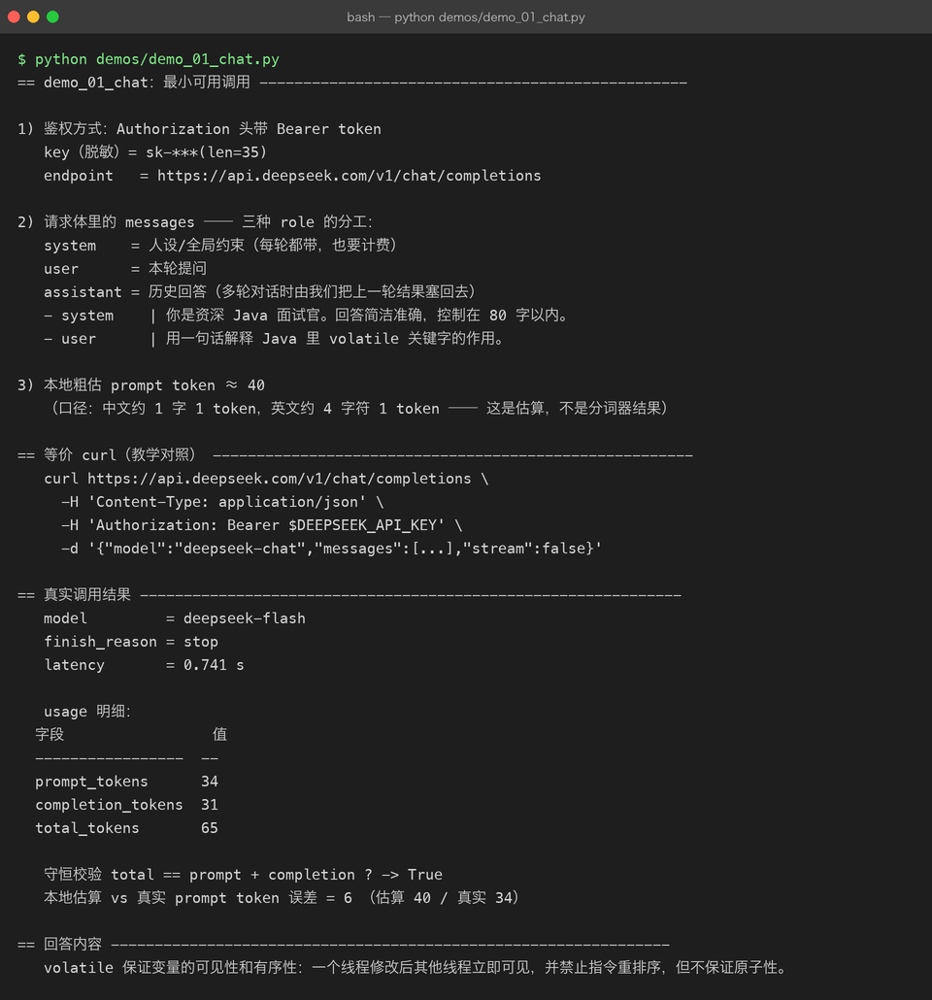
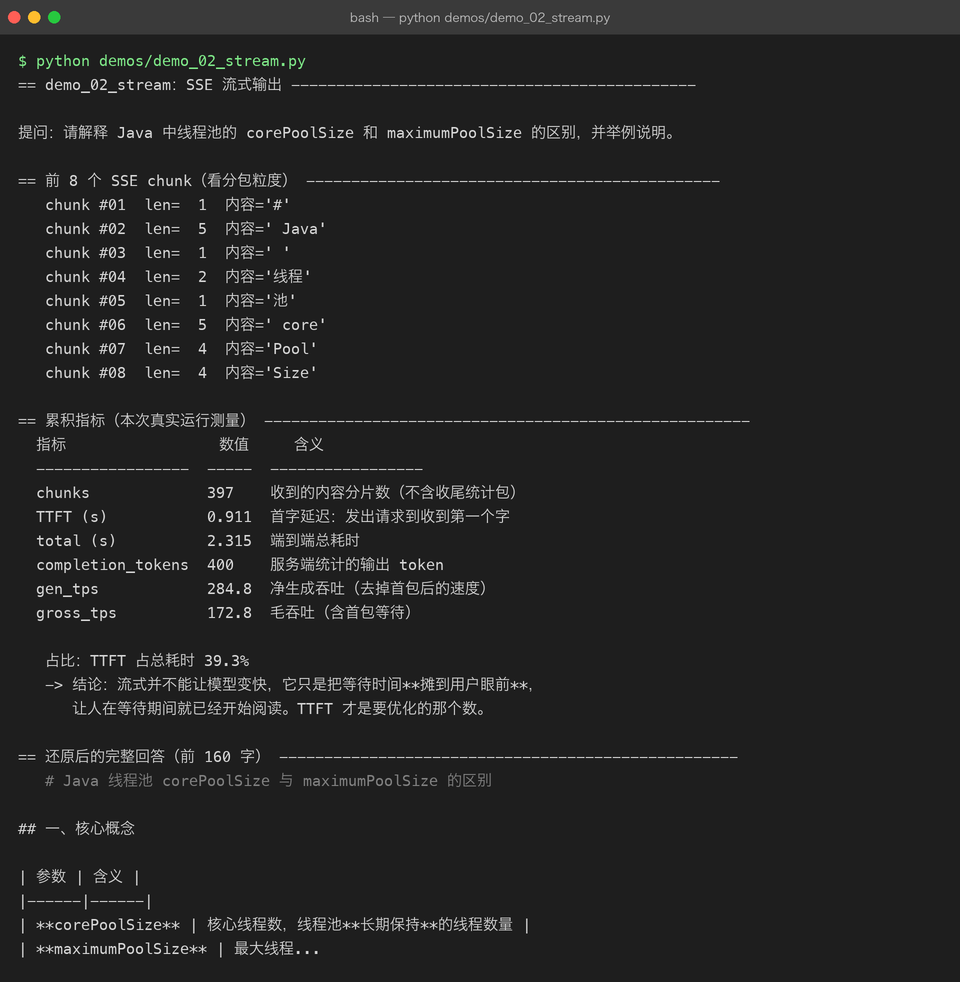
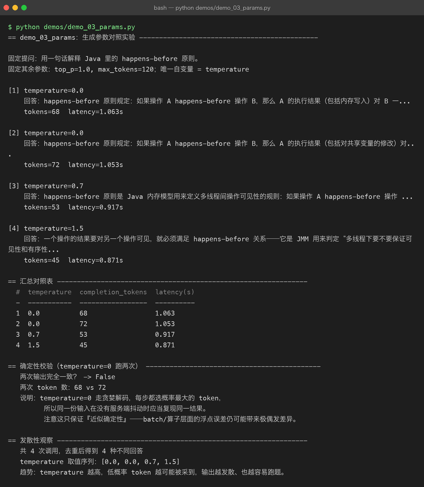
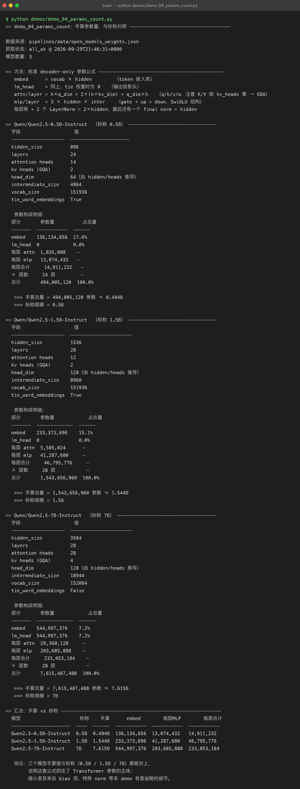
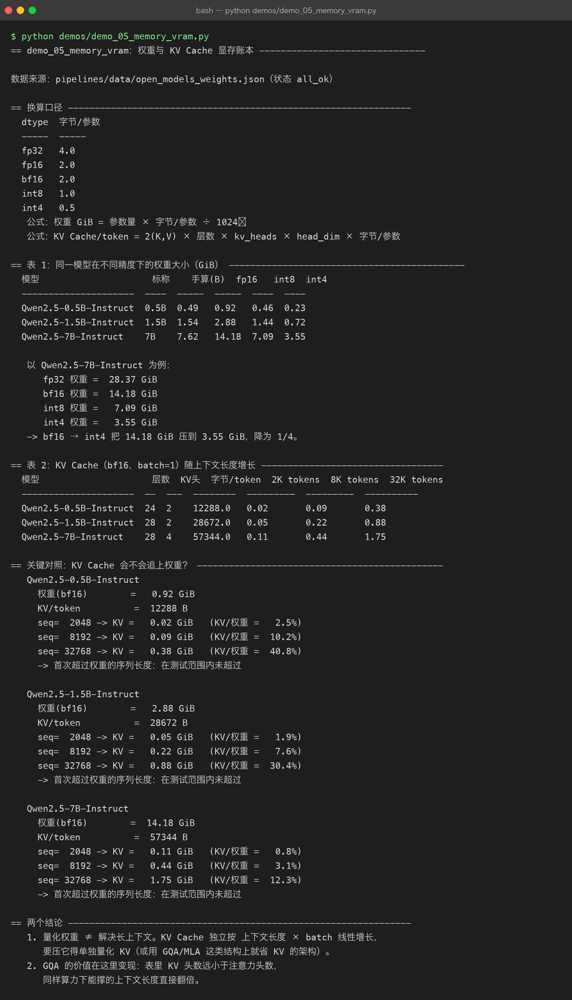
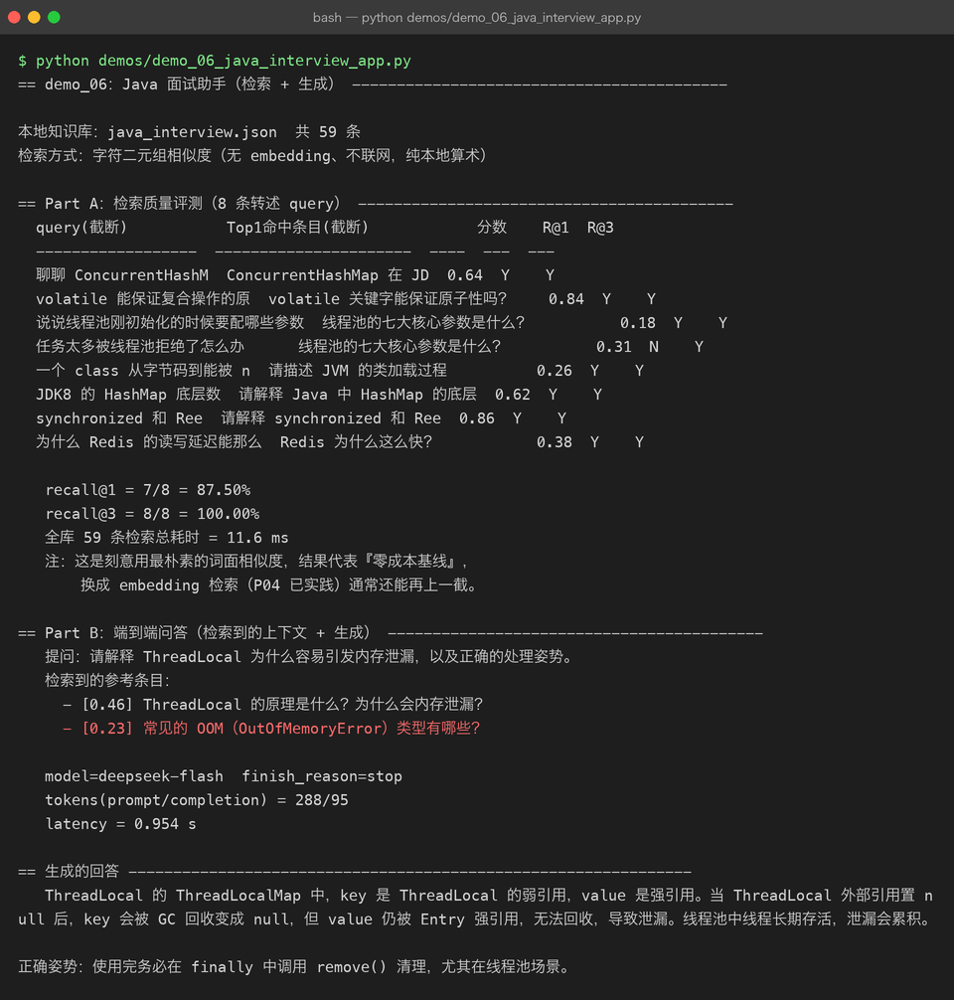

# pipelines —— 本地驱动的开源 LLM 调用管线

> 所属：[Project 07 · Open Source LLM](../README.md)
>
> **与 `workflows/` 的分工**：`workflows/` 回答「模型怎么训出来」，`pipelines/` 回答「模型怎么调起来、资源怎么算」。

## 为什么单开这个目录

本机是 Mac M1 / 16GB 统一内存 / 磁盘余量约 15GB。跑 Qwen2.5-7B 的 bf16 权重需要
**14.18 GiB**（见 M05 实测表），本机内存扛得住但磁盘会被压到危险水位；更大的模型直接不可行。

但**「调用」不等于「加载」**——推理在云端，本机只需要一个 HTTP 客户端。于是 P07 拆成互不干扰的两条线：

| 目录 | 回答的问题 | 是否需要 GPU |
|---|---|---|
| `workflows/` | 模型/数据集怎么训出来（Colab / Pro / 云端 GPU） | 是 |
| **`pipelines/`** | **怎么调用、参数怎么调、资源怎么算** | **否** |

附带好处：这条线的每个数字要么来自**本次真实 API 调用**，要么是**本机可复现的算术**，
没有从博客里抄来的二手结论（具体见文末「数据可信度分级」）。

## 目录契约

```
pipelines/
├── README.md                    # 本文件
├── data/
│   └── open_models_weights.json # 真实抓取的 HF config.json 字段（带着 source 与抓取状态）
├── llm_client/                  # 零第三方依赖的最小客户端
│   ├── client.py                # /chat/completions：非流式 + SSE 流式
│   └── baselines.py             # 参数量 / 权重 / KV Cache 的本地算术
├── demos/                       # 6 个 demo，全部真实跑通
│   ├── _common.py               # 落盘 + 计时 + 表格脚手架
│   ├── demo_01_chat.py          # M01 最小可用调用
│   ├── demo_02_stream.py        # M02 SSE 流式与 TTFT
│   ├── demo_03_params.py        # M03 生成参数对照
│   ├── demo_04_params_count.py  # M04 手算参数量对账
│   ├── demo_05_memory_vram.py   # M05 显存账本
│   ├── demo_06_java_interview_app.py  # M06 Java 面试助手（检索+生成）
│   └── out/                     # 每次运行的终端输出 + 结构化结果（截图的真实素材）
└── assets/                      # 由 demos/out/*_terminal.txt 渲染的真实终端截图
```

## 运行方式

```bash
cd projects/07-open-source-llm/pipelines
source ~/.zshrc                      # DEEPSEEK_API_KEY 在这里导出
python demos/demo_01_chat.py
```

> **必须 `source ~/.zshrc`**：非交互 shell 不会继承里面的导出变量，
> 不 source 会直接抛 `LLMError: 未找到 DEEPSEEK_API_KEY`。这是本机环境特有的坑，
> 别浪费时间怀疑代码。

demo 的输出会同步写入 `demos/out/<name>_terminal.txt` 与 `<name>_result.json`——
**截图只能由这两份真实产物渲染而来**，这是本项目对「配图」的硬约束。

---

## M01 最小可用调用

`demo_01_chat.py` 把一次调用在 HTTP 层面摊开：Bearer 鉴权、三种 role 的分工、
以及 usage 的守恒性质（`total == prompt + completion`）。



**本次真实测量**

| 指标 | 实测值 |
|---|---|
| prompt_tokens | **34** |
| completion_tokens | **31** |
| total_tokens | **65** |
| 守恒校验 `total == prompt + completion` | **True** |
| latency | **0.741 s** |
| 本地粗估 vs 真实 prompt token | 估算 40 / 真实 34，**误差 6** |

本地估算用「中文 1 字 ≈ 1 token、英文 4 字符 ≈ 1 token」的口径，误差 6 属正常——
它证明了**估算只能是估算**，真正计费要以服务端 `usage` 为准。

---

## M02 流式输出：把等待摊到用户眼前

`demo_02_stream.py` 的核心价值是把「总耗时」拆成 **TTFT（首字延迟）** 和「净生成」两段。
非流式下这两个数是同一个值，用户只能干等；流式把它们分开，**体感完全不同，但模型并没有变快**。



| 指标 | 实测值 |
|---|---|
| SSE chunks | **397** |
| TTFT（首字延迟） | **0.9106 s** |
| 端到端总耗时 | **2.3152 s** |
| TTFT 占比 | **39.33%** |
| 净生成吞吐 gen_tps | **284.77 tok/s** |
| 毛吞吐 gross_tps | **172.8 tok/s** |

**两个读数值得记**：

1. **TTFT 占了近 40% 的总时间**——用户有接近四成时长在「对着空白屏等」。这才是要优化的目标。
2. **gen_tps 284.77 vs gross_tps 172.8**，差的正是被 TTFT 拖走的那部分。
   只看「每秒多少 token」会被这个口径差误导。

另一个细节：397 个 chunk 对应 400 个 completion token，几乎 1:1——
中文流式基本是「一个 token 一个包」。

---

## M03 生成参数对照

`demo_03_params.py` 固定 prompt、只改 `temperature`，跑 4 组
（`0.0` 故意跑两次，用于检验贪婪解码是否真的一致）。



| # | temperature | completion_tokens | latency(s) |
|---|---|---|---|
| 1 | 0.0 | 68 | 1.063 |
| 2 | 0.0 | 72 | 1.053 |
| 3 | 0.7 | 53 | 0.917 |
| 4 | 1.5 | 45 | 0.871 |

**⚠️ 本次运行推翻了一个常见说法**：

> temperature = 0 走贪婪解码，同输入应产出相同输出。

实测**两次结果不一致**（68 vs 72 tokens，文本也有差异）。
这说明「temperature=0 ⇒ 严格确定性」是**近似成立**而非保证：
服务端批处理/batching、算子层面的浮点差异都会让极小概率(token分岔)放大，
尤其在长输出里。

如果你的业务依赖「同输入必须同输出」，不要把宝押在 temperature=0 上——
正确做法是加 `seed`（若服务端支持）+ 自己做输出缓存。

另外，本组数据里 token 数随 temperature 升高而下降（68 → 53 → 45），
这是**这组样本的观察**，不能当普遍规律——它取决于采样到停止符的时机。

---

## M04 手算参数量：把「为什么叫 7B」算出来

`demo_04_params_count.py` **完全不联网**，只用 [Transformer 参数公式](https://arxiv.org/abs/1706.03762)
从真 config.json 的架构字段算出参数量，再跟标称规模对账。

能算出来 = 你真的懂这个结构；只能背名字 = 之前是假的懂。



| 模型 | 手算参数量 | 手算(B) | 标称 |
|---|---|---|---|
| Qwen2.5-0.5B-Instruct | **494,005,120** | 0.494 | 0.5B |
| Qwen2.5-1.5B-Instruct | **1,543,656,960** | 1.544 | 1.5B |
| Qwen2.5-7B-Instruct | **7,615,487,488** | 7.615 | 7B |

三个都能对上，说明这套公式抓住了 Transformer 参数的主体。
残余差异来自本 demo **有意省略**的 bias 项、特殊 norm 等细节。

公式（也是 P06 从零实现过的结构，如今在真实模型上对账）：

```text
embed      = vocab × hidden                       （tie 权重时 lm_head 为 0，否则再算一份）
attn/layer = h×q_dim + 2×(h×kv_dim) + q_dim×h     （q/k/v/o；K、V 按 kv_heads 算 → GQA）
mlp/layer  = 3 × hidden × intermediate            （gate + up + down，SwiGLU）
每层再加 2 个 LayerNorm = 2×hidden；最后还有一个 final norm = hidden
```

值得一提：0.5B 与 1.5B 的 `tie_word_embeddings=true`（lm_head 复用嵌入表，直接省下一份
vocab×hidden），7B 为 `false`——所以 7B 单是这两个矩阵就占了 `544,997,376 × 2 ≈ 10.9 亿`参数，
**超过总量的 1/7**。词表大小的代价在这里看得最清楚。

---

## M05 显存账本：权重与 KV Cache

`demo_05_memory_vram.py` 同样纯本地算术，回答两个决策问题：**要不要量化？能不能跑长上下文？**



**Qwen2.5-7B 权重（GiB）**

| fp32 | bf16 | int8 | int4 |
|---|---|---|---|
| **28.37** | **14.18** | **7.09** | **3.55** |

bf16 → int4 正好降为 1/4。这解释了「为什么 4-bit 量化是消费级显卡跑大模型的入场券」。

**KV Cache（bf16, batch=1）**：7B 每 token **57,344 B**，序列长度展开后：

| 2K tokens | 8K tokens | 32K tokens |
|---|---|---|
| **0.11 GiB** | **0.44 GiB** | **1.75 GiB** |

**一个诚实的负结果**：本以为长上下文下 KV 会反超权重，但在 32K 测试范围内**并没有**——
7B 在 32K 时 KV/权重 仅 **12.3%**，最高的 0.5B 也只有 **40.8%**。
原因是这几个模型的 `max_position_embeddings` 为 32768，且 GQA 把 KV 压得很小
（7B 只有 4 个 KV 头 vs 28 个注意力头）。

结论因此要修正表述：

> 长上下文下 KV Cache 会**线性增长**，但在这批 Qwen2.5 模型的官方窗口内还追不上权重。
> 真正让它爆掉的是 **batch 数**——上面全是 batch=1，乘以并发数才是线上真实水位。

另外务必记住：**量化权重 ≠ 解决长上下文**。KV Cache 是独立变量，
要压它得单独量化 KV 或依赖 GQA/MLA 这类架构改进。

---

## M06 Java 面试助手：检索 + 生成

`demo_06_java_interview_app.py` 把前面的东西串成闭环，并且**结果是可测量的**：
使用上层 `data/java_interview.json`（**59 条**真实 Java 面试问答）作为知识库，
用字符二元组相似度做本地检索（无 embedding 依赖、不联网），再交给模型生成。



**检索质量（8 条转述 query 构成的 mini 评测集）**

| 指标 | 实测值 |
|---|---|
| 知识库条目数 | **59** |
| recall@1 | **87.50%**（7/8） |
| recall@3 | **100.00%**（8/8） |
| 全库检索耗时 | **11.59 ms** |

评测集刻意用**转述**（而不是原句照抄）来提问，
否则「字符串一模一样」会给一个虚假的满分。

唯一漏检的一条：「任务太多被线程池拒绝了怎么办」Top1 命中了「线程池的七大核心参数」——
两者共享大量词面，这正是纯词面相似度的典型短板。

**端到端问答实测**：prompt/completion = **288/95** tokens，latency **0.9543 s**。

> 11.59 ms 检索 vs 954 ms 生成——**耗时几乎全在生成侧**。
> 想提速别在检索上抠，优化 prompt 长度和生成长度才是大头。

---

## 必须诚实标注的三件事

写文档时若漏掉这三条，整份材料的可信度就归零：

1. **服务端返回的 model 是 `deepseek-flash`，不是我们请求的 `deepseek-chat`。**
   客户端请求体写的是 `deepseek-chat`，但实际由服务端决定落到哪个模型。
   因此本文件所有延迟 / 吞吐 / 计费相关数字**都是 deepseek-flash 的实测**，
   不能当作 deepseek-chat 的性能。

2. **temperature=0 两次调用结果不一致**（详见 M03），
   「贪婪解码 = 确定性」是近似而非保证。

3. **recall@1 = 87.5% 是「零成本词面基线」的成绩**，样本只有 8 条。
   它用来作**对照基准**有意义，不足以单独支撑任何结论。

## 数据可信度分级

| 类别 | 来源 | 可复现性 |
|---|---|---|
| usage tokens / latency / TTFT / tps | 本次真实 API 调用 | 高（重跑可得同量级） |
| 参数量 / 权重 GiB / KV Cache | 本地算术 + 真实 config.json | 高（不联网可复现） |
| config.json 架构字段 | 实时抓取 HF 镜像（`fetch_status: all_ok`） | 高（原始数据），但以官方为准 |
| recall@1 / recall@3 | 本地 8 条评测集 | 中（样本小） |

## 下一步

- 增加 KServe/vLLM 本地部署对照（需要 GPU，走 `workflows/` 那条线的技术栈）
- 用 embedding 检索替换字符二元组，与 87.5% 这条基线做同口径对比
- 把 M05 的账本接上真实 GPU 显存读数，验证「估算 vs 实测」的偏差

## 版本

v0.1 —— 6 个模块全部真实跑通，产出 6 张真实终端截图 + 12 份运行产物。
