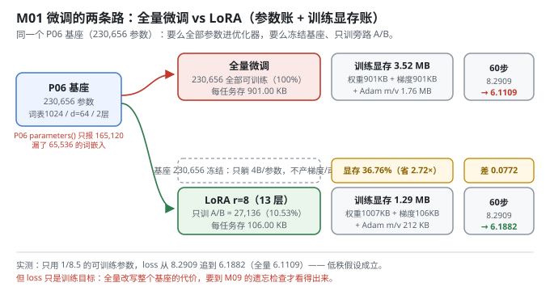
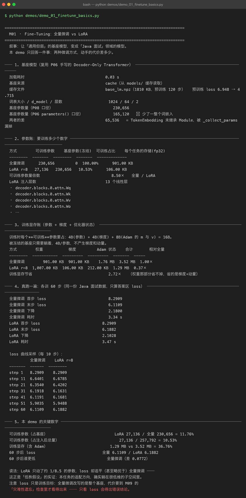

# Milestone 01 — Fine-Tuning：同一个基座，两条路的代价差多少

主线叙事的第一站。P06 手写了一个 Decoder-Only Transformer 并把它预训练成「通用但弱」的基座，P07 攒出了 59 条 Java 面试问答。这一层要回答一个最朴素的问题：**把通用模型变成领域模型，到底要"动"多少东西？**

两条路摆在一起对拍：

- **全量微调**：基座每个参数都进优化器，每个下游任务存一份完整权重。
- **LoRA**：基座冻结，只在 13 个线性层旁边插一条低秩旁路，每个任务存一百多 KB。

答案是"看数字说话"，而不是"LoRA 一定更好"。本项目**纯 numpy 手写**，不引入 torch / peft / transformers —— LoRA 的每一次前向、每一条反向、每一份显存账都是自己算出来的，所以下面每个数字都能追到具体代码行。

---

## 1. Why：为什么先做这一步

微调的概念人人会说，但"值得不值得"是三笔账：**要训练多少个数字、训练时占多少显存、训出来效果差多少**。这三笔账不先算清楚，后面 LoRA / QLoRA / checkpoint / merge 全都是空中楼阁 —— 它们存在的理由，全部写在这三笔账里。

还有一个必须当场解决的坑：**参数量口径**。基座 230,656 个参数，P06 的 `Module.parameters()` 只报 165,120。差了整整一整个词嵌入。如果沿用 P06 的口径，后面所有"可训练占比""压缩倍数"都会算错，而且错得毫无察觉。

## 2. Design：参数账 + 显存账 + 真训一遍

**参数账。** LoRA 的全部想法是一行公式（M04 会把它彻底解剖）：

```text
W' = W + ΔW = W + (alpha / r) · B @ A
```

`W` 冻结，只有 `A ∈ R^{in×r}`、`B ∈ R^{r×out}` 被训练。本项目往 13 个二维权重上注入（`Wq/Wk/Wv/Wo/W1/W2` 各 2 个 block，再加输出投影 `proj`），r=8 时得到 27,136 个可训练参数。

**显存账。** 训练时每个**可训练**参数要占 `4B(参数) + 4B(梯度) + 8B(Adam 的 m 与 v) = 16B`；被冻结的基座只要躺着，4B/参数，不产生梯度和动量。所以 LoRA 省的不是权重，是**梯度 + 动量** —— 这一区别决定了 M05 为什么还要再量化基座。

**真训一遍。** 光算账不够，两路各训 60 步，同一份数据、同一 seed、只算答案区 loss（M03 会解释为什么要只算答案区）。



## 3. Real-run evidence（来自 `demos/out/demo_01_finetune_basics_terminal.txt`）

真实环境：Python 3.13 | numpy 2.5，基座从 `models/base_lm.npz` 缓存读取（1810 KB，预训练 120 步，loss `6.948 → 4.715`），词表 1024 / d_model 64 / 2 层。

**参数账（实测）：**

| 方式 | 可训练参数 | 基座参数(冻结) | 可训练占比 | 每个任务的存储(fp32) |
|---|---|---|---|---|
| 全量微调 | 230,656 | 0 | 100.00% | 901.00 KB |
| LoRA r=8 | **27,136** | 230,656 | **10.53%** | **106.00 KB** |

可训练参数量倍数 **8.50×**；LoRA 注入 **13 个线性层**（`decoder.blocks.0.attn.Wq` … `proj`）。

**训练显存账（实测）：**

| 方式 | 权重 | 梯度 | Adam 状态 | 合计 | 相对全量 |
|---|---|---|---|---|---|
| 全量微调 | 901.00 KB | 901.00 KB | 1.76 MB | 3.52 MB | 1.00× |
| LoRA r=8 | 1,007.00 KB | 106.00 KB | 212.00 KB | **1.29 MB** | **0.37×** |

即 `1.29 / 3.52 = 36.76%`，训练显存节省 **2.72×**。注意 LoRA 那一行权重反而更大（1,007 KB > 901 KB）—— 因为基座权重没搬走，还额外多了 A/B。

**真训 60 步（同一份 Java 面试数据，只算答案区 loss）：**

```
           全量微调    LoRA r=8
  -------  ------  --------
  step 1   8.2909    8.2909
  step 11  6.6401    6.6785
  step 21  6.3540    6.4202
  step 31  6.1918    6.1631
  step 41  6.1191    6.1681
  step 51  5.9035    5.9488
  step 60  6.1109    6.1882
```

全量 `8.2909 → 6.1109`（降 2.1800，3.34 s）；LoRA `8.2909 → 6.1882`（降 2.1028，3.47 s）。末步全量更低，但只差 **0.0772**。



## 4. 踩坑 / 反直觉发现

### 4.1 P06 的 `Module.parameters()` 漏掉了整个词嵌入（实测）

```
基座参数量（P08 口径）                230,656
基座参数量（P06 parameters() 口径）   165,120   ⚠ 少了一整个词嵌入
两者的差                            65,536   = TokenEmbedding 未继承 Module
```

`TokenEmbedding` 在 P06 里是普通类、没继承 `Module`，而 `_collect_params` 只认 `Parameter` / `Module` / list / dict，于是那 65,536 个参数（1024 × 64）根本不在参数表里 —— 优化器看不到它，词向量永远学不到。

P08 对 P06 是**只读依赖**（一行都不改），所以自己写了 `walk_parameters()`：遍历任意对象的 `__dict__`，不依赖 `Module` 继承关系（`src/ft/inject.py:81`）。这不是洁癖，是**不这么写基座就训不出来**。

### 4.2 「loss 更低 = 更好」在本章就是个陷阱（实测）

60 步后全量微调的 loss 更低（差 0.0772），读到这里很容易得出"全量微调更强"。但全量微调改写的是**整个基座**，代价要到 M09 的灾难性遗忘检查里才看得出来 —— 那里结论会反转。

> 本章刻意只下"低秩假设成立"这一个结论：用了 1/8.5 的参数，loss 追平到 0.0772 以内。剩下的留给 M09。

### 4.3 省的是梯度 + 动量，不是权重（实测）

上表里 LoRA 的"权重"一列是 1,007.00 KB，比全量的 901.00 KB 还大。很多人以为 LoRA 顺带把基座也变小了 —— **没有**。基座还是那个基座，fp32 老老实实躺着。这正是 M05 必须再上 NF4 量化的原因：LoRA 解决"训练不动那么多参数"，QLoRA 才解决"基座本身就装不下"。

## 5. Conclusion

1. 同一个基座上，LoRA r=8 只训 **27,136 / 257,792 = 10.53%**，每任务存储从 901 KB 降到 **106 KB**。
2. 训练显存（含 Adam）**1.29 MB vs 3.52 MB = 36.76%**，省的是梯度 + 动量；基座权重那部分省不掉。
3. 60 步后 loss **全量 6.1109 / LoRA 6.1882**，差 0.0772 —— 低秩假设在本任务上成立。
4. **参数量口径必须先校准**：P06 的 `Module.parameters()` 漏了 65,536 个词嵌入参数，P08 自建 `walk_parameters()` 修正。
5. 手写实现的意义在这里第一次兑现：上面每个数字都不是框架报的，是自己一字节一字节算出来的，所以能指出框架（这里是 P06 的 `parameters()`）漏了什么。

## 6. Code map

| 文件 | 职责 |
|---|---|
| `src/ft/base.py` | 基座模型：复用 P06 架构、确定性预训练、npz 缓存（`ensure_base_model`）；含 `walk_parameters` 修正后的存盘 |
| `src/ft/trainer.py` | `LoRATrainer`：前向 → 带 mask 的交叉熵 → 反传 → 只更新 adapter；`curve_summary` |
| `src/ft/inject.py` | `walk_parameters` / `named_parameters` / `inject_lora` / `freeze_base` / `count_parameters` |
| `src/ft/qlora.py` | `training_memory()`：参数 + 梯度 + 优化器状态的显存账（本章用它算 3.52 MB / 1.29 MB） |
| `src/ft/sft_data.py` | Alpaca 三元组 → 带答案区 mask 的 SFT 样本（M02/M03 主角） |
| `demos/demo_01_finetune_basics.py` | 5 节：基座 / 参数账 / 显存账 / 真训 60 步 / 关键数字 |
| `demos/out/demo_01_finetune_basics_terminal.txt` | 本章所有数字的来源 |
| `assets/finetune-basics.svg` | 本章两条路的参数账 + 显存账图 |

## 7. Version line

v0.0 → **v0.1**，M01 微调全景落地。实测：可训练 27,136 / 257,792 = 10.53%，训练显存 1.29 MB vs 3.52 MB = 36.76%，60 步 loss 全量 6.1109 / LoRA 6.1882；并定位 P06 `Module.parameters()` 漏报 65,536 词嵌入参数。纯 numpy、无 torch/peft/transformers。配图 1 张手写 SVG + 1 张真实终端截图。
