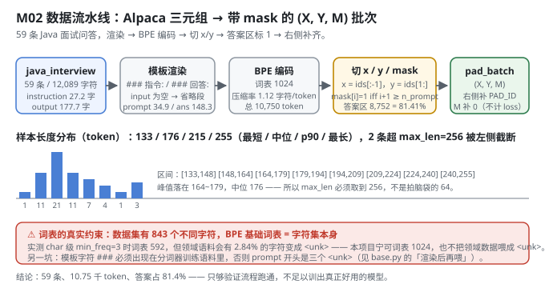
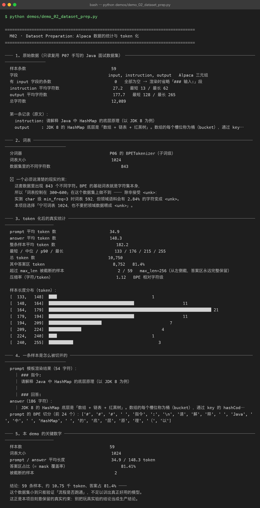

# Milestone 02 — Dataset Preparation：59 条问答，是怎么变成 `(X, Y, M)` 的

M01 证明了"值得微调"（1/8.5 的参数换 loss 追平），但那 60 步喂进去的是什么，还没交代。这一层把数据流水线摊开：**P07 的 Alpaca 三元组 → 渲染成指令模板 → BPE 编码 → 切成 `(x, y, mask)` → 右侧补齐成批次**。

这是整条主线上唯一一次"纯粹处理数据"的环节，但后面每一章的结论都受它约束：答案区占 81.41% 决定了 mask 的收益（M03），词表 1024 决定了困惑度只能在同分词器内部比较（M09），59 条的规模决定了所有结论都只能叫"流程跑通"。

**纯 numpy 手写**，没有 `datasets` 库没有 `DataCollator` —— `pad_batch` 就是十几行 numpy，每个统计量都是 `encode` 出来数出来的。

---

## 1. Why：为什么必须自己走一遍这条流水线

三个必须当场定死的量，框架不会替你决定：

1. **`max_len` 取多少。** 拍脑袋写 64 是常见做法（很多教程的建议），但实测 Java 数据平均一条 182.2 token、中位 176、最长 255。取 64 会让绝大多数样本的**答案被整段切掉**，"只在答案区算 loss"就变成一句空话。
2. **词表取多大。** 建议口径常写"300~600"，但这份数据里有 **843 个不同字符**，而 BPE 的基础词表就是字符集本身 —— 压到 600 必然引入 `<unk>`。
3. **截断该截哪头。** 样本超长时，截开头还是截结尾？答案区永远不能被切，否则监督信号直接丢失。

## 2. Design：渲染 → 编码 → 切 mask → 补齐

**模板（`src/ft/sft_data.py:55`）：**

```text
### 指令:
{instruction}
### 输入:
{input}          ← input 为空则整段省略
### 回答:
{output}<eos>
└──── prompt ────┘└──── answer ────┘
     mask = 0         mask = 1
```

本数据集 59 条的 `input` **全部为空**（实测 `有 input 字段的条数 = 0`），所以渲染时整段省略「### 输入:」。

**切 x / y / mask（`build_sft_examples`）：** `x = ids[:-1]`，`y = ids[1:]`，而 `mask[i] = 1` 当且仅当 `i + 1 >= n_prompt` —— 因为 `y[i]` 对应的是 `ids[i+1]`。这个 off-by-one 是整章最容易写错的地方，写错了模型会在 prompt 的第一个 token 上就开始算 loss。

**截断方向：** 超长样本**从左侧截断**（丢 prompt 开头），保证答案区永远完整留在窗口里。prompt 少看几个字无所谓，答案被截断才是真的丢监督信号。

**分词器（`base.py`）：** 在「通用语料 + **渲染后的**领域语料」的**并集**上训 BPE。基座没见过领域词没关系（那正是要微调的原因），但**分词器**必须认识它们。



## 3. Real-run evidence（来自 `demos/out/demo_02_dataset_prep_terminal.txt`）

**原始数据（只读复用 P07 的 `data/java_interview.json`）：**

| 项 | 实测值 |
|---|---|
| 样本条数 | **59** |
| 字段 | `input, instruction, output`（Alpaca 三元组） |
| 有 `input` 的条数 | **0**（全部为空 → 渲染时省略「### 输入:」段） |
| instruction 字符数 | 平均 **27.2**（最短 13 / 最长 62） |
| output 字符数 | 平均 **177.7**（最短 128 / 最长 265） |
| 总字符数 | **12,089** |

**token 化后的真实统计：**

| 项 | 实测值 |
|---|---|
| prompt 平均 token | **34.9** |
| answer 平均 token | **148.3** |
| 整条样本平均 | **182.2** |
| 最短 / 中位 / p90 / 最长 | 133 / 176 / 215 / 255 |
| 总 token | **10,750** |
| 答案区 token | **8,752（81.4%）** |
| 被截断的样本 | **2 / 59**（`max_len=256`，从左侧截） |
| 压缩率（字符/token） | 1.12（BPE 相对字符级） |

**一条样本是怎么被切开的（真实渲染结果）：**

```
prompt 模板渲染结果（54 字符）：
  │ ### 指令:
  │ 请解释 Java 中 HashMap 的底层原理（以 JDK 8 为例）
  │
  │ ### 回答:
answer（186 字符）：
  │ JDK 8 的 HashMap 底层是「数组 + 链表 + 红黑树」。数组的每个槽位称为桶（bucket），…
prompt 的 BPE 切分（前 24 个）：
  ['#', '#', '#', ' ', '指令', ':', '\n', '请', '解', '释', ' ', 'Java', ' ', '中', ' ', 'HashMap', …]
```

注意 `###` 被切成三个独立的 `'#'` 而不是一个 `'###'` token —— 这是 BPE 合并次数有限的结果，也是下一节那个坑的伏笔。



## 4. 踩坑 / 反直觉发现

### 4.1 模板字符 `###` 不在分词器语料里 → prompt 开头是三个 `<unk>`（实测踩过）

第一版直接拿通用语料训 BPE 就去编码领域数据，模型看到的 prompt 开头是三个 `<unk>` —— **模板白写了**。消息量最大的三个字符（指令/回答的分界标记）被丢了。

修法写在 `src/ft/base.py:93`：`_java_corpus()` 必须用 `render_example` **渲染后的**文本去喂分词器，而不是直接拼 `instruction + input + output`。这件事光看 `vocab_size` 是发现不了的（词表照样是 1024），只有把切分结果打出来才看得见。

> 这条经验的通用形式：**分词器的训练语料必须覆盖你模板里出现的每一个字符**，否则模板在模型眼里是乱码。

### 4.2 "词表 300~600" 在这个数据集上做不到（实测）

```
数据集里的不同字符数                             843
⚠ BPE 的基础词表就是字符集本身，所以「词表控制在 300~600」做不到 —— 除非接受 <unk>：
  实测 char 级 min_freq=3 时词表 592，但领域语料会有 2.84% 的字符变成 <unk>。
```

本项目选择「宁可词表 1024，也不要把领域数据喂成 `<unk>`」。理由很实在：2.84% 的 `<unk>` 落在**答案区**，等于每一百个监督信号里就有三个是噪声，而词表从 592 涨到 1024 只多一点点参数（本项目基座才 230,656，其中 65,536 就是词嵌入）。

### 4.3 该截哪一头，是个有方向性的决定（实测 2 条被截）

`max_len=256` 下有 2 条样本超长。如果图省事从右侧截（`ids[:max_len]`），答案的尾巴会被整段丢掉 —— 而那正是 mask=1 的区域。`build_sft_examples` 选择从**左侧**截（`ids[drop:]`），并同步扣减 `n_prompt`，保证 mask 边界跟着移动。

### 4.4 这个数据集小到只能验证流程（必须诚实标注）

59 条、10.75 千 token。demo 输出的原话：

> 这个数据集小到只能验证「流程是否跑通」，不足以训出真正好用的模型。

本项目**刻意保留**这个真实约束 —— 后面 M06 的超参扫描、M09 的评估结论，全部带着这个前提读。把玩具实验的结论当生产结论，是这类项目最常见的翻车方式。

## 5. Conclusion

1. Alpaca 三元组渲染后切成 `(x, y, mask)`，核心是那个 off-by-one：`mask[i] = 1` 当且仅当 `i + 1 >= n_prompt`。
2. 59 条 → **10,750 token**，答案区 **8,752 = 81.41%** —— 这个比例直接决定 M03 的 mask 收益。
3. `max_len` 必须取 **256**（实测中位 176 / 最长 255），超长样本**从左侧截**，答案区永远完整。
4. 词表必须 **1024**：843 个不同字符，压到 600 会带来 **2.84% `<unk>`**。
5. **分词器语料必须包含模板字符**：否则 `###` 变成三个 `<unk>`，模板白写 —— 且不会报错。
6. 手写实现的意义：`pad_batch` 十几行 numpy 就把"变长 → 定长 + mask"讲透了，也让你能一眼看出截断方向、mask 边界这些框架替你藏起来的决定。

## 6. Code map

| 文件 | 职责 |
|---|---|
| `src/ft/sft_data.py` | `load_java_records`（只读 P07 数据）/ `render_example`（模板渲染）/ `build_sft_examples`（切 x,y,mask + 左侧截断）/ `build_lm_examples`（通用语料，mask 全 1）/ `pad_batch` / `dataset_stats` / `visualize_example` |
| `src/ft/base.py` | `build_tokenizer`（通用 + 渲染后领域语料的并集）、`_java_corpus()`（踩坑 4.1 的修法）、`_build_pretrain_examples` |
| `src/ft/paths.py` | `ensure_p07_dataset()`：只读校验 P07 数据集存在，绝不修改 |
| `demos/demo_02_dataset_prep.py` | 5 节：原始数据 / 词表 / token 统计 / 单样本解剖 / 关键数字 |
| `demos/out/demo_02_dataset_prep_terminal.txt` | 本章所有数字的来源 |
| `assets/dataset-prep.svg` | 本章数据流水线图（含长度直方图与词表约束） |

## 7. Version line

v0.1 → **v0.2**，M02 数据流水线落地。实测：59 条 / 10,750 token / 答案区 81.41%，prompt 34.9 / answer 148.3 token，截断 2 条，词表 1024（843 个不同字符，压到 600 会有 2.84% `<unk>`）；并定位「模板字符 `###` 未进分词器语料 → prompt 开头三个 `<unk>`」这一静默失败。纯 numpy、无 torch/transformers/datasets。配图 1 张手写 SVG + 1 张真实终端截图。
