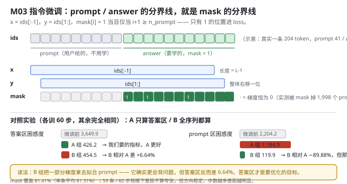
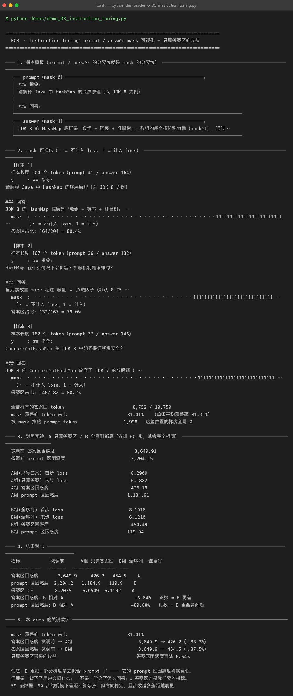

# Milestone 03 — Instruction Tuning：mask 落在哪，模型就学什么

M02 把 59 条问答切成了 `(x, y, mask)`，但"为什么要 mask"还没证明。这一层把它讲透并**用对照实验量化收益**：同样训 60 步，A 组只在答案区算 loss，B 组全序列都算，看两组的答案区困惑度和 prompt 区困惑度各怎么动。

结论先行：**B 组的训练 loss 更低，但答案区困惑度更差**。这是一个典型的"指标选错就全盘皆错"的案例 —— 如果只看 loss 曲线，你会选错方案。

**纯 numpy 手写**：`mask` 是一个 `float64` 数组，交叉熵里按位相乘，被 mask 掉的位置梯度恒为 0。没有 `DataCollatorForCompletionOnlyLM` 帮你做，得自己把边界对齐。

---

## 1. Why：为什么不 mask 就会学坏

预训练的目标是"学语言本身"，所以每个 token 都算 loss。SFT 的目标是"**听懂指令并作答**"，两者不是一回事。

不 mask 会怎样：

1. **一半的梯度浪费在复述问题上。** prompt 是我们给的，模型不需要学会生成它。
2. **把"问答格式"和"领域知识"混在一起学。** 既浪费参数，又容易让模型学会复读 prompt。
3. **指标会被污染。** 模型把 prompt 背熟了，loss 照样降，但答案一个字没变好 —— 下面 B 组就是这个下场。

Alpaca / ShareGPT 系数据集的默认做法就是 **completion-only loss**（只算回答），本项目照做，并把它量化出来。

## 2. Design：模板边界 = mask 边界

```
### 指令:
{instruction}
### 输入:
{input}          ← input 为空则整段省略
### 回答:
{output}<eos>
└──── prompt ────┘└──── answer ────┘
     mask = 0         mask = 1
```

实现上只有一个 off-by-one 要盯死（`src/ft/sft_data.py:143`）：`x = ids[:-1]`、`y = ids[1:]`，所以 `y[i]` 对应的是 `ids[i+1]`，于是

```python
pos  = np.arange(1, ids_arr.size)
mask = (pos >= n_prompt).astype(np.float64)
```

写成了 `pos >= n_prompt - 1` 的话，模型会在 prompt 的**最后一个 token** 上就开始算 loss —— 不会报错，只是悄悄变差。

**对照实验的设计**：A / B 两组唯一差别就是喂给 `cross_entropy` 的 `mask`（A 用答案区 mask，B 用全 1），其余（基座、数据、60 步、lr、seed、batch 顺序）**完全相同**。训完分别算两组在**答案区**和 **prompt 区**的困惑度 —— 注意评估时是拿同一套 mask 分区去测的，所以两组可比。



## 3. Real-run evidence（来自 `demos/out/demo_03_instruction_tuning_terminal.txt`）

**mask 可视化（真实输出，三条样本）：**

```
【样本 1】样本长度 204 个 token（prompt 41 / answer 164）  答案区占比 164/204 = 80.4%
  y     : ## 指令:\n请解释 Java 中 HashMap 的底层原理（以 JDK 8 为例）\n\n### 回答:\nJDK 8 的 HashMap 底层是…
  mask  : ········································111111111111111111111111 …
【样本 2】样本长度 167 个 token（prompt 36 / answer 132）  答案区占比 132/167 = 79.0%
【样本 3】样本长度 182 个 token（prompt 37 / answer 146）  答案区占比 146/182 = 80.2%
```

```
全部样本的答案区 token                8,752 / 10,750
mask 覆盖的 token 占比              81.41%   （单条平均覆盖率 81.31%）
被 mask 掉的 prompt token          1,998   这些位置的梯度全是 0
```

**A / B 对照（各训 60 步）：**

| 指标 | 微调前 | A 组 只算答案区 | B 组 全序列 | 谁更好 |
|---|---|---|---|---|
| 答案区困惑度 | 3,649.9 | **426.2** | 454.5 | **A** |
| prompt 区困惑度 | 2,204.2 | 1,184.9 | **119.9** | **B** |
| 答案区 CE | 8.2025 | **6.0549** | 6.1192 | **A** |
| 训练 loss 首步 → 末步 | — | 8.2909 → 6.1882 | 8.1916 → **6.1210** | B（假象） |

```
答案区困惑度：B 相对 A          +6.64%   正数 = B 更差
prompt 区困惑度：B 相对 A      -89.88%   负数 = B 更会背问题
```



## 4. 踩坑 / 反直觉发现

### 4.1 训练 loss 更低的那组，实际效果更差（实测）

这是本章最有价值的一条：

- B 组末步 loss **6.1210**，低于 A 组的 **6.1882** —— 看 loss 曲线，B 赢了。
- 但 B 组答案区困惑度 **454.5**，比 A 组的 **426.2** 差 **+6.64%** —— 看真实目标，A 赢了。

原因很直白：B 组的 loss 里混进了 prompt 区的 token，而 prompt 区好拟合得多（B 组的 prompt 困惑度能从 2,204.2 压到 119.9，降了 89.9%）。**loss 是加权平均，你往分母里掺了容易的 token，loss 自然低，但你要的那部分没变好。**

> 可迁移的经验：**评估指标必须和训练目标对齐，且必须按你要的子集单独算**。混在一起的总 loss 会把你引向错误方案。

### 4.2 "更会背问题"不是能力（实测 −89.88%）

B 组的 prompt 区困惑度 119.9，比 A 组的 1,184.9 低了一个数量级。听起来像"B 更懂用户会问什么"，但**用户的问题是我们给的，不需要模型生成**。这 89.88% 的下降，买来的代价是答案区差 6.64%。

一句话：`B 组把一部分梯度拿去拟合 prompt 了 —— 但那是「背下了用户会问什么」，不是「学会了怎么回答」。`

### 4.3 mask 覆盖率 81.41% 意味着什么

81.41% 来自 M02 的答案区占比（8,752 / 10,750）。也就是说**不 mask 的时候，有 18.59% 的梯度是纯浪费**（1,998 个 prompt token 位置的梯度恒为 0 之后）。而实测收益是 6.64% —— 小于 18.59%，因为 prompt 和 answer 共享上下文（prompt 的表示仍然参与答案的预测），mask 掉的是"直接监督"，不是"全部影响"。

### 4.4 收益在 60 步尺度下不算夸张，但方向稳定（诚实标注）

demo 输出原话：

> 59 条数据、60 步的规模下差距不算夸张，但方向稳定，且步数越多差距越明显。

6.64% 是**本次实测**，不是理论上限。它证明的是**方向**（只算答案区更好），不是**幅度**（不要拿 6.64% 去预测你的任务）。

## 5. Conclusion

1. **mask 边界 = 模板边界**：`mask[i] = 1` 当且仅当 `i + 1 >= n_prompt`，这个 off-by-one 写错不会报错，只会悄悄变差。
2. 实测 mask 覆盖 **81.41%**（8,752 / 10,750），被 mask 掉的 **1,998** 个 prompt token 梯度恒为 0。
3. 答案区困惑度 **3,649.9 → 426.2（A）/ 454.5（B）**；只算答案区**再降 6.64%**。
4. **训练 loss 会骗人**：B 组 loss 更低（6.1210）但答案区更差（454.5）。评估必须按子集单独算。
5. completion-only loss 是 Alpaca/ShareGPT 系数据集的默认做法，本项目的实测支持了它，但幅度只有个位数百分比。
6. 手写实现的意义：`mask` 就是一个乘进交叉熵的 float 数组 —— 你清楚地看见梯度在哪一段被置零，也就能自己定义"学什么"。

## 6. Code map

| 文件 | 职责 |
|---|---|
| `src/ft/sft_data.py` | `PROMPT_TEMPLATE`（`### 指令:` / `### 回答:`）、`render_example`、`build_sft_examples`（mask 的 off-by-one 就在这里）、`visualize_example`（把 mask 打成人能看懂的 `·`/`1`） |
| `src/ft/trainer.py` | `LoRATrainer.train_step`：`cross_entropy(logits, y, mask=mask)` —— mask 是这里生效的 |
| `src/ft/eval.py` | `evaluate()`：按 mask=1 的位置累计 NLL，本章 A/B 两组的分区困惑度都由它算 |
| `demos/demo_03_instruction_tuning.py` | 5 节：模板 / mask 可视化 / A·B 对照训练 / 结果对比 / 关键数字 |
| `demos/out/demo_03_instruction_tuning_terminal.txt` | 本章所有数字的来源 |
| `assets/instruction-tuning.svg` | 本章 mask 序列示意 + A/B 对照图 |

## 7. Version line

v0.2 → **v0.3**，M03 指令格式与 completion-only loss 落地。实测：mask 覆盖 81.41%，答案区困惑度 3,649.9 → 426.2（只算答案）/ 454.5（全序列），只算答案区再降 6.64%；对照组 prompt 区 1,184.9 vs 119.9（−89.88%，但那是"背问题"）。发现"B 组训练 loss 更低而答案区更差"这一指标陷阱。纯 numpy、无 torch/transformers。配图 1 张手写 SVG + 1 张真实终端截图。
