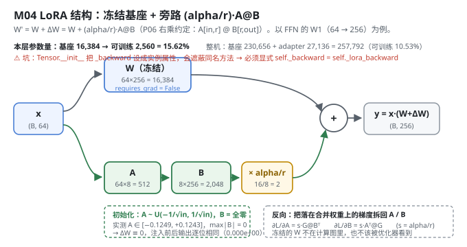
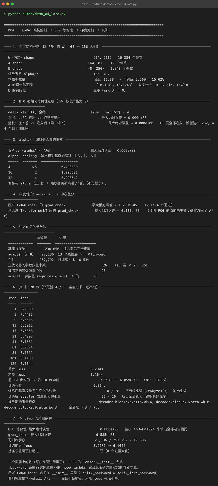

# Milestone 04 — LoRA：`W' = W + ΔW`，以及证明它真的没动基座

M01 说"LoRA 只动 1/8.5 的参数"，但没证明它**真的只动了那些参数**。M03 定好了只在答案区算 loss。这一层把 LoRA 本身彻底解剖：结构、初始化、梯度、以及**冻结是否真的生效**。

这一章的方法论是本项目后面所有章节的模板：**先证明等价性，再证明梯度对，最后才真训**。顺序不能反 —— 如果反向写错了，loss 照样会降，你根本看不出来。

**纯 numpy 手写**：`LoRALinear` 同时继承 P06 的 `Tensor` 与 `Module`，`.data` 是一个**即时合成**的属性（`W.data + scaling·A@B`），反向靠覆写 `_backward` 把梯度拆回 A/B。这样 P06 一行都不用改。

---

## 1. Why：为什么必须做"等价性证明"

LoRA 要成立，必须满足三件事，缺一件就是自欺欺人：

1. **B=0 初始化 ⇒ 注入瞬间与基座完全等价。** 否则"LoRA 是基座的增量"这个前提就是假的，你没法把训练结果归因于 adapter。
2. **反向必须真的流回 A/B。** 手写 autograd 最容易在这里静默失败：梯度不回流 → A/B 恒为初值 → loss 死活不降，**而且不报错**。
3. **基座必须一动不动。** "冻结"在本项目里不是一句口号，是字节级比对（`0 / 28` 个张量变化）。

## 2. Design：合成权重 + 拆梯度

**前向（`src/ft/lora.py:150`）：**

```python
@property
def data(self):                      # 每次访问重新合成
    return self.W.data + self.scaling * (self.A.data @ self.B.data)
```

因为 P06 的前向写死了 `linear(x, self.Wq)` 这种形态，而 `.data` 拿到的就是合并后的权重，**P06 一行都不用改，前向就自动带上了 LoRA 分支**。

**反向（`:159`）：** 落在合并权重上的梯度 `G = ∂L/∂(W+ΔW)`，按链式法则拆回：

```text
∂L/∂A = (alpha/r) · G @ Bᵀ
∂L/∂B = (alpha/r) · Aᵀ @ G
```

**初始化：** A 取 `U(-1/√in, 1/√in)` 小随机值，B **全零** —— 这保证第一步的 `ΔW ≡ 0`。



## 3. Real-run evidence（来自 `demos/out/demo_04_lora_terminal.txt`）

真实环境：Python 3.13 | numpy 2.5，基座 230,656 参数，注入 13 个线性层。

### 3.1 B=0 等价性（实测：逐位相同）

```
delta_weight() 全零                      True   max|ΔW| = 0
单层：LoRA 输出 vs 纯基座输出            最大绝对误差 = 0.000e+00
整机：注入前 vs 注入后（同一输入）         最大绝对误差 = 0.000e+00   13 层全部注入，模型输出 262,144 个数全部相同
```

**262,144 个输出逐位相同**（4×64×1024）。这不是"很接近"，是**完全相同** —— B 全零使得 `ΔW` 严格为 0，浮点上没有任何舍入可谈。

### 3.2 `alpha/r` 缩放真的被乘进前向（实测）

```
ΔW vs (alpha/r)·A@B          最大绝对误差 = 0.000e+00
alpha   scaling   ‖Δy‖/‖y‖
    4       0.5   0.498830
   16         2   1.995321
   32         4   3.990642
```

偏移与 alpha **成正比**（0.5 → 0.4988，2 → 1.9953，4 → 3.9906），证明缩放不是摆设。这一点很重要：很多人把 alpha 当成"另一个要调的旋钮"，实际上它和 lr 是**乘性关系**（M06 会量化这个耦合）。

### 3.3 梯度对拍：autograd vs 中心差分（实测）

```
独立 LoRALinear 的 grad_check         最大相对误差 = 1.213e-05   （< 1e-4 即通过）
注入进 TransformerLM 后的 grad_check   最大相对误差 = 6.585e-05
```

第二行才是关键：它证明 **P06 的原前向里梯度确实流回了 A/B**（如果没流回，误差会是 100% 量级）。

### 3.4 参数账（实测）

| 项 | 数量 | 说明 |
|---|---|---|
| 基座（冻结） | 230,656 | 注入前后完全相同 |
| adapter（r=8） | **27,136** | 13 个线性层 × r×(in+out) |
| 合计 | 257,792 | 可训练占比 **10.53%** |
| 进优化器的参数张量 | **26** | 13 层 × 2 |
| 被冻结的参数张量 | **28** | |

### 3.5 真训 120 步（实测：基座 0 个张量被动过）

```
step 1   8.2909      step 41  6.1681
step 5   7.4485      step 61  6.0874
step 9   6.6515      step 81  6.1811
step 13  6.6012      step 101 6.1183
step 17  6.5853      step 120 6.1644
step 21  6.4202
```

- 首步 **8.2909** → 末步 **6.1644**；前 10 步均值 → 后 10 步均值 **7.3978 → 6.0596**（↓1.3383，18.1%）；耗时 6.96 s。
- **训练后基座权重发生变化的张量：0 / 28**（字节级 `.tobytes()` 比对）—— 冻结生效。
- **训练后 adapter 发生变化的张量：26 / 26** —— 全部是 `*.A` / `*.B`，说明真的在学。



## 4. 踩坑 / 反直觉发现

### 4.1 `Tensor.__init__` 把 `_backward` 设成实例属性 → 静默失败（实测踩过）

这是本项目最危险的一个坑，写在 `src/ft/lora.py:140` 的注释里：

```python
# ⚠ Tensor.__init__ 会把 ``_backward`` 设成一个实例属性（noop lambda），
#   它会**遮蔽**类里定义的方法。所以必须在这里显式挂回真正的反向实现。
self._backward = self._lora_backward
```

P06 的 `Tensor.__init__` 里有 `self._backward = lambda: None`。Python 的查找顺序是**实例属性 > 类方法**，所以哪怕你在 `LoRALinear` 里定义了 `_lora_backward`，实例属性那个 noop 也会赢。

**后果是静默的**：梯度不流回 A/B → A/B 恒为初值 → 而 B 初值是 0，所以 `ΔW` 恒为 0 → **loss 一步都不降，但没有任何报错**。`grad_check` 会全程返回接近 1.0 的相对误差，如果你不看这个数，就会以为"模型在训，只是慢"。

> 可迁移的经验：**手写 autograd 时，任何"没报错但结果不对"的迹象都要先怀疑反向挂上了没有**。等价性证明（3.1）与梯度对拍（3.3）必须放在真训**之前**。

### 4.2 "冻结"要能被证明，不能只是不传参（实测 0/28）

`freeze_base()` 做两件事：把所有非 adapter 参数的 `requires_grad` 置 False（意图显式），以及**不把它们交给优化器**（真正的冻结）。但光这样还不够 —— 本章额外做了一次**字节级比对**（`.tobytes()`）：

```
训练后基座权重发生变化的张量     0 / 28
训练后 adapter 发生变化的张量   26 / 26
```

这两行同时出现才有说服力：0/28 证明没被误改，26/26 证明 adapter 真的在学（如果两行都是 0，那说明压根没训起来）。

### 4.3 `alpha/r` 和 lr 是乘性关系，不是两个独立旋钮（实测）

从 3.2 的表看，`alpha` 越大偏移越大，几乎严格线性。这意味着调 `alpha` 和调 `lr` 在**第一步**是同一件事（都缩放步长）。M06 的扫描会证实：alpha 的最优值（16，即 `alpha/r = 2`）与 lr 高度耦合，两个一起调只会互相掩盖。

## 5. Conclusion

1. LoRA 一行公式：`W' = W + (alpha/r)·A@B`；**A 小随机、B 全零** ⇒ 注入瞬间 `ΔW ≡ 0`。
2. **B=0 等价性实测 `0.000e+00`**：整机 13 层、262,144 个输出逐位相同。
3. **梯度对拍 `6.585e-05`**（注入整机后），证明反向真的流回了 A/B；独立层是 `1.213e-05`。
4. 可训练 **27,136 / 257,792 = 10.53%**；进优化器 26 个张量，冻结 28 个。
5. 真训 120 步：loss **8.2909 → 6.1644**，**基座 0/28 个张量变化**、**adapter 26/26 变化** —— 冻结与学习同时被证明。
6. **最危险的坑**：`Tensor.__init__` 的实例属性 `_backward` 会遮蔽子类方法，导致梯度不回流、loss 不降且不报错。
7. 手写实现的意义：因为 `.data` 是自己合成的，P06 一行都不用改就拿到了完整 LoRA 前向 + 反向 —— 这是"理解机制"带来的自由度，框架用户拿不到。

## 6. Code map

| 文件 | 职责 |
|---|---|
| `src/ft/lora.py` | `LoRAConfig`（r/alpha/dropout/scaling）、`LoRALinear`（即时合成 `.data` + `_lora_backward` 拆梯度 + `delta_weight`/`merged_weight`） |
| `src/ft/inject.py` | `walk_parameters` / `inject_lora`（把 target 位置的 Parameter **换成** LoRALinear）/ `freeze_base` / `lora_layers` / `count_parameters` |
| `src/ft/trainer.py` | `LoRATrainer`：只把 A/B 交给 Adam，其余同普通训练循环 |
| `src/ft/paths.py` | `enable_deterministic_autograd()`：把 P06 的 `Tensor._prev` 从 set 换成有序 list（见 M07/M09 的可复现性） |
| `demos/demo_04_lora.py` | 7 节：结构解剖 / B=0 等价性 / alpha 缩放 / 梯度对拍 / 参数账 / 真训 120 步 / 关键数字 |
| `demos/out/demo_04_lora_terminal.txt` | 本章所有数字的来源 |
| `assets/lora.svg` | 本章 LoRA 结构图（冻结基座 + 旁路） |

## 7. Version line

v0.3 → **v0.4**，M04 LoRA 落地并被证明。实测：B=0 等价性最大绝对误差 `0.000e+00`（整机 262,144 个输出逐位相同）；`grad_check` 最大相对误差 `6.585e-05`；120 步 loss `8.2909 → 6.1644`；基座被改动张量 **0/28**、adapter **26/26**。并定位 `Tensor.__init__` 实例属性遮蔽 `_backward` 导致的静默失败。纯 numpy、无 torch/peft。配图 1 张手写 SVG + 1 张真实终端截图。
