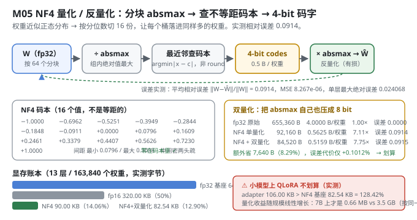
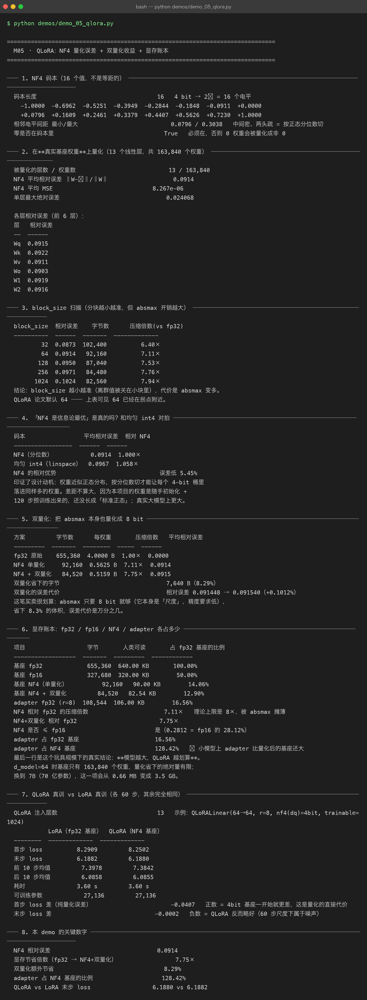

# Milestone 05 — QLoRA：把基座压成 4 bit，代价是多少

M04 证明了 LoRA 只动 1/8.5 的参数 —— 但**基座本身没变小**。fp32 的 230,656 个参数还是老老实实躺在显存里。这就是大多数人根本跑不起微调的真正瓶颈：7B 模型光权重就要 28 GB。

QLoRA 的解法很直接：**把被冻结的基座压成 4 bit，前向时再反量化回 float 参与计算**。

```text
y = x · dequant(W_nf4)  +  (alpha/r) · x · A · B
    └── 冻结、4 bit ──┘   └── 可训练、fp32 ──┘
```

**纯 numpy 手写**：NF4 码本、分块 absmax、最近邻查表、双量化、显存账本，全部自己实现（`src/ft/quantize.py`）。没有 `bitsandbytes`。

---

## 1. Why：为什么是 NF4 而不是 int4

一句话讲清 NF4（4-bit NormalFloat）：

> 神经网络权重近似服从**零均值正态分布**。既然分布已知，就不需要像 int8 那样把 `[-1, 1]` 均匀切 256 份，而是**按分位数**切 16 份 —— 让每一份里落进来的权重**数量相同**。信息论上，这让 4 bit 承载的信息量最大。

还有一条不可商榷的约束：**量化只作用于被冻结的基座**。梯度不会流过量化器（那东西不可导），所以**量化误差不会被训练修复**。这也是为什么必须用为"正态分布权重"量身定做的码本，而不是粗暴的 int4。

## 2. Design：三步量化 + 一步双量化

1. **分块 absmax 归一化**：每 `block_size`（默认 64）个数一组，除以组内绝对值最大值，压到 `[-1, 1]`。分块是为了挡住离群值 —— 一个特别大的权重参与全局归一化，会把其他所有权重都压成 0。
2. **映射到 NF4 的 16 个码字**：不是 `round`，而是**最近邻查找**（`argmin |x - c|`），因为码字不等距。
3. **双量化（可选）**：每个块要存一个 fp32 的 absmax，摊到 `4/64 = 0.0625` 字节/权重，占 NF4（0.5 字节/权重）的 12.5%，很浪费。于是对 absmax **再量化一次**成 8 bit（每 256 个 absmax 共享一个 fp32 scale），压到 1/4。

**存储账：**

| 方案 | 每权重字节数 | 相对 fp32 |
|---|---|---|
| fp32 | 4.0000 | 1.00× |
| fp16 | 2.0000 | 2.00× |
| NF4（不双量化） | 0.5 + 4/64 = 0.5625 | 7.11× |
| NF4 + 双量化 | 0.5 + (1+4/256)/64 = 0.5159 | 7.75× |



## 3. Real-run evidence（来自 `demos/out/demo_05_qlora_terminal.txt`）

**在真实基座权重上量化：13 个线性层，共 163,840 个权重。**

| 指标 | 实测值 |
|---|---|
| NF4 平均相对误差 `‖W−Ŵ‖/‖W‖` | **0.0914** |
| NF4 平均 MSE | 8.267e-06 |
| 单层最大绝对误差 | 0.024068 |
| 各层相对误差 | Wq 0.0915 / Wk 0.0922 / Wv 0.0911 / Wo 0.0903 / W1 0.0919 / W2 0.0916 |

**码本（实测打印）：** 16 个值，相邻电平间距最小 0.0796 / 最大 0.3038（中间密、两头疏 = 按正态分位数切），**零在码本里**（否则 0 权重会被量化成非 0）。

### 3.1 block_size 扫描（实测）

| block_size | 相对误差 | 字节数 | 压缩倍数(vs fp32) |
|---|---|---|---|
| 32 | 0.0873 | 102,400 | 6.40× |
| **64** | **0.0914** | 92,160 | **7.11×** |
| 128 | 0.0950 | 87,040 | 7.53× |
| 256 | 0.0971 | 84,480 | 7.76× |
| 1024 | 0.1024 | 82,560 | 7.94× |

分块越小越准（离群值被关在小块里），代价是 absmax 变多。**QLoRA 论文默认 64 —— 上表可见 64 已经在拐点附近**（32 只再好 4.5%，却多花 11% 的体积）。

### 3.2 "NF4 是信息论最优"是真的吗？和均匀 int4 对拍（实测）

| 码本 | 平均相对误差 | 相对 NF4 |
|---|---|---|
| NF4（分位数） | **0.0914** | 1.000× |
| 均匀 int4（linspace） | 0.0967 | 1.058× |

**NF4 误差低 5.45%**。差距不算大，因为本项目的权重是随手初始化 + 120 步预训练出来的，还没长成"标准正态"；**真实大模型上差距更大**（这条是推断，不是本机实测）。

### 3.3 双量化（实测：划算）

| 方案 | 字节数 | 每权重 | 压缩倍数 | 平均相对误差 |
|---|---|---|---|---|
| fp32 原始 | 655,360 | 4.0000 B | 1.00× | 0.0000 |
| NF4 单量化 | 92,160 | 0.5625 B | 7.11× | 0.0914 |
| **NF4 + 双量化** | **84,520** | **0.5159 B** | **7.75×** | 0.0915 |

- 额外省 **7,640 B（8.29%）**
- 误差代价：相对误差 `0.091448 → 0.091540`（**+0.1012%**）

absmax 本身是"尺度"，精度要求低，8 bit 足够。**省 8.3% 体积，代价万分之几** —— 这笔买卖很划算。

> 实现上有个诚实细节（`src/ft/quantize.py:177`）：双量化后 `qt.absmax` 存的是**已还原的有损版本**，反量化用它 —— 否则测出来的误差会假装双量化是免费的。

### 3.4 显存账本（实测）

| 项目 | 字节 | 人类可读 | 占 fp32 基座 |
|---|---|---|---|
| 基座 fp32 | 655,360 | 640.00 KB | 100.00% |
| 基座 fp16 | 327,680 | 320.00 KB | 50.00% |
| 基座 NF4（单量化） | 92,160 | 90.00 KB | 14.06% |
| 基座 NF4 + 双量化 | 84,520 | **82.54 KB** | **12.90%** |
| adapter fp32 (r=8) | 108,544 | 106.00 KB | 16.56% |

`NF4 相对 fp32 压缩 7.11×`（理论上限 8×，被 absmax 摊薄），`NF4+双量化 7.75×`；NF4 是 fp16 的 **28.12%**。

### 3.5 QLoRA 真训 vs LoRA 真训（各 60 步，其余完全相同）

| 指标 | LoRA（fp32 基座） | QLoRA（NF4 基座） |
|---|---|---|
| 首步 loss | 8.2909 | 8.2502 |
| 末步 loss | 6.1882 | **6.1880** |
| 前 10 步均值 | 7.3978 | 7.3842 |
| 后 10 步均值 | 6.0858 | 6.0855 |
| 耗时 | 3.60 s | 3.60 s |
| 可训练参数 | 27,136 | 27,136 |

**首步 loss 差 −0.0407**（4-bit 基座一开始就更差，这是量化的直接代价）；**末步 loss 差 −0.0002**（QLoRA 反而略好 —— 60 步尺度下属于噪声）。



## 4. 踩坑 / 反直觉发现

### 4.1 小模型上 QLoRA 根本不划算（实测 128.42%）

这是本章最重要的负结果：

```
adapter 占 NF4 基座                128.42%   ⚠ 小模型上 adapter 比量化后的基座还大
```

`d_model=64` 时基座只有 163,840 个权重，量化省下的绝对量有限（640 KB → 82.54 KB），而 adapter 自己就要 106 KB。**你把基座压到 82.54 KB，结果真正的显存大头变成了 adapter。**

量化收益随模型规模**线性增长**。按同一公式外推到 7B（70 亿参数）：这一项会从 **0.66 MB 变成 3.5 GB** —— 那才是 QLoRA 的主场。**注意：7B 的数字是按同一公式外推，不是本机实测**（本机跑不动 7B）。

> 可迁移的经验：**QLoRA 的收益是"基座越大越值钱"**。在小模型（<1B）上为了 QLoRA 而 QLoRA，通常是净亏。

### 4.2 NF4 相对均匀 int4 只赢 5.45%，不是碾压（实测）

教科书爱说"NF4 是信息论最优"，实测在本项目上只低 **5.45%**（0.0914 vs 0.0967）。原因是本项目的权重还没长成标准正态（随手初始化 + 120 步预训练）。

诚实标注：**这个 5.45% 是小规模、欠训练权重上的实测值**；它印证了设计动机（分位数切分确实更优），但**不能外推说"真实大模型上也只有 5.45%"** —— 那里的分布更接近正态，差距应该更大（推断）。

### 4.3 QLoRA 的末步 loss 反而略低，但那是噪声（实测 −0.0002）

末步 6.1880 vs 6.1882，差 0.0002。不要把这个写成"QLoRA 效果更好" —— 60 步尺度下这是浮点噪声。真正稳定的信号是**首步差 −0.0407**：那是量化的直接代价，是真实的、可解释的。

### 4.4 双量化的误差必须"算进去"，不能假装免费（实现细节）

`quantize_nf4` 在 `double_quant=True` 时会把 `qt.absmax` **替换成反量化后的有损值**（`dequantize_absmax(ac, asc, size)`），而不是继续用无损的 `absmax`。如果偷懒沿用无损值，测出来的误差会**假装双量化是免费的**（误差仍是 0.0914 而不是 0.0915）。差 0.0001，但这 0.0001 就是全部真相。

## 5. Conclusion

1. NF4 = 分块 absmax 归一化 + 最近邻查不等距码本；实测在真实基座上相对误差 **0.0914**（MSE 8.267e-06）。
2. **block_size 越小越准，64 是拐点**（32 只再好 4.5%，多花 11% 体积）。
3. NF4 比均匀 int4 误差低 **5.45%**（实测，欠训练权重上）。
4. **双量化划算**：额外省 **8.29%** 体积，误差代价 **+0.1012%**；fp32 → NF4+双量化总压缩 **7.75×**（0.5159 B/权重）。
5. **QLoRA vs LoRA 末步 loss 6.1880 vs 6.1882**，可训练参数相同；首步差 −0.0407 是量化的真实代价。
6. **⚠ 小模型上 QLoRA 不划算**：adapter 106 KB > NF4 基座 82.54 KB（**128.42%**）。7B 上才是 0.66 MB vs 3.5 GB（**按同一公式外推，非实测**）。
7. 手写实现的意义：因为码本和 absmax 都是自己管的，你才能做"均匀 int4 vs NF4""单量化 vs 双量化"这种对拍 —— 用现成库只能拿到一个黑盒数字。

## 6. Code map

| 文件 | 职责 |
|---|---|
| `src/ft/quantize.py` | `NF4_LEVELS` 码本、`quantize_nf4`（分块 + 最近邻查表）、`dequantize_nf4`、`quantize_absmax`/`dequantize_absmax`（双量化 8-bit）、`quantization_error`、`nf4_storage_bytes` |
| `src/ft/qlora.py` | `QLoRALinear`（NF4 基座 + fp32 adapter，`.data` 即时反量化合成）、`memory_ledger`（显存账本）、`training_memory`、`human_bytes` |
| `src/ft/inject.py` | `inject_lora(kind="qlora")`：把 target 位置换成 `QLoRALinear` |
| `demos/demo_05_qlora.py` | 8 节：码本 / 真实权重量化 / block_size 扫描 / NF4 vs int4 / 双量化 / 显存账本 / QLoRA 真训 / 关键数字 |
| `demos/out/demo_05_qlora_terminal.txt` | 本章所有数字的来源 |
| `assets/qlora.svg` | 本章 NF4 量化/反量化流程图 |

## 7. Version line

v0.4 → **v0.5**，M05 QLoRA 落地。实测：NF4 相对误差 **0.0914**，fp32→NF4+双量化压缩 **7.75×**（0.5159 B/权重），双量化额外省 **8.29%**、误差代价 +0.1012%；block_size 32/64/128/256/1024 → 误差 0.0873/0.0914/0.0950/0.0971/0.1024；NF4 比均匀 int4 误差低 5.45%；QLoRA vs LoRA 末步 loss **6.1880 vs 6.1882**。并诚实记录「小模型上 adapter 106 KB > NF4 基座 82.54 KB（128.42%）」这一负结果。纯 numpy、无 bitsandbytes/peft。配图 1 张手写 SVG + 1 张真实终端截图。
