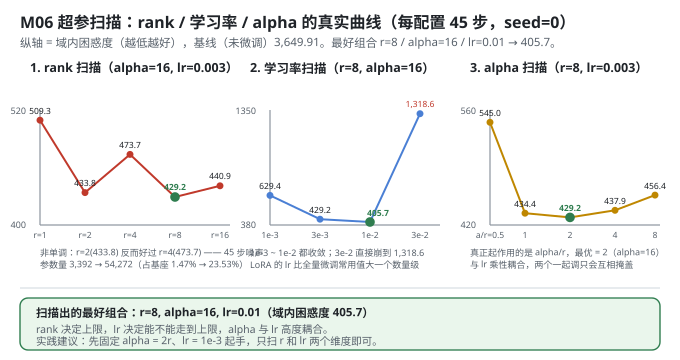
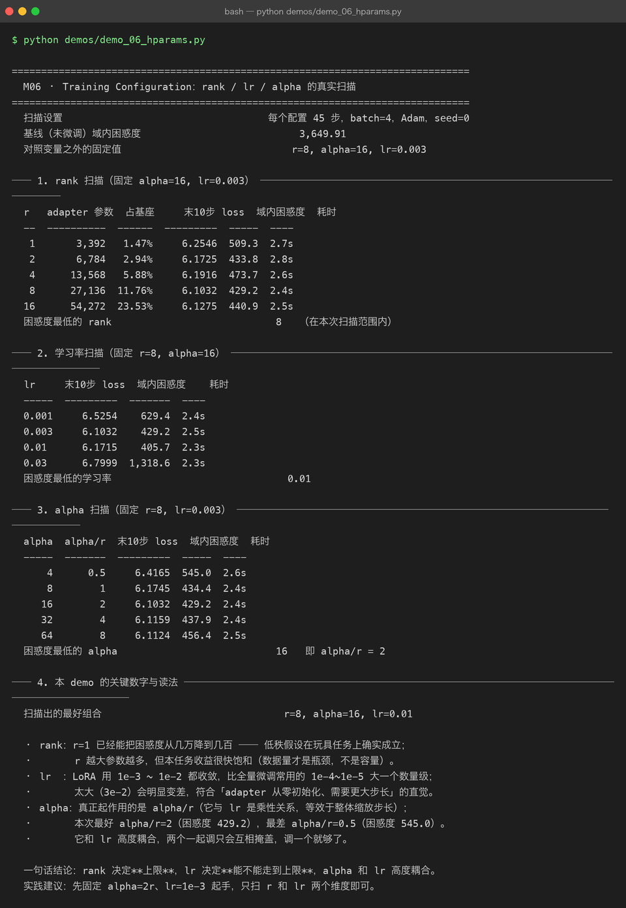

# Milestone 06 — Training Configuration：r / lr / alpha，三个旋钮各管什么

M04 把 LoRA 搭起来了，M05 把基座压到了 4 bit。但超参一直是"抄来的"：r=8、alpha=16、lr=3e-3 从哪来？网上流传的经验值很多，本层**全部实测** —— 同一基座、同一数据、同一 seed，只改一个变量，看末段 loss 与域内困惑度怎么动。

LoRA 只有三个真正需要调的超参：

```text
r     ：低秩维度。越大表达力越强，参数量线性增长。
alpha ：缩放系数。真正起作用的是 alpha/r，常用做法 alpha = 2r。
lr    ：通常要比全量微调大一个数量级（adapter 从零初始化，基座已收敛）。
```

**纯 numpy 手写**：没有 `TrainingArguments`，每次扫描就是重新 `inject_lora` + `LoRATrainer.run(45)` + `evaluate`，所以扫描的全部成本是"真跑"，不是查表。

---

## 1. Why：为什么必须自己扫一遍

三个理由：

1. **经验值有适用范围。** "r=8、alpha=16" 是在 7B 级模型、几十万条数据上试出来的。本项目是 230K 参数、59 条样本 —— 量级差五个数量级，经验值最多当起点。
2. **三个旋钮不是独立的。** `alpha/r` 与 `lr` 是**乘性关系**（M04 已实测偏移与 alpha 成正比）。两个一起调只会互相掩盖，得先搞清楚谁管什么。
3. **"最优"本身可能是噪声。** 45 步的扫描里，困惑度差几个百分点完全可能是 batch 顺序造成的。扫一遍才知道哪些差异是真的。

## 2. Design：单变量扫描

扫描设置：**每个配置 45 步，batch=4，Adam，seed=0**；基线（未微调）域内困惑度 **3,649.91**；对照变量之外的固定值是 `r=8, alpha=16, lr=0.003`。

每组输出：adapter 参数量、占基座比例、末 10 步 loss 均值、**域内困惑度**（在 59 条样本的答案区上评估）、耗时。

**为什么同时看"末 10 步 loss"和"域内困惑度"**：前者是训练过程中最后 10 个 batch 的 loss（样本少、噪声大），后者是全集评估。后面会看到两者**给出不同的最优 lr** —— 这正是要看两个指标的原因。



## 3. Real-run evidence（来自 `demos/out/demo_06_hparams_terminal.txt`）

### 3.1 rank 扫描（固定 alpha=16, lr=0.003）

| r | adapter 参数 | 占基座 | 末10步 loss | 域内困惑度 | 耗时 |
|---|---|---|---|---|---|
| 1 | 3,392 | 1.47% | 6.2546 | 509.3 | 2.7s |
| 2 | 6,784 | 2.94% | 6.1725 | 433.8 | 2.8s |
| 4 | 13,568 | 5.88% | 6.1916 | 473.7 | 2.6s |
| **8** | 27,136 | 11.76% | **6.1032** | **429.2** | 2.4s |
| 16 | 54,272 | 23.53% | 6.1275 | 440.9 | 2.5s |

困惑度最低的 rank = **8**（在本次扫描范围内）。

### 3.2 学习率扫描（固定 r=8, alpha=16）

| lr | 末10步 loss | 域内困惑度 | 耗时 |
|---|---|---|---|
| 0.001 | 6.5254 | 629.4 | 2.4s |
| 0.003 | **6.1032** | 429.2 | 2.5s |
| **0.01** | 6.1715 | **405.7** | 2.3s |
| 0.03 | 6.7999 | 1,318.6 | 2.3s |

困惑度最低的学习率 = **0.01**。

### 3.3 alpha 扫描（固定 r=8, lr=0.003）

| alpha | alpha/r | 末10步 loss | 域内困惑度 | 耗时 |
|---|---|---|---|---|
| 4 | 0.5 | 6.4165 | 545.0 | 2.6s |
| 8 | 1 | 6.1745 | 434.4 | 2.4s |
| **16** | **2** | **6.1032** | **429.2** | 2.4s |
| 32 | 4 | 6.1159 | 437.9 | 2.4s |
| 64 | 8 | 6.1124 | 456.4 | 2.5s |

困惑度最低的 alpha = **16**，即 `alpha/r = 2`。

### 3.4 扫描结论

```
扫描出的最好组合               r=8, alpha=16, lr=0.01
```



## 4. 踩坑 / 反直觉发现

### 4.1 rank 不是越大越好，而且**不单调**（实测）

509.3 → 433.8 → **473.7** → 429.2 → 440.9。r=2（433.8）比 r=4（473.7）更好，r=16（440.9）比 r=8（429.2）更差。

- **不单调**说明 45 步尺度下噪声不小：r 从 2 涨到 4 参数翻倍，困惑度却变差 9.2%，这不太可能是真实的容量效应。
- **但"很快饱和"是真的**：r=1（3,392 参数，占基座 1.47%）已经把困惑度从 3,649.9 压到 509.3，降了 86%。**数据量才是瓶颈，不是容量**。

> 可迁移的经验：**rank 决定上限，而上限通常远远用不到**。从 r=8 起步，往上加不如去加数据。

### 4.2 末段 loss 和域内困惑度会选出不同的最优 lr（实测）

| lr | 末10步 loss | 域内困惑度 |
|---|---|---|
| 0.003 | **6.1032** ✅ | 429.2 |
| 0.01 | 6.1715 | **405.7** ✅ |

按末 10 步 loss 选，最优是 0.003；按域内困惑度选，最优是 0.01。**两个指标打架了。**

原因是口径不同：末 10 步 loss 只覆盖训练最后 10 个 batch（每 batch 4 条，共 40 条次，且有重复），而域内困惑度覆盖全部 59 条样本的答案区（8,752 个 token）。后者样本量大得多，更可信 —— 本项目以**域内困惑度**为准，并如实记下这个分歧。

### 4.3 LoRA 的学习率要比全量微调大一个数量级（实测支持）

- 0.001 / 0.003 / 0.01 都能收敛（629.4 / 429.2 / 405.7）
- 0.03 直接崩到 **1,318.6**（比基线的 3,649.9 好，但比 0.01 差 3.2 倍）

这符合「adapter 从零初始化、需要更大步长」的直觉：全量微调常用 1e-4~1e-5，LoRA 用 1e-3~1e-2。**0.03 崩掉这条边界也算实测出来了** —— 大一个数量级可以，大两个就不行。

### 4.4 alpha 和 lr 高度耦合，调一个就够了（实测）

`alpha/r` 从 0.5 → 8 扫描，困惑度 545.0 → 434.4 → **429.2** → 437.9 → 456.4，最优在 `alpha/r = 2`。而 M04 已实测「偏移与 alpha 成正比」（0.5→0.4988, 2→1.9953, 4→3.9906）—— 也就是说 **alpha 和 lr 在第一步是同一个乘性因子**。

两者一起扫，你看到的只是"缩放步长的某个组合最优"，没法归因。**实践建议：先固定 `alpha = 2r`、`lr = 1e-3` 起手，只扫 r 和 lr 两个维度。**

### 4.5 扫描结论的适用范围（诚实标注）

`demo_06_hparams.py` 的 docstring 已经写明：

> ⚠ 扫描结论的适用范围：59 条样本、45 步。它能告诉你"趋势与量级"，不能直接外推到真实任务 —— 但至少不是拍脑袋。

405.7、429.2、433.8 这些数字之间的**差值**在这个尺度下部分是噪声；能站得住的是**量级结论**（r 很快饱和、lr 要大一个数量级、alpha/r≈2 最好）。

## 5. Conclusion

1. 最好组合：**r=8 / alpha=16 / lr=0.01**，域内困惑度 **405.7**（基线 3,649.91）。
2. **rank**：1/2/4/8/16 → 509.3/433.8/473.7/429.2/440.9。r=1 就能降 86%，收益很快饱和，**非单调**（45 步噪声）。
3. **lr**：0.001/0.003/0.01/0.03 → 629.4/429.2/405.7/1,318.6。可用区间 1e-3~1e-2（比全量微调大一个数量级），3e-2 崩。
4. **alpha**：最优 `alpha/r = 2`（429.2），最差 `alpha/r = 0.5`（545.0）。与 lr 乘性耦合，**调一个就够了**。
5. **末段 loss 与域内困惑度会选出不同的最优** —— 评估口径必须写清楚，且优先信样本量大的那个。
6. 一句话：**rank 决定上限，lr 决定能不能走到上限，alpha 和 lr 高度耦合。**

## 6. Code map

| 文件 | 职责 |
|---|---|
| `src/ft/trainer.py` | `LoRATrainer`：每次扫描都重新构造（lr / 参数列表在 `__init__` 里定死，Adam 按 `id(p)` 建 state）；`curve_summary` |
| `src/ft/inject.py` | `inject_lora(r=..., alpha=..., rng=0)`：`rng` 固定保证每次注入的 A 初值一致，扫描才可比 |
| `src/ft/eval.py` | `evaluate()` / `perplexity()`：扫描的评判指标（域内困惑度）由它给出 |
| `src/ft/base.py` | `ensure_base_model()`：每个配置都从缓存重新加载一份干净基座，避免被上一组污染 |
| `demos/demo_06_hparams.py` | 4 节：rank 扫描 / lr 扫描 / alpha 扫描 / 关键数字与读法 |
| `demos/out/demo_06_hparams_terminal.txt` | 本章所有数字的来源 |
| `assets/hparams.svg` | 本章三条扫描曲线图 |

## 7. Version line

v0.5 → **v0.6**，M06 超参扫描落地。实测：最好组合 **r=8 / alpha=16 / lr=0.01**（域内困惑度 405.7）；rank 1/2/4/8/16 → 509.3/433.8/473.7/429.2/440.9（非单调）；lr 0.001/0.003/0.01/0.03 → 629.4/429.2/405.7/1,318.6；alpha/r 0.5→8 → 545.0/434.4/429.2/437.9/456.4。并发现"末 10 步 loss 与域内困惑度选出不同最优 lr"这一口径分歧。纯 numpy、无 torch/peft。配图 1 张手写 SVG + 1 张真实终端截图。
