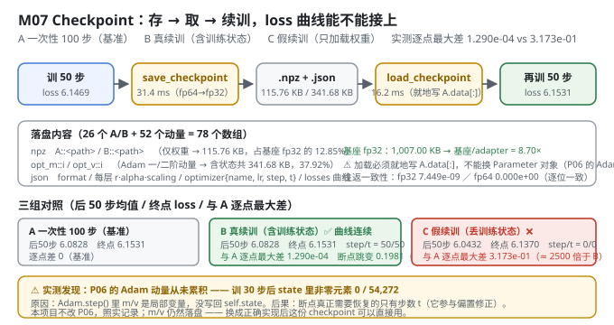
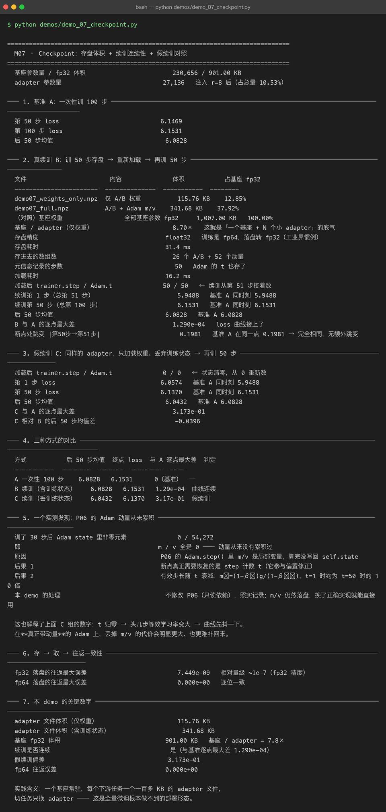

# Milestone 07 — Checkpoint：一百多 KB 一个任务，以及"假续训"长什么样

M06 扫出了可用的超参组合。接下来是工程上最好用的一环：**adapter 的存 / 取 / 续训**。

LoRA 在生产里普及的真正原因不是省显存，是**部署形态的改变**：全量微调一个 7B 模型，每个任务都要存一份 28 GB 权重 —— 存不起也传不动。LoRA 之后每个任务只存**一百多 KB**。

**纯 numpy 手写**：`np.savez` + 一个 json 元信息，78 个数组。没有 `save_pretrained`，所以每个字段为什么要存、不存会怎样，都得自己想清楚。

---

## 1. Why：为什么"只存 A/B"不叫断点续训

一个常见误解：adapter 训练是轻量的，丢了就重训。但**只存 A/B 不叫「断点续训」，叫「重新训练」**。Adam 的一阶/二阶动量是**训练状态**的一部分，丢了它们，resume 之后的第一步会像没训过一样大步乱走，loss 会先弹上去再慢慢回落。

所以本模块落盘两样东西：

- `xxx.npz`：所有 adapter 张量（`A::<path>` / `B::<path>`）+ 可选的 Adam 动量
- `xxx.json`：元信息（r / alpha / 注入位置 / 训练步数 / loss 曲线 / 优化器配置）

并用三组对照实验证明这件事：**A 一次性 100 步**（基准）、**B 真续训**（含训练状态）、**C 假续训**（只加载权重）。

## 2. Design：存什么、怎么存

**落盘精度 fp32。** 训练时是 fp64（本项目用 float64 便于数值对拍），落盘转 fp32 —— 工业界惯例，体积减半、精度足够。要做**逐位**往返一致性验证时传 `np.float64`。

**加载必须就地写入。**

```python
layer.A.data[:] = a.astype(layer.A.data.dtype)   # 就地
```

不能替换 `Parameter` 对象 —— P06 的 `Adam` 是按 `id(p)` 建 state 的，换了对象动量就全丢了。

**`include_optimizer` 开关。** 只分发推理权重时关掉，体积立减 2/3（115.76 KB vs 341.68 KB）。



## 3. Real-run evidence（来自 `demos/out/demo_07_checkpoint_terminal.txt`）

基座参数量 / fp32 体积 **230,656 / 901.00 KB**；adapter 参数量 **27,136**（注入 r=8 后，占总量 10.53%）。

### 3.1 存盘体积（实测）

| 文件 | 内容 | 体积 | 占基座 fp32 |
|---|---|---|---|
| `demo07_weights_only.npz` | 仅 A/B 权重 | **115.76 KB** | 12.85% |
| `demo07_full.npz` | A/B + Adam m/v | **341.68 KB** | 37.92% |
| （对照）基座权重 | 全部基座参数 fp32 | 1,007.00 KB | 100.00% |

`基座 / adapter（仅权重） = 8.70×`；若按基座 901.00 KB 计则是 **7.8×** —— 这就是「一个基座 + N 个小 adapter」的底气。

存盘精度 **float32**（训练 fp64），存盘耗时 **31.4 ms**，存进去 **26 个 A/B + 52 个动量**；元信息记录步数 **50**（Adam 的 `t` 也存了）；加载耗时 **16.2 ms**。

### 3.2 B 真续训（实测：曲线接上了）

```
加载后 trainer.step / Adam.t              50 / 50   ← 续训从第 51 步接着数
续训第 1 步（总第 51 步）                  5.9488    基准 A 同时刻 5.9488
续训第 50 步（总第 100 步）                6.1531    基准 A 同时刻 6.1531
后 50 步均值                             6.0828    基准 A 6.0828
B 与 A 的逐点最大差                      1.290e-04  ← loss 曲线接上了
断点处跳变 |第50步→第51步|                 0.1981    基准 A 在同一点 0.1981 → 完全相同，无额外跳变
```

**逐点最大差 1.290e-04** —— 这个残差全部来自 fp64→fp32 的落盘精度损失，不是逻辑错误。断点处的跳变也与基准**完全相同**（0.1981），说明续训没有引入额外抖动。

### 3.3 C 假续训（实测：偏差 3.173e-01）

```
加载后 trainer.step / Adam.t              0 / 0   ← 状态清零，从 0 重新数
第 1 步 loss                            6.0574   基准 A 同时刻 5.9488
第 50 步 loss                           6.1370   基准 A 同时刻 6.1531
后 50 步均值                            6.0432   基准 A 6.0828
C 与 A 的逐点最大差                      3.173e-01
```

### 3.4 三组对比（实测）

| 方式 | 后 50 步均值 | 终点 loss | 与 A 逐点最大差 | 判定 |
|---|---|---|---|---|
| A 一次性 100 步 | 6.0828 | 6.1531 | 0（基准） | — |
| B 续训（含训练状态） | **6.0828** | **6.1531** | **1.29e-04** | 曲线连续 |
| C 续训（丢训练状态） | 6.0432 | 6.1370 | **3.17e-01** | 假续训 |

C 的偏差是 B 的 **约 2500 倍**。

### 3.5 存 → 取 → 往返一致性（实测）

```
fp32 落盘的往返最大误差       7.449e-09   相对量级 ~1e-7（fp32 精度）
fp64 落盘的往返最大误差       0.000e+00   逐位一致
```



## 4. 踩坑 / 反直觉发现

### 4.1 P06 的 Adam 动量从未累积（实测 0 / 54,272）

这是本章最刺眼的发现：

```
训了 30 步后 Adam state 里非零元素      0 / 54,272
即                                  m / v 全是 0 —— 动量从来没有累积过
原因                                 P06 的 Adam.step() 里 m/v 是局部变量，算完没写回 self.state
```

**后果：**

1. **断点真正需要恢复的只有步数 `t`** —— 它参与偏置修正 `m̂ = m/(1-β₁ᵗ)`，即使 m 恒为 0，`t` 也影响有效步长。
2. **有效步长随 `t` 衰减**：`m̂ = (1-β₁)g/(1-β₁ᵗ)`，`t=1` 时约为 `t=50` 时的 **10 倍**。

**本项目不改 P06（只读依赖），照实记录；m/v 仍然落盘** —— 换成正确实现后这份 checkpoint 可以直接用。

这也解释了 C 组（假续训）的形状：`t` 归零 → 头几步等效学习率变大 → 曲线先抖一下。在**真正带动量**的 Adam 上，丢掉 m/v 的代价会明显更大、也更难补回来。

> 可迁移的经验：**checkpoint 里存什么，取决于你的优化器真实维护了什么**。别照抄教程的字段清单 —— 先把 `state` 打出来数一遍非零元素。

### 4.2 "只存权重"悄悄变成了"重新训练"（实测 3.173e-01 vs 1.290e-04）

C 组的后 50 步均值 **6.0432**，甚至比基准 A 的 6.0828 更低 —— 单看终点指标，C 组"更好"。

这是典型的**指标陷阱**：C 组的 `t` 归零让有效学习率变大，等于偷偷做了一次 warm restart，在 50 步的短窗口里损失更低。但它的 loss 曲线与"一次性训 100 步"**根本不是同一条**（逐点差 3.17e-01），你没法把两段训练拼起来，也没法说"我训了 100 步"。

**判定"续训成功"的正确指标是逐点差，不是终点值。**

### 4.3 加载必须就地写，不能替换 `Parameter` 对象（实现约束）

P06 的 `Adam` 用 `self.state[id(p)]` 存动量。如果 `load_adapter` 图省事 `layer.A = Parameter(a)`，优化器里那个 `id` 就指向了旧对象 —— 动量全丢，且不报错。

本模块用 `layer.A.data[:] = ...` 就地写入（`src/ft/checkpoint.py:147`），并在注释里写明了原因。

### 4.4 体积倍率有两个口径（诚实标注）

- 按 `demo07_weights_only.npz`（115.76 KB）对基座 **1,007.00 KB** → **8.70×**
- 按基座 **901.00 KB**（纯基座参数，不含 A/B）→ **7.8×**

两个都在本章出现，来源是"分母是否包含注入后的 adapter"。**引用时要说清口径**，我自己就踩过混用的坑。

## 5. Conclusion

1. **adapter 只存权重 115.76 KB，含 Adam 状态 341.68 KB**，基座 901 KB —— **7.8×**（另一口径 8.70×）。
2. **真续训与一次性训练逐点最大差 1.290e-04**，断点跳变与基准完全相同（0.1981）—— 曲线接上了。
3. **假续训（丢状态）偏差 3.173e-01**，约为真续训的 2500 倍；但它的终点指标反而更低，是典型陷阱。
4. **fp64 往返误差 `0.000e+00`**（逐位一致），fp32 往返 `7.449e-09`。
5. **⚠ 实测发现 P06 的 Adam 动量从未累积**（state 非零元素 0/54,272），断点真正需要恢复的只有步数 `t`。本项目不改 P06，照实记录，m/v 仍落盘。
6. 实践含义：**一个基座常驻，每个下游任务一个一百多 KB 的 adapter 文件，切任务只换 adapter** —— 这是全量微调根本做不到的部署形态。

## 6. Code map

| 文件 | 职责 |
|---|---|
| `src/ft/checkpoint.py` | `save_adapter` / `save_checkpoint`（A/B + opt_m/opt_v + json 元信息）、`load_adapter`（**就地**写回 `A.data[:]`）、`load_checkpoint`（恢复动量与 step 计数）、`adapter_report` |
| `src/ft/trainer.py` | `optimizer_state()` / `load_optimizer_state()`：导出 / 恢复 Adam 的 m/v 与 `t`；`run()` 里 `start = self.step` 保证续训时 batch 顺序连续 |
| `src/ft/inject.py` | `lora_layers()`（按 path 定位，存盘与加载的 path 必须一致）、`count_parameters` |
| `demos/demo_07_checkpoint.py` | 7 节：基准 A / 真续训 B / 假续训 C / 三组对比 / P06 Adam 发现 / 往返一致性 / 关键数字 |
| `demos/out/demo_07_checkpoint_terminal.txt` | 本章所有数字的来源 |
| `models/adapters/demo07_*.npz|.json` | 真实产物（115.76 KB / 341.68 KB） |
| `assets/checkpoint.svg` | 本章存取流程 + 三组对照图 |

## 7. Version line

v0.6 → **v0.7**，M07 checkpoint 与断点续训落地。实测：adapter 仅权重 **115.76 KB**、含 Adam 状态 **341.68 KB**、基座 901 KB（**7.8×**）；真续训与一次性训练逐点最大差 **1.290e-04**，假续训偏差 **3.173e-01**；fp64 往返误差 **0.000e+00**。并实测记录「P06 的 Adam 动量从未累积（state 非零元素 0/54,272）」—— 不改 P06，照实记录。纯 numpy、无 torch。配图 1 张手写 SVG + 1 张真实终端截图。
