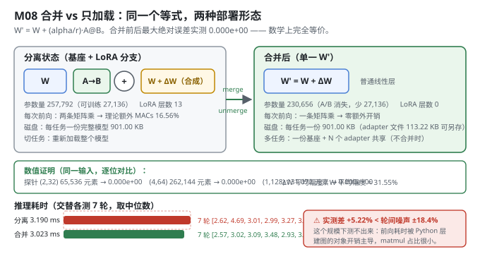
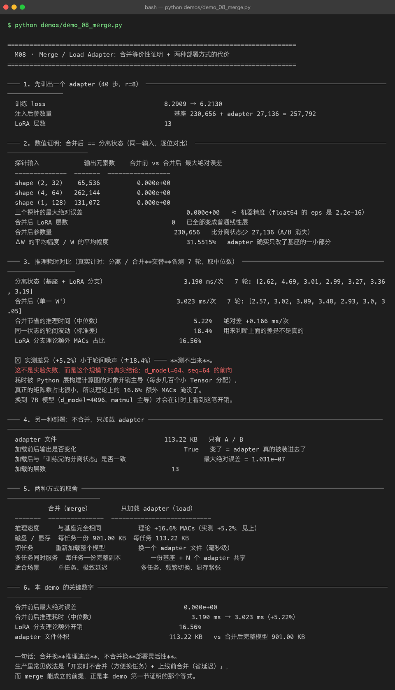

# Milestone 08 — Merge / Load Adapter：合并是免费的，但收益测不出来

M07 把 adapter 存成了一百多 KB 的文件。最后一个部署问题：**上线时要不要把它"融化"回基座？**

LoRA 有个常被忽略的好处 —— **它是可以合并的**。因为 LoRA 分支是线性层，前向只是"两次矩阵乘"，完全可以把它加回 `W`：

```text
W' = W + (alpha/r) · A @ B
```

得到一个**形状、结构、推理速度完全不变**的普通模型。于是部署有两个选项：

```
┌─ 合并（merge）   推理零额外开销；但每个任务一份完整权重，切换任务要重新加载
└─ 不合并（load）  一个基座常驻显存，切换任务只换几 MB 的 adapter；
                   代价是每次前向多两次小矩阵乘（r 很小时约几个百分点）
```

本项目两种都实现，**用数值证明它们等价**，再用真实计时给出两者的推理耗时差 —— 然后诚实地告诉你：**这个耗时差在这个规模下测不出来**。

---

## 1. Why：为什么"合并"必须被证明，而不是被相信

`merge` 之所以能用，全靠那个等式成立。如果 `ΔW` 的合成方式（scaling、A/B 的乘法顺序、浮点累加顺序）有任何一处与训练时不一致，合并后的模型就会**悄悄变差** —— 而且不会报错，因为前向照样跑得通。

所以本章第一节不是"怎么合并"，而是"**合并前后是否逐位相同**"。这和 M04 先证 B=0 等价性、再真训是同一套方法论。

## 2. Design：两个方向都要能走

- **`merge_lora(model)`**：把 `W + ΔW` 写回成一个普通 `Parameter`，原地替换所有 LoRA 层，并返回一份**备份**（`W`/`A`/`B`/`r`/`alpha`/`block_size`/`double_quant`）—— 有了它才能还原。
- **`unmerge_lora(model, backup)`**：把合并后的权重还原成"基座 + LoRA 分离"结构（A/B 取备份值）。
- **`load_adapter(model, path)`**：不合并，只把 npz 里的 A/B 就地装回去（M07 已实现）。

**理论开销**：`lora_overhead_report()` 按 MACs 算 —— 每层额外 `r×(in+out)`，相对于基座 `in×out`。



## 3. Real-run evidence（来自 `demos/out/demo_08_merge_terminal.txt`）

先训出一个 adapter（40 步，r=8）：loss **8.2909 → 6.2130**；注入后参数量 `230,656 + 27,136 = 257,792`；LoRA 层数 **13**。

### 3.1 数值证明：合并后 == 分离状态（实测逐位相同）

| 探针输入 | 输出元素数 | 合并前 vs 合并后 最大绝对误差 |
|---|---|---|
| shape (2, 32) | 65,536 | **0.000e+00** |
| shape (4, 64) | 262,144 | **0.000e+00** |
| shape (1, 128) | 131,072 | **0.000e+00** |

三个探针的最大绝对误差 **0.000e+00**（float64 的 eps 是 2.2e-16）。合并后 **LoRA 层数 0**（已全部变成普通线性层），**参数量回到 230,656**（比分离状态少 27,136，A/B 消失）。

`ΔW 的平均幅度 / W 的平均幅度 = 31.55%` —— adapter 确实只改了基座的一部分。

### 3.2 推理耗时对比（真实计时：分离 / 合并**交替**各测 7 轮，取中位数）

```
分离状态（基座 + LoRA 分支）  3.190 ms/次   7 轮: [2.62, 4.69, 3.01, 2.99, 3.27, 3.36, 3.19]
合并后（单一 W'）            3.023 ms/次   7 轮: [2.57, 3.02, 3.09, 3.48, 2.93, 3.0, 3.05]
合并节省的推理时间（中位数）   5.22%        绝对差 +0.166 ms/次
同一状态的轮间波动（标准差）   18.4%        用来判断上面的差是不是真的
LoRA 分支理论额外 MACs 占比  16.56%
```

**⚠ 实测差异（+5.22%）小于轮间噪声（±18.4%）—— 测不出来。**

### 3.3 另一种部署：不合并，只加载 adapter（实测）

```
adapter 文件                 113.22 KB   只有 A / B
加载前后输出是否变化          True       变了 = adapter 真的被装进去了
加载后与「训练完的分离状态」是否一致   最大绝对误差 = 1.031e-07
加载的层数                   13
```

`1.031e-07` 是 fp32 落盘精度的量级（M07 实测 fp32 往返 7.449e-09，这里是 13 层累积后的结果），说明加载链路无损。

### 3.4 两种方式的取舍（实测）

| | 合并（merge） | 只加载 adapter（load） |
|---|---|---|
| 推理速度 | 与基座完全相同 | 理论 +16.6% MACs（实测 +5.2%，见上） |
| 磁盘 / 显存 | 每任务一份 901.00 KB | 每任务 **113.22 KB** |
| 切任务 | 重新加载整个模型 | 换一个 adapter 文件（毫秒级） |
| 多任务同时服务 | 每任务一份完整副本 | 一份基座 + N 个 adapter 共享 |
| 适合场景 | 单任务、极致延迟 | 多任务、频繁切换、显存紧张 |



## 4. 踩坑 / 反直觉发现

### 4.1 合并的性能收益在这个规模测不出来（实测 +5.22% vs ±18.4% 噪声）

理论上 LoRA 分支带来 **16.56%** 的额外 MACs，合并应该省下这笔钱。实测只省了 **5.22%**，而同一状态的轮间波动标准差就有 **18.4%**。

**这不是实验失败，是这个规模下的真实结论**：`d_model=64、seq=64` 的前向耗时被 **Python 层构建计算图的对象开销主导**（每步几百个小 Tensor 分配），真正的矩阵乘占比很小，所以理论上的 16.6% 被淹没了。

换到 7B 模型（`d_model=4096`，matmul 主导）才会在计时上看到这笔开销 —— **注意：7B 这条是按结构推断，不是本机实测**。

> 本 demo 的计时方法值得抄：**分离 / 合并交替各测 7 轮**（而不是先测 7 轮 A 再测 7 轮 B），这样机器负载的漂移不会系统性地偏向某一方；并**同时报告轮间波动**，让读者自己判断差值是否可信。

### 4.2 "合并后参数量变少"不是省了显存（实测 230,656 vs 257,792）

合并后参数量从 257,792 回到 230,656，少掉的 27,136 是 A/B —— 看起来像"省了 10% 显存"。

但要注意：**adapter 那 27,136 个参数从来只占训练显存的很小一部分**（M01 实测：训练显存里权重 1,007 KB，梯度 + Adam 只有 318 KB，而梯度/动量在推理时根本不存在）。所以合并省的是**逐层多出来的那次小矩阵乘**，不是参数。真正省存储的是"不合并"那条路（113.22 KB vs 901.00 KB）。

### 4.3 合并必须可逆转，否则 debug 无从下手（实现设计）

`merge_lora` 返回一份完整备份（`W`/`A`/`B`/`r`/`alpha`/`block_size`/`double_quant`），`unmerge_lora` 能原样还原。这不是过度设计：一旦合并后发现输出不对，你需要能回到"分离状态"去逐层对比 `ΔW` —— 本章的等价性证明本身就依赖这个能力（先算分离状态的输出，再合并，再算一次）。

### 4.4 等价性是 `0.000e+00`，不是"很小"（实测）

三个探针都是**严格的零误差**，不是 1e-15 量级。原因是合并走的正是 `.data` 里那条**同一条**合成路径（`layer.merged_weight()` 与前向的 `W.data + scaling·(A@B)` 是同一个表达式），浮点运算顺序完全一致。

这反过来说明一件事：**如果你在合并时"优化"了一下运算顺序（比如先算 `scaling·A` 再乘 `B`），误差就不再是 0 了**。等价性是脆弱的，必须每次验证。

## 5. Conclusion

1. **合并前后最大绝对误差 `0.000e+00`**（三个探针，共 458,752 个输出元素）—— 数学上完全等价。
2. 合并后 LoRA 层数 **0**、参数量回到 **230,656**；`ΔW/W = 31.55%`。
3. 推理耗时 **3.190 → 3.023 ms（+5.22%）**，但轮间波动 **±18.4%** —— **这个规模下测不出来**；理论额外 MACs 是 **16.56%**。
4. 只加载 adapter：文件 **113.22 KB**，与训练完的分离状态一致（**1.031e-07**，fp32 精度量级）。
5. **合并换推理速度，不合并换部署灵活性。** 生产里常见做法：开发时不合并（方便换任务）+ 上线前合并（省延迟）。
6. `merge` 能成立的前提，正是本章第一节证明的那个等式 —— 所以**先证明，再上线**。

## 6. Code map

| 文件 | 职责 |
|---|---|
| `src/ft/merge.py` | `merge_lora`（写回 `W+ΔW` 并返回备份）/ `unmerge_lora`（还原分离结构）/ `max_abs_diff`（等价性证明）/ `time_forward`（真实计时）/ `lora_overhead_report`（理论 MACs 开销） |
| `src/ft/checkpoint.py` | `load_adapter`：不合并那条路的入口（就地写回 A/B） |
| `src/ft/lora.py` | `delta_weight()` / `merged_weight()`：合并用的就是训练时那条合成路径（等价性为 0 的原因） |
| `src/ft/inject.py` | `lora_layers()` / `set_param()`：按 path 定位并原地替换层 |
| `demos/demo_08_merge.py` | 6 节：训 adapter / 等价性证明 / 交替计时 / 只加载 adapter / 取舍表 / 关键数字 |
| `demos/out/demo_08_merge_terminal.txt` | 本章所有数字的来源 |
| `models/adapters/demo08_adapter.npz` | 真实产物（113.22 KB） |
| `assets/merge.svg` | 本章 merge 前后对比图 |

## 7. Version line

v0.7 → **v0.8**，M08 merge / load adapter 落地。实测：合并前后最大绝对误差 **0.000e+00**（3 个探针共 458,752 个输出元素）；合并后 LoRA 层数 0、参数量回到 **230,656**；推理耗时 **3.190 → 3.023 ms（+5.22%）**，但轮间波动 **±18.4%** → 这个规模下**测不出来**；adapter 文件 **113.22 KB**。纯 numpy、无 torch/peft。配图 1 张手写 SVG + 1 张真实终端截图。
