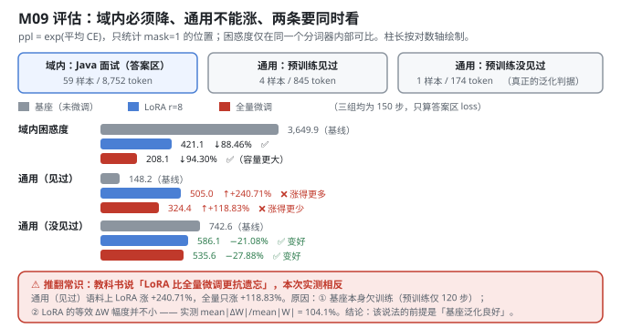
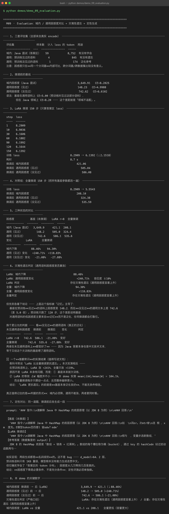

# Milestone 09 — Fine-Tuned Model Evaluation：学会了，但忘了吗

主线最后一站。前面八层把「通用基座 → 冻结 → 注入 LoRA → Java 面试领域 SFT → 存盘 → 合并」全跑通了，现在要回答唯一真正重要的问题：**这样训出来的模型，到底有没有变好？**

答案是"是，也不是"。本章给出两类证据：

1. **定量**：困惑度 —— 域内必须降、通用不能涨，**两条要同时看**。
2. **定性**：同一道题，微调前后各生成一段 —— 本项目如实呈现：**两段都是乱码**。

**纯 numpy 手写**：评估不走 autograd 的 `cross_entropy`，直接 numpy 算 log-softmax（`src/ft/eval.py:52`）—— 评估不需要建图，也避免和训练时的实现互相干扰。

---

## 1. Why：为什么只报域内指标是自欺欺人

把模型训成只会背 59 条答案的复读机，**域内指标也会很好看**。所以必须同时看通用语料：域内困惑度下降 = 学会了；通用困惑度不暴涨 = 没忘。**只报第一条等于自欺欺人。**

困惑度的定义：`ppl = exp(平均交叉熵)`，等价于"模型在每个位置上平均有多不确定"，越低越好。注意**不同分词器之间的困惑度不可比**（字符级天然比 BPE 低），本项目只在同一个分词器内部做前后对比。

## 2. Design：三套评估集 + 一个对照组

| 评估集 | 样本数 | 计入 loss 的 token | 用途 |
|---|---|---|---|
| 域内：Java 面试（答案区） | 59 | 8,752 | 有没有学会 |
| 通用：预训练**见过**的语料 | 4 | 845 | 有没有遗忘 |
| 通用：预训练**没见过**的语料 | 1 | 174 | 泛化参考 |

**为什么要分"见过 / 没见过"**：P06 的通用语料被切成 `[:-4]` 训练 + `[-4:]` 评估（`src/ft/base.py:82`），评估行**不参与预训练**。这样"通用困惑度是否暴涨"才真的在测泛化，而不是测记忆 —— 这个区分在本章救了整个结论（见 4.1）。

**对照组**：LoRA r=8 训 150 步 vs **全量微调**训 150 步，其余完全相同。



## 3. Real-run evidence（来自 `demos/out/demo_09_evaluation_terminal.txt`）

### 3.1 微调前的基线（实测）

| 指标 | 困惑度 | CE |
|---|---|---|
| 域内（Java 面试） | **3,649.91** | 8.2025 |
| 通用（见过） | **148.23** | 4.9988 |
| 通用（没见过） | **742.62** | 6.6102 |

基座在**见过**的通用语料上 CE=5.00，但在 Java 领域上 CE=8.20 —— 这个差距就是「领域不适配」。

### 3.2 LoRA 微调 150 步（实测）

```
step   1  8.2909      step  90  6.1992
step  10  6.9036      step 120  6.1644
step  30  6.1606      step 150  6.1392
step  60  6.1882
```

训练 loss **8.2909 → 6.1392**（↓2.1518），耗时 8.7 s。微调后：域内 **421.06** / 通用见过 **505.04** / 通用没见过 **586.08**。

### 3.3 对照组：全量微调 150 步（实测）

训练 loss **8.2909 → 5.5543**。微调后：域内 **208.10** / 通用见过 **324.38** / 通用没见过 **535.59**。

### 3.4 三种状态的对比（实测）

| 困惑度 | 基座（未微调） | LoRA r=8 | 全量微调 |
|---|---|---|---|
| 域内（Java 面试） | 3,649.9 | **421.1** | **208.1** |
| 通用（见过） | 148.2 | 505.0 | 324.4 |
| 通用（没见过） | 742.6 | 586.1 | 535.6 |

| 变化 | LoRA | 全量微调 |
|---|---|---|
| 域内下降 | **−88.46%** | **−94.30%** |
| 通用（见过）变化 | **+240.71%** | **+118.83%** |
| 通用（没见过）变化 | **−21.08%** | **−27.88%** |

### 3.5 定性对比（实测生成，同一 prompt）

```
prompt: '### 指令:\n请解释 Java 中 HashMap 的底层原理（以 JDK 8 为例）\n\n### 回答:\n'

【基座（未微调）】   '…如  \n词er。次mtr维\n连 根 ，x m  度先。E模型token否四意l 留odw？edm'
【LoRA 微调后】     '…相与  ，变量步选新数组，'
【参考答案】        JDK 8 的 HashMap 底层是「数组 + 链表 + 红黑树」。数组的每个槽位称为桶（bucket），…
```



## 4. 踩坑 / 反直觉发现

### 4.1 「LoRA 更抗遗忘」在本项目被推翻（实测）

教科书常说「LoRA 比全量微调更抗遗忘」。**本次实测相反**：在预训练语料上，LoRA 涨 **+240.71%**，全量只涨 **+118.83%**。

原因不是 LoRA 本身有问题，而是两条：

1. **基座本来就欠训练。** 预训练只跑了 120 步 —— 基座在"见过"语料上 148.2 vs "没见过"语料上 742.6，**差 5.0 倍**。这个差距说明那 148.2 主要来自**记忆**而不是泛化，任何微调都会打散它。
2. **LoRA 的等效 ΔW 幅度并不小。** 本 demo 实测 `mean|ΔW|/mean|W| = 104.1%` —— **超过 100%**。而全量微调每步只挪动一点点，反而整体偏移更小。

> 结论：**「LoRA 更抗遗忘」的前提是「基座本身泛化良好」，不能无条件相信。** 在一个欠训练的基座上，LoRA 的"低秩"约束并没有转化成"小改动"。

### 4.2 严格口径下的判定被"记忆"主导了，必须换判据（实测）

按 `forgetting_report`（容忍度 ±10%）判定，LoRA 和全量**都被判为"存在灾难性遗忘"**。但这个指标被记忆主导了 —— 换个更公允的判据，看**没见过**的通用语料：

| 未见通用语料 | 微调前 | 微调后 | 变化 | 判定 |
|---|---|---|---|---|
| LoRA r=8 | 742.6 | 586.1 | **−21.08%** | 变好 |
| 全量微调 | 742.6 | 535.6 | **−27.88%** | 变好 |

**两者在未见通用语料上都变好了** —— 因为 Java 答案本身也是中文技术文本，等于又给这个欠训练的基座喂了通用语料。

> 真正值得记住的是**判据的形式**：域内必须降、通用不能涨、两者要同时看；而且要区分"见过 / 没见过"，否则量的是记忆不是泛化。

### 4.3 困惑度下降 ≠ 可用（实测：生成仍是乱码）

域内困惑度 **3,649.9 → 421.1（↓88.46%）** 是**真的** —— 但生成出来仍是乱码级别：

```
【LoRA 微调后】'相与  ，变量步选新数组，'
```

这不是 bug：d_model=64、2 层、预训练语料只有 1 KB 量级，模型根本没有能力生成连贯中文。但它确实学会了「答案区的 token 分布」。

**结论：困惑度下降是必要条件，不是充分条件；定性评测必须单独做。**

### 4.4 全量微调的域内困惑度更低（208.1 vs 421.1），但不代表它更好（实测）

全量微调域内 **208.1**，LoRA **421.1** —— 容量更大，拟合更强，符合预期。但如果只看这一个数就选全量，你会忽略：

- 它在"见过"语料上虽然涨得少（+118.83% vs +240.71%），**但仍然涨了一倍多**；
- 每个任务要存 901 KB（M07 实测），而 LoRA 只要 115.76 KB。

域内困惑度只是决策的一个维度。

### 4.5 跨进程不可复现的根因与修法（M04 埋的伏笔在这里兑现）

`Tensor._prev` 在 P06 里是 Python **`set`**，`backward()` 遍历它做拓扑排序，而 set 的迭代顺序由**对象地址**决定 —— 每次进程启动都不一样。这不影响数学（任何顺序都是合法拓扑序），但会改变梯度累加的浮点求和顺序。

训练动力学是混沌的：实测 300 步 × lr=3e-3 时，这点差异被放大成**完全不同的基座权重**（两次重建最大差 0.48）。150 步 SFT 的困惑度能从 406 甩到 428。

本项目用 `enable_deterministic_autograd()`（`src/ft/paths.py:92`）在不改 P06 的前提下包一层：给每个 Tensor 记自增序号 `_seq`，把 `_prev` 换成按创建顺序排序的 list。**开启后三个独立进程的 150 步困惑度逐位相同。**

## 5. Conclusion

1. **域内困惑度 3,649.9 → 421.1（↓88.46%）** —— 领域适配成立；全量对照组 208.1（↓94.30%）。
2. **通用（见过）148.2 → 505.0（+240.71%）**；全量 324.4（+118.83%）。严格口径下两者都判为"存在灾难性遗忘"。
3. **换用未见语料判据：两者都变好**（LoRA −21.08% / 全量 −27.88%）—— 因为 Java 答案本身也是中文技术文本。
4. **⚠「LoRA 更抗遗忘」被推翻**：实测 LoRA 涨得更多（+240.71% vs +118.83%），原因是基座欠训练 + LoRA 等效 `mean|ΔW|/mean|W| = 104.1%`。该说法的前提是**基座泛化良好**。
5. **⚠ 困惑度下降 ≠ 可用**：88.46% 的下降是真的，但定性生成仍是乱码。困惑度是必要条件不是充分条件。
6. **判据的形式比结论重要**：域内必须降、通用不能涨、两者同时看，且要区分"见过 / 没见过"。
7. 跨进程可复现靠 `enable_deterministic_autograd()`（把 `_prev` 从 set 换成有序 list），**不改 P06 任何文件**。

## 6. Code map

| 文件 | 职责 |
|---|---|
| `src/ft/eval.py` | `evaluate()`（numpy 直算 log-softmax，只统计 mask=1）/ `perplexity()` / `compare()` / `forgetting_report()`（容忍度 ±10% 的遗忘判定）/ `generate_text()`（定性生成） |
| `src/ft/base.py` | `general_corpus()`：把 P06 通用语料切成「预训练行 / 评估行」，**评估行不参与预训练** —— 4.2 那个判据成立的前提 |
| `src/ft/sft_data.py` | `build_sft_examples`（域内评估集）/ `build_lm_examples`（通用评估集，mask 全 1） |
| `src/ft/paths.py` | `enable_deterministic_autograd()` / `ordered_prev()`：把 `Tensor._prev` 从 set 换成有序 list，解决跨进程不可复现 |
| `src/ft/trainer.py` | `LoRATrainer.run()`：150 步训练；全量对照组直接复用 P08 的 `named_parameters` |
| `demos/demo_09_evaluation.py` | 8 节：三套评估集 / 基线 / LoRA 150 步 / 全量对照 / 三状态对比 / 遗忘判定 / 定性生成 / 关键数字 |
| `demos/out/demo_09_evaluation_terminal.txt` | 本章所有数字的来源 |
| `assets/evaluation.svg` | 本章评估流程与三组对比图 |

## 7. Version line

v0.8 → **v0.9**，M09 评估与灾难性遗忘检查落地。实测：域内困惑度 **3,649.9 → 421.1（↓88.46%）**；通用（见过）**148.2 → 505.0（+240.71%）**；通用（没见过）**742.6 → 586.1（−21.08%）**；全量对照组域内 208.1 / 通用见过 +118.83% / 未见 −27.88%。**推翻「LoRA 更抗遗忘」**（实测 `mean|ΔW|/mean|W| = 104.1%`），并诚实标注「困惑度下降 ≠ 可用：定性生成仍是乱码」。纯 numpy、无 torch/transformers。配图 1 张手写 SVG + 1 张真实终端截图。
