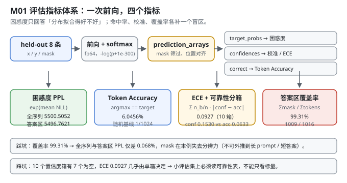
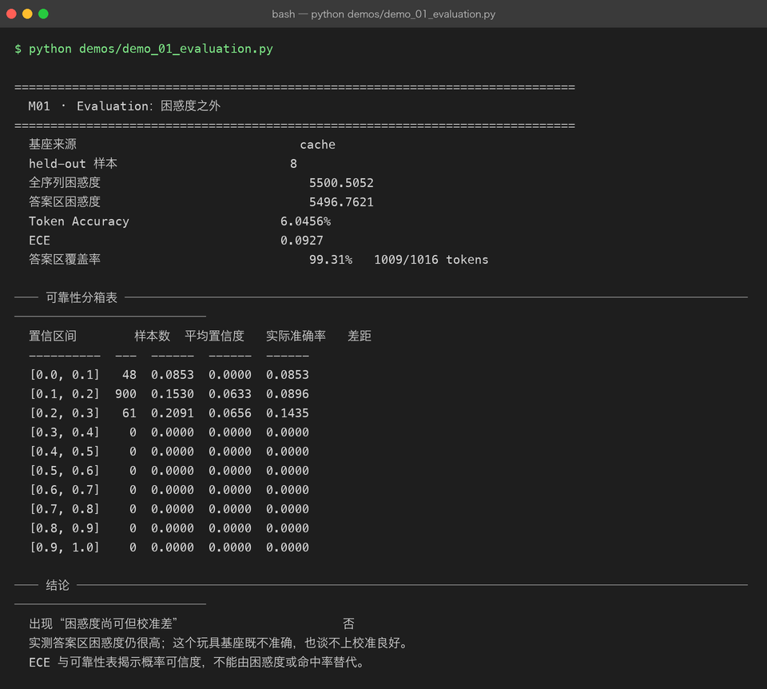

# Milestone 01 — Evaluation：困惑度之外

Project 08 的最后一章用「域内困惑度 3,649.9 → 421.1」回答了"模型有没有变好"。但那个答案只有一个数字，而一个数字撑不起"上线"这个决定。

P09 的第一层先把**指标体系**建起来。除了困惑度，我还要能回答三件事：

1. **这个困惑度到底在测什么？** 全序列还是答案区？—— 取决于 mask 覆盖了多少 token。
2. **模型真的"说对了"吗？** 困惑度是分布拟合程度，`argmax` 命没命中是另一回事。
3. **它给出的概率可信吗？** 一个说"我有 15% 把握"的模型，实际命中率是多少？—— 这是**校准（calibration）**，困惑度里完全看不出来。

**纯 numpy 手写**：不走 P06 的 autograd，直接 `numpy` 算 softmax / log-softmax（`src/ie/metrics.py:42`）。评估不需要建图，也避免和训练时的实现互相干扰 —— 这条和 P08 M09 是同一个决定。

---

## 1. Why：为什么困惑度不够

困惑度 `ppl = exp(平均交叉熵)` 描述的是"模型对下一个 token 的分布拟合得有多好"。它有三个结构性盲区：

| 盲区 | 例子 | 补它的指标 |
|---|---|---|
| **不知道在测什么** | mask 覆盖了 99.31% 的 token 时，"全序列 PPL" 和 "答案区 PPL" 几乎没区别 | **答案区覆盖率** |
| **不反映离散命中** | 分布拟合得很好，但 argmax 每次都差一个 token | **Token Accuracy** |
| **不反映概率可信度** | 预测分布很"平"，PPL 很低，但模型自己也不信自己 | **ECE + 可靠性分箱表** |

第三条最容易被忽略，也最危险：**如果你要用 temperature=0 之外的采样策略，或者要用置信度做路由/拒答，一个未校准的概率分布就是错的输入。**

还有一条不可商榷：**数值稳定**。`-log(p)` 在 `p=0` 时会得到 `inf`。本项目统一用 `-log(p + 1e-300)`（`src/ie/metrics.py:87`），并在 fp64 下计算 —— 否则 1e-300 会在 float32 里直接下溢成 0。

## 2. Design：一次前向，四个指标

关键是**只做一次前向，把所有指标需要的中间量一次性收集齐**：

```python
prediction_arrays(model, examples)  ->  {
    "target_probs": 目标 token 上的概率,      # -> 困惑度
    "confidences":  max(softmax) 每位置的最大值, # -> 校准
    "correct":      argmax == target 的 0/1 标记, # -> Token Accuracy
}
```

三个数组都被 `mask` 筛过（`selected = mask.reshape(-1) > 0.5`），所以它们长度一致、位置对齐 —— **配对比较才成立**。

四个指标：

| 指标 | 定义 | 回答什么 |
|---|---|---|
| `perplexity` | `exp(mean(-log p_target))` | 分布拟合好不好 |
| `token_accuracy` | `mean(argmax == target)` | 贪心解码能不能命中 |
| `ece` | `Σ (n_bin/n) · \|avg_conf − accuracy\|`（10 个等宽置信度箱） | 概率值能不能当概率用 |
| `answer_coverage` | `Σ mask / Σ tokens` | 上面的 PPL 到底测的是哪一段 |

`use_mask=False` 时 mask 全填 1，就退化成"全序列困惑度" —— 用同一个函数、同一批数据，只翻转一个开关，**两者的差才可比**。



## 3. Real-run evidence（来自 `demos/out/demo_01_evaluation_terminal.txt`）

真实环境：Python 3.13.12 | numpy 2.5.3。基座来自 P08 的 `cache`（d_model=64 / n_heads=4 / n_layers=2 / vocab=1024），评估集是 **held-out 8 条**（与训练集 instruction 交集为 0）。batch_size=2。

```
  基座来源                               cache
  held-out 样本                        8
  全序列困惑度                             5500.5052
  答案区困惑度                             5496.7621
  Token Accuracy                     6.0456%
  ECE                                0.0927
  答案区覆盖率                             99.31%   1009/1016 tokens
```

**可靠性分箱表（实测）：**

```
  置信区间        样本数  平均置信度   实际准确率   差距
  ----------  ---  ------  ------  ------
  [0.0, 0.1]   48  0.0853  0.0000  0.0853
  [0.1, 0.2]  900  0.1530  0.0633  0.0896
  [0.2, 0.3]   61  0.2091  0.0656  0.1435
  [0.3, 0.4]    0  0.0000  0.0000  0.0000
  [0.4, 0.5]    0  ...（后面 7 箱全空）
```

四个读数：

- **全序列 5500.5052 vs 答案区 5496.7621，只差 0.068%**。原因就写在下一行：**覆盖率 99.31%（1009/1016）** —— 这个玩具 SFT 样本几乎整条序列都是答案区，mask 基本没起到"切出答案"的作用。**这个结论不能外推到真实场景**（真实 prompt 长、答案短时，两者会差很多）。
- **Token Accuracy 6.0456%**。词表 1024，随机猜是 0.098%；模型比随机好 62 倍，但绝对水平仍然是"几乎说不对"。注意它和 PPL 5496 **不是同一件事**：PPL 衡量整个分布，Token Acc 只看法一票。
- **ECE 0.0927**。900/1016 个位置挤在 `[0.1, 0.2]` 这一箱，平均置信度 0.1530、实际准确率 0.0633 —— **模型说自己有 15.3% 把握，实际只对了 6.3%，系统性过度自信**。
- **10 个箱里 7 个是空的**。模型输出的最高置信度只到 0.3 出头 —— 这是一个"从来不确定"的模型，它的问题不是自信过头，而是**根本没有能把分布压尖的能力**。

demo 里的判定是"未出现困惑度尚可但校准差"（因为判定条件是 `token_accuracy > 0 and ece > 0.10`，ECE 0.0927 差 0.0073 没越过阈值），但结论行写得很清楚：

```
  实测答案区困惑度仍很高；这个玩具基座既不准确，也谈不上校准良好。
  ECE 与可靠性表揭示概率可信度，不能由困惑度或命中率替代。
```



## 4. 踩坑 / 反直觉发现

### 4.1 「全序列 PPL ≈ 答案区 PPL」是数据特性，不是指标失效（实测差 0.068%）

两个数只差 3.74（0.068%），看起来像"mask 写错了"。核对 `answer_coverage` 才发现是**数据本身**：答案区覆盖了 99.31% 的 token，切不切都一样。

可迁移的规则：**报 PPL 之前必须先报覆盖率**。如果 mask 错了（全 1 或全 0），你的 PPL 就是在测 prompt，数字照样很漂亮。本项目把覆盖率塞进 `evaluate()` 的返回值（`src/ie/metrics.py:187`），就是为了让两者永远同时出现。

### 4.2 ECE 对分箱粒度敏感，而本例的分箱已经退化

1016 个位置里有 900 个落在同一箱，剩下 116 个分到两箱，**7 个箱完全空**。这意味着 0.0927 这个数几乎完全由 `[0.1, 0.2]` 那一箱决定 —— 它更接近"整体偏差"而不是"分箱的加权平均"。

诚实结论：**ECE 只有在样本量足够、各箱都有数据时才有分辨力**。小评估集上（本项目 1009 个 token）要看**可靠性表本身**，不能只盯着 ECE 这一个标量。空箱在表里显示为 `0 / 0.0000 / 0.0000`，这是刻意的 —— 让"没有数据"这件事可见，而不是被平均掉。

### 4.3 阈值判定会"擦边"，别把它当成物理定律

demo 里 `misleading = token_accuracy > 0 and ece > 0.10`。实测 ECE 0.0927，**差 0.0073 就没被判成"校准差"**，但可靠性表明明白白写着过度自信 2.4 倍（0.1530 vs 0.0633）。

这是本项目第一次、但不是最后一次遇到"**二元判定 + 擦边数值**"的陷阱。处理方式：二元判定只用来触发一行结论文字，**真正的判断依据仍然是人读表**。P08 M09 的"遗忘判定容忍度 ±10%"是同样的思路 —— 机械阈值给提示，判断留给读表的人。

### 4.4 `-log(p)` 的下溢：为什么是 `1e-300` 而不是 `1e-12`

一个"几乎不可能"的 token，fp64 下 `p` 可能是 1e-320（次正规数），再小就真的下溢成 0 了。`+1e-300` 把 `-log` 的结果封顶在约 690，而不是 `inf`。

**为什么不用 `1e-12`**：那会给 PPL 一个人为的天花板（1e12），把"模型极度不确定"伪装成"模型很确定地错了"。`1e-300` 的选择标准是"足够小，不改变任何真实概率的对数值；又足够大，拦住下溢"。

## 5. Conclusion

1. **一次前向、三个对齐数组**（target_probs / confidences / correct），是四个指标可交叉验证的前提 —— 它们都被同一个 mask 筛过。
2. **困惑度 / Token Accuracy / ECE 是三个正交的问题**：拟合、命中、可信度。实测 PPL 5496.76、Token Acc 6.0456%、ECE 0.0927 —— 三个数字讲的是三件事。
3. **覆盖率 99.31% 让"全序列 vs 答案区"在本项目上失去分辨力**（差 0.068%）。报 PPL 必须同时报覆盖率。
4. **实测过度自信**：`[0.1, 0.2]` 箱里平均置信度 0.1530、实际准确率 0.0633，差 0.0896；10 个箱有 7 个空 —— 模型从来不确定。
5. 二元阈值判定会擦边（ECE 0.0927 vs 阈值 0.10），**判定文字只是提示，判断依据是可读的可靠性表**。
6. 手写实现的意义：因为 softmax、分箱、加权平均都是自己写的，你才知道 ECE 到底在平均什么、空箱是怎么处理的 —— 用 `sklearn.calibration` 只能拿到一个黑盒浮点数。

## 6. Code map

| 文件 | 职责 |
|---|---|
| `src/ie/metrics.py` | `prediction_arrays`（一次前向产出三个对齐数组）/ `perplexity` / `answer_perplexity` / `token_accuracy` / `reliability_bins` / `expected_calibration_error` / `answer_coverage` / `evaluate`（一次拿全）/ `metrics_from_logits`（不依赖模型对象） |
| `src/ie/evalset.py` | 提供 held-out 8 条与 `build_sft_examples` 的 mask（答案区标记的来源） |
| `src/ie/paths.py` | `ensure_deps_importable()`：校验 P06/P08 只读依赖并启用确定性 autograd |
| `demos/demo_01_evaluation.py` | 3 节：指标总览 / 可靠性分箱表 / 结论判定 |
| `demos/out/demo_01_evaluation_terminal.txt` | 本章所有数字的来源 |
| `assets/evaluation.svg` | 本章评估指标体系图 |

## 7. Version line

v0.0 → **v0.1**，M01 评估指标体系落地。实测（held_out=8，1016 token）：全序列 PPL **5500.5052**、答案区 PPL **5496.7621**、Token Accuracy **6.0456%**、ECE **0.0927**、答案区覆盖率 **99.31%（1009/1016）**；可靠性表显示 `[0.1,0.2]` 箱 900 个样本、平均置信度 0.1530 vs 实际准确率 0.0633，10 箱中 7 箱为空。并诚实记录「覆盖率 99.31% 使全序列/答案区 PPL 仅差 0.068%，本例不可外推」与「ECE 0.0927 擦边未过 0.10 阈值，判定文字不等于结论」。纯 numpy、无 torch/sklearn。配图 1 张手写 SVG + 1 张真实终端截图。
