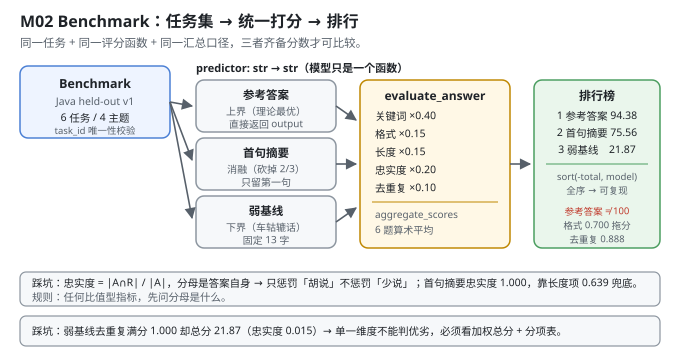
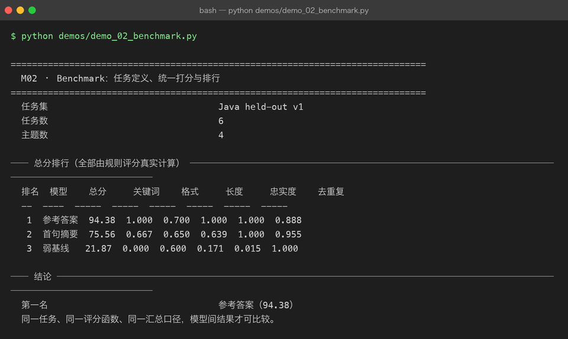

# Milestone 02 — Benchmark：任务定义、统一打分与排行

M01 建立了**指标**：PPL、Token Acc、ECE。但指标只描述"模型在某个数据集上的表现"，还没回答"我要拿它干什么"。

这一层把评估升级成 **Benchmark**：一组**任务**（task），每个任务有 prompt、参考答案、关键词、主题；一个统一的**打分函数**；一张**可排序的排行榜**。

M01 的指标和 M02 的 benchmark 是两件事：

| | M01 Evaluation | M02 Benchmark |
|---|---|---|
| 单位 | token | 任务（task） |
| 打分 | 概率分布层面的统计量 | 可读答案的多维规则评分 |
| 可比性 | 同一分词器、同一数据 | 同一任务集 + 同一评分函数 + 同一汇总口径 |

**纯 numpy 手写**：任务集、评分器、汇总、排行全部自己实现（`src/ie/benchmark.py`、`src/ie/autoeval.py`），不引入任何评测框架。

---

## 1. Why：为什么"排行榜"必须有三个"同一"

一个 benchmark 分数只有在**三个东西都固定**的时候才可比较：

1. **同一任务** —— prompt 必须一字不差（否则测的是 prompt 工程，不是模型）。
2. **同一评分函数** —— 参数、权重、阈值都不能变。
3. **同一汇总口径** —— 每题打分后怎么平均（本项目用简单算术平均，`aggregate_scores`）。

违反任何一条，排行榜就是噪音。现实中大量"某某模型超越 GPT-4"的结论，问题都出在第三条 —— 换个汇总方式（macro vs micro、去极值与否）结论就翻。

本项目刻意**不碰** MMLU / HumanEval 这类真实榜单：它们需要真实大模型才能跑出有意义的结果。这里的价值是**把排行榜的骨架做对** —— 任务集抽象、评分器接口、可复现的排行，这些换到任何榜单上都一样。

## 2. Design：三个对象

```python
BenchmarkTask(task_id, prompt, reference, keywords, topic)   # 一个任务
Benchmark(name, tasks).evaluate(model_name, predictor)        # 一个模型跑完所有任务
Benchmark.compare({name: predictor})                          # 多个模型 → 排行榜
```

- `predictor: Callable[[str], str]` —— **模型被抽象成一个函数**。这是整个设计的核心：不管背后是 7B 还是规则拼字符串，只要 `prompt → answer`，就能进排行榜。本项目三个"模型"里有两个就是规则函数。
- `tasks_from_records(records)` —— 直接把 M03 的 held-out 记录转成任务（`instruction → prompt`，`output → reference`，`topic` 由 `infer_topic` 推断）。**评估集和 benchmark 用同一批数据**，避免"两套数据各说各话"。
- `Benchmark.compare` 按 `(-total, model)` 排序 —— **分数相同时按名字排序**，保证排行榜在不同机器上完全一样（可复现性细节，但很重要）。

打分函数来自 M04 的 `evaluate_answer`（关键词 40% + 格式 15% + 长度 15% + 忠实度 20% + 去重复 10%），这里只做**汇总与排行**。



## 3. Real-run evidence（来自 `demos/out/demo_02_benchmark_terminal.txt`）

任务集 **Java held-out v1**，6 个任务 / 4 个主题（从 M03 的 held-out 前 6 条构造）。三个"模型"全是规则函数：

| 模型 | 做法 |
|---|---|
| 参考答案 | 直接返回 `record["output"]`（理论上界） |
| 首句摘要 | 只返回参考答案的第一句 |
| 弱基线 | 无论问什么都回答「Java 中需要根据具体情况分析。」 |

```
── 总分排行（全部由规则评分真实计算） ─────────────────────────────
  排名  模型    总分     关键词    格式     长度     忠实度    去重复
  --  ----  -----  -----  -----  -----  -----  -----
   1  参考答案  94.38  1.000  0.700  1.000  1.000  0.888
   2  首句摘要  75.56  0.667  0.650  0.639  1.000  0.955
   3  弱基线   21.87  0.000  0.600  0.171  0.015  1.000

  第一名                                参考答案（94.38）
```

四个读数：

- **参考答案 94.38，不是 100**。这是最有信息量的一行：连"把参考答案原样交上去"都拿不到满分，说明评分函数**不是"跟参考答案比对"**，而是在独立地衡量答案质量。`0.700`（格式）和 `0.888`（去重复）是参考答案自己丢的分 —— 参考答案里有重复的 3-gram，格式也不完全符合"有列表/有冒号"的加分项。
- **首句摘要 75.56，忠实度却是满分 1.000**。因为忠实度的定义是 `|answer_terms ∩ reference_terms| / |answer_terms|` —— **分母是答案自己的词**，所以"少说"完全不被惩罚，只惩罚"多说"。这是本评分器的已知偏向，见 4.1。
- **弱基线 21.87，其中去重复 1.000（满分）**。一个 13 个字的车轱辘话，在"去重复"这一项上拿了满分 —— 因为它根本没重复。**单一维度完全不能判优劣**，必须看加权总分和各分项。
- **弱基线忠实度 0.015**，几乎为 0。它说的「Java」「根据」「具体」「情况」「分析」几乎都不是参考答案里的词。**这一项才是真正把废话答案区分出来的东西**（权重 20%，仅次于关键词）。



## 4. 踩坑 / 反直觉发现

### 4.1 忠实度是"查准率"，不是"查全率"—— 越短越容易满分

```python
faithfulness = |answer_terms ∩ reference_terms| / |answer_terms|     # src/ie/autoeval.py:97
```

分母是**答案自己的词数**。后果：

- 只回答一个词且这个词在参考答案里 → 忠实度 **1.000**（首句摘要实测 1.000）。
- 回答很长但大部分不在参考答案里 → 忠实度很低（弱基线 0.015）。

所以忠实度单项**惩罚"胡说"，不惩罚"不说"**。必须和 `length_reasonableness`（权重 15%）配对使用 —— 后者在 `ratio < 0.6` 时按 `ratio / 0.6` 线性扣分，专门治"少说"。

实测印证：首句摘要长度项 0.639（被扣了），忠实度 1.000（被奖励了），两项合起来才给出合理的 75.56。

> 可迁移的经验：**任何一个"比值型"指标，先问分母是什么**。分母是自己 → 越短越占便宜；分母是参考答案 → 越长越占便宜。两种都不是质量度量，必须配对。

### 4.2 参考答案自己拿不到 100 分 —— 这是特性不是 bug

参考答案 94.38 分，丢了 5.62 分（格式 0.700、去重复 0.888）。

这不是评分器写错了。**"参考答案"只是一个参考，不是唯一正确答案**。评分函数衡量的是"这个答案像不像一个好的回答"（有关键词、有格式、长度合适、不复读），参考答案在这些维度上本来就不一定完美。

真正要警惕的是反过来：如果某个评分器给参考答案 100 分，**那它一定在跟答案做字符串比对**，也就失去了评估"没见过的好答案"的能力。

### 4.3 三个"模型"都是规则函数 —— 这不是偷懒

排行榜上的三项全是不调模型的规则函数。这看起来像"没测模型"，但实际上是最有价值的一类对照实验：

- **参考答案 = 上界**（94.38）
- **首句摘要 = 信息量的消融**（砍掉 2/3 内容，掉 18.82 分）
- **弱基线 = 下界**（21.87）

**先把评分器的动态范围标定出来，再往里放真模型。** 如果你不知道"废话"该得多少分、"完美"该得多少分，真模型拿到的 60 分你也不知道该高兴还是该难过。

本项目后续各章（M05 的 adapter / INT8 比较）走的都是这条路线：**先有可解释的对照组，再放真模型**。

### 4.4 排序键必须全序，否则排行榜不可复现

```python
rows.sort(key=lambda row: (-row["total"], row["model"]))    # src/ie/benchmark.py:54
```

只按 `-total` 排序时，Python 的 `sort` 是稳定的 —— 相同分数会保持**输入字典的顺序**，而 dict 顺序依赖于插入顺序。加上 `model` 作为第二键，排序变成**全序**，任何机器上跑出同一张表。

这类"可复现性细节"在 P08 已经踩过一次（`Tensor._prev` 是 set 导致跨进程不可复现）。本项目在排序、抽样（M03 的 seed）、指标汇总处都做了同样的处理。

## 5. Conclusion

1. Benchmark = **任务集 + 评分函数 + 汇总口径**；三者任一变化，分数就不可比。
2. `predictor: str → str` 是核心抽象：**模型只是一个函数**，规则函数也能进排行榜当对照组。
3. 实测排行：**参考答案 94.38 > 首句摘要 75.56 > 弱基线 21.87**（6 任务 / 4 主题，全部由规则评分真实计算）。
4. **参考答案只拿 94.38**（格式 0.700、去重复 0.888）—— 评分器衡量的是"像不像好答案"，不是"像不像参考答案"。
5. **忠实度是查准率不是查全率**：首句摘要忠实度 1.000 却只拿 75.56，靠长度项 0.639 兜底。比值型指标必须先问分母是什么。
6. **弱基线去重复满分 1.000 却总分 21.87** —— 单一维度不能判优劣，必须看加权总分 + 分项表。
7. 手写实现的意义：因为评分器是自己写的，我才知道"参考答案为什么不是 100 分"；用 `lm-eval-harness` 这类框架只能拿到一个分数，解释不了它。

## 6. Code map

| 文件 | 职责 |
|---|---|
| `src/ie/benchmark.py` | `BenchmarkTask`（task_id/prompt/reference/keywords/topic）/ `Benchmark.evaluate`（单模型跑全任务）/ `Benchmark.compare`（多模型排行，`(-total, model)` 全序排序）/ `tasks_from_records`（把 held-out 记录转成任务） |
| `src/ie/autoeval.py` | 提供 `evaluate_answer` 与 `aggregate_scores`（本章的打分与汇总口径来源，详见 M04） |
| `src/ie/evalset.py` | `infer_topic`：给任务打主题标签，供"主题数"统计 |
| `demos/demo_02_benchmark.py` | 3 节：任务集构造 / 三个 predictor / 总分排行 |
| `demos/out/demo_02_benchmark_terminal.txt` | 本章所有数字的来源 |
| `assets/benchmark.svg` | 本章 benchmark 流水线图 |

## 7. Version line

v0.1 → **v0.2**，M02 Benchmark 落地。实测（Java held-out v1，6 任务 / 4 主题）：排行 **参考答案 94.38 > 首句摘要 75.56 > 弱基线 21.87**；分项显示参考答案格式 0.700 / 去重复 0.888（拿不到满分），首句摘要忠实度 1.000 但长度仅 0.639，弱基线去重复 1.000 而忠实度仅 0.015。并诚实记录「忠实度分母是答案自身 → 惩罚胡说不惩罚少说」「三个"模型"均为规则函数，用于标定评分器动态范围」。纯 numpy、无评测框架。配图 1 张手写 SVG + 1 张真实终端截图。
