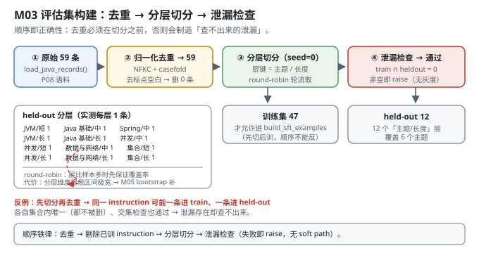
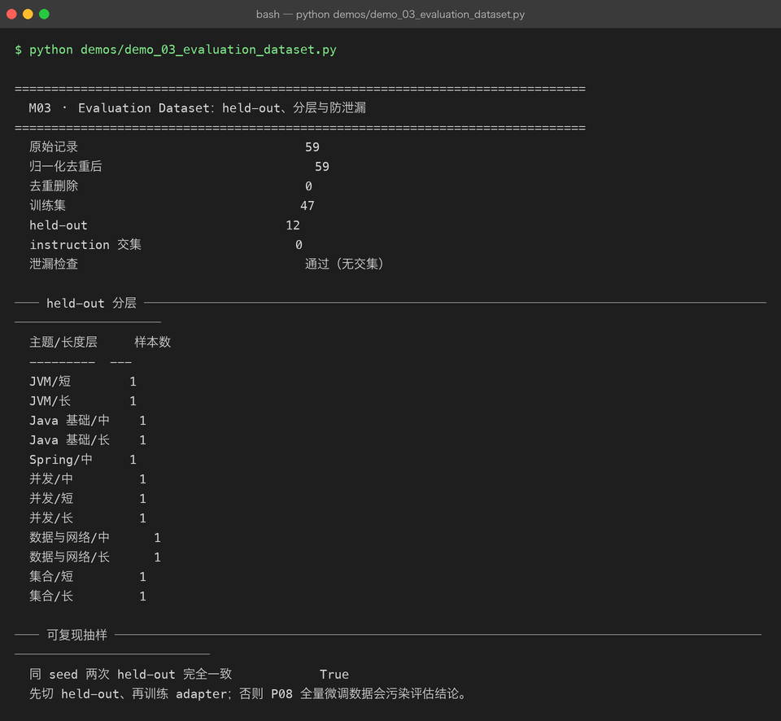

# Milestone 03 — Evaluation Dataset：held-out、分层与防泄漏

M02 有了 benchmark，但有个致命问题：**它用的 held-out 是哪来的？**

P08 M09 报告"域内困惑度 3,649.9 → 421.1（↓88.46%）"时，那个"域内评估集"就是**全部 59 条训练语料本身**。数字是真的，但它在测"模型有没有背下来"，不是"模型有没有学会"。

这一层把评估集当成**一等公民**来做：

- 从 59 条原始数据里**切出**一份**从未参与训练**的 held-out；
- 切的时候**分层**，保证主题和长度都覆盖到；
- 切完**跑泄漏检查**，交集非空就直接 `raise`。

**顺序不能反**：先切 held-out，再训练 adapter。P08 的全量微调把 59 条全喂进去了，所以 P09 的所有结论（M01 的 PPL、M05 的配对比较）都必须建立在"重新切分 + 重新训练"之上。

---

## 1. Why：为什么"评估集"比"评估指标"更先决定结论可信度

一个评估结论的可信度，取决于**最弱的一环**。三件事会同时毁掉它：

| 失效模式 | 后果 | 本项目的防线 |
|---|---|---|
| **泄漏**：评估题在训练数据里出现过 | 指标虚高，测的是记忆 | `leakage_report` → 交集非空即抛异常 |
| **偏斜**：held-out 全是某一个主题 | 指标只反映该主题 | `record_stratum` 分层抽样 |
| **不可复现**：每次切的不一样 | 两次实验结论不可比 | `np.random.default_rng(seed)` |

第三条最容易被忽略，但它是"比较"这件事的地基：**如果今天的 held-out 和昨天的不一样，M05 里那 10 个 seed 的配对比较就毫无意义。**

还有一个顺序问题必须写清楚：**去重必须在切分之前**。如果先切分再去重，同一条 instruction 可能一条进 train、一条进 held-out —— 去重只能删掉一条，另一条留在 held-out 里，泄漏检查也抓不到（因为归一化后的 key 只出现一次）。

## 2. Design：四步

```python
build_evaluation_set(records, heldout_size, seed=0, training_records=None)
    ├── 1. deduplicate_records()   NFKC + casefold + 去所有非字母数字 → 按 key 去重
    ├── 2. 可选：剔除 training_records 里已出现过的 instruction
    ├── 3. _stratified_pick()      按「主题/长度」分层，round-robin 轮流取
    └── 4. leakage_report()        train_keys ∩ heldout_keys == ∅ ? 否则 raise
```

几个设计细节：

- **`normalize_instruction`**（`src/ie/evalset.py:19`）：`unicodedata.normalize("NFKC")` 统一全角/半角，`casefold()` 统一大小写，`re.sub(r"[\W_]+", "")` 删掉所有标点和空白。**"HashMap 怎么扩容？" 和 "hashmap怎么扩容" 必须被判为同一条**，否则去重和泄漏检查都是漏的。
- **`record_stratum`**：`f"{主题}/{长度}"`，主题由 `infer_topic` 按关键词推断（并发 / JVM / 集合 / Spring / 数据与网络 / 兜底"Java 基础"），长度按 instruction 字符数 ≤18 短 / ≤30 中 / 否则长。**6 个主题 × 3 个长度 = 最多 18 层**。
- **`_stratified_pick` 的 round-robin**（`src/ie/evalset.py:91`）：把层名打乱后轮流从每层取一个，取够了就停。**保证小层也有样本**，而不是按层大小比例抽样（那样小层会被吃掉）。
- **`leakage_report` 失败即 `RuntimeError`**（`src/ie/evalset.py:145`）：不是打一行警告，是**直接崩**。泄漏是"结论无效"级别的 bug，不值得给它一个 soft path。



## 3. Real-run evidence（来自 `demos/out/demo_03_evaluation_dataset_terminal.txt`）

原始语料 59 条（P08 的 `load_java_records()`），`heldout_size=12`、`seed=0`：

```
  原始记录                               59
  归一化去重后                             59
  去重删除                               0
  训练集                                47
  held-out                           12
  instruction 交集                     0
  泄漏检查                               通过（无交集）
```

**held-out 分层（实测）：**

```
  主题/长度层     样本数
  ---------  ---
  JVM/短        1        JVM/长        1
  Java 基础/中    1        Java 基础/长   1
  Spring/中     1        并发/中        1
  并发/短        1        并发/长        1
  数据与网络/中    1        数据与网络/长   1
  集合/短        1        集合/长        1
```

```
  同 seed 两次 held-out 完全一致            True
```

五个读数：

- **59 → 59，去重删 0**。这一行容易被误读成"去重没用"。真实含义是：**这批语料本身没有重复**。去重是防御性步骤，本例恰好没触发 —— 见 4.2。
- **训练 47 / held-out 12**。切分比例约 20%，是 8~12 条这种小评估集上常见的选择（太小则置信区间太宽，太大则训练数据不够）。M01/M05 用的是 `heldout_size=8`，M03 演示用 12 —— **同一个函数、只改参数**，这是刻意的。
- **12 条 held-out 落在 12 个不同的「主题/长度」层**，覆盖全部 **6 个主题**（JVM / Java 基础 / Spring / 并发 / 数据与网络 / 集合）。每层的样本数都是 1 —— 这正是 round-robin 分层抽样的预期行为：**层比样本多时，先保证覆盖率，不保证每层配额**。
- **instruction 交集 0，泄漏检查通过**。这是整章唯一的"硬门槛"，过了才能谈后面的指标。
- **同 seed 两次切分完全一致 `True`**。可复现性实测通过，不是"理论上应该"。



## 4. 踩坑 / 反直觉发现

### 4.1 P08 的"域内评估集"其实是训练集 —— 这是本章存在的全部理由

P08 M09 报的"域内困惑度 3,649.9 → 421.1（↓88.46%）"，评估用的是**全部 59 条**，而这 59 条正是 SFT 的训练数据。

那个数字**没有错**，但它回答的问题是"模型有没有把这 59 条背下来"，不是"模型有没有学会回答 Java 面试题"。P08 自己也在结论里写了"困惑度下降 ≠ 可用"（定性生成仍是乱码）—— 现在多了一条解释：**评估集本身被污染了**。

P09 的处理：**先切 held-out，再训练 adapter**（`demos/_common.py:45` 的 `adapter_bundle`，held-out 8 条先切出来，剩下 47 条才进 `build_sft_examples`）。M01 报的 PPL 5496.76 和 P08 报的 421.1 差了 13 倍 —— **差的不是模型，是评估集**。

> 可迁移的经验：**看到"微调后指标暴涨"先问一句：评估集有没有进过训练集。** 这是深度学习里最常见、也最容易被漂亮数字掩盖的错误。

### 4.2 「去重删除 0」不等于"去重这一步可以省"

实测删 0 条，看起来这一步是白写的。但：

- 换一批语料（尤其是爬来的、多人标注的）立刻就会非零；
- 更关键的是 **4.3 的顺序问题**：去重必须在切分**之前**，否则会制造"去重后仍然泄漏"的假象。

防御性代码的价值不在本次是否触发，而在**换输入时不会静默出错**。本项目让它打印 `去重删除 0` 而不是隐藏这一行，就是为了让"没触发"这件事可见。

### 4.3 顺序反了会制造"查不出来的泄漏"

假设同一条 instruction 出现两次（`key` 相同）：

- **正确顺序**（先去重再切分）：两条合成一条，要么进 train 要么进 held-out，不会同时出现 → 交集为 0。
- **错误顺序**（先切分再去重）：可能一条进 train、一条进 held-out；去重时各自在自己的集合里是唯一的，**谁都不会被删**；`leakage_report` 检查的是 train 与 held-out 的**交集**，此时两者确实不同 → **泄漏检查通过，但实际泄漏了**。

所以 `build_evaluation_set` 的第一步就是 `deduplicate_records`，`training_records` 的剔除也在切分之前（`src/ie/evalset.py:117-126`）。**顺序即正确性。**

### 4.4 分层抽样的"每层 1 个"是预期行为，不是抽样坏了

12 条样本落到 12 个不同的层，每层恰好 1 条。这是 `_stratified_pick` 的 round-robin 设计的直接结果：层名打乱后**轮流**取，只有在取完一轮后才会回到同一层取第二个。

当 `heldout_size` 小于层数时（12 < 理论最多 18 层，实际这批数据只有 12 个非空层），结果必然是"每层一个"。**这是有意的覆盖优先策略**：12 条样本里宁可每个主题都有，也不要某个主题堆 5 条、其他主题 0 条。

代价要说清楚：**每层只有 1 条时，分层维度上的置信区间极宽**。本项目在 M05 用 10 seed bootstrap 给出 ±0.047 的标准差，正是在补这个洞 —— 分层保证覆盖，bootstrap 量化不确定性，两件事缺一不可。

### 4.5 泄漏检查用 `raise` 而不是 `warning`

```python
if not report["leakage_free"]:
    raise RuntimeError(f"评估集泄漏：发现 {report['overlap_count']} 条 instruction 重叠")
```

理由：**泄漏后的所有下游数字都是无效的**，让流程继续跑下去只是浪费时间和制造误导。相比之下，P08 的"遗忘判定"用 ±10% 容忍度是合理的 —— 那是一个连续量，需要人为设阈值；而"交集是否为空"是一个**布尔事实**，没有灰度。

## 5. Conclusion

1. **评估集是结论可信度的第一环**，比指标本身更先决定成败。三种失效模式：泄漏、偏斜、不可复现。
2. 实测：**59 条 → 去重后 59（删 0）→ 训练 47 / held-out 12**，instruction 交集 **0**，泄漏检查通过；12 条覆盖全部 **6 个主题层**。
3. **顺序即正确性**：先去重 → 再剔除已训 instruction → 再分层切分 → 最后泄漏检查。顺序反了会制造"查不出来的泄漏"。
4. **先切 held-out 再训练 adapter**。P08 的 421.1 与 P09 的 5496.76 差 13 倍，差的不是模型，是评估集。
5. **分层用 round-robin 保证覆盖率**：层比样本多时每层 1 条是预期行为；代价是分层维度置信区间极宽，需靠 M05 的 bootstrap 补。
6. **泄漏是布尔事实，没有灰度** —— `raise` 而不是 `warning`。
7. **同 seed 两次切分完全一致（实测 `True`）**，这是 M05 配对比较的地基。
8. 手写实现的意义：因为切分、去重、泄漏检查都是自己的代码，我能精确回答"held-out 里到底有什么"（12 行分层表就是答案）；用 `train_test_split` 只能拿到两个数组。

## 6. Code map

| 文件 | 职责 |
|---|---|
| `src/ie/evalset.py` | `normalize_instruction`（NFKC + casefold + 去标点）/ `infer_topic` / `length_stratum` / `record_stratum`（主题/长度层键）/ `deduplicate_records` / `leakage_report`（交集检查）/ `_stratified_pick`（round-robin 分层抽样）/ `stratum_counts` / `build_evaluation_set`（四步主流程，泄漏即 `raise`） |
| `src/ie/evalset.py:145` | 泄漏检查失败 → `RuntimeError`，无 soft path |
| `demos/_common.py` | `data_split` / `base_bundle` / `adapter_bundle`：**先切 held-out 再训 adapter** 的落地处 |
| `demos/demo_03_evaluation_dataset.py` | 3 节：切分统计 / held-out 分层表 / 可复现性验证 |
| `demos/out/demo_03_evaluation_dataset_terminal.txt` | 本章所有数字的来源 |
| `assets/evalset.svg` | 本章 held-out 切分与泄漏检查图 |

## 7. Version line

v0.2 → **v0.3**，M03 评估数据集落地。实测：`heldout_size=12 / seed=0` → 原始 59 条、去重后 59（删 0）、训练 **47** / held-out **12**、instruction 交集 **0**、泄漏检查通过；12 条落在 12 个不同的「主题/长度」层，**覆盖全部 6 个主题**（JVM / Java 基础 / Spring / 并发 / 数据与网络 / 集合）；同 seed 两次切分完全一致 `True`。并诚实记录「P08 的域内评估集实为训练集，421.1 vs 5496.76 差 13 倍源于评估集而非模型」「去重删除 0 不代表该步骤可省」「顺序反了会制造查不出的泄漏」。纯 numpy + 标准库。配图 1 张手写 SVG + 1 张真实终端截图。
