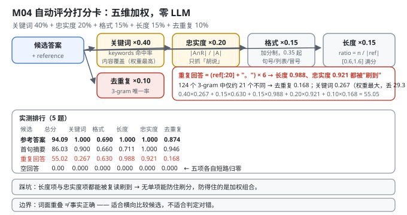
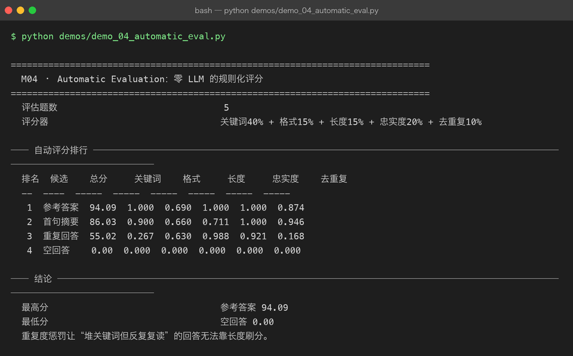

# Milestone 04 — Automatic Evaluation：零 LLM 的规则化评分

M02 搭好了 benchmark 的骨架（任务集 + 排行），但打分函数是借来的。这一层把它做实：**一个完全离线、确定性、零 LLM 调用的自动评分器**。

用 LLM 当裁判（LLM-as-judge）是现在的主流做法，但它有三个硬伤：

1. **不确定** —— 同一个输入两次调用可能给不同分，排行榜不可复现；
2. **贵且慢** —— 5 题 × 4 个候选 × 多次调用，成本和时间都不适合放在开发循环里；
3. **不可解释** —— 拿到一个"78 分"，你不知道是哪一项丢的。

本项目选另一条路：**规则化评分**。五个维度加权求和，每个维度都是一段几行的纯 Python。代价是它只能测"表面质量"，测不了事实正确性 —— 这条边界后面会明确写出来。

---

## 1. Why：为什么是这五项，权重为什么这么分

```python
total = 100 × (0.40·关键词 + 0.15·格式 + 0.15·长度 + 0.20·忠实度 + 0.10·去重复)
```

| 维度 | 权重 | 回答什么 | 为什么是这个权重 |
|---|---|---|---|
| **关键词覆盖** | 40% | 该说的点说到了吗 | 最高 —— 内容是第一位 |
| **忠实度** | 20% | 说的东西有依据吗 | 次高 —— 惩罚"胡说" |
| **格式** | 15% | 像个"回答"吗 | 弱约束，只做加分 |
| **长度** | 15% | 说够了吗 / 啰嗦吗 | 双向惩罚过短和过长 |
| **去重复** | 10% | 在复读吗 | 权重最小但**不可省**（见 4.1） |

五项分三类：**内容**（关键词 + 忠实度，60%）、**形式**（格式 + 长度，30%）、**退化检测**（去重复，10%）。

为什么"去重复"权重最小却不可省：它是一个**否决项**。前 60% 的内容分可以通过"反复复读同一句话"部分刷到（复读确实包含关键词、也确实忠实），只有去重复能识别出"这个回答的信息量远小于它的字数"。10% 的权重足以让"复读型答案"上不了榜，又不会过度惩罚正常的术语重复。

## 2. Design：五个纯函数 + 一个加权

```python
keyword_coverage(answer, keywords)   # keywords 里出现了几个（子串匹配）
format_compliance(answer)            # 0.35 起 + 有句号 +0.25 + 有列表/编号 +0.25 + 有冒号分号 +0.15
length_reasonableness(a, reference)  # ratio=n/ref；[0.6,1.6] 满分，过短 ratio/0.6，过长 1-(r-1.6)/2.4
faithfulness_proxy(a, reference)     # |terms(a) ∩ terms(ref)| / |terms(a)|
repetition_score(answer, ngram=3)    # 去重后 3-gram 数 / 总 3-gram 数
```

三个实现细节值得单独说：

- **`_terms` 的中英混排处理**（`src/ie/autoeval.py:24`）：ASCII 词用正则 `[a-z][a-z0-9_+.-]{1,}` 抽（至少 2 字符，避免把单个字母当词）；中文没有空格，用**滑动 2-gram**：`"线程安全"` → `{"线程","程安","安全"}`。**中文是 2-gram 而不是分词** —— 不引入 jieba，靠 2-gram 的重叠度做集合运算，对"是否用了同样的术语"足够用。
- **`format_compliance` 是加分制不是扣分制**：空回答直接 0，非空起 0.35，然后逐项加分、上限 1.0。这样"格式"永远是个温和的加成，不会让一个内容正确的朴素段落被判死。
- **`length_reasonableness` 以参考答案为标尺**（`src/ie/autoeval.py:67`）：`target = len(reference)`，`ratio = n / target`。**没有 reference 时退化到绝对字数区间 [20, 500]** —— 所有 demo 都传了 reference，走的是相对分支。



## 3. Real-run evidence（来自 `demos/out/demo_04_automatic_eval_terminal.txt`）

5 道评估题（M03 的 held-out 前 5 条），四个候选答案：

| 候选 | 构造方式 |
|---|---|
| 参考答案 | 原样返回 `record["output"]` |
| 首句摘要 | 参考答案的第一句 |
| **重复回答** | `(reference[:20] + "。") × 6` —— 把参考答案前 20 字复读 6 遍 |
| 空回答 | 空字符串 |

```
── 自动评分排行 ───────────────────────────────────────────────────
  排名  候选    总分     关键词    格式     长度     忠实度    去重复
  --  ----  -----  -----  -----  -----  -----  -----
   1  参考答案  94.09  1.000  0.690  1.000  1.000  0.874
   2  首句摘要  86.03  0.900  0.660  0.711  1.000  0.946
   3  重复回答  55.02  0.267  0.630  0.988  0.921  0.168
   4  空回答    0.00  0.000  0.000  0.000  0.000  0.000

  最高分                                参考答案 94.09
  最低分                                空回答 0.00
```

**把"重复回答"这一行拆开看（本章的核心）：**

- **长度 0.988 —— 几乎满分。** 它把前 20 字复读 6 遍，总长约 126 字符，和参考答案长度几乎一致，**长度项被成功刷到了**。
- **忠实度 0.921 —— 也很高。** 复读的词全部来自参考答案，`|A∩R|/|A|` 自然接近 1。**忠实度项对"复读"是瞎的。**
- **去重复 0.168 —— 崩了。** 126 个字符产生 124 个 3-gram，其中不同的只有约 21 个（一个周期的量），`21/124 ≈ 0.169`。
- **关键词 0.267 —— 也崩了。** 复读前 20 字只能覆盖 6 个关键词里的约 1.6 个。
- **总分 55.02**。按权重还原：`0.40×0.267 + 0.15×0.630 + 0.15×0.988 + 0.20×0.921 + 0.10×0.168 = 55.05`（分项显示值四舍五入后的误差内）。

**空回答 0.00**：五个分项**每一个**都有"空输入直接返回 0"的短路分支，所以总分严格为 0，不是"某项接近 0"。



## 4. 踩坑 / 反直觉发现

### 4.1 没有单项能防住刷分 —— 防得住的是加权组合

这一条值得说三遍，因为它推翻了"加个重复度检测就安全了"的直觉：

- **长度项确实被刷到了**（0.988）。如果只看长度，复读答案和参考答案没区别。
- **忠实度项也确实被刷到了**（0.921）。复读出来的词当然全部"忠实"。
- 真正拉住它的是**关键词**（0.267，权重最大 40%，一项就丢 29.3 分）和**去重复**（0.168，权重 10%，丢 8.3 分）。

反过来说：**如果我为了"防复读"把去重复权重提到 40%，那正常回答里的术语复现（"volatile 保证可见性……volatile 不保证原子性"）就会被误杀。**

> 可迁移的经验：**评估指标的设计目标是"让每一种作弊方式都要同时过好几关"，而不是"找一个万能指标"。** 五个维度里任何一个单独看都能被针对性绕过 —— 这正是要五维加权的原因。

### 4.2 短文本在"去重复"上天然满分（源码级陷阱）

```python
def repetition_score(answer, ngram=3):
    compact = re.sub(r"\s+", "", answer)
    if not compact:
        return 0.0
    if len(compact) < ngram:      # <-- 少于 3 个字符，直接满分
        return 1.0
```

一个 2 个字的回答（"好的"）会拿到 `repetition_score = 1.0`。这看起来是 bug，其实是**有意的**：3-gram 在长度不足时无定义，返回 1.0（"没有可判定的重复"）比返回 0.0（"判定为重复"）更保守。

代价是：**极短回答在去重复项上白拿满分**。兜底靠 `length_reasonableness`（过短按 `ratio/0.6` 线性扣分）—— 这又回到 4.1 的结论：**任何一个单项的漏洞都要靠另一个单项补**。

### 4.3 忠实度对"复读"完全失灵，这是它的定义决定的

M02 已经指出忠实度的分母是答案自身（`|A∩R|/|A|`），所以"少说"不受惩罚。M04 补上了另一半：**"复读"也不受惩罚**，因为复读的词 100% 来自参考答案，分子分母相等。

实测：重复回答忠实度 **0.921**，比首句摘要的 1.000 只低一点，远高于它应得的水平。

**忠实度这个指标真正能抓的只有一类错误：说参考答案里没有的东西（幻觉）。** 它抓不住"说太少"（M02），也抓不住"反复说"（本章）。三条一起看才完整。

### 4.4 参考答案的"去重复"只有 0.874 —— 真实的中文文本本来就有重复

参考答案去重复 0.874、格式 0.690，两项加起来丢了约 11 分（94.09 而非 100）。

原因很实在：**中文技术回答里"的"、"是"、"一个"这类 2-gram 和大量术语会自然复现**，3-gram 唯一率本来就不可能是 1。这意味着 `repetition_score` 的**实用上界大约在 0.95 左右**，不是 1.0。

所以不要把这个分数当"绝对质量"读，它是**相对量**：0.168（复读） vs 0.874（正常文本）的差距才是信号，0.874 vs 0.946（首句摘要）的差距基本是噪声。

### 4.5 边界：这套规则测不了"事实正确性"

必须诚实写出来：`faithfulness_proxy` 是**词面重叠度**，不是事实核查。

- 一个答案把"volatile 保证原子性"说成"volatile 不保证原子性"，词面重叠度几乎一样，**评分器给同样的分**；
- 一个用词完全不同但完全正确的答案，会被判低分。

所以这套评分器适用于：**同一批任务上、候选答案之间的横向比较**（M02 的排行、M05 的模型对比）。它不适用于判断"这个答案对不对"。

真正要测事实正确性，得用 LLM-as-judge 或人工 —— 而那正是本章开头说的"不确定、贵、不可解释"的方案。**评估没有免费的午餐，只有明确取舍。**

## 5. Conclusion

1. 规则化评分 = **五个纯函数加权**：关键词 40% / 忠实度 20% / 格式 15% / 长度 15% / 去重复 10%。零 LLM、确定性、可解释。
2. 实测排行：**参考答案 94.09 > 首句摘要 86.03 > 重复回答 55.02 > 空回答 0.00**（5 题）。
3. **重复回答是本章的核心案例**：长度 0.988（刷到了）、忠实度 0.921（也刷到了），但关键词 0.267、去重复 0.168 把它拉到 55.02 —— **重复度 0.168 由 124 个 3-gram 里仅约 21 个不同得出**。
4. **没有单项能防住刷分，防得住的是加权组合。** 任何一维单独看都能被绕过（长度可被复读刷、忠实度可被复读刷、去重复对短文本白送 1.0）。
5. **忠实度只抓"胡说"**，抓不住"少说"（M02：分母是答案自身）也抓不住"复读"（本章）。
6. `repetition_score` 的实用上界约 **0.95**（参考答案实测 0.874），它是相对量不是绝对量。
7. **空回答严格 0.00** —— 五个分项都有空输入短路，不是"接近 0"。
8. 边界：词面重叠 ≠ 事实正确。这套评分器适合**横向比较候选**，不适合判定对错。
9. 手写实现的意义：因为每个维度都是几行自己写的 Python，我能精确说出"55.02 是怎么来的"（逐项还原到 55.05）；用现成 judge 只能拿到一个分数和一个"理由"，而那个理由本身不可验证。

## 6. Code map

| 文件 | 职责 |
|---|---|
| `src/ie/autoeval.py` | `_terms`（ASCII 正则 + 中文 2-gram）/ `derive_keywords`（按标点切分，上限 8）/ `keyword_coverage` / `format_compliance`（加分制，0.35 起）/ `length_reasonableness`（相对 reference，过短 `ratio/0.6`）/ `faithfulness_proxy`（`\|A∩R\|/\|A\|`）/ `repetition_score`（3-gram 唯一率，短文本返回 1.0）/ `evaluate_answer`（五维加权）/ `aggregate_scores` / `rank_answers` |
| `src/ie/autoeval.py:83-84` | `if len(compact) < ngram: return 1.0` —— 短文本白送满分，靠长度项兜底 |
| `src/ie/benchmark.py` | 复用 `evaluate_answer` + `aggregate_scores` 作为 M02 的打分与汇总口径 |
| `demos/demo_04_automatic_eval.py` | 3 节：候选构造 / 自动评分排行 / 最高最低分 |
| `demos/out/demo_04_automatic_eval_terminal.txt` | 本章所有数字的来源 |
| `assets/autoeval.svg` | 本章自动评分打分卡图 |

## 7. Version line

v0.3 → **v0.4**，M04 零 LLM 规则化自动评分落地。实测（5 题）：**参考答案 94.09 > 首句摘要 86.03 > 重复回答 55.02 > 空回答 0.00**；重复回答分项 关键词 0.267 / 格式 0.630 / 长度 0.988 / 忠实度 0.921 / **去重复 0.168**（124 个 3-gram 中约 21 个不同），逐项还原总分 55.05。并诚实记录「长度 0.988 与忠实度 0.921 均被复读刷到 → 无单项能防刷分，防得住的是加权组合」「`repetition_score` 对 <3 字符文本返回 1.0」「忠实度抓不住少说与复读」「词面重叠 ≠ 事实正确」。纯 numpy + 标准库，无 LLM 调用。配图 1 张手写 SVG + 1 张真实终端截图。
