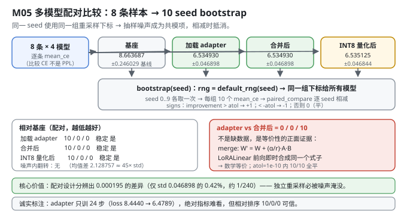
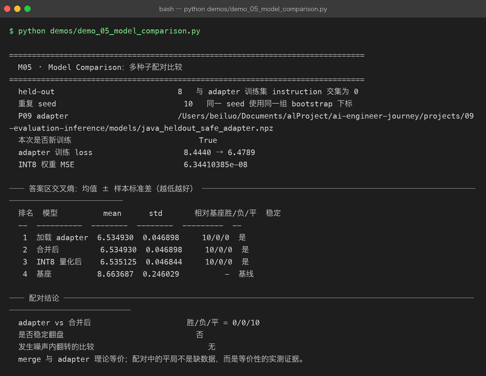

# Milestone 05 — Model Comparison：多种子配对比较

前四层把"怎么评"做完了（指标 → benchmark → 评估集 → 评分器）。现在回答 AI 工程里最高频也最容易做错的问题：**A 模型和 B 模型，哪个更好？**

难点在于：本项目的 held-out 只有 **8 条**。在 8 条样本上算出"adapter 的 CE 是 6.5349、基座是 8.6637"，你能下结论吗？

不能直接下。**单点估计没有不确定性，就没有比较。** 这一层做的是：

1. 用 **bootstrap 重采样**把单点估计变成分布（10 个 seed）；
2. 用**配对设计**（同一 seed 用同一组重采样下标）抵消共同噪声；
3. 用**胜/负/平**计数而不是"均值谁小"来下结论 —— 因为均值差可能只是噪声。

**纯 numpy 手写**：bootstrap、配对比较、稳定性判定全在 `src/ie/compare.py`，不引入 scipy。

---

## 1. Why：为什么"均值更小"不等于"更好"

三个真实的陷阱：

**陷阱一：样本量太小。** 8 条样本上，换一组样本可能结论就翻。bootstrap 回答的是"如果换一批同分布的样本，结论还成立吗"。

**陷阱二：两组比较各自独立采样，噪声会淹没信号。** 这是本章最关键的一点。实测：

- adapter 的 bootstrap 标准差 **±0.046898**
- INT8 与 adapter 的均值差只有 **0.000195**

差值只有标准差的 **0.42%**。如果两组各自独立重采样，这个差异 100% 会被噪声淹掉。但**配对设计**下它稳定出现 10/0/0 —— 因为两组用的是**同一组下标**，抽样带来的偏差是**共模**的，在相减时抵消了。

**陷阱三：用 `mean_a < mean_b` 下结论，会掩盖"有时赢有时输"。** `paired_compare` 输出 `noise_flip` 标志：只要既有胜又有负，就说明结论在噪声内翻转 —— 这时候"均值更小"是假信号。

## 2. Design：三层结构

```python
summarize(values)                       # 均值 / 样本标准差(std ddof=1) / min / max
paired_compare(baseline, challenger)    # 逐 seed 相减 → sign → 胜/负/平 + stable + noise_flip
evaluate_models(models, seeds, evaluator, baseline=..., lower_is_better=True)
```

关键设计点：

- **`lower_is_better` 统一符号**（`src/ie/compare.py:37`）：`improvement = -raw_delta if lower_is_better else raw_delta`。**`improvement > 0` 永远表示 challenger 更好**，调用方不用记方向。本项目比较的是交叉熵（越低越好）。
- **`atol` 判平，不是 `==`**（`src/ie/compare.py:38`）：`np.where(improvement > atol, 1, np.where(improvement < -atol, -1, 0))`。浮点运算必然有 ~1e-16 的噪声，用严格等于会假报"负"。M05 里 adapter vs merge 特意用 `atol=1e-10`。
- **`stable` 的定义**（`src/ie/compare.py:41`）：`无平局` 且 `符号全一致`。**有平局就判不稳定** —— 这是刻意的保守。
- **`evaluator: (model, seed) -> float`**：把"怎么算一个数"注入进来。M05 注入的是"按 seed 重采样 8 条样本的 mean_ce"。

**为什么比较的是 CE 而不是 PPL**（`demos/demo_05_model_comparison.py:27`）：`_example_losses` 返回每条样本的 `mean_ce`，bootstrap 后**对 CE 取平均**。如果对 PPL 取平均，由 Jensen 不等式 `E[exp(X)] > exp(E[X])`，会把均值系统性高估 —— **PPL 不可直接平均**，这是它作为比较指标的固有缺陷。



## 3. Real-run evidence（来自 `demos/out/demo_05_model_comparison_terminal.txt`）

held-out **8 条**（与 adapter 训练集 instruction 交集为 0），**10 个 seed**，同一 seed 使用同一组 bootstrap 下标。adapter 本次新训练（24 步，`lr=3e-3`，`r=4`，`alpha=8`）。

```
  held-out                           8   与 adapter 训练集 instruction 交集为 0
  重复 seed                            10   同一 seed 使用同一组 bootstrap 下标
  本次是否新训练                            True
  adapter 训练 loss                    8.4440 → 6.4789
  INT8 权重 MSE                        6.34410385e-08
```

```
── 答案区交叉熵：均值 ± 样本标准差（越低越好） ────────────────────────────
  排名  模型          mean      std       相对基座胜/负/平  稳定
  --  ----------  --------  --------  ---------  --
   1  加载 adapter  6.534930  0.046898     10/0/0  是
   2  合并后         6.534930  0.046898     10/0/0  是
   3  INT8 量化后    6.535125  0.046844     10/0/0  是
   4  基座          8.663687  0.246029          -  基线

── 配对结论 ────────────────────────────────────────────────────────────
  adapter vs 合并后                     胜/负/平 = 0/0/10
  是否稳定翻盘                             否
  发生噪声内翻转的比较                         无
  merge 与 adapter 理论等价；配对中的平局不是缺数据，而是等价性的实测证据。
```

五个读数：

- **adapter / merge / INT8 三者相对基座都是 10 胜 0 负 0 平，判定"稳定"。** 差距是 `8.663687 − 6.534930 = 2.128757`，相当于 adapter 标准差（0.0469）的 **45 倍** —— 这是"不需要统计检验也能信"的量级。
- **基座的 std 是 0.246029，是 adapter 的 5.2 倍。** 未微调的基座在 8 条样本上的表现**更不稳定**（逐条 CE 差异更大），微调不仅降低了均值，也降低了方差。这一行容易被忽略，但它本身就是"微调有效"的独立证据。
- **INT8 与 adapter 只差 0.000195**（`6.535125 − 6.534930`），只有 std 的 **0.42%**，却在配对设计下稳定 10/0/0。**这就是配对设计的价值**：共模噪声抵消后，能分辨远小于标准差的系统性差异。
- **`adapter vs 合并后 = 0/0/10` 全平** —— 这是**正面的等价性证据**，不是数据缺失（见 4.1）。
- **"发生噪声内翻转的比较：无"** —— 三个对比里都没有"有胜有负"的情况，说明排序在所有重采样下一致。



## 4. 踩坑 / 反直觉发现

### 4.1 `0/0/10` 全平是等价性的正面证据，不是"数据不够"

这是本章最容易被误读的一行，必须说清楚。

`merge_lora` 做的事是把 LoRA 的增量折进基座权重：`W' = W + (alpha/r) · A · B`。而 `LoRALinear` 在前向时是**即时合成** `.data = W + (alpha/r)·A·B`。两者**数学上完全等价** —— 合并只是把运行时的加法提前做掉。

所以"全平"是**理论预测的必然结果**。实测 10 个 seed 全部落在 `atol=1e-10` 以内，说明：

1. `merge_lora` 的实现没有引入额外的数值误差；
2. 合并前后前向计算路径一致（`LoRALinear` 伪装成 Tensor 的技巧没有副作用）。

> **怎么读这张表**：`0/0/10` 在这里是 `merge_lora` 正确性的**回归测试**，而不是"两个模型差不多，随便选"。如果哪天它变成 `5/5/0`（噪声内翻转），那说明合并引入了浮点级别的偏差；如果变成 `10/0/0` 或 `0/10/0`，那就是**合并写错了**。

要强调的是：**表格里"合并后"那一行的 `10/0/0` 是相对基座的结果，底部单独打印的 `0/0/10` 是 adapter 与 merge 之间的直接对比。两个数字口径不同，别混着读。**

### 4.2 配对设计能测出比标准差小 240 倍的差异

| | 数值 |
|---|---|
| INT8 与 adapter 的均值差 | **0.000195** |
| adapter 的 bootstrap 标准差 | **0.046898** |
| 比值 | **0.42%**（约 1/240） |

如果两组各自独立重采样（不同下标），差值会被两组噪声叠加淹没，结论一定是"无显著差异"。**配对**（同一 seed 同一组下标）让抽样偏差变成共模项，在 `b − a` 里被减掉。

> 可迁移的经验：**比较两个模型时，一定要在完全相同的数据子集上比。** 这条既适用于 bootstrap，也适用于"用同一个 held-out 跑所有模型"—— 换一批数据就等于把噪声翻倍。本项目的 `evaluate_models` 把所有模型放在同一个 `evaluator(model, seed)` 下、用同一个 seed 序列，正是为此。

### 4.3 用 `atol` 判平，不要用 `==`

```python
signs = np.where(improvement > atol, 1, np.where(improvement < -atol, -1, 0))   # src/ie/compare.py:38
```

浮点合并必然产生 ~1e-16 量级的差异。如果用 `improvement > 0` 判胜，adapter vs merge 会变成 `10/0/0`（adapter"胜"，因为合并后的数在浮点上恰好大了一点点）—— **一个纯粹的浮点噪声会被报成"adapter 显著更好"**。

`atol=1e-10` 的选择：远大于 fp64 的舍入噪声（~1e-16），远小于任何有意义的模型差异（本项目最小有意义差异是 INT8 的 1.95e-4）。**阈值要卡在"噪声量级"和"信号量级"之间。**

### 4.4 `stable=False` 有一种情况是"太好了"

```python
stable = non_ties.size > 0 and np.all(non_ties == non_ties[0]) and not np.any(signs == 0)
```

注意最后的 `not np.any(signs == 0)`：**只要有任何一个平局，`stable` 就是 `False`**。所以 adapter vs merge 的 `0/0/10` 会让 `stable=False` —— 但这个 `False` 的含义是"无法判断优劣方向"（因为没有非平局样本），**不是"结论不可信"**。

这是刻意保守的设计：`stable` 的语义是"**在所有重采样下，胜负方向完全一致且没有平局**"。用它的时候要知道它在平局时会保守地返回否。本项目在排行榜里只展示 `stable`，而在底部单独打印 adapter vs merge 的胜/负/平计数 —— **两个口径分开呈现，避免误读**。

### 4.5 诚实标注：adapter 只训了 24 步

```
  adapter 训练 loss                    8.4440 → 6.4789
```

24 步（`demos/_common.py:45` 的 `steps=24`）是为了让 demo 在几秒内跑完、图快速可复现。**绝对指标很难看**：CE 6.53 对应 PPL 约 690，基座 8.66 对应 PPL 约 5,760 —— 一个仍然"说不出人话"的模型。

但**比较结论是有效的**：三者相对基座 `10/0/0` 稳定，`noise_flip` 为无。这是因为 **bias-variance 里的 bias 部分**（模型好不好）和 **variance 部分**（评估不确定性）是分开的：24 步训练让 bias 只降了一部分，但 8 条样本的 bootstrap 把 variance 量化清楚了。

> 一句话：**绝对数字别看，相对排序可信。** 这是小样本评估的正确读法。

### 4.6 ⚠ P06 的 `Adam` 动量从不累积 —— 本章训练的 24 步其实是 SignSGD

本章的 adapter 由 P08 的 `LoRATrainer` 训练，而它用的是 **P06 的 `Adam`**（`projects/08-fine-tuning/src/ft/trainer.py:73`）。读 P06 的源码会发现一个真实缺陷：

```python
# projects/06-mini-transformer-llm/src/model/training.py:53
m, v = self.state[id(p)]              # 只读
m = b1 * m + (1 - b1) * p.grad        # 局部重绑定
v = b2 * v + (1 - b2) * (p.grad ** 2)  # 局部重绑定
...                                    # 从未写回 self.state[id(p)]
```

`self.state` 里的 `m, v` **永远是 `__init__` 时建的零数组**。于是每一步实际用的是：

```text
m = 0.1·g          v = 0.001·g²
m̂ = 0.1·g / (1 − 0.9^t)      v̂ = 0.001·g² / (1 − 0.999^t)
update = lr · m̂ / (√v̂ + eps)  ≈  lr · c(t) · sign(g)
```

**即退化为「带衰减系数的 SignSGD」**：`t=1` 时 `c≈1.0`，`t=24` 时 `c≈0.53`（`0.1/0.9202 ÷ √(0.001/0.0237)`）。

**本项目不改 P06**（那是前一个项目的交付物，改了就失去了跨项目复用的意义），所以这里如实记录它对本 chapter 数字的影响：

- 训练**仍然有效**（实测 loss 8.4440 → 6.4789），SignSGD 在 LoRA 低秩参数上本来就不算差；
- 但 **loss 曲线的形状不等于真 Adam 的形状**，不能拿它去调学习率或推断收敛速度；
- M05 的比较结论（10/0/0 稳定）**不受影响** —— 四个模型用的是同一套评估流程，训练器缺陷只影响 adapter 的绝对水平，不影响四者之间的相对排序。

> 可迁移的经验：**复用上游项目的优化器之前，先看它的 state 有没有被写回。** 这类 bug 不会报错、loss 照样下降，只有通过"对比真 Adam"或读源码才能发现。

### 4.7 M05 的 INT8 MSE（6.344e-08）和 M06 的（7.673e-08）不是同一个东西

本章打印的 `INT8 权重 MSE = 6.34410385e-08` 来自 `quantize_model(merged, bits=8, granularity="per_channel")`，是对**所有 ndim≥2 的参数**做加权平均（含词嵌入和所有线性层）。

M06 打印的 `7.67262816e-08` 只针对**单个矩阵 `decoder.proj`**（65,536 个参数）。

两者分母不同、覆盖范围不同，**不可直接比较**。引用时必须带上范围说明 —— 这也是为什么 M06 的表格标题专门写了"对比权重 decoder.proj (64, 1024)"。

## 5. Conclusion

1. **小样本上不能用单点估计下结论**：8 条 held-out → 10 seed bootstrap → 均值 ± 样本标准差。
2. **配对设计是本章的核心**：同一 seed 同一组下标，共模噪声相减抵消。实测分辨出 **0.000195** 的差异（仅 std 的 0.42%，约 1/240）。
3. 实测：加载 adapter **6.534930 ± 0.046898**、合并后 **6.534930 ± 0.046898**、INT8 **6.535125 ± 0.046844**、基座 **8.663687 ± 0.246029**；三者相对基座 **10/0/0，稳定**，`noise_flip` 为无。
4. **`adapter vs merge = 0/0/10` 是等价性的正面证据**（`merge_lora` 数学等价 + `atol=1e-10` 内严格相等），不是数据缺失；表格里的 `10/0/0` 是相对基座的另一口径，别混读。
5. **基座的 std 是 adapter 的 5.2 倍**（0.246029 vs 0.046898）—— 微调同时降低了均值和方差，这是"有效"的独立证据。
6. **用 `atol` 判平不用 `==`**，阈值卡在噪声量级（~1e-16）与信号量级（1.95e-4）之间；`stable` 在存在平局时保守返回 `False`。
7. **比较用 CE 不用 PPL**：`E[exp(X)] > exp(E[X])`，PPL 直接平均会因 Jensen 不等式系统性高估。
8. 诚实标注：**adapter 只训 24 步**（loss 8.4440 → 6.4789），绝对指标难看但**相对排序可信**；M05 的 INT8 MSE 覆盖全部 2D 参数，与 M06 单矩阵口径不同。
9. ⚠ **P06 的 `Adam` 动量从不累积**（state 只读不写回），本章 24 步训练实际是「带衰减的 SignSGD」（`c` 从 1.0 衰减到 0.53）。不改 P06，如实标注；结论的相对排序不受影响。
10. 手写实现的意义：因为 bootstrap 的下标是自己用 `default_rng(seed)` 生成的，我才能**让所有模型共享同一组下标** —— 这是配对设计能生效的前提，也是任何现成 `bootstrapped` 库不会替你做的事。

## 6. Code map

| 文件 | 职责 |
|---|---|
| `src/ie/compare.py` | `summarize`（均值/std(ddof=1)/min/max）/ `paired_compare`（逐 seed 相减、`atol` 判平、`lower_is_better` 统一符号、`stable` / `noise_flip` / `sign_consistency`）/ `evaluate_models`（多模型 × 多 seed，共用 evaluator 与 seed 序列） |
| `src/ie/compare.py:38` | `atol` 判平而非 `==` —— 防止浮点噪声假报胜负 |
| `src/ie/quantize.py` | `quantize_model(bits=8, granularity="per_channel")`：生成本章的 INT8 对照组（遍历 `ft.inject.named_parameters`，见 4.6） |
| `src/ie/metrics.py` | `evaluate()["mean_ce"]`：每条样本的交叉熵，bootstrap 的数据源 |
| `demos/_common.py` | `adapter_bundle`：**先切 held-out 再训 adapter**，`steps=24` |
| `demos/demo_05_model_comparison.py` | 5 节：配置 / 四模型逐条 CE / 10 seed bootstrap 排行 / adapter vs merge 配对 / 结论 |
| `demos/out/demo_05_model_comparison_terminal.txt` | 本章所有数字的来源 |
| `assets/model-comparison.svg` | 本章多模型配对比较图 |

## 7. Version line

v0.4 → **v0.5**，M05 多种子配对比较落地。实测（held-out 8 条、10 seed、同下标配对）：加载 adapter **6.534930±0.046898**、合并后 **6.534930±0.046898**、INT8 **6.535125±0.046844**、基座 **8.663687±0.246029**；三者相对基座 **10/0/0 稳定**、`noise_flip` 无；**adapter vs 合并后 0/0/10 全平**（`atol=1e-10`，等价性的正面证据）；adapter 训练 loss **8.4440 → 6.4789**（24 步）；INT8 全模型权重 MSE **6.34410385e-08**。并诚实记录「配对设计分辨出 0.000195 = std 的 0.42% 的差异」「`stable` 遇平局保守返回 False」「adapter 只训 24 步，绝对指标难看但相对排序可信」「**P06 的 Adam 动量从不累积，本章训练实为带衰减 SignSGD（c: 1.0 → 0.53），不改 P06**」「本章 INT8 MSE 覆盖全部 2D 参数，与 M06 单矩阵 7.673e-08 口径不同」。纯 numpy、无 scipy。配图 1 张手写 SVG + 1 张真实终端截图。
