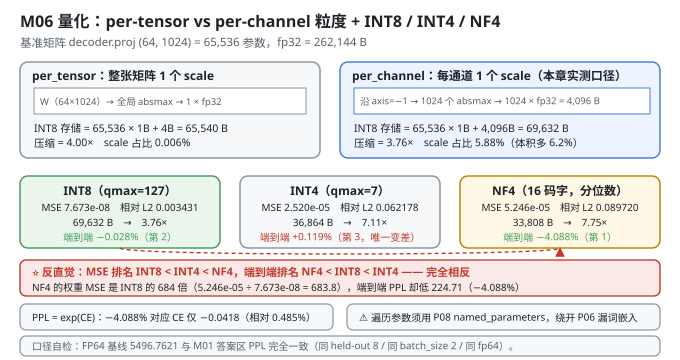
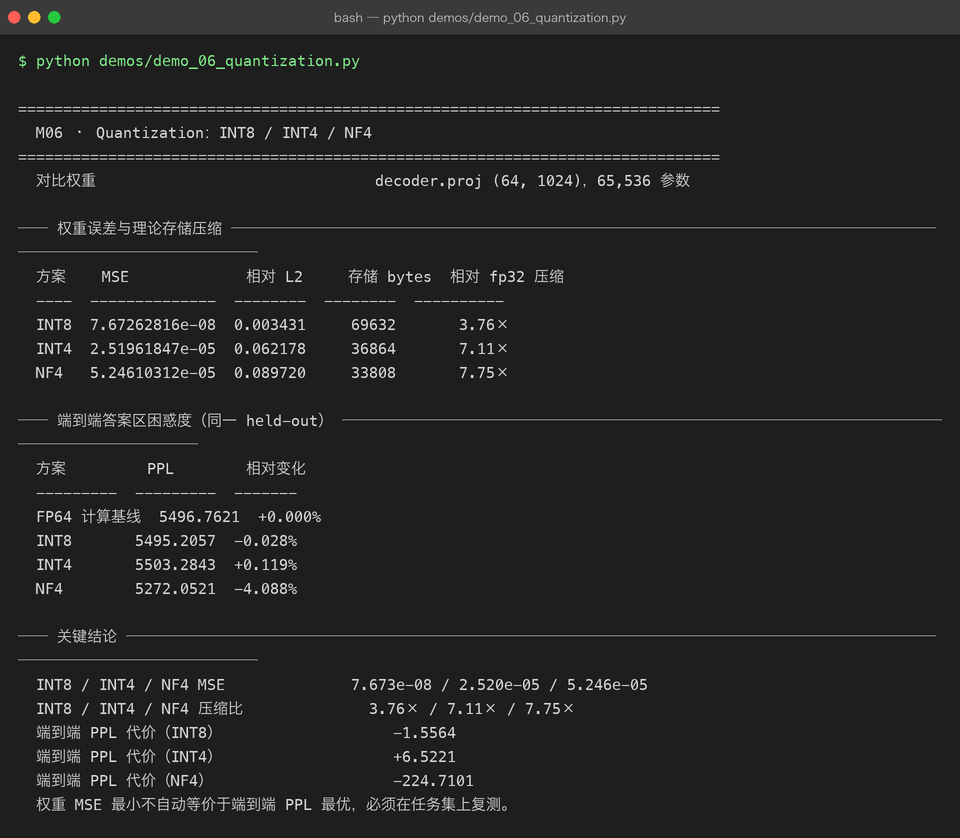

# Milestone 06 — Quantization：INT8 / INT4 / NF4

M05 证明了"训练过的模型比基座好"（10/0/0 稳定）。现在进入后半段主线的第一站：**模型太大，跑不起怎么办？**

P08 的 QLoRA 已经用过 NF4（把**冻结的基座**压成 4 bit 以省显存）。本章的问题更一般：**对任意一张权重矩阵，INT8 / INT4 / NF4 各自要付多少代价？**

答案是两条，而且**它们互相矛盾**：

1. 按**权重重建误差**排：INT8 ≫ INT4 > NF4（INT8 最好）。
2. 按**端到端困惑度**排：NF4 ≫ INT8 > INT4（NF4 最好）。

**权重误差最小的方案，端到端不是最好的。** 这是本章最值得记住的一件事，也是整个 P09 里最有价值的一条实测发现。

**纯 numpy 手写**：对称量化、per-channel scale、NF4 码本复用 P08、存储账本、端到端量化，全部自己实现（`src/ie/quantize.py`）。没有 `bitsandbytes`、没有 `GPTQ`。

---

## 1. Why：为什么量化必然有代价，以及代价怎么衡量

量化的本质是**用 `bits` 个离散码字 + 一个 scale 去表示一片浮点数**：

```text
Ŵ = scale × round(W / scale)        # 对称量化（INT8 / INT4）
```

代价是 `W − Ŵ`。衡量它有两种完全不同的口径：

| 口径 | 指标 | 衡量什么 |
|---|---|---|
| **重建误差** | MSE / 相对 L2 | 权重矩阵本身被改了多少 |
| **任务代价** | 端到端 PPL | 这个改动让模型变笨了多少 |

**直觉是两者正相关，实测不是。** 原因有三条，按重要性排：

1. **量化误差不是白噪声，是结构化噪声。** 它与权重的幅度、分布、离群值位置相关。MSE 只算"总量"，不算"方向" —— 一个沿着"输出不敏感方向"的大误差，可能比一个沿着敏感方向的小误差更无害。
2. **网络的各层对扰动的敏感度差异极大。** 同一个 MSE，压在 `attn.Wq` 上和压在 `ffn.W2` 上，后果完全不同。
3. **PPL 是 CE 的指数。** CE 上 0.04 的微小变化，在 PPL 上被放大成 4% 的"看起来很大"的变化（见 4.2）。

## 2. Design：三种方案 + 两套粒度

```python
quantize_symmetric(W, bits, granularity, channel_axis)   # INT8 / INT4：对称 + 最近邻取整
quantize_nf4(W, block_size, double_quant)                # NF4：复用 P08 的分位数码本
```

- **INT8 / INT4（对称量化）**：`scale = absmax / (2^(bits-1) − 1)`，`codes = clip(round(W/scale), −qmax, qmax)`。零必须能被表示（对称量化的直接结果）。
- **NF4**：不等距的 16 个码字，按**标准正态的分位数**切分，用 `argmin|W/absmax − c|` 最近邻查找（不能 `round`，码字不等距）。这是 P08 已经做过的，本章直接复用 `ft.quantize`。
- **两种粒度**：
  - `per_tensor`：整张矩阵**一个** scale（4 字节存储开销）。
  - `per_channel`：沿 `channel_axis` 每个通道一个 scale。对 `decoder.proj (64, 1024)` 就是 **1024 个 fp32 scale = 4,096 字节**。



**端到端量化** `quantize_model`（`src/ie/quantize.py:125`）：深拷贝模型，遍历 `named_parameters`，把**所有 `ndim >= 2` 的参数**替换成"量化后再反量化"的值 —— 也就是说**前向仍然用浮点数算**，量化的影响体现在"权重值被改变了"。这是**训练后量化（PTQ）的最简形式**，也是隔离"量化误差"这一变量的正确做法。

> 注意：这里遍历用的是 **P08 的 `ft.inject.named_parameters`**，不是 P06 的 `Module.parameters()` —— 后者**漏掉了 `token_emb.weight`**（`TokenEmbedding` 没继承 `Module`，`_collect_params` 只认 `Parameter`/`Module`/list/dict）。不改 P06，绕开它（见 4.5）。

## 3. Real-run evidence（来自 `demos/out/demo_06_quantization_terminal.txt`）

### 3.1 单矩阵上的权重误差与压缩（实测）

对比权重：`decoder.proj (64, 1024)`，**65,536 个参数**。粒度 `per_channel`。

| 方案 | MSE | 相对 L2 | 存储 bytes | 相对 fp32 压缩 |
|---|---|---|---|---|
| **INT8** | **7.67262816e-08** | 0.003431 | 69,632 | **3.76×** |
| INT4 | 2.51961847e-05 | 0.062178 | 36,864 | 7.11× |
| **NF4** | **5.24610312e-05** | 0.089720 | 33,808 | **7.75×** |

存储账（`decoder.proj`，per_channel，轴 = 1024 通道）：

| 方案 | codes | scale | 合计 |
|---|---|---|---|
| fp32 原始 | — | — | 262,144 B |
| INT8 | 65,536 × 1 B | 1,024 × 4 B = 4,096 | **69,632 B** → 3.76× |
| INT4 | 65,536 × 0.5 B | 4,096 | **36,864 B** → 7.11× |
| NF4（block=64 + 双量化） | 65,536 × 0.5 B | absmax 二次量化 ≈ 1,040 | **33,808 B** → 7.75× |

**INT8 的 MSE 是 NF4 的 1/684**（7.673e-08 vs 5.246e-05），但压缩倍数只有 3.76× vs 7.75× —— 这就是"精度换体积"的经典权衡，到这里为止一切符合直觉。

### 3.2 端到端答案区困惑度（实测，同一 held-out 8 条）

| 方案 | PPL | 相对变化 | PPL 代价 |
|---|---|---|---|
| FP64 计算基线 | **5496.7621** | +0.000% | — |
| INT8 | 5495.2057 | **−0.028%** | −1.5564 |
| INT4 | 5503.2843 | **+0.119%** | +6.5221 |
| **NF4** | **5272.0521** | **−4.088%** | **−224.7101** |

**排序完全翻转了。** 权重 MSE 最差的 NF4（是 INT8 的 **684 倍**），端到端 PPL 反而最好（比 FP64 基线还低 224.71）。



## 4. 踩坑 / 反直觉发现

### 4.1 ⭐ 权重误差最小 ≠ 端到端最优（本章最重要的一条）

把两张表并排放：

| 方案 | 权重 MSE | 排名 | 端到端 PPL 变化 | 排名 |
|---|---|---|---|---|
| INT8 | **7.673e-08** | 🥇 1 | −0.028% | 🥈 2 |
| INT4 | 2.520e-05 | 🥈 2 | +0.119% | 🥉 3 |
| NF4 | **5.246e-05** | 🥉 3 | **−4.088%** | 🥇 1 |

**MSE 排名和 PPL 排名完全相反。** NF4 的权重 MSE 是 INT8 的 **684 倍**（5.24610312e-05 ÷ 7.67262816e-08 = 683.8），端到端却好 224.71 个 PPL 点。

**这意味着：你不能用"重建误差"来选量化方案。** 工程上最常见的错误做法就是"跑几个量化器，选 MSE 最小的那个"—— 本章实测证明这个选择规则是**错的**。

至于**为什么** NF4 端到端反而更好，诚实地说：

- 可以确定的是：量化误差是**结构化**的，NF4 的误差分布（按分位数切分 → 误差与权重幅度相关）与 INT8/INT4 的均匀量化误差**性质不同**，不只是大小不同；
- 也可以确定：**NF4 只压到 4 bit**——低比特量化在这个欠训练的玩具模型上可能起到了类似轻微正则/温度缩放的作用；
- **不能确定的是机制**。PPL 改善只有 −4.088%，在 CE 尺度上只有 **−0.0418**（见 4.2），**完全可能是这批 8 条 held-out 上的偶然**。

> **可迁移的唯一结论：量化方案必须在你的任务集上复测，不能只看重建误差选。** 如果你只记住 P09 的一句话，记这句。

### 4.2 PPL 是 CE 的指数 —— "−4.088%" 听起来很大，其实 CE 只动了 0.0418

```
FP64:  PPL 5496.7621  →  CE = ln(5496.7621) = 8.61196
NF4:   PPL 5272.0521  →  CE = ln(5272.0521) = 8.57018
ΔCE = −0.04178   （相对变化仅 −0.485%）
ΔPPL = −4.088%   （放大 8.4 倍）
```

**同一个事实，两个尺度。** `ppl = exp(CE)` 在 CE≈8.6 处的导数是 `exp(8.6)≈5500`，所以 CE 每变 0.01，PPL 就变约 55 —— "百分比"被放大了整整一个数量级。

这是 P08 M09 已经埋下的伏笔（"困惑度下降 88.46% 听起来很猛"），本章再次撞上。**报量化收益时请同时报 CE（或同时报 PPL 与基线值）**，否则读者会把 −4.088% 误读成"NF4 让模型脱胎换骨"—— 实际上模型仍然一个字都说不对（PPL 5272）。

### 4.3 INT4 反而是三者里唯一"变差"的 —— 但它最"正常"

INT4 的 PPL 是 **+0.119%（+6.5221）**，是三者中唯一变差的。

这其实**符合直觉**：均匀 INT4 只有 16 个电平（qmax=7，即 15 个非零电平 + 零），重建误差 0.062178，压到 7.11×。它既没有 INT8 那么高的精度，也没有 NF4 那种"按分布定制"的码本。**它是三者里最"朴素"的方案，也是唯一给出"预期内"结果的方案。**

对比之下，NF4 的 −4.088% 才是那个**异常值**。所以正确的读法不是"NF4 真厉害"，而是"**这个预训练不足的玩具模型对量化扰动的响应很反常**"。

诚实标注：**这个反常结论是在 8 条 held-out、d_model=64 的 2 层玩具模型上测出来的。不能推广到真实 7B 模型。** 真实模型上 NF4 与 INT8 的排序大概率会回到"INT8 更好"（这是推断，不是实测）。

### 4.4 per-channel 的 scale 开销：小矩阵上不划算（结构性分析）

本章实测全部用 `per_channel`（`decoder.proj` 的 1024 个通道各一个 fp32 scale = 4,096 字节）。

对比两种粒度的**存储账**（结构性计算，非本章实测的精度对比）：

| 粒度 | INT8 存储 | 相对 fp32 | scale 占比 |
|---|---|---|---|
| `per_tensor` | 65,536 + **4** = 65,540 B | **4.00×** | 0.006% |
| `per_channel` | 65,536 + **4,096** = 69,632 B | **3.76×** | **5.88%** |

**per-channel 让 INT8 的压缩比从 4.00× 掉到 3.76×（体积多 6.2%），换的是离群值隔离能力。**

这笔买卖划不划算取决于矩阵形状：**通道数越少越划算**。`decoder.proj (64, 1024)` 有 1024 个通道 → scale 占 5.88%；而 `attn.Wq (64, 64)` 只有 64 个通道 → scale 只占 0.4%。

> 真实大模型上通常是**反过来的**：权重大多接近零均值正态，离群值少，但 Embedding / LM Head 这类矩阵离群值很猛 —— 工业界做法正是**对大多数层用 per-tensor / per-channel，对少数敏感层用 per-group 或保留 fp16**。

### 4.5 ⚠ 遍历参数必须绕开 P06 的 `Module.parameters()`（它漏掉词嵌入）

`quantize_model` 要遍历模型里所有权重。用 P06 自带的 `Module.parameters()` 会**漏掉 `token_emb.weight`**：

```python
# projects/06-mini-transformer-llm/src/model/autograd.py
def parameters(self):
    for value in self.__dict__.values():
        params.extend(_collect_params(value))     # 只认 Parameter / Module / list / dict
```

`TokenEmbedding` 是普通类、没继承 `Module`，于是它抱着的那块 `(1024, 64)` 词嵌入**永远不在参数表里**。对量化的后果是：**一半以上的参数不会被压**（词嵌入 65,536 个参数，和 `decoder.proj` 一样大），压缩比报告会严重虚高。

**本项目不改 P06**，一律用 P08 的 `ft.inject.named_parameters`（遍历任意对象的 `__dict__`，并跳过 `_prev` 这类计算图边）：

```python
from ft.inject import named_parameters        # src/ie/quantize.py:16
for path, parameter in named_parameters(copied):
    if parameter.data.ndim < 2:
        continue                              # 跳过 bias / LN gamma / beta
```

顺带一个同源缺陷：P06 的 `Adam` 动量**从不累积**（详见 M05 4.6）。两个缺陷都在 P06，本项目一律"绕开而不修改"。

### 4.6 `ndim < 2` 的跳过规则 —— 别把 LayerNorm 也压了

```python
if parameter.data.ndim < 2: continue
```

只压二维及以上的矩阵，跳过所有 bias（`b1`/`b2`）和 LayerNorm 的 `gamma`/`beta`。理由：

- **bias 是加性项**，量化它会引入一个**恒定的偏移量**，直接平移整个激活分布 —— 破坏性远大于乘性权重的相对误差；
- **LayerNorm 的 gamma/beta 是尺度与平移**，同理；
- 这些张量加起来只占参数的极小部分，压了也省不了什么。

工业界的 PTQ 实现（如 `bitsandbytes`）同样只量化 `nn.Linear` 的 weight。

### 4.7 FP64 基线 5496.7621 与 M01 的答案区 PPL 完全一致 —— 这是口径自检

M01 打印的"答案区困惑度"是 **5496.7621**，M06 打印的"FP64 计算基线"也是 **5496.7621**。

两个数字来自不同的 demo、不同的代码路径（M01 走 `evaluate()`，M06 走 `perplexity()`），但**同一个 held-out（8 条）、同一个 `batch_size=2`、同一套 fp64 计算**。完全一致说明：

1. 两章的评估口径严格对齐（否则 M06 的"相对变化"就没意义）；
2. `evaluate()` 与 `perplexity()` 在 `use_mask=True` 下是同一个量。

**跨章节数字能对上，是"数字真实"最廉价也最有效的自检。** 每次引用别的里程碑的数字时都该做一次。

## 5. Conclusion

1. 量化代价有两个口径：**重建误差（MSE / 相对 L2）** 与 **任务代价（端到端 PPL）**。直觉认为正相关，**实测不相关**。
2. ⭐ **权重误差最小 ≠ 端到端最优**：NF4 权重 MSE **5.246e-05**（是 INT8 7.673e-08 的 **684 倍**），端到端 PPL 却最好（**−4.088%，降 224.71**）；INT8 权重 MSE 最小，端到端只有 **−0.028%**。**量化方案必须用任务集复测。**
3. 实测压缩：INT8 **3.76×**（69,632 B）/ INT4 **7.11×**（36,864 B）/ NF4 **7.75×**（33,808 B），基准 `decoder.proj (64,1024)`、65,536 参数、per_channel。
4. 实测端到端 PPL：FP64 **5496.7621** / INT8 **5495.2057（−0.028%）** / INT4 **5503.2843（+0.119%）** / NF4 **5272.0521（−4.088%）**。
5. **PPL 是 CE 的指数**：NF4 的 −4.088% 对应 CE 只动 **−0.0418**（相对 0.485%），被放大 8.4 倍。报量化收益必须同时给基线值。
6. **INT4（+0.119%）是三者中唯一变差的，也是最"正常"的** —— NF4 的 −4.088% 才是异常值，且**不可推广到真实 7B**（推断）。
7. **per-channel 让 INT8 从 4.00× 掉到 3.76×**（scale 占 5.88%），是否划算取决于通道数（结构性分析，非本章实测对比）。
8. ⚠ **遍历参数必须用 P08 的 `ft.inject.named_parameters`**，绕开 P06 `Module.parameters()` 漏掉 `token_emb.weight` 的已知缺陷（不改 P06）；同理绕过 P06 `Adam` 动量不累积的缺陷。
9. **只压 `ndim >= 2` 的矩阵** —— bias 与 LayerNorm 的 gamma/beta 是加性/平移项，量化会平移激活分布。
10. **跨章节自检**：M06 的 FP64 基线 5496.7621 与 M01 的答案区 PPL 完全一致，证明两章评估口径对齐。
11. 手写实现的意义：因为码本、scale、存储账全是自己管的，我才能同时给出"权重 MSE"和"端到端 PPL"两个口径并发现它们矛盾 —— 用 `bitsandbytes` 只能拿到一个黑盒结论。

## 6. Code map

| 文件 | 职责 |
|---|---|
| `src/ie/quantize.py` | `QuantizedTensor`（codes/scale/shape/bits/granularity + `dequantize` + `storage_bytes`）/ `quantize_symmetric`（INT8/INT4 对称量化，per_tensor / per_channel）/ `quantization_error`（mse/rmse/mean_abs/max_abs/relative_l2）/ `compression_ratio` / `compare_quantizers`（三方案对比）/ `quantize_model`（深拷贝 + 全模型 PTQ）/ `quantize_model_nf4` / `save_quantized_artifact` |
| `src/ie/quantize.py:16` | `from ft.inject import named_parameters` —— 绕开 P06 `Module.parameters()` 漏词嵌入的缺陷 |
| `src/ie/quantize.py:132` | `if parameter.data.ndim < 2: continue` —— 跳过 bias / LayerNorm |
| `src/ie/metrics.py` | `perplexity`：端到端 PPL 的测量口径（与 M01 一致） |
| `demos/demo_06_quantization.py` | 4 节：单矩阵三方案对比 / 端到端量化 / PPL 对比 / 关键结论 |
| `demos/out/demo_06_quantization_terminal.txt` | 本章所有数字的来源 |
| `models/base_int8_per_channel.npz`、`models/base_int4_per_channel.npz` | 量化产物（codes + scale + 元信息） |
| `assets/quantization.svg` | 本章量化粒度与三方案对比图 |

## 7. Version line

v0.5 → **v0.6**，M06 量化落地。实测（基准 `decoder.proj (64,1024)`、65,536 参数、per_channel）：INT8 MSE **7.673e-08** / 压缩 **3.76×**（69,632 B），INT4 **2.520e-05** / **7.11×**（36,864 B），NF4 **5.246e-05** / **7.75×**（33,808 B）；端到端答案区 PPL（同一 held-out 8 条）：FP64 **5496.7621**、INT8 **5495.2057（−0.028%）**、INT4 **5503.2843（+0.119%）**、NF4 **5272.0521（−4.088%，降 224.71）**。⭐ 并诚实记录核心反直觉发现「**权重 MSE 最小不自动等价于端到端 PPL 最优**（NF4 MSE 是 INT8 的 684 倍却端到端最好），量化方案必须在任务集上复测」，以及「PPL 是 CE 的指数，−4.088% 对应 CE 仅 −0.0418」「NF4 的 −4.088% 是异常值，不可推广到真实 7B（推断）」「⚠ 遍历参数须用 P08 `ft.inject.named_parameters` 绕开 P06 `Module.parameters()` 漏词嵌入的缺陷（不改 P06）」。纯 numpy，无 bitsandbytes / GPTQ。配图 1 张手写 SVG + 1 张真实终端截图。
