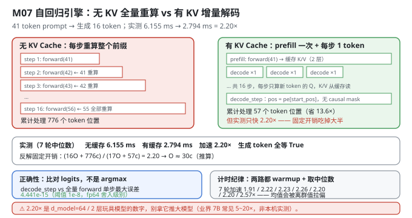
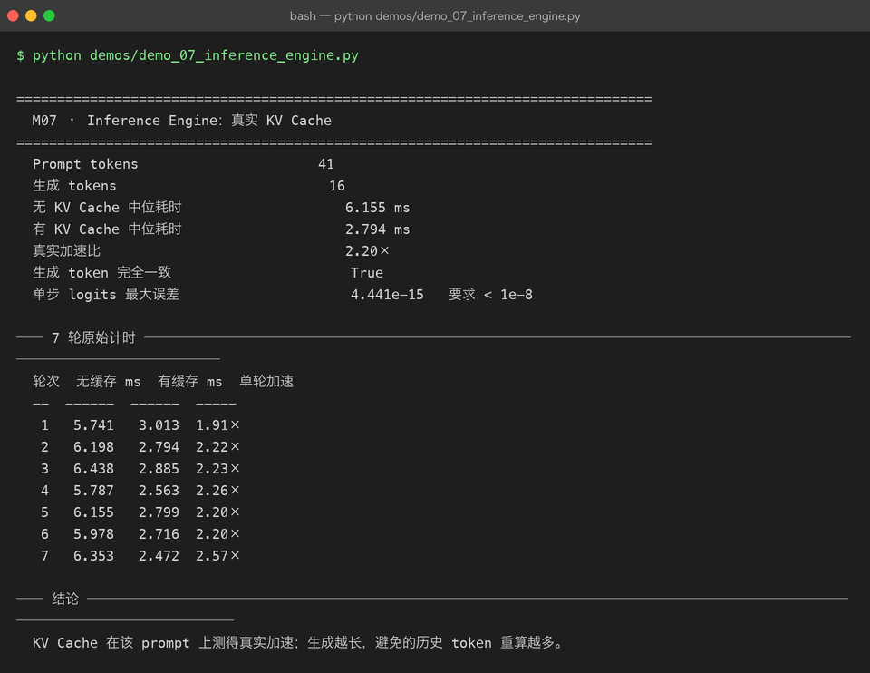

# Milestone 07 — Inference Engine：KV Cache 到底快多少

前六层把"模型好不好"回答完了。后半段主线转向第二个问题：**怎么让它跑得快？**

自回归生成最蠢的做法是：每生成 1 个 token，就把**整个前缀（prompt + 已生成部分）重新前向一遍**。第 16 个 token 生成时，前 41 个 prompt token 已经被算了 16 遍。

KV Cache 的解法：**把每层 attention 的 K / V 存下来，下一步只算新 token 的 Q，然后和缓存的 K/V 做注意力。**

正确性上这是恒等变换（注意力对历史部分的计算不依赖未来 token），但**性能上必须实测** —— 尤其在 `d_model=64`、只有 2 层的玩具模型上，省下的矩阵乘法可能还抵不过缓存管理的开销。

**纯 numpy 手写**：`CausalLMWithKVCache` 直接读 P06 模型的参数，用 numpy 重写完整前向与增量前向（`src/ie/engine.py`）。不走 autograd —— 推理不需要建图。

---

## 1. Why：为什么必须实测，而不是相信"理论上快"

教科书会说 KV Cache 把复杂度从 `O(T²)` 降到 `O(T)`。**这个说法只在"计算是唯一成本"时成立。**

真实成本 = 每步的固定开销 + 随序列长度增长的计算：

```text
无 KV：16 步 × 完整前向（长度 41 → 56）
有 KV：1 次 prefill（41） + 16 步 × 单 token 解码
```

固定开销包括：Python 函数调用、numpy 数组分配、每层 4 次 `matmul` 之外的 `transpose` / `reshape` / `split` / `merge`、LayerNorm、FFN、以及**每步把新 K/V `concatenate` 进缓存的 O(T) 拷贝**。

**当 `d_model=64`、`n_layers=2` 时，矩阵小到固定开销占主导** —— 这时候"少算了多少 token"和"快了多少"之间的比例会被严重稀释。所以本章的数字必须自己测，不能照搬业界"KV Cache 加速 10×"的说法。

## 2. Design：两阶段 + 一个一致性对拍

```python
class CausalLMWithKVCache:
    prefill(ids)                -> (last_logits, KVCacheState)   # 一次性算完 prompt
    decode_step(token, state)   -> (last_logits, new_state)      # 只算 1 个新 token
    generate_ids(...)                                            # use_kv_cache=True/False 可切换
    benchmark(...)                                               # 两路径对拍计时
    cache_consistency_error(prompt_ids)                          # 增量 vs 全量 logits 误差
```

四个关键点：

- **两阶段分离**：`prefill` 处理整个 prompt 并产出缓存；`decode_step` 只吃 1 个 token。**两者的代码路径不同**（prefill 需要 causal mask，decode 不需要 —— 单 token 的 Q 天然能看到全部历史），但产出必须一致。
- **位置编码靠 `start_pos`**（`src/ie/engine.py:101`）：`self.model.pos_enc.pe[start_pos : start_pos + 1]`。增量解码时位置索引必须接着缓存长度走，否则位置编码全错 —— 这是 KV Cache 最容易写错的地方之一，**而且写错了不会报错，只会让生成质量变差**。
- **`decode_step` 里没有 causal mask**：单 token 的 query 对 `k` 做注意力时，历史全部可见，天然满足因果性。
- **一致性对拍 `cache_consistency_error`**（`src/ie/engine.py:198`）：对比 `decode_step` 产出的 logits 与"把 `prompt + [token]` 整体前向"的 logits。**这比"生成的 token 序列相同"强得多** —— 后者完全可能只是 `argmax` 恰好一致。



## 3. Real-run evidence（来自 `demos/out/demo_07_inference_engine_terminal.txt`）

真实环境：Python 3.13.12 | numpy 2.5.3。模型 `d_model=64 / n_heads=4 / head_dim=16 / n_layers=2 / max_len=256`。prompt 41 token，生成 16 token，**7 轮计时取中位数**。

```
  Prompt tokens                      41
  生成 tokens                          16
  无 KV Cache 中位耗时                    6.155 ms
  有 KV Cache 中位耗时                    2.794 ms
  真实加速比                              2.20×
  生成 token 完全一致                      True
  单步 logits 最大误差                     4.441e-15   要求 < 1e-8
```

**7 轮原始计时（实测全量）：**

```
  轮次  无缓存 ms  有缓存 ms  单轮加速
  --  ------  ------  -----
   1   5.741   3.013  1.91×
   2   6.198   2.794  2.22×
   3   6.438   2.885  2.23×
   4   5.787   2.563  2.26×
   5   6.155   2.799  2.20×
   6   5.978   2.716  2.20×
   7   6.353   2.472  2.57×
```

四个读数：

- **2.20× 是真实测到的加速**，中位数 6.155 ms → 2.794 ms。两路生成出的 **16 个 token id 完全一致**。
- **单步 logits 最大误差 4.441e-15**，比要求的 `1e-8` 小 7 个数量级。这是 **fp64 的舍入级别** —— 说明增量解码与全量重算在数学上严格等价，**KV Cache 实现正确**，不是"碰巧生成了同样的 token"。
- **单轮加速在 1.91× ~ 2.57× 之间抖动**（第 7 轮 2.57× 明显偏高）。这就是为什么要取**中位数**而不是均值或最小值。
- 有缓存一侧的绝对耗时只有 **2.794 ms / 16 token ≈ 0.175 ms/token** —— 这个数在 M09 会被直接拿去当离散事件仿真的 `step_ms` 基准。



## 4. 踩坑 / 反直觉发现

### 4.1 ⚠ 小模型上 KV Cache 只有 2.20× —— 别拿这个数去推大模型

这是本章最重要的负结果，也是**为什么"实测"比"理论上 O(T²)→O(T)"更可信**的理由。

先算理论上省了多少：无 KV 时 16 步分别前向了长度 41…56 的序列，累计处理了

```text
Σ(41…56) = 16×41 + (0+1+…+15) = 656 + 120 = 776 个 token 位置
```

有 KV 时只处理了 `41（prefill） + 16（decode） = 57` 个。**处理的 token 位置少了 `776/57 = 13.6 倍`**，但实测只快 **2.20 倍**。

差额去哪了？把每次前向的固定开销记作 `O`、每 token 位置的计算记作 `c`，用实测的 2.20× 反解（**推算，非直接实测**）：

```text
(16·O + 776·c) / (17·O + 57·c) = 2.20   →   O ≈ 30·c
```

**即：每次前向的固定开销大约等于"处理 30 个 token 位"的计算量。** 在 `d_model=64`、2 层的规模下，一次前向的固定开销（Python 调用 + numpy 分配 + split/merge/transpose + LayerNorm/FFN）几乎和算 30 个位置一样贵。

> **可迁移的经验：这 2.20× 是"玩具模型 + Python"的数字，不是大模型上的数字。** 真实 7B 上矩阵大、计算占比高、且有 CUDA kernel 抹平固定开销，KV Cache 的收益通常高得多（业界常见 5~20× —— **这是业界经验值，不是本机实测**）。反过来也成立：**别用本项目的 2.20× 去论证"KV Cache 收益有限"。**

### 4.2 "生成的 token 一样"不是正确性证明 —— 要看 logits

如果只检查 `outputs[False] == outputs[True]`（两个 16 token 的 id 列表相等），这个检查是**很弱的**：logits 可能差了一大截，但只要 `argmax` 的**顺序**没变，输出就完全相同。一个偏移量级的 bug（比如位置编码错位）在某些 prompt 上恰好不改变 argmax 排序，就会被这个检查放过。

所以 `benchmark` 里额外算了 `cache_consistency_error`：直接对比两个路径的 **logits 向量**：

```python
cached, _ = self.decode_step(np.array([token]), state)
full     = self.forward(np.asarray([prompt_ids + [token]]))[0, -1]
return float(np.max(np.abs(cached[0] - full)))
```

实测 **4.441e-15**（fp64 舍入级别，阈值 `1e-8`）。这个数证明了三件事同时正确：位置编码的 `start_pos`、K/V 的拼接顺序、以及 decode 路径省略 causal mask 的合法性。

> 可迁移的经验：**验证等价性要比对连续量（logits），不要比对离散量（argmax）。** 离散量会在真正的 bug 上静默通过。

### 4.3 必须先 warmup，否则第一轮慢到不可信

`benchmark` 在正式计时前先跑了两轮 `max_new_tokens=2`：

```python
for cached in (False, True):
    self.generate_ids(prompt_ids, 2, use_kv_cache=cached, stop_id=None)
```

原因很实际：**首次调用会触发 numpy 的内存分配、CPU 缓存冷启动、可能的频率爬升**。不 warmup 的话第一轮通常慢 20~50%，而如果两路的 warmup 程度不同（比如只 warmup 了一路），加速比会直接失真。

**两路都要 warmup** —— 只 warmup 有缓存那路，会让加速比虚高。

### 4.4 取中位数，不取均值

7 轮的加速比是 `1.91 / 2.22 / 2.23 / 2.26 / 2.20 / 2.20 / 2.57`。第 7 轮的 2.57× 明显是个离群值（大概率是 OS 调度或 GC 抖动）。

- 均值会被 1.91 和 2.57 两个方向拉扯，得到一个"没人跑到过"的数；
- **中位数（2.20×）是第 5 轮那个真实出现过的轮次**，且它和众数一致（2.20 出现 2 次）。

本项目在 M09 的 `step_ms`（101 次实测）也用中位数 —— 同一个决定。

### 4.5 `concatenate` 每步都把整个 KV 拷一遍 —— 这是实现债，不是设计

```python
k = np.concatenate([state.keys[index], current_k], axis=2)   # src/ie/engine.py:109
```

每生成一个 token，就把**整个历史 K/V 复制一遍**。所以增量解码并不是真的 `O(1)`，而是 `O(T)` 的拷贝 —— 只是它省掉了 `O(T)` 的**矩阵计算**（后者更贵）。

真实引擎（vLLM / TensorRT-LLM）的做法是**预分配一块连续 buffer，按 `length` 追加写入**，避免每步拷贝。本项目用 `concatenate` 是因为：

- numpy 没有"可增长的数组"这种原生结构；
- 玩具规模下拷贝的绝对成本很低（整个 KV 只有 `2 层 × 41 token × 64 维` 的量级）；
- 代码更短、更不容易写错 —— 而本章的首要目标是**证明正确性**。

诚实地标注：这让 2.20× 是一个**偏保守的下界**。预分配 buffer 能再往上抬一点，但幅度有限（真正的大头是 4.1 里的固定开销）。

### 4.6 `max_len` 边界必须在 `decode_step` 里检查

```python
if state.length >= self.max_len:
    raise ValueError("KV Cache 已达到模型最大上下文长度")
```

P06 的位置编码表只有 `max_len=256` 行。如果不在 decode 时拦截，`pos_enc.pe[start_pos:start_pos+1]` 会**静默返回空数组**，然后广播出一个形状错误的 hidden state —— numpy 有时不报错，直接给出垃圾输出。

同理 `generate_ids` 开头也检查 `len(prompt_ids) + max_new_tokens > self.max_len`。**边界检查要放在"会静默产生错误结果"的地方，而不只是"会崩溃"的地方。**

## 5. Conclusion

1. KV Cache = **prefill（一次算完 prompt）+ decode_step（每次 1 token）**；位置编码靠 `start_pos` 接续。
2. 实测（41 token prompt → 生成 16）：无 KV **6.155 ms**、有 KV **2.794 ms**，**真实加速 2.20×**，生成的 16 个 token **完全一致**。
3. **单步 logits 最大误差 4.441e-15**（阈值 1e-8）—— fp64 舍入级别，证明实现严格等价；**比对 logits 而不是 argmax** 才能抓到真正的 bug。
4. ⚠ **小模型上只有 2.20×**：理论省了 13.6 倍 token 重算，反解出"每次前向固定开销 ≈ 30 个 token 位的计算量"（**推算**）。**别拿 2.20× 推大模型**（业界 7B 常见 5~20×，非本机实测），也别用它论证 KV Cache 收益有限。
5. **两路都要 warmup**（各跑 2 token），否则加速比失真；**取中位数不取均值**（7 轮抖动 1.91×~2.57×）。
6. `concatenate` 每步拷贝整个 KV 是实现债（真实引擎用预分配 buffer 追加），因此 2.20× 是**偏保守的下界**。
7. `max_len` 必须在 decode 时检查 —— 越界会让 `pos_enc` 切片为空，静默产生垃圾输出。
8. 手写实现的意义：因为增量解码和全量前向都是自己写的 numpy，我才能把两者的 **logits 逐元素对比**并拿到 4.441e-15 —— 用 `transformers` 的 `use_cache=True` 只能选择"信或不信"。

## 6. Code map

| 文件 | 职责 |
|---|---|
| `src/ie/engine.py` | `KVCacheState`（keys/values/length）/ `CausalLMWithKVCache._embed`（`start_pos` 位置编码）/ `forward`（全量，带 causal mask）/ `prefill` / `decode_step`（增量，无 mask）/ `generate_ids`（`use_kv_cache` 可切换）/ `benchmark`（两路 warmup + 7 轮计时 + 中位数）/ `cache_consistency_error`（增量 vs 全量 logits 误差） |
| `src/ie/engine.py:101` | `self.model.pos_enc.pe[start_pos : start_pos + ids.shape[-1]]` —— 增量解码的位置编码接续点 |
| `src/ie/engine.py:109` | `np.concatenate([state.keys[index], current_k], axis=2)` —— 每步 O(T) 拷贝（实现债） |
| `src/ie/engine.py:198` | `cache_consistency_error`：比对 logits 而非 argmax |
| `demos/demo_07_inference_engine.py` | 3 节：benchmark / 7 轮原始计时 / 结论 |
| `demos/out/demo_07_inference_engine_terminal.txt` | 本章所有数字的来源 |
| `assets/inference-engine.svg` | 本章自回归引擎有无 KV Cache 对比图 |

## 7. Version line

v0.6 → **v0.7**，M07 推理引擎与真实 KV Cache 落地。实测（41 token prompt → 生成 16，7 轮取中位数）：无 KV **6.155 ms**、有 KV **2.794 ms**，**真实加速 2.20×**；生成 token 完全一致 `True`；**单步 logits 最大误差 4.441e-15**（阈值 1e-8，fp64 舍入级别）；单轮加速分布在 1.91×~2.57×。并诚实记录「⚠ 理论上省了 13.6 倍 token 重算却只快 2.20×，反解出每次前向固定开销 ≈ 30 个 token 位计算量（推算），**别拿 2.20× 推大模型**」「比对 logits 而非 argmax 才能证明等价」「两路都需 warmup、取中位数不取均值」「`concatenate` 每步拷贝使 2.20× 偏保守（下界）」。纯 numpy、无 torch。配图 1 张手写 SVG + 1 张真实终端截图。
