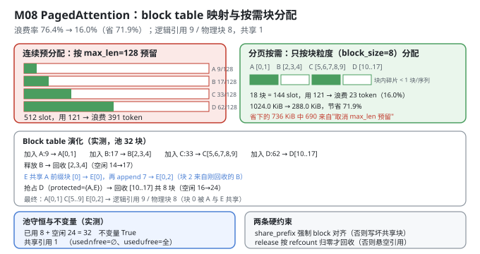
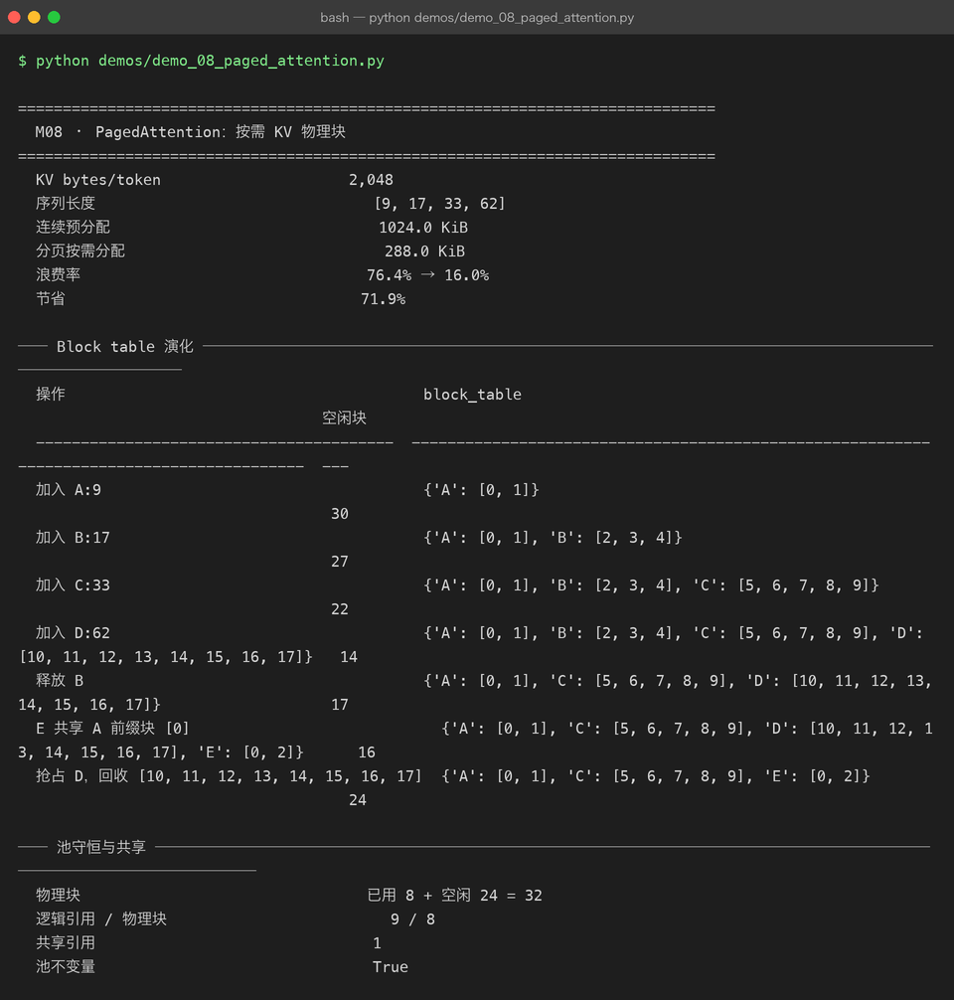

# Milestone 08 — PagedAttention：按需分配 KV 物理块

M07 证明了 KV Cache 能省掉重复计算（实测 2.20×）。但 KV Cache 引入了一个新问题：**它要占显存，而且占多少事先不知道。**

朴素做法是"按 `max_seq_len` 给每条序列预留一整块连续显存"。这个做法有三种浪费：

| 浪费类型 | 具体表现 | 后果 |
|---|---|---|
| **内部碎片** | 序列实际长 9，却预留了 128 | 每条序列浪费 `(max_len − 实际长度)` |
| **预留浪费** | 到底会生成多长，请求进来时不知道 | 只能按最坏情况预留 |
| **无法共享** | 两条序列有相同前缀（system prompt、few-shot），各存一份 | 前缀重复存储 |

PagedAttention 的解法来自操作系统：**把 KV Cache 切成固定大小的物理块（block），用一张 block table 把"逻辑第 i 块"映射到"某个物理块"，按需分配。**

**纯 numpy 手写**：块池、block table、引用计数、前缀共享、抢占、不变量检查，全部自己实现（`src/ie/paged.py`）。不引入 vLLM。

---

## 1. Why：为什么"分页"能同时解决三件事

**内部碎片**：浪费从"预留长度 − 实际长度"降到"块大小 − (实际长度 mod 块大小)"，**上限是 1 个块**。

**预留浪费**：不需要预留 —— 生成一个 token 就申请一个 slot，块满了再申请下一个块。显存占用**随实际生成长度线性增长**，而不是按最坏情况一次性占满。

**前缀共享**：两条序列的相同前缀可以**指向同一个物理块**，靠**引用计数（refcount）**管理生命周期。这是连续分配根本做不到的 —— 连续内存里两个序列的前缀必须在两个不同的地址。共享带来的收益在多轮对话、长 system prompt、beam search 场景下极其可观。

**代价**要说清楚：注意力 kernel 不能再假设 K/V 是连续的，必须按 block table 做** gather**。这是 PagedAttention 唯一的性能代价，也是为什么真实实现需要专门的 CUDA kernel。

## 2. Design：块池 + block table + refcount

```python
class PagedKVCache:
    blocks       # (num_blocks, block_size, token_bytes) 物理块池
    free_blocks  # 空闲块号列表
    block_table  # request_id -> [物理块号, ...]   逻辑块 i → 物理块
    lengths      # request_id -> 已存 token 数
    refcounts    # 每个物理块被多少个请求引用
```

核心操作：

| 操作 | 行为 |
|---|---|
| `append(id, n)` | 按需取块，写入 token 位；`physical = table[logical]`，`offset = pos % block_size` |
| `share_prefix(src, tgt, n)` | 复制 src 的前 `n/block_size` 个块号，`refcounts[block] += 1` |
| `release(id)` | 逐块 `refcounts -= 1`，归 0 才真正回池（并 `fill(0)` 清零） |
| `preempt(protected)` | 选"块数最多、长度最长"的请求释放，回收它的块 |
| `check_invariants()` | 五条池不变量（见 4.4） |

地址换算就是两个除法 —— 这是整个设计的精髓：

```python
logical, offset = divmod(token_position, block_size)
physical = block_table[request_id][logical]
# 真实数据在 blocks[physical, offset]
```



## 3. Real-run evidence（来自 `demos/out/demo_08_paged_attention_terminal.txt`）

配置：`KV bytes/token = 2,048`（`2 × layers=2 × heads=4 × head_dim=16 × dtype_bytes=8`），`num_blocks=32`，`block_size=8`，`max_seq_len=128`，四条序列长度 `[9, 17, 33, 62]`。

### 3.1 显存账（实测）

```
  KV bytes/token                     2,048
  序列长度                               [9, 17, 33, 62]
  连续预分配                              1024.0 KiB
  分页按需分配                             288.0 KiB
  浪费率                                76.4% → 16.0%
  节省                                 71.9%
```

拆解（按公式还原）：

| 口径 | 计算 | 结果 |
|---|---|---|
| 有效 token | `9+17+33+62 = 121` × 2,048 B | 242 KiB |
| 连续预分配 | `4 × 128` × 2,048 B | **1,024 KiB**（浪费 782 KiB，**76.4%**） |
| 分页按需 | `(2+3+5+8) 块 × 8` × 2,048 B | **288 KiB**（浪费 46 KiB，**16.0%**） |
| 节省 | `1 − 288/1024` | **71.9%** |

分页后剩余的 46 KiB 浪费，全部来自"每条序列最后一块没填满"：`A` 用 9/16、`B` 17/24、`C` 33/40、`D` 62/64 —— **合计 23 个空 slot，正是 PagedAttention 理论上限"每条序列浪费 < 1 块 × 序列数"的体现**。

### 3.2 Block table 演化（实测全量）

```
  操作                                        block_table                                                                                 空闲块
  ----------------------------------------  ------------------------------------------------------------------------------------------  ---
  加入 A:9                                    {'A': [0, 1]}                                                                                30
  加入 B:17                                   {'A': [0, 1], 'B': [2, 3, 4]}                                                                27
  加入 C:33                                   {'A': [0, 1], 'B': [2, 3, 4], 'C': [5, 6, 7, 8, 9]}                                          22
  加入 D:62                                   {'A': [0, 1], 'B': [2, 3, 4], 'C': [5, 6, 7, 8, 9], 'D': [10, 11, 12, 13, 14, 15, 16, 17]}   14
  释放 B                                      {'A': [0, 1], 'C': [5, 6, 7, 8, 9], 'D': [10, 11, 12, 13, 14, 15, 16, 17]}                   17
  E 共享 A 前缀块 [0]                            {'A': [0, 1], 'C': [5, 6, 7, 8, 9], 'D': [10, 11, 12, 13, 14, 15, 16, 17], 'E': [0, 2]}      16
  抢占 D，回收 [10, 11, 12, 13, 14, 15, 16, 17]  {'A': [0, 1], 'C': [5, 6, 7, 8, 9], 'E': [0, 2]}                                             24
```

**逐行发生了什么：**

- `A:9` → `ceil(9/8) = 2` 块；`B:17` → 3 块；`C:33` → 5 块；`D:62` → 8 块。空闲从 32 一路降到 14。
- **释放 B**：`[2,3,4]` 回到池里，空闲 14 → 17。
- **`E` 共享 `A` 的前缀块 `[0]`**（`A` 的前 8 个 token），然后 `append(E, 7)` → `E` 长度 15 → 需要 2 块，还差 1 块，从池里取到刚回收的 **块 2** → `E: [0, 2]`。**块 0 被 `A` 和 `E` 同时引用，物理上只存了一份。**
- **抢占 `D`**（`protected={"A","E"}`）：候选是 `C` 和 `D`，`D` 占 8 块最多 → 被选中，回收 `[10..17]` 共 8 块，空闲 16 → 24。

### 3.3 池守恒与共享（实测）

```
  物理块                                已用 8 + 空闲 24 = 32
  逻辑引用 / 物理块                         9 / 8
  共享引用                               1
  池不变量                               True
```

- **已用 8 + 空闲 24 = 32**：池完全守恒，没有块丢失也没有块重复。
- **逻辑引用 9 / 物理块 8**：`A` 2 + `C` 5 + `E` 2 = 9 条逻辑引用，指向 8 个不同物理块 `{0,1,2,5,6,7,8,9}` —— **多出来的那 1 条就是块 0 的共享引用**。这一行是"前缀共享真的生效了"的直接证据。
- **池不变量 `True`**：五条断言全过（见 4.4）。



## 4. 踩坑 / 反直觉发现

### 4.1 ⚠ 这是块级账本，不是真实 GPU 显存分配

必须诚实标注：

- `blocks` 是一个 `np.zeros((32, 8, 2048), dtype=np.uint8)` 的**占位数组**（约 512 KiB），`append` 只往 `blocks[physical, offset, 0]` 写一个 `position % 256` 的标记字节。**它记录"这个 slot 归谁"，不存真正的 K/V 张量。**
- 因此 `2048 B/token` 是**按架构公式算出来的**（`2 × 2 × 4 × 16 × 8`），不是本机实测的显存占用。
- 同理，M08 的 `dtype_bytes=8`（fp64，与 P06 模型的 dtype 一致），而 **M10 算 7B 时用的是 `dtype_bytes=2`（BF16）** —— 两章 dtype 不同，**不可直接对比**。

所以本章的结论应读作："**块分配策略**把浪费率从 76.4% 压到 16.0%，节省 71.9%"。这个结论对策略本身成立；**具体 KiB 数字是本例参数下的账本结果，不是 7B 上的实测。**

### 4.2 `share_prefix` 强制要求前缀按完整 block 对齐 —— 这是安全约束不是偷懒

```python
if prefix_tokens % block_size:
    raise ValueError("为避免写时复制歧义，共享前缀必须按完整 block 对齐")
```

原因：如果共享了"半个块"，那么 `E` 往这个块的第 5~8 个 slot 写入自己的 token 时，会**直接改到 `A` 的数据** —— 因为它们是同一块物理内存。

真实 vLLM 的处理是 **copy-on-write**：共享块被写入时先复制一份再改。本项目选择**直接拒绝未对齐的共享**，理由：

- 演示的目标是"把共享与引用计数的机制讲清楚"，CoW 会引入大量分支；
- 拒绝比"静默写坏"安全得多 —— 这是一个**会静默产生错误结果**的操作（和 M07 的 `max_len` 越界同类）。

> 可迁移的经验：**当"部分共享"的正确实现复杂时，先做成显式拒绝。** 报错比给错答案好。

### 4.3 `release` 必须按 refcount 归零才真回收 —— 否则共享会变成悬空引用

```python
for block in self.block_table.pop(request_id):
    self.refcounts[block] -= 1
    if self.refcounts[block] == 0:      # 只有没人引用了才回池
        self.blocks[block].fill(0)
        released.append(block)
        self.free_blocks.append(block)
```

如果 `release(A)` 不看 refcount 就把块 0 塞回空闲列表，那么 `E` 的 block table 里还写着 `[0, 2]`，而块 0 可能已经被分配给别的请求 —— **悬空引用 + 数据错乱**，且不会报错。

实测印证：`preempt` 时 `protected={"A", "E"}` 把 `A` 保护起来，正是因为 `E` 共享着 `A` 的块 0。**释放共享者之前必须先释放（或保护）被共享者** —— 这个顺序约束是 refcount 机制绕不开的。

### 4.4 `check_invariants` 的五条断言 —— 池记账必须有自检

```python
return (
    not (used & free)                              # ① 一个块不能同时是"已用"和"空闲"
    and used | free == set(range(self.num_blocks)) # ② 已用 ∪ 空闲 = 全部块（没有丢失）
    and used == tables                             # ③ 已用集合 == 所有 block_table 引用的块
    and len(self.free_blocks) == len(free)         # ④ 空闲列表无重复
    and np.all(self.refcounts >= 0)                # ⑤ refcount 不为负
)
```

实测全部通过（`True`）。第 ② 条最重要：**它保证"块池守恒"**，也就是终端里那行"已用 8 + 空闲 24 = 32"。

这类自检在分配器代码里是**必需品**。块泄漏（分配了没释放）和块重复释放（同一块进了两次空闲列表）都不会立刻崩溃，只会在几百个请求之后表现为"显存不足"或"数据错乱"—— 到那时已经无法定位。

### 4.5 `block_size` 是个真实的权衡（按同一公式推算）

本章用 `block_size=8`，vLLM 默认 16。用同一批序列长度 `[9, 17, 33, 62]` 推算：

| block_size | 分配 slot | 内部碎片 | block table 条目数 |
|---|---|---|---|
| **8** | 144 | 23 token（**16.0%**） | 18 |
| 16 | 160 | 39 token（24.4%） | 10 |

**块越小越省显存，但 block table 越长**（调度和 kernel launch 的开销越大）。

本例选 8 有两个原因：一是让碎片对比更明显（16.0% vs 76.4%），二是池只有 32 个块，块号要在终端里看得清。

> 注意：**这张对比表是按公式推算的，不是本章 demo 的实测输出**（demo 只跑了 `block_size=8`）。

### 4.6 分页省下的 71.9% 里，绝大部分是"不再按 max_len 预留"

拆开看：连续预分配浪费 782 KiB，分页浪费 46 KiB，**省下的 736 KiB 里只有 46 KiB 是"块内碎片"的改善，其余 690 KiB 全部来自"不再按 `max_seq_len=128` 预留"**。

也就是说：**PagedAttention 最大的收益不是"分块"这个动作本身，而是"按需分配"这个语义。** 分块只是让按需分配在注意力 kernel 里可行的手段。

这条很容易被讲反。如果只把 `max_seq_len` 从 128 调小到 64，连续预分配也能省一半 —— 但那样就得拒绝所有超过 64 的请求，而分页不需要做这个妥协。

## 5. Conclusion

1. PagedAttention = **固定大小物理块 + block table 映射 + 按需分配**，地址换算就是 `divmod(pos, block_size)`。
2. 实测（4 条序列 `[9,17,33,62]`、`max_len=128`、`block=8`、2,048 B/token）：连续预分配 **1024.0 KiB**（浪费 **76.4%**）→ 分页 **288.0 KiB**（浪费 **16.0%**），**节省 71.9%**。
3. 分页后剩余的 16.0% 浪费**全部来自"每条序列最后一块没填满"**（23 个空 slot），正是理论上限"每条 < 1 块"的体现。
4. **前缀共享实测生效**：`E` 共享 `A` 的块 0 → 逻辑引用 **9** / 物理块 **8**，**共享引用 1**。
5. **池守恒**：已用 **8** + 空闲 **24** = **32**；五条不变量全部 `True`。
6. ⚠ **诚实标注：这是块级账本，不是真实 GPU 分配** —— `blocks` 是 `uint8` 占位数组，2,048 B/token 按公式算出；且本章 `dtype_bytes=8`（fp64）与 M10 的 BF16（2）**不可直接对比**。
7. `share_prefix` **强制 block 对齐**（避免写坏共享块；真实实现用 CoW）；`release` **按 refcount 归零才回收**（否则悬空引用）；`preempt` 必须 `protected` 住被共享者。
8. **分页最大的收益是"按需分配"语义，不是"分块"动作本身**（省下的 736 KiB 里 690 KiB 来自取消 `max_len` 预留）。
9. 手写实现的意义：因为块池、refcount、不变量都是自己的代码，我能把"共享到底省了几块"打印成一个数字（`逻辑引用 9 / 物理块 8`）—— 用 vLLM 只能看到 `GPU blocks: 32` 这类聚合指标。

## 6. Code map

| 文件 | 职责 |
|---|---|
| `src/ie/paged.py` | `PagedKVCache`：`allocate` / `_take_blocks` / `append`（按需取块 + token 位写入）/ `share_prefix`（refcount++，**强制 block 对齐**）/ `release`（refcount--，归零才回池并清零）/ `preempt`（选块数最多者，`protected` 保护被共享者）/ `physical_block`（`divmod` 地址换算）/ `stats`（用量与碎片率）/ `check_invariants`（五条池不变量） |
| `src/ie/paged.py:66` | `if prefix_tokens % block_size: raise ValueError(...)` —— 未对齐共享显式拒绝 |
| `src/ie/paged.py:81` | `if self.refcounts[block] == 0:` —— refcount 归零才真正回收 |
| `src/ie/paged.py:143` | `memory_comparison`：连续 vs 分页的浪费率与节省率 |
| `demos/demo_08_paged_attention.py` | 3 节：显存账对比 / block table 演化 / 池守恒与共享 |
| `demos/out/demo_08_paged_attention_terminal.txt` | 本章所有数字的来源 |
| `assets/paged-attention.svg` | 本章 block table 与块分配图 |

## 7. Version line

v0.7 → **v0.8**，M08 PagedAttention 落地。实测（4 条序列 `[9,17,33,62]`、`max_len=128`、`block_size=8`、池 32 块、2,048 B/token）：连续预分配 **1024.0 KiB**（浪费 **76.4%**）vs 分页 **288.0 KiB**（浪费 **16.0%**），**节省 71.9%**；block table 完整演化（A:9→[0,1]、B:17→[2,3,4]、C:33→[5..9]、D:62→[10..17]、释放 B 回收 3 块、**E 共享 A 前缀块 [0]** 后为 [0,2]、抢占 D 回收 8 块）；**池守恒 已用 8 + 空闲 24 = 32**，**逻辑引用 9 / 物理块 8，共享引用 1**，五条不变量 `True`。并诚实记录「⚠ 块级账本非真实 GPU 分配，`blocks` 为 `uint8` 占位、2,048 B/token 按公式算出；本章 `dtype_bytes=8`（fp64）与 M10 的 BF16 不可直接对比」「分页最大收益是按需分配语义而非分块动作（736 KiB 中 690 KiB 来自取消 max_len 预留）」「`share_prefix` 强制 block 对齐、`release` 按 refcount 归零才回收」。纯 numpy、无 vLLM。配图 1 张手写 SVG + 1 张真实终端截图。
