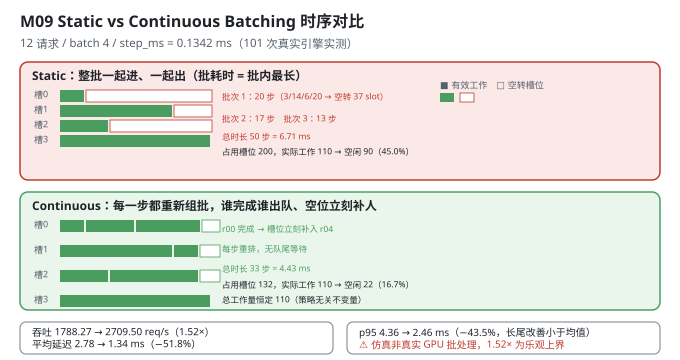
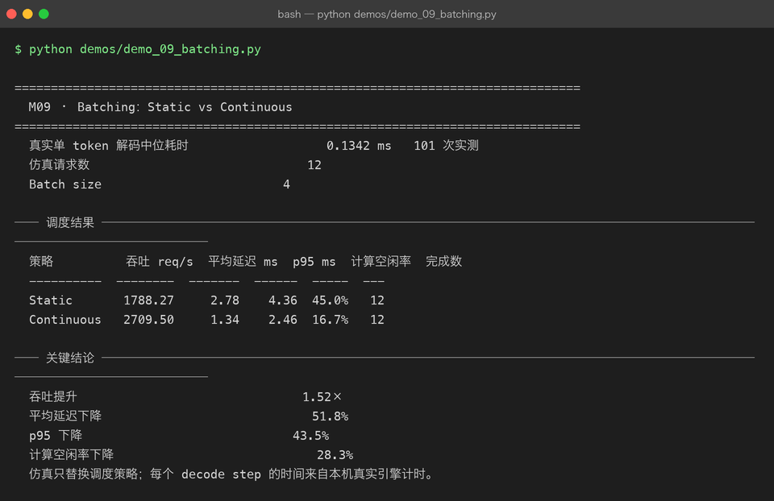

# Milestone 09 — Batching：Static vs Continuous

M07 让单次生成快了 2.20×，M08 让单次生成的显存省了 71.9%。但**服务**面对的不是一次请求，而是一股**持续到达的请求流**。

朴素做法（**Static Batching**）：攒够 `batch_size` 个请求，一起跑，等**批里最长的那个**生成完，整批一起返回，再攒下一批。

问题显而易见：批里有一个要生成 20 个 token 的请求，另外三个只要 2~6 个 —— 那三个的槽位在剩下的 14~18 步里**全部空转**，而新到的请求只能在队列里干等。

**Continuous Batching**（也叫 iteration-level scheduling）的解法：**每一步都重新组批**。谁生成完了就立刻出队，空出的槽位马上补一个等待中的请求进来。

**纯 numpy + 离散事件仿真**：`src/ie/batching.py` 不碰 GPU，只用事件推进时间。但**每个 decode step 的耗时来自本机真实引擎的 101 次实测**（M07 那个引擎）。

---

## 1. Why：为什么静态批处理会浪费一半算力

核心矛盾是：**同一个批里的请求，生成长度差异很大。**

静态批处理的批耗时 = `max(批内 token 数)`，而实际工作量 = `sum(批内 token 数)`。两者的差就是浪费。而且这个浪费是**乘法级**的：批越大、长度方差越大，浪费越猛。

Continuous Batching 在每个 decode step 后重新组批，槽位一空就补人。它消除的是两类等待：

1. **队尾等待**（head-of-line blocking）：短请求被长请求堵在批里；
2. **槽位空转**：短请求完成后，它的槽位在批结束前一直是空的。

## 2. Design：两个离散事件仿真 + 一个统一口径

```python
@dataclass(frozen=True)
class Request:
    request_id: str
    arrival_ms: float
    tokens: int            # 该请求需要生成多少 token
```

两个仿真器共享**同一套报告口径**（`_report`），这是可比性的关键：

| 量 | 定义 |
|---|---|
| `busy_slots` | 真正处理了的 token-step 数（**总工作量，两种策略相同**） |
| `capacity_slots` | 批占用的槽位 × 步数（**策略不同，这是唯一变量**） |
| `compute_idle_rate` | `1 − busy / capacity` |
| `mean/p95_latency` | `完成时刻 − 到达时刻` |

- **`simulate_static`**：按到达排序后每 `batch_size` 个一组；`start = max(上一批结束, 批内最晚到达)`；批耗时 = 批内最大 token 数；`capacity_slots += batch_steps * batch_size`。
- **`simulate_continuous`**：维护 `active` 列表；每步让所有活跃请求前进 1 token，`remaining == 0` 的出队；只要 `len(active) < batch_size` 就从 `pending` 补人；`capacity_slots += batch_size`（每步都按满槽计）。

**时间单位用真实的 `step_ms`**：`arrival_ms` 由"到达序号 × step_ms"构造，所以到达节奏与解码速度挂钩 —— 这是让仿真有意义的前提（如果到达间隔与 step 无关，仿真就退化成纯数学题）。



## 3. Real-run evidence（来自 `demos/out/demo_09_batching_terminal.txt`）

**`step_ms` 来自本机真实引擎**：M07 的 `CausalLMWithKVCache.decode_step`，**101 次实测取中位数 = 0.1342 ms**。

12 个请求，`batch_size=4`，token 数 `[3,14,6,20,5,11,2,17,8,4,13,7]`，到达序号 `[0,0,0,0,2,4,7,10,12,15,18,21]`（× step_ms）。

```
  真实单 token 解码中位耗时                   0.1342 ms   101 次实测
  仿真请求数                              12
  Batch size                         4
```

```
── 调度结果 ──────────────────────────────────────────────────────
  策略          吞吐 req/s  平均延迟 ms  p95 ms  计算空闲率  完成数
  ----------  --------  -------  ------  -----  ---
  Static       1788.27     2.78    4.36  45.0%   12
  Continuous   2709.50     1.34    2.46  16.7%   12

── 关键结论 ──────────────────────────────────────────────────────
  吞吐提升                               1.52×
  平均延迟下降                             51.8%
  p95 下降                             43.5%
  计算空闲率下降                            28.3%
```

**把"计算空闲率"拆开（按源码口径还原）：**

| 策略 | 总工作量 `busy_slots` | 占用槽位 `capacity_slots` | 空闲 |
|---|---|---|---|
| Static | **110**（12 个请求共 110 token） | `3 批 × 4 槽 × (20+17+13) 步 = 200` | **90 → 45.0%** |
| Continuous | **110**（同一个工作量） | `33 步 × 4 槽 = 132` | **22 → 16.7%** |

**这张表就是整个 M09 的答案**：两种策略做的功完全一样（110 个 token-step），区别只在于**占用了多少槽位** —— Static 用 200 个，Continuous 用 132 个。省下的 68 个槽位直接变成吞吐。

四个读数：

- **吞吐 1788.27 → 2709.50 req/s（1.52×）**。等价于总时长从 50 个 decode step 压到 33 个。
- **平均延迟 2.78 → 1.34 ms（−51.8%）**：队列等待几乎被消除。
- **p95 4.36 → 2.46 ms（−43.5%）**：**长尾改善幅度小于均值**（见 4.2）。
- **计算空闲率 45.0% → 16.7%（降 28.3 个百分点）**：接近一半的算力从"空转"变成了"干活"。
- 两者**完成数都是 12**，没有请求被丢弃 —— 提升来自调度效率，不是靠丢请求。



## 4. 踩坑 / 反直觉发现

### 4.1 ⚠ 这是离散事件仿真，不是真实 GPU 批处理 —— 而且 1.52× 是乐观上界

必须诚实标注三层：

1. **批处理本身没有并行**：仿真假设"一个 decode step 可以同时推进 `batch_size` 个请求，且耗时仍是 `step_ms`"。**这个假设在 GPU 上近似成立**（解码是内存带宽瓶颈，批内合并读权重几乎免费），**在 CPU 上不成立**（CPU 上 batch=4 的耗时大约是 batch=1 的 2~4 倍）。
2. **`step_ms` 是真实的**（101 次实测 0.1342 ms），但它是**单请求**的耗时。仿真把它当作"批内共享的一步"的耗时。
3. 真实 GPU 上，batch 增大时单步耗时会**亚线性增长**（不是完全免费）。所以**1.52× 是"批内完全免费"假设下的上界**，真实收益会低于它。

demo 的结论行写得很清楚：

```
  仿真只替换调度策略；每个 decode step 的时间来自本机真实引擎计时。
```

> 可迁移的经验：**仿真结论必须写清"哪个量是实测、哪个量是假设"。** 本章实测的只有 `step_ms`；调度结果全是仿真产物。

### 4.2 p95 只降 43.5%，比均值的 51.8% 少 —— 这是机制决定的，不是噪声

Continuous Batching 消除的是**等待**，而等待对**短请求**伤害最大（它们在 Static 里被长请求堵在批里，白白等 14~18 步）。所以均值（被短请求拉低）改善巨大。

但 **p95 对应的是最长的那几个请求**（20、17、13 个 token）。它们的延迟下限就是"自己的 token 数 × step_ms" —— **这部分无论如何优化都减不掉**。Continuous 只能帮它们省掉"排队等上一批"，省不掉"自己要生成 20 步"。

实测数字印证：p95 从 4.36 降到 2.46 ms，而最长请求的理论下限是 `20 × 0.1342 = 2.684 ms`—— **p95 已经贴到理论下限附近了，往下降无可降。**

> 这条对容量规划很实用：**Continuous Batching 主要改善的是短请求的体验（均值、P50），对长请求的绝对延迟改善有限。** 要压 p99 得靠别的手段（投机解码、模型切分、更快的 kernel）。

### 4.3 "总工作量恒定"是这套仿真最有用的自检

`busy_slots` 在两种策略下**都必须是 110**（12 个请求共 110 个 token，每个都要被处理一次）。

这个恒等式很有价值：它把"策略差异"**完全隔离到 `capacity_slots` 这一个变量上**。如果哪天两个仿真的 `busy_slots` 不相等，说明某个请求被漏处理了 —— 仿真写错了。

这个思路和 M08 的"池守恒 8+24=32"、M06 的"FP64 基线 == M01 PPL"是同一类：**找一个"策略无关的不变量"，用它来证明比较是公平的。**

### 4.4 到达节奏必须用 `step_ms` 缩放，否则仿真没有意义

```python
arrivals = [0, 0, 0, 0, 2, 4, 7, 10, 12, 15, 18, 21]
requests = [Request(f"r{i:02d}", arrival * step_ms, tokens) for ...]
```

如果直接用"0, 2, 4, 7... 毫秒"当到达时间，而 `step_ms = 0.1342 ms`，那么**所有请求在第 1 步之前就全到了** —— 仿真退化成"一次性处理 12 个请求"，Continuous 的优势会消失（没有"边到达边调度"这回事）。

乘上 `step_ms` 之后，到达间隔变成 `2~3 个 decode step`，才真实复现"边到边调度"的场景。

> 可迁移的经验：**仿真里的所有时间量必须同一量纲、且相对尺度要合理。** 到达率与处理率的比值（这里约 12 个请求 / 50 步）决定了队列是否形成，也就决定了调度策略有没有发挥空间。

### 4.5 `capacity_slots` 的定义必须两策略一致，否则空闲率不可比

两个仿真对"槽位"的定义是**一致的**：一个"槽位"= 一个批位置 × 一个 decode step。

- Static：`capacity_slots += batch_steps * batch_size`（批内所有位置，按批耗时计）
- Continuous：`capacity_slots += batch_size`（每步都按满槽计，空着的也算）

**两者都把"空着的槽位"算进分母** —— 这正是"空闲率"要衡量的东西。如果 Continuous 只算"实际活跃的请求数"，它的 `capacity` 就会等于 `busy`，空闲率恒为 0，**指标就失去了意义**。

这类"分母口径"的坑在 M02（忠实度）、M04（去重复）已经出现过两次，本章是第三次：**看到一个比值指标，先确认分母在两组之间定义一致。**

## 5. Conclusion

1. Static Batching 的浪费来自"批耗时 = 批内最长请求"与"实际工作量 = 批内 token 之和"的差；Continuous Batching **每步重新组批**，槽位一空就补人。
2. 实测仿真（12 请求 / batch 4 / `step_ms = 0.1342 ms` 来自 **101 次真实引擎计时**）：**吞吐 1788.27 → 2709.50 req/s（1.52×）**、平均延迟 **2.78 → 1.34 ms（−51.8%）**、p95 **4.36 → 2.46 ms（−43.5%）**、计算空闲率 **45.0% → 16.7%（降 28.3 个百分点）**，两者完成数都是 12。
3. **核心拆解**：总工作量恒为 **110 token-step**；Static 占用 **200** 槽位（空闲 90），Continuous 占用 **132** 槽位（空闲 22）—— 省下的 68 个槽位就是吞吐的来源。
4. ⚠ **诚实标注：调度结果是离散事件仿真，不是真实 GPU 批处理**；只有 `step_ms` 是实测；**1.52× 是"批内合并免费"假设下的乐观上界**（CPU 上不成立，GPU 上也会亚线性退化）。
5. **p95 改善（43.5%）小于均值（51.8%）是机制决定的**：Continuous 消除的是等待，主要救短请求；长请求的延迟下限是自己的 token 数（最长请求理论下限 2.684 ms，实测 p95 已降到 2.46 ms）。
6. **"总工作量恒定 110" 是策略无关的不变量** —— 用它证明两个仿真的比较是公平的（与 M08 池守恒、M06 基线对齐同一类思路）。
7. 到达间隔必须乘 `step_ms` 缩放，否则请求在第 1 步前全部到达，仿真退化。
8. `capacity_slots` 在两策略下**都把空槽算进分母**，否则空闲率失真 —— 第三次遇到"比值指标的分母口径"问题。
9. 手写实现的意义：因为两个仿真共享同一个 `_report`，我才能断言"两者 busy 都是 110，唯一变量是 capacity" —— 用现成的排队论库你只会拿到一个平均等待时间，拿不到这个隔离。

## 6. Code map

| 文件 | 职责 |
|---|---|
| `src/ie/batching.py` | `Request`（request_id / arrival_ms / tokens）/ `_report`（统一口径：吞吐 / 均值 / p95 / max / 空闲率 / busy / capacity）/ `simulate_static`（批耗时 = 批内最长）/ `simulate_continuous`（每步重排，槽位即补）/ `compare_batching`（四项增益） |
| `src/ie/batching.py:54` | `capacity_slots += batch_steps * batch_size` —— Static 把整批空转槽位计入分母 |
| `src/ie/batching.py:77` | `capacity_slots += batch_size` —— Continuous 每步按满槽计（空槽同样计入分母） |
| `src/ie/engine.py` | `CausalLMWithKVCache.decode_step`：提供 `step_ms`（M07 引擎，101 次实测中位数） |
| `demos/demo_09_batching.py` | 3 节：真实 step 计时 / 12 请求构造 / 两策略调度结果 |
| `demos/out/demo_09_batching_terminal.txt` | 本章所有数字的来源 |
| `assets/batching.svg` | 本章 Static vs Continuous 时序对比图 |

## 7. Version line

v0.8 → **v0.9**，M09 Static vs Continuous Batching 落地。实测仿真（12 请求 / batch 4，`step_ms = 0.1342 ms` 来自 **101 次真实引擎计时**）：**吞吐 1788.27 → 2709.50 req/s（1.52×）**、平均延迟 **2.78 → 1.34 ms（−51.8%）**、p95 **4.36 → 2.46 ms（−43.5%）**、计算空闲率 **45.0% → 16.7%（降 28.3 个百分点）**、完成数均 12；核心拆解为「总工作量恒为 110 token-step，Static 占 200 槽 / Continuous 占 132 槽」。并诚实记录「⚠ 调度结果是离散事件仿真而非真实 GPU 批处理，只有 `step_ms` 是实测，**1.52× 是乐观上界**」「p95 改善小于均值是机制决定（长请求延迟下限 = 自身 token 数，最长请求下限 2.684 ms）」「busy 恒定 110 是策略无关不变量，用于证明比较公平」「到达间隔须乘 step_ms 缩放否则仿真退化」「`capacity_slots` 两策略都把空槽计入分母」。纯 numpy + 标准库，无 vLLM。配图 1 张手写 SVG + 1 张真实终端截图。
