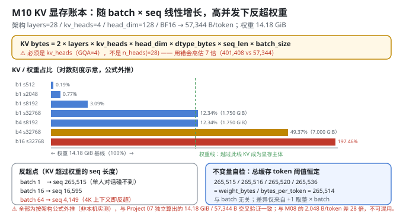
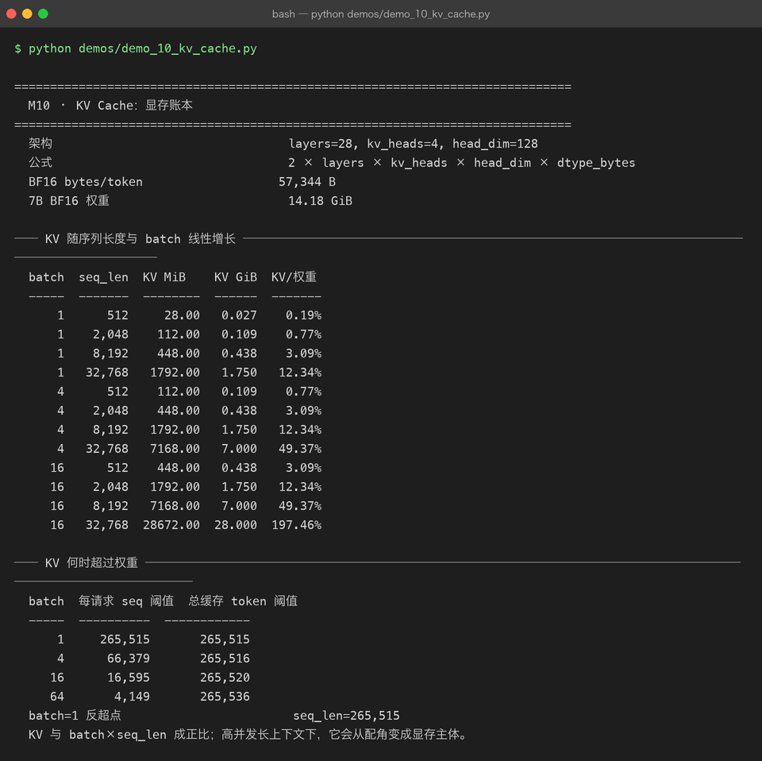

# Milestone 10 — KV Cache：显存账本

M07 说 KV Cache 能省时间，M08 说分页能省空间。这一层回答一个更根本的问题：**KV Cache 到底占多少显存？什么时候它会反客为主，成为显存的主体？**

答案是：**它和 `batch_size × seq_len` 成正比**，而且比例系数大到反直觉 —— 在高并发长上下文下，KV Cache 能轻松超过模型权重本身。

**⚠ 诚实标注（读本章前必看）：本章的 7B 相关数字全部是按架构公式计算的，不是本机实测。** 本机跑不动 7B。这些数字与 Project 07 已经算过的显存账本对齐（7B BF16 权重 14.18 GiB、KV 57,344 B/token）—— 也就是说，这是**两个项目各自独立算出同一个数**的交叉验证，但仍然属于"外推"而非"实测"。

---

## 1. Why：为什么"模型有多大"不等于"要多少显存"

一个 7B 模型，BF16 权重 14.18 GiB。直觉是"买张 24 GB 的卡就够了"。**这个直觉在高并发长上下文下错得离谱**，因为显存至少要装三样东西：

```text
总显存 ≈ 权重 + KV Cache + 激活值/临时缓冲
```

其中 **KV Cache 是唯一一个随请求量线性增长的项**，而且它的系数不小：

```text
KV bytes/token = 2 × layers × kv_heads × head_dim × dtype_bytes
```

`2` 是 K 和 V 两份。这个公式里每一项都在"做大"它：层数 × KV 头数 × 头维度 × 序列长度 × 批大小。

## 2. Design：一个公式，三个视角

`src/ie/kvbook.py` 只做一件事 —— 把上面那个公式变成可查的账本：

```python
bytes_per_token(KVArchitecture(layers, kv_heads, head_dim), dtype_bytes)
    = 2 × layers × kv_heads × head_dim × dtype_bytes

kv_cache_bytes(arch, seq_len, batch_size, dtype_bytes)
    = bytes_per_token(arch) × seq_len × batch_size

sequence_length_to_exceed_weights(arch, weight_bytes, batch_size, dtype_bytes)
    = floor(weight_bytes / (bytes_per_token × batch_size)) + 1     # KV 反超权重的序列长度
```

三个视角分别回答：

| 函数 | 回答 |
|---|---|
| `bytes_per_token` | 每存 1 个 token 的 KV 要多少字节（**架构常数**） |
| `memory_table` | 给定 `(batch, seq)`，KV 占多少 GiB、是权重的百分之几 |
| `sequence_length_to_exceed_weights` | **反超点**：多长的序列会让 KV 超过权重 |

第三个最有决策价值：**反超点之前，显存规划看权重；反超点之后，显存规划看 KV。**



## 3. Real-run evidence（来自 `demos/out/demo_10_kv_cache_terminal.txt`）

参考架构（Qwen2-7B 形态，与 P07 对齐）：`layers=28, kv_heads=4, head_dim=128`，BF16（`dtype_bytes=2`）。

```
  架构                                 layers=28, kv_heads=4, head_dim=128
  公式                                 2 × layers × kv_heads × head_dim × dtype_bytes
  BF16 bytes/token                   57,344 B
  7B BF16 权重                         14.18 GiB
```

**验算**：`2 × 28 × 4 × 128 × 2 = 57,344` B/token ✓

### 3.1 KV 随序列长度与 batch 线性增长（公式外推）

| batch | seq_len | KV MiB | KV GiB | KV / 权重 |
|---|---|---|---|---|
| 1 | 512 | 28.00 | 0.027 | **0.19%** |
| 1 | 2,048 | 112.00 | 0.109 | 0.77% |
| 1 | 8,192 | 448.00 | 0.438 | 3.09% |
| 1 | 32,768 | 1,792.00 | 1.750 | **12.34%** |
| 4 | 512 | 112.00 | 0.109 | 0.77% |
| 4 | 2,048 | 448.00 | 0.438 | 3.09% |
| 4 | 8,192 | 1,792.00 | 1.750 | 12.34% |
| 4 | 32,768 | 7,168.00 | 7.000 | **49.37%** |
| 16 | 512 | 448.00 | 0.438 | 3.09% |
| 16 | 2,048 | 1,792.00 | 1.750 | 12.34% |
| 16 | 8,192 | 7,168.00 | 7.000 | 49.37% |
| **16** | **32,768** | **28,672.00** | **28.000** | **197.46%** |

**这张表最值得记住的一行是最后一行**：`batch=16, seq=32,768` 时 KV Cache 达 **28.00 GiB**，是权重（14.18 GiB）的 **197.46%** —— **接近两倍**。

对角线规律很明显：`batch × seq_len` 相同的格子，KV 占比完全相同（`1×2048`、`4×512` 都是 0.77%；`16×512`、`4×2048`、`1×8192`... 等等）。**这直接验证了"KV ∝ batch × seq_len"。**

### 3.2 KV 何时超过权重（公式外推）

| batch | 每请求 seq 阈值 | 总缓存 token 阈值 |
|---|---|---|
| **1** | **265,515** | 265,515 |
| 4 | 66,379 | 265,516 |
| 16 | 16,595 | 265,520 |
| **64** | **4,149** | 265,536 |

三个读数：

- **单请求（batch=1）要 seq 265,515 才反超** —— 这个长度远超当前任何模型的上下文窗口。**所以"单人对话"场景里 KV 永远不是瓶颈**，权重才是。
- **batch=64 时每请求只要 seq 4,149 就反超** —— 4K 上下文是今天最普通的量级。**高并发下 KV 立刻变成显存主体。**
- **"总缓存 token 阈值"四行几乎恒定（265,515 / 265,516 / 265,520 / 265,536）** —— 这是账本的自检，见 4.3。



## 4. 踩坑 / 反直觉发现

### 4.1 ⚠ 公式里必须是 `kv_heads`，不是 `n_heads` —— 用错会高估 7 倍

这是 GQA（Grouped Query Attention）带来的坑。Qwen2-7B 有 **28 个 query 头，但只有 4 个 KV 头**：每 7 个 query 头共享 1 组 K/V。

```text
正确：2 × 28 层 × 4 KV头 × 128 × 2 B = 57,344 B/token
错误：2 × 28 层 × 28 头 × 128 × 2 B = 401,408 B/token  ← 高估 7.0 倍
```

差别是**整整 7 倍**。用错的话，`batch=16, seq=32768` 的 KV 会被算成 196 GiB 而不是 28 GiB —— 你会得出"这个配置根本不可能"的错误结论，而实际上一张 A100 80G 是能跑的。

**本项目把 `kv_heads` 单独作为 `KVArchitecture` 的一个字段**（而不是复用 `n_heads`），就是为了逼着写公式的人回答"这里该用哪个"。

> 可迁移的经验：**copy 一个显存公式之前，先确认它用的是 `n_heads` 还是 `n_kv_heads`。** 网上大量的估算脚本是 MHA 时代写的，在 GQA / MQA 模型上会系统性高估。

### 4.2 反超点把"显存规划"切成两个完全不同的问题

| 场景 | 显存主体 | 优化方向 |
|---|---|---|
| batch=1，seq < 265K | **权重**（14.18 GiB） | 量化权重（M06）、模型切分 |
| batch=64，seq > 4,149 | **KV Cache**（可达权重的 2 倍） | 分页（M08）、KV 量化、MQA/GQA、卸载、前缀共享 |

**这两类问题的解法几乎不重叠**：量化权重对 KV 一点用没有（KV 是运行时产生的激活，不是权重）；分页对权重一点用没有。

具体到 `batch=16, seq=32,768`：`14.18 + 28.00 = 42.18 GiB`。这个配置在 A100 80GB 上可行，在 24 GB 的卡（A10 / RTX 4090）上**绝无可能** —— 而如果只看权重，你会以为 24 GB 绰绰有余。

> 可迁移的经验：**做容量规划时，先算反超点，再决定优化什么。** 盲目量化权重是最常见的时间浪费。

### 4.3 "总缓存 token 阈值"恒定 ≈ 265.5K —— 这是账本的自检

四行的"总缓存 token 阈值"是 `265,515 / 265,516 / 265,520 / 265,536`，**几乎完全相同**。这不是巧合：

```text
总阈值 = 每请求 seq 阈值 × batch
       ≈ (weight_bytes / (bytes_per_token × batch)) × batch
       = weight_bytes / bytes_per_token
       = 15,225,659,064 / 57,344 = 265,514      ← 与 batch 无关
```

**"KV 超过权重所需的总缓存 token 数"是一个与 batch 无关的量** —— 它只取决于"权重大"和"每个 token 的 KV 大"两个量。微小差异（265,515 ~ 265,536）全部来自 `+1` 的取整在乘 batch 后被放大。

这个恒等式是**账本正确性的自检**：如果哪天四行差别很大，说明公式或取整写错了。

这和 M08 的"池守恒 8+24=32"、M09 的"busy 恒为 110"是同一类思路 —— **找一个策略/参数无关的不变量，用它验证计算。**

### 4.4 与 M08 的 2,048 B/token 差整整 28 倍 —— 别混用

| | M08（玩具模型） | M10（7B 参考） |
|---|---|---|
| 架构 | `layers=2, heads=4, head_dim=16` | `layers=28, kv_heads=4, head_dim=128` |
| dtype | **fp64**（`dtype_bytes=8`，与 P06 模型一致） | **BF16**（`dtype_bytes=2`） |
| B/token | **2,048** | **57,344** |
| 比值 | — | **恰好 28 倍** |

`57,344 / 2,048 = 28.0`，正好是 `(28 层 / 2 层) × (128 / 16) × (2 B / 8 B)` 的乘积。

两个数字都对，但**属于不同的模型、不同的 dtype**。引用时必须带上口径 —— 这也是为什么 M08 的文档里专门标了"本章 `dtype_bytes=8` 与 M10 的 BF16 不可直接对比"。

### 4.5 本章数字全是外推，不是实测 —— 但有两个交叉验证

必须说清楚可信度来源：

- **不是本机实测**：本机（`d_model=64` 的玩具模型）跑不动 7B，也拿不到真实 GPU 显存读数。
- **与 P07 交叉验证**：Project 07 的显存账本**独立算过**同样的两个数 —— 7B BF16 权重 **14.18 GiB**、KV **57,344 B/token**。两个项目用各自的代码得出同一个结果，说明公式和参数没有抄错。
- **与 M08 交叉验证**：同一公式在玩具架构上给出 2,048 B/token，与 M08 一致。

所以本章数字应读作"**按架构公式外推，且与 P07 独立计算结果一致**"，而不是"实测"。**`memory_table` 里那些 GiB 数字，是真机上应该出现的值，不是本机观测到的值。**

### 4.6 KV 量化是把账本砍半的最直接手段

公式里 `dtype_bytes` 是线性项，所以：

| KV dtype | bytes/token | 相对 BF16 |
|---|---|---|
| FP16 / BF16 | 57,344 | 1.00× |
| **INT8 / FP8** | **28,672** | **0.50×** |
| INT4 | 14,336 | 0.25× |

**KV 从 BF16 压到 INT8，显存直接减半** —— 反超点也会相应翻倍（batch=64 时从 seq 4,149 抬到 8,298）。

而且 KV 量化比权重量化**更容易**：KV 是运行时产生的激活，可以用"校准集"确定量化范围，也可以按通道/按头做粒度。工业界（vLLM、TensorRT-LLM）已经把 FP8 KV 作为标准选项。

**但要注意**：本章账本**没有**包含 KV 量化，表里全是 BF16。这是刻意的 —— 先给出一个干净的基准，量化是可以叠加在上面的独立变量。

## 5. Conclusion

1. KV 显存公式：`2 × layers × kv_heads × head_dim × dtype_bytes × seq_len × batch_size`。参考架构（28 层 / 4 KV 头 / head_dim 128 / BF16）→ **57,344 B/token**。
2. **KV ∝ batch × seq_len**：表里的对角线（`batch×seq` 相同 → 占比相同）直接验证了这一点。
3. 实测（**公式外推**）：`batch=16, seq=32,768` → KV **28.00 GiB**，达权重的 **197.46%**（权重 14.18 GiB，合计 42.18 GiB —— A100 80G 可行，24 GB 卡不行）。
4. **反超点**：batch 1 → **seq 265,515**（单人对话永远碰不到）；batch 4 → 66,379；batch 16 → **16,595**；batch 64 → **4,149**（高并发下 4K 上下文即反超）。
5. ⚠ **公式里必须用 `kv_heads`（GQA=4），用 `n_heads`（=28）会高估 7 倍**（401,408 vs 57,344）。
6. **反超点把显存规划切成两个问题**：之前优化权重（量化、切分），之后优化 KV（分页、KV 量化、GQA、前缀共享）—— 两类解法几乎不重叠。
7. **"总缓存 token 阈值"恒定 ≈ 265,514**（`weight_bytes / bytes_per_token`，与 batch 无关）—— 账本自检不变量。
8. **与 M08 的 2,048 B/token 差 28 倍**（架构 + dtype 都不同），引用必须带口径。
9. ⚠ **全部数字是公式外推，非本机实测**；但与 P07 独立算出的 14.18 GiB / 57,344 B 交叉验证一致。
10. **KV 量化到 INT8 可直接减半**（反超点翻倍），且比权重量化更容易 —— 本章账本为干净基准，未叠加该变量。
11. 手写实现的意义：因为公式是自己写的，我才能把它拆成"架构常数 × 序列 × 批"三段并做对角线自检 —— 用现成的显存计算器只能拿到一个总数，无法验证。

## 6. Code map

| 文件 | 职责 |
|---|---|
| `src/ie/kvbook.py` | `KVArchitecture`（**`layers` / `kv_heads` / `head_dim` 三字段分离，逼你区分 query 头与 KV 头**）/ `bytes_per_token` / `kv_cache_bytes` / `memory_table`（batch × seq 二维表 + `vs_weights` 占比）/ `sequence_length_to_exceed_weights`（反超点）/ `model_weight_bytes` / `qwen7b_reference`（从 28 层 / 4 KV 头 / 128 重推 P07 的数字） |
| `src/ie/kvbook.py:23` | `2 * layers * kv_heads * head_dim * dtype_bytes` —— 核心公式，`kv_heads` 而非 `n_heads` |
| `src/ie/kvbook.py:68` | `math.floor(weight_bytes / per_position) + 1` —— 反超点（+1 保证"严格超过"） |
| `demos/demo_10_kv_cache.py` | 3 节：架构与公式 / KV 增长表 / 反超点表 |
| `demos/out/demo_10_kv_cache_terminal.txt` | 本章所有数字的来源 |
| `assets/kv-cache.svg` | 本章 KV 显存增长与反超点图 |

## 7. Version line

v0.9 → **v0.10**，M10 KV Cache 显存账本落地。参考架构 `layers=28 / kv_heads=4 / head_dim=128`、BF16：每 token **57,344 B**、7B BF16 权重 **14.18 GiB**；增长表显示 `batch=16 @ seq=32,768` 时 KV 达 **28,672 MiB = 28.000 GiB**，为权重的 **197.46%**（合计 42.18 GiB）；**反超点 batch 1 → seq 265,515 / batch 4 → 66,379 / batch 16 → 16,595 / batch 64 → 4,149**。并诚实记录「⚠ 本章 7B 数字**全部是按架构公式外推、非本机实测**，但与 Project 07 独立算出的 14.18 GiB / 57,344 B 交叉验证一致」「公式必须用 `kv_heads`（GQA=4），误用 `n_heads`(=28) 会高估 7 倍 → 401,408 B/token」「**总缓存 token 阈值恒定 ≈ 265,514**（与 batch 无关），是账本自检不变量」「与 M08 的 2,048 B/token 差 28 倍（架构 + dtype 均不同），不可混用」。纯 Python 标准库 + numpy，无 GPU 实测。配图 1 张手写 SVG + 1 张真实终端截图。
