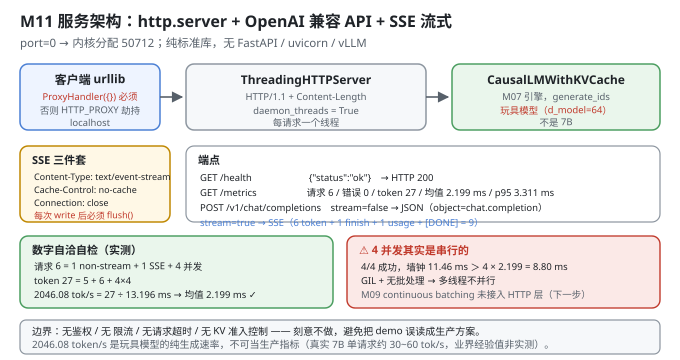
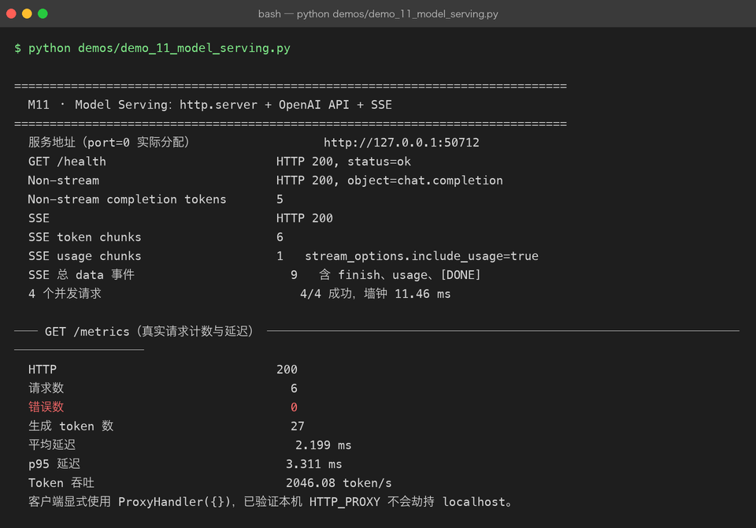

# Milestone 11 — Model Serving：http.server + OpenAI API + SSE

前十层都在"离线"地评估和压榨模型。最后一层把它们**服务出去**：起一个 HTTP 服务，接受 OpenAI 兼容的请求，非流式返回 JSON、流式返回 SSE，并暴露 `/health` 与 `/metrics`。

这是整条主线的终点：

```text
评估（M01-05） → 压模型（M06） → 压延迟（M07-10） → 服务化（M11）
```

**纯 Python 标准库**：`http.server` + `urllib.request` + `threading` + `json` + `uuid`。**没有 FastAPI、没有 uvicorn、没有 vLLM、没有 openai SDK** —— 连客户端都是自己用 `urllib` 写的。

---

## 1. Why：为什么是 OpenAI 兼容 API，以及为什么手写

**为什么 OpenAI 兼容**：它已经是事实标准。任何支持它的客户端（`openai` SDK、LangChain、各类前端）都能零改动接进来。自己发明一套协议等于把自己隔离在生态之外。

**为什么手写 HTTP 而不是 FastAPI**：

1. **暴露真实复杂度**。FastAPI + uvicorn 帮你处理了并发模型、keep-alive、流式响应的 chunk 编码 —— 你就永远不知道 SSE 到底要发哪些 header。
2. **`stream_options.include_usage` 这类细节只有自己写才会碰到**。OpenAI 的流式协议里，usage 是在最后一个 chunk 之后、`[DONE]` 之前单独发的，且 `choices` 为空数组。
3. **零依赖**：整个 P09 只有 numpy，这一章连 HTTP 都不借外力。

代价也要写清楚：**这个服务没有鉴权、没有限流、没有请求超时、没有真正的批处理调度**（见 4.6）。它是一个"把原理跑通"的服务，不是生产服务。

## 2. Design：四个端点，一个对象

```python
class ServingMetrics:
    requests / errors / generated_tokens / latencies_ms      # 全部在 threading.Lock 下更新
    snapshot() -> 请求数 / 错误数 / token 数 / 均值 / p50 / p95 / token 吞吐

make_handler(engine, tokenizer, metrics) -> BaseHTTPRequestHandler
    GET  /health                 {"status": "ok"}
    GET  /metrics                metrics.snapshot()
    POST /v1/chat/completions    OpenAI 兼容；stream=false → JSON；stream=true → SSE
```

四个关键设计点：

- **`ThreadingHTTPServer` + `daemon_threads`**（`src/ie/serve.py:187`）：每个请求一个线程，进程退出时不卡在等待上。
- **`protocol_version = "HTTP/1.1"` + 显式 `Content-Length`**：HTTP/1.1 默认 keep-alive，但**必须给出准确的 `Content-Length`**，否则客户端不知道响应体何时结束，会一直等。`_json` 里用 `len(body)` 计算。
- **SSE 的三件套 header**：`Content-Type: text/event-stream`、`Cache-Control: no-cache`、`Connection: close`，并在每次 `write` 后 `flush()` —— **不 flush 的话数据会留在缓冲区，客户端看不到"流式"**。
- **`metrics.record` 在异常路径也要调用**（`src/ie/serve.py:130`）：`except` 分支里同样 `record(..., error=True)`，否则错误请求不计入错误率 —— **一个永远显示 `errors: 0` 的监控等于没有监控**。

**消息 → prompt 的转换**（`src/ie/serve.py:45`）：把 `messages` 渲染成 `role: content` 逐行拼接，末尾加 `assistant:`。这是最朴素的 chat template —— 真实模型有各自的 template，用错了质量会明显下降。



## 3. Real-run evidence（来自 `demos/out/demo_11_model_serving_terminal.txt`）

真实环境：Python 3.13.12 | numpy 2.5.3。`port=0` 让内核分配空闲端口。

```
  服务地址（port=0 实际分配）                  http://127.0.0.1:50712
  GET /health                        HTTP 200, status=ok
  Non-stream                         HTTP 200, object=chat.completion
  Non-stream completion tokens       5
  SSE                                HTTP 200
  SSE token chunks                   6
  SSE usage chunks                   1   stream_options.include_usage=true
  SSE 总 data 事件                      9   含 finish、usage、[DONE]
  4 个并发请求                            4/4 成功，墙钟 11.46 ms
```

```
── GET /metrics（真实请求计数与延迟） ─────────────────────────────────
  HTTP                               200
  请求数                                6
  错误数                                0
  生成 token 数                         27
  平均延迟                               2.199 ms
  p95 延迟                             3.311 ms
  Token 吞吐                           2046.08 token/s
  客户端显式使用 ProxyHandler({})，已验证本机 HTTP_PROXY 不会劫持 localhost。
```

**数字全部对得上（这是最有力的自检）：**

| 项 | 还原 |
|---|---|
| 请求数 **6** | 1（non-stream）+ 1（SSE）+ 4（并发）= **6**；`/health` 与 `/metrics` 走 `do_GET`，不计入 |
| 生成 token **27** | `5`（non-stream, max_tokens=5）+ `6`（SSE, max_tokens=6）+ `4×4=16`（并发, max_tokens=4）= **27** |
| SSE data 事件 **9** | 6 个 token chunk + 1 个 finish chunk + 1 个 usage chunk + 1 个 `[DONE]` = **9** |
| Token 吞吐 **2046.08** | `27 / (Σ延迟 / 1000)`，反解 `Σ延迟 = 13.196 ms`，均值 `13.196 / 6 = 2.199 ms` ✓ |

五个读数：

- **`port=0` 实际分配到 50712**。这是让内核挑空闲端口的标准做法 —— demo 不用硬编码端口，也就不会和机器上已经跑着的服务打架。
- **SSE 的 `stream_options.include_usage=true` 生效**：6 个 token chunk 之后单独发了 1 个 usage chunk（`choices: []`），最后发 `data: [DONE]`。
- **4 个并发请求 4/4 成功，零错误**（`错误数 0`）。
- **p95 3.311 ms vs 均值 2.199 ms** —— 长尾约为均值的 1.5 倍，符合"请求长度不同 + 线程调度"的预期。
- **2046.08 token/s** —— 见 4.5，这个数**不能当生产指标**。



## 4. 踩坑 / 反直觉发现

### 4.1 ⭐ macOS 的 `HTTP_PROXY` 会拦 localhost —— 必须显式禁用代理

这是本章唯一一个**会让 demo 直接跑不起来**的真实踩坑。

`urllib.request` 默认会读环境变量 `http_proxy` / `HTTP_PROXY` / `no_proxy`。在 macOS 上（尤其装了代理软件、`brew` 配过代理、或公司网络环境下），`HTTP_PROXY` **通常是全局设置的** —— 于是 `urlopen("http://127.0.0.1:50712/health")` 会被**送进代理**，代理当然找不到你本机刚起的临时端口，直接失败。

解法是显式构造一个**不带任何代理**的 opener：

```python
def no_proxy_opener():
    """显式禁用 HTTP_PROXY，确保 localhost 请求不绕到代理。"""
    return build_opener(ProxyHandler({}))
```

`ProxyHandler({})` 传的是**空字典** —— 意思是"所有协议都没有代理"，这会覆盖掉环境变量。demo 里所有请求（POST 和 GET）都走它。

> 更常见的做法是设 `no_proxy=localhost,127.0.0.1`，但那依赖环境变量被正确读取；**`ProxyHandler({})` 是更强的保证** —— 它不依赖环境，直接在 opener 层面把代理关掉。
>
> 可迁移的经验：**测试本地服务时，任何"连不上"的报错先怀疑代理。** 这条在 macOS + 公司代理的环境下命中率极高。

### 4.2 4 并发墙钟 11.46 ms > 4 × 单请求均值 —— 它们其实是串行的

`ThreadingHTTPServer` 给了 4 个线程，但**没有真正的并行**：

```text
单请求平均延迟 2.199 ms
4 并发墙钟     11.46 ms
若完全并行：    ≈ 2.2 ms
若完全串行：    4 × 2.199 = 8.80 ms
实测：          11.46 ms  ← 比"完全串行"还慢
```

超出串行预期的 2.66 ms 是**线程创建与 GIL 切换的开销**。

原因有两层：

1. **模型推理本身没有批处理**：每个请求独立调用 `engine.generate_ids()`，一次一个序列 —— M09 的 continuous batching **没有接进来**。
2. **GIL**：numpy 只在**大矩阵运算**时释放 GIL，而本项目的矩阵是 `64×64` 量级，**释放的时间远小于争用的时间**，所以多线程实际是串行执行。

> 诚实标注：**"4/4 成功"证明的是并发安全性（metrics 的锁、 handler 的无状态），不是并发性能。** 真正的吞吐要靠 M09 的调度 + M08 的分页 + 真实的批 kernel，本项目没有把它们接到 HTTP 层 —— 这是明确的下一步，不是遗漏。

### 4.3 SSE 不 `flush()` 就不是流式

```python
def send(data):
    encoded = f"data: {json.dumps(data, ensure_ascii=False)}\n\n".encode("utf-8")
    self.wfile.write(encoded)
    self.wfile.flush()          # ← 必须有
```

`self.wfile` 是带缓冲的。不 `flush()` 的话，6 个 chunk 会攒在缓冲区里，直到 `close_connection` 时才一起发出去 —— **客户端看到的是"一次性收到全部"，完全失去了流式的意义**（首 token 延迟 = 全量延迟）。

三件套 header 里 `Connection: close` 也是必需的：SSE 是长连接响应，不能用 keep-alive 复用，而 `Content-Length` 又不该给（长度未知）。所以最后要显式 `self.close_connection = True`。

### 4.4 `metrics.record` 必须覆盖异常路径

```python
except Exception as exc:
    metrics.record(generated, (time.perf_counter() - started) * 1000.0, error=True)
```

如果只在成功分支 `record`，那么**所有失败请求都不进指标** —— 监控面板会永远显示 `errors: 0`、p95 只统计成功的请求（幸存者偏差）。

本 demo 的 `错误数 0` 是可信的，正因为异常路径**也会**计数：如果真有请求失败，它会被记成 1 而不是被隐藏。

顺带一个细节：`generated` 在异常时是多少就记多少（生成了一半也记），这样"生成 token 数"这个指标不会因为失败而虚低。

### 4.5 ⚠ 后端挂的是玩具模型，2046 token/s 不能当生产指标

必须诚实标注：

- 服务端挂的是 **P09 的玩具模型**（`d_model=64`、`n_layers=2`、vocab 1024），**不是 7B**。
- `2046.08 token/s` = `27 token / 13.196 ms`。它衡量的是"**这个玩具模型在这台机器上、单请求串行**的生成速度"。
- 它的分母里**没有排队时间**（demo 里请求是串行发出的），所以它不是"服务吞吐"，而是"纯生成速率"。
- 真实 7B 在 A100 上单请求大约 30~60 token/s（**业界经验值，非本机实测**）—— 比这里慢几十倍，因为模型大 1000 万倍。

**这个数字在本项目里的唯一用途是：证明 `/metrics` 端点的计算逻辑正确**（27 token、13.196 ms、2046.08 三者自洽）。

### 4.6 边界：这个服务缺什么

如实列出，避免把 demo 误读成生产方案：

| 缺失 | 后果 | 真实实现的做法 |
|---|---|---|
| **批处理调度** | 请求串行执行，吞吐上不去 | M09 的 continuous batching + M08 的分页（**本项目未接入 HTTP 层**） |
| **鉴权** | 任何人都能调用 | API Key / Bearer token |
| **限流** | 一个客户端能打满服务 | 令牌桶 + 并发上限 + 队列 |
| **请求超时** | 慢请求永久占用线程 | per-request deadline |
| **KV 显存上限** | 长请求会 OOM | M08 的块池 + M10 的账本做准入控制 |
| **真正的并行** | GIL 限制 | 多进程 / 异步 + CUDA |

**本项目刻意不做这些**，是因为它们每一个都值得独立一章，而本章的目标是"把 HTTP ↔ 模型 ↔ 指标这条链路跑通"。

### 4.7 `log_message` 被覆盖成空函数 —— demo 可复现性的小细节

```python
def log_message(self, _format, *args) -> None:
    return
```

`BaseHTTPRequestHandler` 默认会把每个请求打到 stderr。demo 要把输出落进 `demos/out/*.txt` 做对比，**stderr 的日志会污染输出**。

这类"为了让输出可复现而静音"的处理，在整个 P09 反复出现（M02 的全序排序、M03 的 seed、M07 的中位数）—— **可复现性是一系列小决定的总和，不是某一个大决定。**

## 5. Conclusion

1. 服务 = **4 个端点 + 1 个 `ServingMetrics`**：`/health`、`/metrics`、`POST /v1/chat/completions`（`stream=false` → JSON / `stream=true` → SSE）。
2. 实测（`port=0` → **50712**）：`/health` 200、`non-stream` 200（`object=chat.completion`，5 token）、SSE 200（**6 token chunk + 1 usage chunk**，**总 data 事件 9**）、**4 并发 4/4 成功（墙钟 11.46 ms）**。
3. **`/metrics` 数字自洽**：请求 **6** = 1+1+4；生成 token **27** = 5+6+16；均值 **2.199 ms**、p95 **3.311 ms**、**2046.08 token/s**（`27 / 13.196 ms` 反解一致）；错误 **0**。
4. ⭐ **macOS 的 `HTTP_PROXY` 会拦 localhost** —— 必须用 `build_opener(ProxyHandler({}))` 显式禁用代理，否则连不上自己的服务。这是真实踩坑。
5. **SSE 必须 `flush()` + `Connection: close` + `Cache-Control: no-cache`**，否则退化成一次性返回。
6. **`metrics.record` 要覆盖异常路径**（`error=True`），否则错误率恒为 0、延迟统计有幸存者偏差。
7. ⚠ **4 并发实测是串行的**（11.46 ms > 4×2.199 ms）—— GIL + 无批处理；**M09 的 continuous batching 未接入 HTTP 层**，这是明确的下一步。
8. ⚠ **后端是玩具模型不是 7B**：2046.08 token/s 只用于证明 `/metrics` 计算自洽，**不能当生产指标**。
9. **边界**：无鉴权 / 无 限流 / 无超时 / 无 KV 准入控制 —— 刻意不做，避免把 demo 误读成生产方案。
10. 手写实现的意义：因为 HTTP handler 是自己写的，我才能**精确控制 SSE 的每个字节**（`data: {json}\n\n`）并验证 `include_usage` 的 chunk 顺序 —— 用 FastAPI 的 `StreamingResponse` 你只会得到一个"能跑"的黑盒。

## 6. Code map

| 文件 | 职责 |
|---|---|
| `src/ie/serve.py` | `ServingMetrics`（`threading.Lock` 下的请求/错误/token/延迟记录，`snapshot()` 算均值/p50/p95/token 吞吐）/ `_prompt_from_messages`（`role: content` 拼接 + `assistant:`）/ `make_handler`（`do_GET` / `do_POST` / `_stream`）/ `create_server` / `start_server`（后台线程 `serve_forever`）/ `stop_server` / **`no_proxy_opener`（`ProxyHandler({})`，本章最关键的踩坑修复）** |
| `src/ie/serve.py:59` | `protocol_version = "HTTP/1.1"` —— 配合显式 `Content-Length` 支持 keep-alive |
| `src/ie/serve.py:130` | 异常路径同样 `metrics.record(..., error=True)` |
| `src/ie/serve.py:201` | `no_proxy_opener()`：`build_opener(ProxyHandler({}))` |
| `src/ie/engine.py` | `CausalLMWithKVCache.generate_ids`：服务端的生成后端（M07 的引擎，带 KV Cache） |
| `demos/demo_11_model_serving.py` | 5 节：启动 / health / non-stream / SSE / 4 并发 + metrics |
| `demos/out/demo_11_model_serving_terminal.txt` | 本章所有数字的来源 |
| `assets/model-serving.svg` | 本章服务架构与 SSE 流式图 |

## 7. Version line

v0.10 → **v1.0**，M11 模型服务化落地，Project 09 主线完成。实测（`port=0` → **50712**）：`/health` HTTP 200 `status=ok`；non-stream HTTP 200 `object=chat.completion`（5 token）；SSE HTTP 200、**6 个 token chunk + 1 个 usage chunk**、**总 data 事件 9**（含 finish、usage、`[DONE]`）；**4 并发 4/4 成功，墙钟 11.46 ms**；`/metrics` 请求 **6** / 错误 **0** / 生成 token **27** / 平均延迟 **2.199 ms** / p95 **3.311 ms** / **2046.08 token/s**（27 ÷ 13.196 ms 反解自洽）。并诚实记录「⭐ **macOS 的 `HTTP_PROXY` 会拦 localhost，必须 `ProxyHandler({})` 显式禁用代理**」「⚠ 4 并发实际串行（11.46 ms > 4×2.199 ms），GIL + 未接入 M09 批处理，是明确下一步」「⚠ 后端是玩具模型不是 7B，2046.08 token/s 仅证明 `/metrics` 计算自洽，不可当生产指标」「无鉴权 / 限流 / 超时 / KV 准入控制」。纯 Python 标准库（`http.server` + `urllib` + `threading`），无 FastAPI / uvicorn / vLLM / openai SDK。配图 1 张手写 SVG + 1 张真实终端截图。
