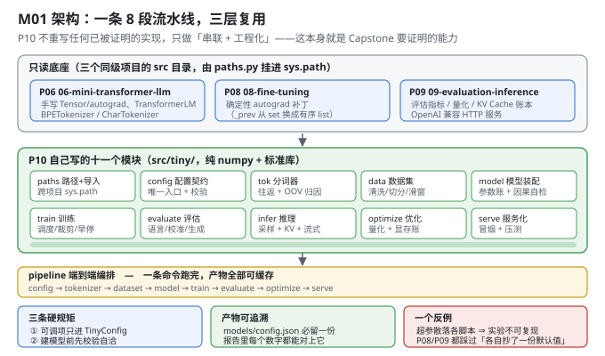
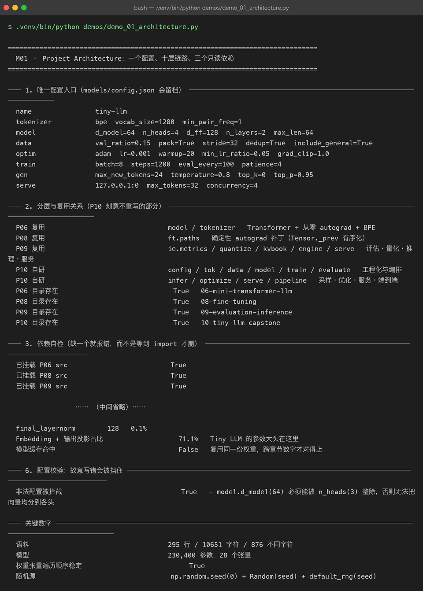

# Milestone 01 — Project Architecture：一个配置、八段链路、三层复用

Capstone 的第一件事不是写模型，而是**定边界**。前面 9 个项目各交付一块能力，但如果把它们堆在一起就开写，最后一定得到一堆"能跑但不可复现"的脚本 —— P08 的 hparams 扫描和 P09 的模型对比都吃过这个亏：两份代码各自抄了一份默认值，跑出来的数字互相矛盾。

所以 M01 只做三件事：**定唯一配置入口、画清复用边界、把依赖缺失变成一句能看懂的报错**。

---

## 1. Why：为什么 Capstone 的第一章是「架构」而不是「模型」

三个必须回答的问题：

1. **哪些是要自己写的？** —— 如果连 Transformer 都重写，那这 10 个项目的关系就断了；如果全部照抄，那 Capstone 就没有独立价值。答案在依赖边界上。
2. **配置从哪来？** —— 超参数散落在各个脚本里，实验就不可复现。这个坑 P08/P09 都踩过。
3. **依赖缺了会怎样？** —— 一份 clone 下来的仓库少了同级项目，是应该在 `paths.py` 给出"缺哪个目录"，还是让某一行 `from model import ...` 抛一个不知所以然的 `ModuleNotFoundError`？

## 2. Design：三条硬规矩 + 三层复用

**复用边界**（`src/tiny/paths.py` 负责挂 `sys.path`）：

| 来源 | 复用什么 | 为什么不重写 |
|---|---|---|
| P06 | `TransformerLM`（含从零 autograd）、`BPETokenizer` / `CharTokenizer` | 手写 autograd 是本仓库最难也最值钱的一块，重写只会引入新 bug |
| P08 | `ft.paths.enable_deterministic_autograd()` | `Tensor._prev` 是 `set`，迭代顺序依赖对象地址 ⇒ 跨进程不可复现。P10 要拿真实数字下结论，必须就地打补丁 |
| P09 | `ie.metrics` / `quantize` / `kvbook` / `engine` / `serve` | 评估指标、量化、KV Cache 账本、OpenAI 兼容服务都已跑通并压测过 |

**自研的十一个模块**：`paths` `config` `tok` `data` `model` `train` `evaluate` `infer` `optimize` `serve` `pipeline`。

**三条硬规矩**（写在 `config.py` 的模块说明里）：

1. 所有可调项只进 `TinyConfig`，任何脚本只能从它读；
2. `TinyConfig.validate()` 在**建模型之前**挡掉不自洽的组合（如 `d_model % n_heads != 0`）；
3. 配置能存成 JSON、能读回来，训练产物目录里**一定留一份** `models/config.json`。



**一个刻意的约定**：`model.vocab_size = 0` 表示"跟着分词器走"。词表大小由分词器决定，而分词器要先看到语料才能训出来 —— 但模型结构配置在写文件时并不知道这个数。所以建模型前统一由 `resolve_vocab_size()` 填实，避免出现"模型词表 1000、分词器词表 1024"这种**能跑但会越界**的隐患。

## 3. Real-run evidence（来自 `demos/out/demo_01_architecture_terminal.txt`）



### 3.1 唯一配置入口（8 行就能看完全部超参）

```text
name                tiny-llm
tokenizer           bpe  vocab_size=1280  min_pair_freq=1
model               d_model=64  n_heads=4  d_ff=128  n_layers=2  max_len=64
data                val_ratio=0.15  pack=True  stride=32  dedup=True  include_general=True
optim               adam  lr=0.001  warmup=20  min_lr_ratio=0.05  grad_clip=1.0
train               batch=8  steps=1200  eval_every=100  patience=4
gen                 max_new_tokens=24  temperature=0.8  top_k=0  top_p=0.95
serve               127.0.0.1:0  max_tokens=32  concurrency=4
```

### 3.2 依赖自检：缺目录时报错要能指到根因

```text
P06 目录存在    True   06-mini-transformer-llm
P08 目录存在    True   08-fine-tuning
P09 目录存在    True   09-evaluation-inference
已挂载 P06 src  True
已挂载 P08 src  True
已挂载 P09 src  True
```

### 3.3 参数账本：第一个能发现配置写错的探针

```text
总参数      230,400
张量数      28
fp64 体积   1.76 MiB

token_embedding      81,920  35.6%
output_projection    81,920  35.6%
transformer_blocks   66,432  28.8%
final_layernorm         128   0.1%
```

**这个数字本身就暴露了一件事**：词嵌入 + 输出投影占掉 71.1%。在 23 万参数的小模型上，"调 d_model"不如"调词表"来得有效 —— M04 会把这个事实展开。

### 3.4 规模是怎么定下来的

```text
语料行数（清洗后）     295   丢弃 短行 0 / 重复 0
字符数 / 不同字符      10651 / 876
train / val 行数      251 / 44
词表大小选择依据        4 特殊 token + 876 基础字符 + 合并 → 1280
```

### 3.5 配置校验：故意写错会被挡住

```text
非法配置被拦截   True
  - model.d_model(64) 必须能被 n_heads(3) 整除，否则无法把向量均分到各头
```

报错里带上**具体数值和原因**，不是一句 "invalid config"。这是能省下最多调试时间的一行代码。

## 4. 踩坑与反直觉发现

1. **`Tensor._prev` 是 `set`，跨进程不可复现。** 它的迭代顺序由对象地址决定，于是"同一份配置 + 同 seed"在不同进程里会得到不同梯度。P08 已经诊断出这一点，P10 在 `paths.py` 里**就地**打补丁（必须在任何 `Tensor` 被创建之前生效，这也是为什么这件事写在 `paths.py` 而不是 `train.py`）。
2. **`Module.parameters()` 漏掉了整个词嵌入。** `TokenEmbedding` 没继承 `Module`，65,536 个参数不在 P06 的参数表里。P10 改用自己写的 `walk_parameters()` 递归遍历，28 个张量一个不漏 —— M06 的检查点"存 28 / 读 28"能对上，靠的就是这个。
3. **"能跑但越界"是最难查的配置错误。** 模型词表 1000、分词器词表 1024，绝大多数 token 都正常，只有少数几个 id 会索引越界。所以 `resolve_vocab_size()` 宁可显式抛错也不允许两者不一致。

## 5. Conclusion

1. Capstone 的复用边界是**明确的**：P06 出模型与分词器、P08 出确定性补丁、P09 出评估/推理/服务组件；P10 自己写的是**工程化与编排**。
2. 一个 `TinyConfig` 管住全部超参，`models/config.json` 每次必留 —— 报告里的每个数字都能追溯。
3. 依赖缺失时给出**带完整路径**的报错，而不是让 `import` 崩在无关的位置。
4. 参数账本 230,400 / 28 张量，其中词表相关占 **71.1%**，这直接决定了后续章节的调参方向。
5. 配置校验在**建模型之前**执行：实测 `d_model=64 / n_heads=3` 会被拦下，报错带上具体数值。

## 6. Code map

| 文件 | 职责 |
|---|---|
| `src/tiny/paths.py` | 路径推导（不硬编码绝对路径）+ 挂 P06/P08/P09 的 `src` + 启用确定性 autograd |
| `src/tiny/config.py` | `TinyConfig` 及六个子配置；`validate()` / `to_json()` / `from_dict()` / `summary_lines()` |
| `src/tiny/__init__.py` | 分层导出的门面；`__version__ = "0.1.0"` |
| `demos/demo_01_architecture.py` | 6 节：唯一配置入口 / 分层与复用 / 依赖自检 / 规模推导 / 参数账本 / 配置校验 |
| `demos/out/demo_01_architecture_terminal.txt` | 本章所有数字的来源 |
| `assets/architecture.svg` | 8 段链路 + 三层复用图 |
| `assets/term-01-architecture.png` | 真实运行截图 |

## 7. Version line

v0.0 → **v0.1**，Capstone 骨架落地。实测：语料 295 行 / 10,651 字符 / 876 个不同字符；模型 230,400 参数 / 28 个张量 / 1.76 MiB(fp64)；词表相关参数占 71.1%；故意写错的配置被 `validate()` 拦下并给出一句话原因。配图 1 张手写 SVG + 1 张真实终端截图。
