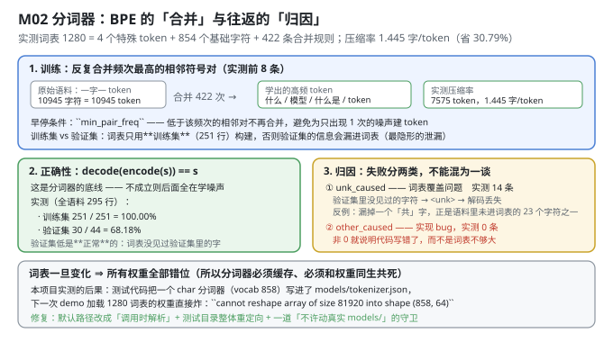
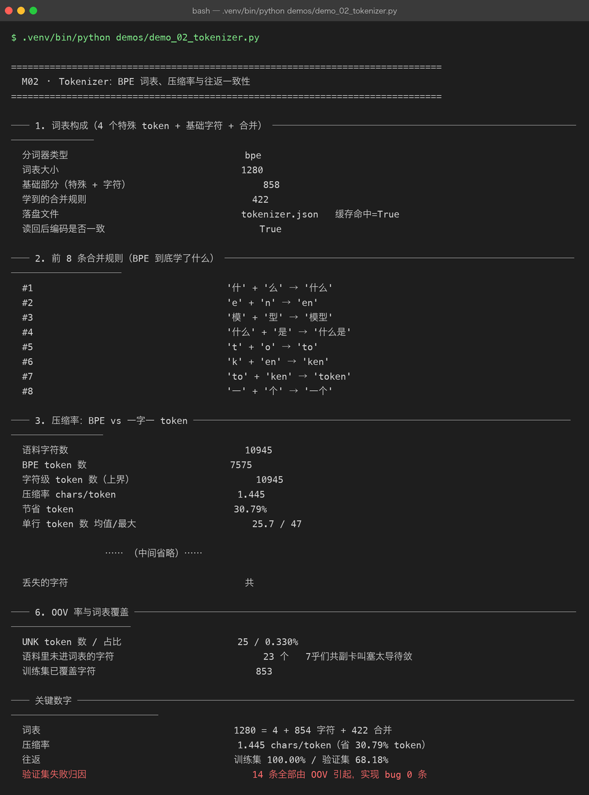

# Milestone 02 — Tokenizer：BPE 的「合并」，以及往返失败的「归因」

M01 定了语料规模（10,651 字符 / 876 个不同字符），也定了词表大小 1280。这一章回答两个问题：

1. **BPE 到底把什么合成了新 token？** —— 直接打印前 8 条合并规则，而不是"信任算法"。
2. **往返失败是词表不够大，还是代码写错了？** —— 这是本章最有价值的一处设计：**失败必须能归因**。

---

## 1. Why：为什么「往返一致性」是分词器的底线

`decode(encode(s)) == s`。如果它不成立，后面所有训练都是在**学噪声** —— 因为模型看到的文本已经被改变了，而你浑然不觉。

但只报一个"通过率 68%"是没有信息量的：它既可能是词表没覆盖验证集里某个生僻字（正常），也可能是代码把两个不同的字塌缩成了同一个 id（严重 bug）。**两者的处理方式完全相反**，所以必须分开报。

## 2. Design：先切分、再训词表；失败按原因分类

**顺序不可颠倒**：`clean → split → build_tokenizer(train_lines)`。用验证集一起训词表等于把验证集的信息泄漏进模型，这是**最隐蔽的泄漏**（P06 也踩过）。

**归因规则**（`tok.roundtrip_report`）：

```python
missing = {ch for ch in line if ch not in vocab}          # 这一行里词表没有的字符
caused_by_unk = bool(missing) and all(ch not in recovered for ch in missing)
```

- `unk_caused` —— 词表覆盖问题。可度量、可接受（要么把字符补进词表，要么承认它就该被 `unk`）。
- `other_caused` —— **实现 bug，必须为 0**。非 0 就说明代码错了，而不是词表不够大。

**BPE 早停**：`min_pair_freq` 控制"低于该频次的相邻符号对不再合并"。不设这个门槛，算法会为只出现 1 次的拼写噪声专门建一个 token —— 那个 token 永远不会被正确使用。



## 3. Real-run evidence（来自 `demos/out/demo_02_tokenizer_terminal.txt`）



### 3.1 词表构成

```text
分词器类型              bpe
词表大小                1280
基础部分（特殊 + 字符）   858
学到的合并规则           422
落盘文件                tokenizer.json   缓存命中=True
读回后编码是否一致        True
```

### 3.2 前 8 条合并规则：BPE 到底学了什么

```text
#1  '什' + '么'   → '什么'
#2  'e'  + 'n'    → 'en'
#3  '模' + '型'   → '模型'
#4  '什么' + '是' → '什么是'
#5  't'  + 'o'    → 'to'
#6  'k'  + 'en'   → 'ken'
#7  'to' + 'ken'  → 'token'
#8  '一' + '个'   → '一个'
```

这 8 行比任何解释都清楚：BPE 先黏出汉字词（什么 / 模型 / 什么是 / 一个），再黏出英文子词（en → ken → token）。所以中文语料上它同时是"词级"和"子词级"的。

### 3.3 压缩率：BPE 存在的意义

```text
语料字符数              10945
BPE token 数           7575
字符级 token 数（上界）   10945
压缩率 chars/token      1.445
节省 token             30.79%
单行 token 数 均值/最大   25.7 / 47
```

### 3.4 切词示例：模型"眼里"的文本

```text
原文      问：什么是 KV Cache？答：KV Cache 缓存已算过的 K 和 V。
token 数  26
pieces = 问 | ： | 什么是 |   | KV |   | Cache | ？ | 答 | ： | KV |   | Cache |   |
         缓存 | 已 | 算 | 过 | 的 |   | K |   | 和 |   | V | 。
```

注意 `什么是` 是一个 token、`KV` 和 `Cache` 各是一个 token、空格是独立 token。模型看到的不是"字"，而是这些统计上高频的块。

### 3.5 往返一致性：训练集 100%，验证集的失败全部有归因

```text
训练集行数 / 成功      251 / 251
训练集通过率          100.00%
验证集行数 / 成功      44 / 30
验证集通过率          68.18%
失败归因：OOV 导致     14
失败归因：其它         0      ← 必须为 0
全部失败都能用 OOV 解释  True

反例原文  训练 BPE 时统计的是相邻符号对的共现频次，合并规则按顺序回放即可复现分词结果
反例还原  训练 BPE 时统计的是相邻符号对的现频次，合并规则按顺序回放即可复现分词结果。
丢失的字符 共
```

**这一节是本章的核心**：29 个失败（14 条验证集行）全部由 OOV 引起，`other_caused = 0`。所以"验证集只有 68% 往返"不是 bug，而是**信息**：它精确告出"验证集里有几个字你从来没教过模型"。

### 3.6 OOV 率与覆盖

```text
UNK token 数 / 占比     25 / 0.330%
语料里未进词表的字符      23 个   7乎们共副卡叫塞太导待敛
训练集已覆盖字符        853
```

这 23 个字符就是"验证集往返失败"的全部原因，而且它们**只出现在训练集之外** —— 这正是"先用训练集训词表"的正确代价。

## 4. 踩坑与反直觉发现

1. **词表一旦变化 ⇒ 所有权重全部错位。** 这不是理论风险，本项目真实踩到：测试代码把 char 分词器（vocab 858）写进了 `models/tokenizer.json`，下一次 demo 加载 1280 词表的权重直接炸：

   ```text
   ValueError: cannot reshape array of size 81920 into shape (858, 64)
   ```

   根因是 `ensure_tokenizer(cfg, texts, path=TOKENIZER_JSON)` 的**默认参数在 `def` 时就绑定好了**，测试里 `monkeypatch.setattr(tok, "TOKENIZER_JSON", ...)` 对它完全无效；而且 `tests/conftest.py` 的 `tmp_models_dir` 只重定向了 `tok.TOKENIZER_JSON`，漏了 `pipeline.TOKENIZER_JSON`（这个名字在两个模块里各有一份）。修复是三件事一起做：默认路径改成**调用时解析** + 逐条登记 `(模块, 常量名)` + 加一道"整轮测试不许动真实 `models/`"的守卫。

2. **压缩率不是越高越好。** 词表越大压缩率越高，但 OOV 越少 × 词表越大 = 参数越多。M04 会算出：词表相关的参数占 71.1%。词表大小是**参数预算与压缩率的权衡**，不是单调优化目标。

3. **`roundtrip_report` 只返回前 5 条反例**，但要给出失败总数与归因计数。否则一个小 bug 会淹没在几百条样例里，或者反过来，你会以为"只有 5 条失败"。

## 5. Conclusion

1. 词表 1280 = 4 个特殊 token + 854 个基础字符 + **422 条合并规则**；压缩率 **1.445 字/token，省 30.79% token**。
2. 训练集往返 **251 / 251 = 100.00%**；验证集 30 / 44 = 68.18%，其中 **14 条全部由 OOV 引起、实现 bug 0 条**。
3. 归因机制让"68% 通过率"从"看起来有 bug"变成"可解释的覆盖率事实"。
4. 语料里有 **23 个字符没进词表**，于是 UNK 占 0.330%，并直接造成那 14 条验证集往返失败 —— 这就是验证集指标的上限来源之一。
5. 真实踩坑：分词器缓存被测试污染会以 `cannot reshape` 的形式在**别的章节**爆出来。缓存路径必须可被测试重定向，并且要有一道守卫。

## 6. Code map

| 文件 | 职责 |
|---|---|
| `src/tiny/tok.py` | `build_tokenizer` / `save_tokenizer` / `load_tokenizer` / `ensure_tokenizer`（缓存）/ `roundtrip_report`（**带归因**）/ `tokenizer_stats` / `oov_chars` |
| `src/tiny/data.py` | `clean_lines` / `split_lines`（供"先切分再训词表"使用） |
| `demos/demo_02_tokenizer.py` | 6 节：词表构成 / 前 8 条合并 / 压缩率 / 切词示例 / 往返与归因 / OOV 覆盖 |
| `demos/out/demo_02_tokenizer_terminal.txt` | 本章所有数字的来源 |
| `assets/tokenizer.svg` | BPE 合并 + 往返归因图（含真实缓存污染事故） |
| `assets/term-02-tokenizer.png` | 真实运行截图 |

## 7. Version line

v0.1 → **v0.2**，分词器落地并完成归因化验证。实测：词表 1280（4 + 854 字符 + 422 合并）；压缩率 1.445 字/token（省 30.79% token）；训练集往返 100.00%、验证集 68.18%，**14 条失败全部由 OOV 解释、实现 bug 0 条**；UNK 率 0.330%。并定位并修复"测试污染 `models/tokenizer.json`"导致的跨章节 `cannot reshape` 事故。配图 1 张手写 SVG + 1 张真实终端截图。
