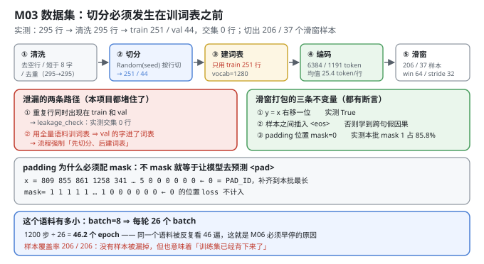
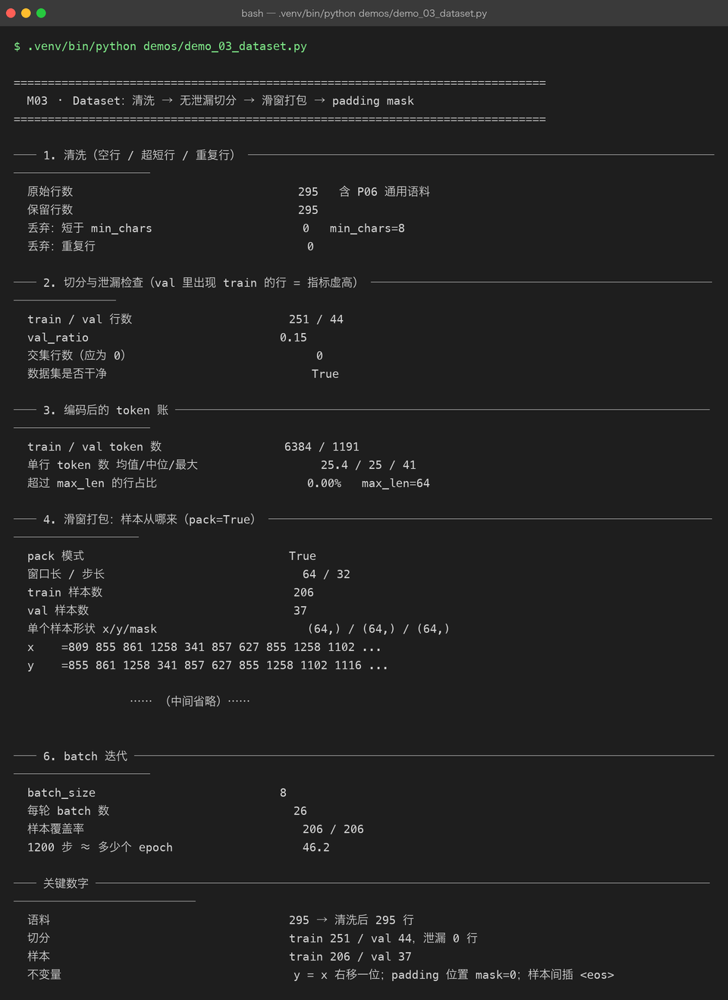

# Milestone 03 — Dataset：切分必须发生在训词表之前

M02 解决了"文本怎么变成 id"。这一章解决"id 怎么变成训练样本"，而它的核心不是滑窗，是**两条泄漏路径**：

1. **重复行**同时出现在 train 和 val —— 验证指标会虚高，因为模型"见过"其中一份。
2. **用全量语料训词表** —— 验证集里的字符提前进了词表，等于是把答案的字母表给了模型。

第二条比第一条隐蔽得多，而且 M02 已经证明它**确实发生了**（验证集有 23 个字符在词表之外）。

---

## 1. Why：样本的等价性写成不变量，而不是"应该没错"

滑窗打包很容易写出"看起来对"的实现。所以本章把三条不变量做成**可断言的事实**：

1. `y = x` 右移一位（语言模型的定义）；
2. 样本之间插入 `<eos>`（否则最后一位的下一 token 是下一行开头，模型会学到**跨句子的假因果**）；
3. padding 位置的 `mask = 0`（不 mask 就等于让模型去预测 `<pad>`）。

不变量能被断言，就说明它不是"我记得应该这样"。

## 2. Design：五步流水线 + 两条泄漏护栏

```text
① 清洗（去空行 / 短于 min_chars / 去重）
② 切分（Random(seed) 按行切 → train / val）
③ 建词表（只用 train_lines）      ← 泄漏护栏 #1
④ 编码（train_ids / val_ids）
⑤ 滑窗打包（pack=True，window=max_len，stride）
```

**泄漏护栏**：

- `leakage_check(train, val)` 直接求交集，非空就抛错（`build_dataset` 里的硬检查）；
- 流程顺序强制"先 ② 后 ③"，`build_dataset` 内部不接受外部传入的 tokenizer 之外的口子。

**两种样本构造**（`make_examples`）：

- `pack=True` —— 把语料首尾相接再滑窗，样本几乎全是有效 token，**少 padding**；本项目选它。
- `pack=False` —— 每行一个样本，行短就大量 padding，浪费算力。



## 3. Real-run evidence（来自 `demos/out/demo_03_dataset_terminal.txt`）



### 3.1 清洗

```text
原始行数            295   含 P06 通用语料
保留行数            295
丢弃：短于 min_chars 0   min_chars=8
丢弃：重复行          0
```

清洗"什么都没删"也是有用信息：它说明这份语料质量本身是干净的，后面所有数字都没有被清洗动作影响。

### 3.2 切分与泄漏检查

```text
train / val 行数     251 / 44
val_ratio          0.15
交集行数（应为 0）     0
数据集是否干净        True
```

### 3.3 编码后的 token 账

```text
train / val token 数   6384 / 1191
单行 token 数 均值/中位/最大  25.4 / 25 / 41
超过 max_len 的行占比   0.00%   max_len=64
```

**单行最长 41 < max_len 64** ⇒ 截断率 0%。这一行很重要：如果截断率很高，滑窗会把句子尾巴全切掉，而 `y` 却还在提示"预测下一 token"。

### 3.4 滑窗打包

```text
pack 模式                True
窗口长 / 步长             64 / 32
train 样本数             206
val 样本数               37
单个样本形状 x/y/mask     (64,) / (64,) / (64,)

x    =809 855 861 1258 341 857 627 855 1258 1102 ...
y    =855 861 1258 341 857 627 855 1258 1102 1116 ...
y 是否等于 x 右移一位       True
样本之间插入 <eos>        True   不插的话模型会学到跨句子的假因果
```

### 3.5 padding 与 mask

```text
batch 形状            (4, 30)   batch=4, 长度按本批最长补齐
padding 用的 id       0
mask 中 1 的比例       85.8%   其余位置 loss 不计入
mask[0] = 1 1 1 1 1 ... 1 0 0 0 0 0 0
x[0]    = 809 855 861 1258 341 ... 5 23 21 0 0 0 0 0 0
```

`85.8%` 是 `pack=True` 的直接收益：一格里只有 14.2% 是 padding。换成"每行一个样本"，短行一多这个数字会掉到 50% 以下。

### 3.6 batch 迭代与语料规模

```text
batch_size        8
每轮 batch 数       26
样本覆盖率          206 / 206
1200 步 ≈ 多少个 epoch   46.2
```

**46.2 个 epoch** 是本章最刺眼的数字：1200 步训练里，同一份 206 个样本被反复看了 46 遍。这不是 bug，是语料太小 —— M06 的过拟合曲线和早停机制，根因就写在这里。

## 4. 踩坑与反直觉发现

1. **"清洗没删任何东西"也要报出来。** 如果清洗悄悄删掉了 40% 的行，后面所有"语料 295 行"的论述就都是错的。统计是证据的一部分。
2. **`<eos>` 不插，模型会学到跨句假因果。** 滑窗把 `...答：模型会以 token token。` 和下一行 `问：什么是 RAG？答：...` 接在一起，`y` 就会在两个完全不同的话题之间求"下一 token"。这类错误在 loss 曲线上**完全看不出来**。
3. **padding id 用 0 是危险的默认值。** 如果 0 同时也是某个真实 token 的 id，mask 写错就会静默地教模型预测一个不存在的词。本项目显式定义了 `PAD_ID`，并在 demo 里断言"padding 位置确实用了 PAD_ID"。
4. **`val_ratio=0.15` 在 295 行上只切出 44 行**，其中「问：…答：…」的完整问答对只剩 7 对（M07 用到）。小语料上，验证集能承载的评测能力比想象中弱得多。

## 5. Conclusion

1. 五步流水线：清洗（295 → 295）→ 切分（251 / 44）→ 建词表（**只用 train**）→ 编码（6384 / 1191 token）→ 滑窗（206 / 37 样本）。
2. **泄漏两条路都堵住了**：重复行交集 0；词表只用训练集，验证集的 23 个 OOV 字符就是护栏生效的证据。
3. 三条不变量全部有断言：`y = x 右移一位` True；样本间插 `<eos>` True；padding 位置 `mask=0`（本批 1 占 85.8%）。
4. 截断率 **0.00%**（单行最长 41 < max_len 64），所以滑窗没有丢句子尾巴。
5. **1200 步 = 46.2 个 epoch** —— 这个数字预告了 M06 的过拟合，也是"小语料上必须早停"的定量依据。

## 6. Code map

| 文件 | 职责 |
|---|---|
| `src/tiny/data.py` | `load_corpus` / `clean_lines` / `split_lines` / `leakage_check` / `make_examples`（两种打包）/ `pad_batch` / `batch_iter` / `build_dataset` / `dataset_report` |
| `demos/demo_03_dataset.py` | 6 节：清洗 / 切分与泄漏 / token 账 / 滑窗打包 / padding mask / batch 迭代 |
| `demos/out/demo_03_dataset_terminal.txt` | 本章所有数字的来源 |
| `assets/dataset.svg` | 五步流水线 + 两条泄漏路径 + 三条不变量 |
| `assets/term-03-dataset.png` | 真实运行截图 |

## 7. Version line

v0.2 → **v0.3**，数据集落地且泄漏被显式证伪。实测：清洗无丢弃（295 → 295）；train 251 / val 44、交集 **0** 行；编码 6384 / 1191 token，截断率 0.00%；滑窗产出 206 / 37 个样本，`y = x 右移一位`、样本间插 `<eos>`、padding `mask=0`（mask 有效率 85.8%）三条不变量全部成立。并量出 1200 步 ≈ **46.2 个 epoch**，为 M06 的早停提供定量依据。配图 1 张手写 SVG + 1 张真实终端截图。
