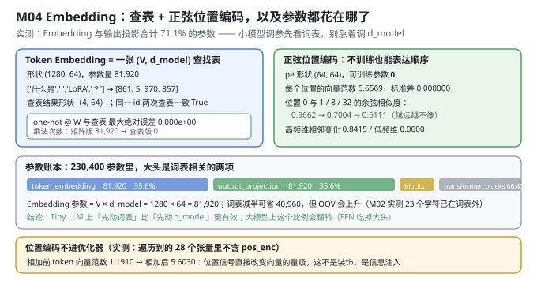
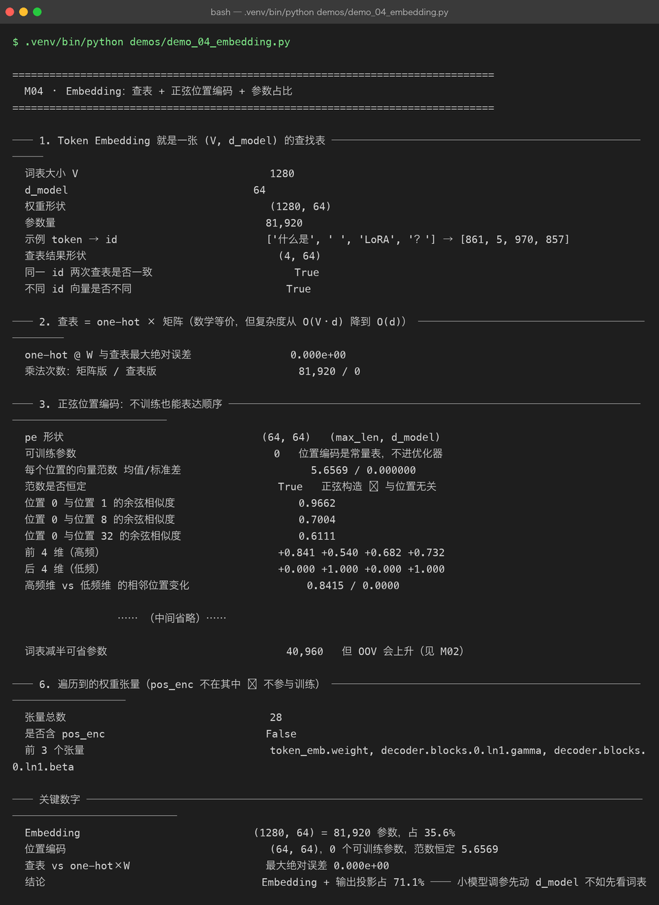

# Milestone 04 — Embedding：查表 + 正弦位置编码，以及参数都花在哪了

M03 把文本变成了 `(64,)` 的 id 序列。这一章把它变成 `(B, T, 64)` 的向量：**token embedding 一次查表 + 位置编码一次相加**。

本章的结论是定量的，而且会直接影响后续调参方向：**词嵌入与输出投影合计占掉 71.1% 的参数**。在 23 万参数的小模型上，"先看词表"比"先动 d_model"更有效。

---

## 1. Why：两件事必须被证明，而不是被相信

1. **"查表"和"one-hot × W"必须数学等价。** 这是 embedding 层的定义。如果不等价，说明有人在查表逻辑里动了手脚（缩放、归一化），而模型学到的东西就和你以为的不一样。
2. **位置编码不能进优化器。** 正弦位置编码是**常量表**，不是可训练参数。如果它被误当成参数交给 Adam，模型会去"学习位置"，而它本来已经有一个正确的解析解 —— 更糟的是，它还会被算进参数量，让你对模型规模判断失误。

## 2. Design：一次查表 + 一次相加

**前向**（`P06` 的 `TokenEmbedding`）：

```text
x: (B, T) int64
  → token_emb.weight[x]          # (B, T, d_model)，一次花 O(d) 的查表
  → + pos_enc[:T]                # (T, d_model)，常量表，直接相加
  = (B, T, d_model)
```

**为什么"查表 ≠ one-hot × W"要专门证明**：one-hot 矩阵是 `(V, V)`，乘一次是 `O(V·d)`；查表是 `O(d)`。V=1280 时差 1280 倍。这不是"优化技巧"，是**为什么 embedding 层能存在**的原因。



## 3. Real-run evidence（来自 `demos/out/demo_04_embedding_terminal.txt`）



### 3.1 Token Embedding 就是一张查找表

```text
词表大小 V     1280
d_model      64
权重形状       (1280, 64)
参数量        81,920
示例 token → id   ['什么是', ' ', 'LoRA', '？'] → [861, 5, 970, 857]
查表结果形状    (4, 64)
同一 id 两次查表是否一致  True
不同 id 向量是否不同      True
```

### 3.2 查表 = one-hot × 矩阵（等价性实测）

```text
one-hot @ W 与查表最大绝对误差   0.000e+00
乘法次数：矩阵版 / 查表版        81,920 / 0
```

误差是**精确的 0**（fp64 下逐位相同），乘法次数差 81,920 倍。这两行加起来才说明"查表是同一件事的正确实现"。

### 3.3 正弦位置编码：不训练也能表达顺序

```text
pe 形状                      (64, 64)   (max_len, d_model)
可训练参数                    0          位置编码是常量表，不进优化器
每个位置的向量范数 均值/标准差    5.6569 / 0.000000
范数是否恒定                   True       正弦构造 ⇒ 与位置无关
位置 0 与位置 1 的余弦相似度      0.9662
位置 0 与位置 8 的余弦相似度      0.7004
位置 0 与位置 32 的余弦相似度     0.6111
前 4 维（高频）                +0.841 +0.540 +0.682 +0.732
后 4 维（低频）                +0.000 +1.000 +0.000 +1.000
高频维 vs 低频维 的相邻位置变化    0.8415 / 0.0000
```

三条可验证的性质：

- **范数恒定 5.6569**（= √32，2 个 1.0 加上其余正弦分量的合成）且标准差恰好 0 —— 位置不改变向量的长度，只改变方向。
- **相似度随距离单调下降**（0.9662 → 0.7004 → 0.6111）：位置越远，编码越不相似。
- **高频维的变化远大于低频维**（0.8415 vs 0.0000）：这正是"多分辨率"设计的目的 —— 低频维给粗粒度绝对位置，高频维给细粒度相对差异。

### 3.4 combine：Embedding + 位置编码直接相加

```text
combine 输出形状          (1, 4, 64)
是否等于 emb + pe         0.000e+00
相加前 token 向量范数      1.1910
相加后向量范数            5.6030
```

**相加前 1.19 → 相加后 5.60**：位置信号改变了向量的量级，所以这不是装饰，是**信息注入**。也所以"位置编码的幅度"会和 embedding 初始化尺度耦合 —— 这是后面所有 LN 存在的理由之一。

### 3.5 参数大头在哪

```text
token_embedding      81,920  35.6%
output_projection    81,920  35.6%
transformer_blocks   66,432  28.8%
final_layernorm         128   0.1%

Embedding 参数 = V × d_model = 1280 × 64 = 81,920
词表减半可省参数 = 40,960（但 OOV 会上升，见 M02）
两者合计 71.1%
```

### 3.6 位置编码不在参数表里

```text
张量总数        28
是否含 pos_enc  False
前 3 个张量      token_emb.weight, decoder.blocks.0.ln1.gamma, decoder.blocks.0.ln1.beta
```

28 个张量里没有 `pos_enc` —— 这是"它不进优化器"的**可执行证据**，而不是口头承诺。

## 4. 踩坑与反直觉发现

1. **词表是"参数预算"里的隐形大头。** 大模型上 FFN 会主导参数量，所以很多人形成了"参数都在 FFN"的直觉。但在 23 万参数的小模型上，`V × d_model` 一项就占 35.6%。**词表大小是一个可以调的超参**，而且它同时影响参数量、压缩率、OOV 率三件事。
2. **位置编码的幅度会改变向量量级。** 实测范数从 1.19 跳到 5.60。如果 embedding 初始化尺度很大，位置信号会被淹没；如果很小，位置会主导。这也是 Transformer 必须在每个子层前做 LN 的原因之一。
3. **"每个位置的范数恒定"是正弦构造的副产品，不是设计目标。** 但它让不同位置的编码"可比" —— 这是一个几乎白拿的性质，也是它比"可学习位置编码"更抗过拟合的地方（0 个参数 vs `max_len × d_model` 个参数）。
4. **低频维在相邻位置上几乎不变（0.0000）。** 初看像缺陷，实际上是设计：那几维负责区分"远距离的位置段"，高频维负责区分"相邻位置"。用一条"相邻变化量"去看整体，会得出错误结论。

## 5. Conclusion

1. `(1280, 64)` 的查找表 = 81,920 参数，占全模型 **35.6%**；与输出投影合计 **71.1%**。
2. 查表与 `one-hot @ W` 最大绝对误差 **0.000e+00**，乘法次数 81,920 → 0。
3. 位置编码 `(64, 64)`、**0 个可训练参数**、每位置范数恒定 **5.6569**，且相似度随距离单调下降（0.9662 → 0.7004 → 0.6111）。
4. Embedding 与位置编码直接相加（误差 0.000e+00），相加后向量范数 1.1910 → 5.6030。
5. 遍历到的 28 个张量**不含** `pos_enc` ⇒ 常量表确实没进优化器。
6. 直接结论：**在 Tiny LLM 上，先动词表比先动 d_model 更有效**（词表减半即可省 40,960 参数），但代价是 OOV 上升 —— 这是一个真实的权衡，不是单向优化。

## 6. Code map

| 文件 | 职责 |
|---|---|
| `src/tiny/model.py` | `build_model`（唯一构造入口）/ `walk_parameters`（递归遍历，**不漏词嵌入**）/ `parameter_report`（分组参数账）/ `forward_sanity`（因果性自检）`/ set_seed` |
| P06 `model/embeddings.py` | `TokenEmbedding`（查表）+ 正弦 `pos_enc`（常量表，不注册为 Parameter） |
| `demos/demo_04_embedding.py` | 6 节：查表 / 等价性 / 位置编码性质 / combine / 参数占比 / 张量清单 |
| `demos/out/demo_04_embedding_terminal.txt` | 本章所有数字的来源 |
| `assets/embedding.svg` | 查表 + 位置编码 + 参数占比条 |
| `assets/term-04-embedding.png` | 真实运行截图 |

## 7. Version line

v0.3 → **v0.4**，Embedding 层落地并被量化。实测：`(1280, 64)` = 81,920 参数占 35.6%，与输出投影合计 **71.1%**；查表 vs `one-hot @ W` 误差 **0.000e+00**（乘法 81,920 → 0）；位置编码 0 个可训练参数、每位置范数恒为 5.6569、位置 0↔1/8/32 相似度 0.9662 / 0.7004 / 0.6111；`combine` 后范数 1.1910 → 5.6030；28 个张量中不含 `pos_enc`。配图 1 张手写 SVG + 1 张真实终端截图。
