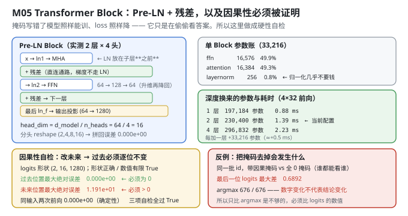
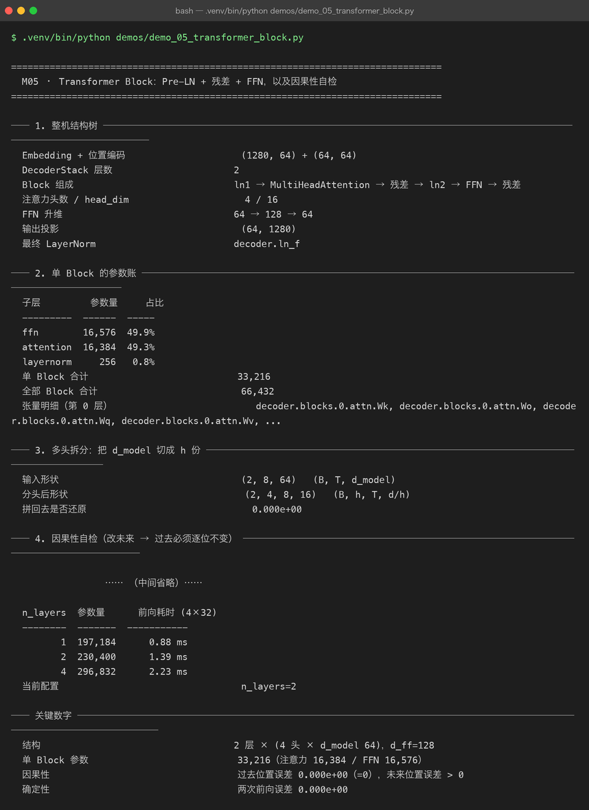

# Milestone 05 — Transformer Block：Pre-LN + 残差 + FFN，以及因果性必须被证明

M04 把 id 变成了 `(B, T, 64)` 的向量。这一章把这堆向量送进**真正干活的那一层**：`ln → 注意力 → 残差 → ln → FFN → 残差`。

本章的核心不是"把结构画出来"，而是**证明一个几乎无法用肉眼发现的错误不存在**：因果掩码。它写错了，模型照样能训、loss 照样会降、验证集指标照样好看——只是它在偷偷看答案。所以这里把它做成一条硬性自检。

---

## 1. Why：三个必须被证明的不变量

一个 Decoder Block 里有三处"写错了也不会崩"的地方：

1. **因果性。** 位置 `t` 的输出只能依赖 `≤ t` 的输入。判据很干净：**把第 `t` 个位置之后的 token 全改掉，第 `t` 个及之前的 logits 必须逐位不变**。误差是精确的 0，不是"很小"。
2. **确定性。** 同一输入跑两次必须逐位相同。这是 P08 那个确定性补丁生效的前提——`Tensor._prev` 如果是 `set`，反向传播的加法顺序随对象地址变，跨进程就不可复现。
3. **多头拆分的可逆性。** 把 `d_model` 切成 `h` 份再拼回来，必须还原。这一步错了不会报错，只会让每个头学到"残缺的、交错的信息"。

三条都不靠"我读代码看对了"，靠**对着数字验**。

## 2. Design：Pre-LN 的顺序是有代价的

```text
x (B, T, d_model)
  ├─ h = x
  ├─ h = ln1(h)                    # LN 在子层**之前**
  ├─ h = MultiHeadAttention(h)     # ← 因果掩码在这一层里加
  ├─ x = x + h                     # 残差：直连通路，梯度不经过 LN
  ├─ h = ln2(x)
  ├─ h = FFN(h)                    # 64 → 128 → 64
  └─ x = x + h                     # 残差 → 下一层
```

**为什么是 Pre-LN（LN 放子层前面）而不是 Post-LN**：Post-LN 里梯度要先穿过 LN 才回到残差，深模型上训练初期容易不稳；Pre-LN 让残差通路**完全不经过归一化**，梯度可以直连到最底层。代价是每层输出的量级会随深度累积，所以最后需要一个 `ln_f` 兜底——这就是输出投影前那个 LayerNorm 存在的理由。

多头拆分的形状变换（`P06` 的 `MultiHeadAttention`）：

```text
(B, T, d_model)  →  reshape  →  (B, T, h, d/h)  →  transpose  →  (B, h, T, d/h)
```

`head_dim = d_model / n_heads = 64 / 4 = 16`。**拆的是"通道维"，不是"批次维"** —— 所以 reshape 之后必须 transpose，让 `h` 和 `T` 换个位置，之后才能对 `T` 做 softmax。



## 3. Real-run evidence（来自 `demos/out/demo_05_transformer_block_terminal.txt`）



### 3.1 结构树

```text
Embedding + 位置编码    (1280, 64) + (64, 64)
DecoderStack 层数       2
Block 组成              ln1 → MultiHeadAttention → 残差 → ln2 → FFN → 残差
注意力头数 / head_dim    4 / 16
FFN 升维               64 → 128 → 64
输出投影                (64, 1280)
最终 LayerNorm          decoder.ln_f
```

### 3.2 单 Block 的参数账：注意力与 FFN 几乎平分

```text
子层         参数量     占比
---------  ------  -----
ffn        16,576  49.9%
attention  16,384  49.3%
layernorm     256   0.8%
单 Block 合计    33,216
全部 Block 合计  66,432
```

这一条值得停一下：**在大模型上 FFN 通常占绝大多数参数（往往是注意力的 2 倍以上），但在这里两者几乎相等（49.9% vs 49.3%）。**

原因是 FFN 的参数量按 `2 × d_model × d_ff` 算，注意力按 `4 × d_model²` 算。令两者相等，解出 `d_ff = 2 × d_model`。当前配置恰好是 `d_ff = 128 = 2 × 64` —— 所以它们必然平分。**大模型之所以 FFN 占大头，是因为它们的 `d_ff/d_model` 通常取 4**（GPT 系列），4 > 2，FFN 自然翻倍。

也就是说，"参数都在 FFN"这个直觉**不是普遍规律，而是 `d_ff/d_model = 4` 这个具体选择的后果**。在 `d_ff = 2×d_model` 的配置下，两者就是平手。这也是本章唯一一处会改变你对"模型长什么样"的认知的地方。

### 3.3 多头拆分：拆了还能拼回去

```text
输入形状        (2, 8, 64)     (B, T, d_model)
分头后形状      (2, 4, 8, 16)  (B, h, T, d/h)
拼回去是否还原   0.000e+00
```

还原误差是**精确的 0**。`transpose → reshape` 这一步看似只是搬数据，但顺序错了（比如漏了 transpose 就 reshape）就是另一套语义，而它不会报错。

### 3.4 因果性自检：改未来 → 过去必须逐位不变

```text
logits 形状                   (2, 16, 1280)
形状正确 / 数值有限             True / True
改未来后：过去位置最大绝对误差     0.000e+00   必须为 0
改未来后：未来位置最大绝对误差     1.191e+01   必须 > 0
同输入两次前向最大绝对误差        0.000e+00
三项自检是否全部通过             True
```

自检的做法是：取一段 16 长度的输入，把**后 8 个位置**的 token 全部加 7 再取模（换成完全不同的词），然后比较前后两次前向：

- **前 8 个位置的 logits 误差 0.000e+00** —— 改未来完全不影响过去。这是因果掩码正确的**判据**。
- **后 8 个位置的 logits 误差 1.191e+01** —— 未来**必须**变。如果这里也是 0，说明注意力压根没起作用（比如权重全 0、或者残差把子层短路了），那是另一种坏掉。

**两条都要满足，只看一条会漏。** 只验"过去不变"，一个把注意力输出全置 0 的实现也能通过。

### 3.5 反例：把掩码去掉会发生什么

只验上面两条还不够——万一掩码本来就"全开"，过去不变也可能碰巧成立（比如序列很短）。所以做一个反向实验：**用全 0 掩码**（谁都能看谁）跑同一批 id。

```text
带因果掩码 vs 不带掩码，最后一位 logits 最大差    0.6892
带掩码 / 不带掩码 的 argmax                 676 / 676
```

**两个数字要连起来读**：logits 的数值差到了 0.6892（确实被作弊影响了），**但 argmax 是同一个 676**。

这就是最阴的地方：**如果只检查"预测出来的那个 token 对不对"，这个错误会被完全漏掉。** 数值全错了，结论却没变。所以自检必须比 **logits 的数值**，不能比 argmax。掩码一旦失效，模型在训练时会持续看到"答案"，损失会降得更快、验证指标会虚高，而你在推理时用不到那些未来信息——**训练和推理之间就断了一根线**。

### 3.6 层数对照：深度换来的参数与耗时

```text
n_layers  参数量      前向耗时 (4×32)
--------  -------  -----------
       1  197,184      0.88 ms
       2  230,400      1.39 ms
       4  296,832      2.23 ms
当前配置    n_layers=2
```

每加一层恒增 **33,216** 参数（即单 Block 参数量），耗时增加约 0.5 ms。**参数是线性长的，耗时也是线性长的**——在纯 numpy 的 CPU 实现上，没有 GPU 那种"深度几乎免费、宽度很贵"的特性。这也是后面 M09 量化能拿到 3.85× 加速的原因：算力瓶颈就在这些矩阵乘上，而它们可以被压到低精度。

## 4. 踩坑与反直觉发现

1. **"参数都在 FFN"不是规律，是 `d_ff/d_model = 4` 的后果。** 令 `2·d·d_ff = 4·d²` 得 `d_ff = 2d`。当前 `d_ff = 2d`，所以 FFN 与注意力参数几乎相等（49.9% vs 49.3%）。换成 GPT 的 `d_ff = 4d`，FFN 立刻翻倍。**记住这个比例，比记住"FFN 大"有用。**
2. **因果性自检必须双向验证。** 只验"过去不变"是不够的——一个注意力恒输出 0 的实现也能过。必须同时要求"未来**必须变**"（实测 1.191e+01），两条一起才锁死。
3. **argmax 相等 ≠ 模型没被污染。** 去掉掩码后，最后一位 logits 最大差 0.6892，但 argmax 依然是 676。**这就是为什么自检要比数值。** 任何"只看最终预测对不对"的测试，在掩码这类结构错误面前都是盲的。
4. **多头拆分错在 transpose 上，不会报错。** `(B,T,h,d/h)` 直接 reshape 回 `(B,T,d_model)` 在形状上完全合法，但语义已经变了（相当于把不同头的通道交错混在一起）。只有"拆完再拼、误差是否为 0"这一个检查能抓住它——这就是 3.3 那一行存在的意义。
5. **Pre-LN 需要 `ln_f` 收尾，Post-LN 不需要。** 因为残差通路不经过 LN，输出量级会随层数累积。这不是"多加一层更保险"，是结构选择的必然配套。

## 5. Conclusion

1. 结构：**2 层 × (4 头 × d_model 64)，d_ff = 128**，单 Block **33,216** 参数（注意力 16,384 / FFN 16,576 / LN 256），全部 Block 合计 66,432。
2. **注意力与 FFN 参数几乎相等（49.3% vs 49.9%）**，因为 `d_ff = 2 × d_model`。这是配置的后果，不是普遍规律。
3. 多头拆分还原误差 **0.000e+00**；`head_dim = 16`。
4. 因果性：**过去位置误差 0.000e+00（必须为 0），未来位置误差 1.191e+01（必须 > 0）**；同输入两次前向 **0.000e+00**；三项自检全部通过。
5. 反例证明：去掉掩码后最后一位 logits 最大差 **0.6892**，但 argmax 仍为 **676** ⇒ **只比 argmax 会漏掉这类错误，必须比数值**。
6. 层的代价是线性的：每层 +33,216 参数、+0.5 ms（4×32 前向）。当前 230,400 参数、1.39 ms。

## 6. Code map

| 文件 | 职责 |
|---|---|
| `src/tiny/model.py` | `forward_sanity`（三条不变量：形状 / 因果 / 确定）/ `build_model` / `walk_parameters` / `parameter_report` |
| P06 `model/decoder.py` | `DecoderStack` / `Block`（Pre-LN + 残差）/ `ln_f` |
| P06 `model/attention.py` | `MultiHeadAttention`（拆头 reshape + 因果掩码在此生效） |
| P08 `src/ft/paths.py` | `enable_deterministic_autograd()`（把 `_prev` 从 set 改成有序 list） |
| `demos/demo_05_transformer_block.py` | 6 节：结构树 / 参数账 / 多头拆分 / 因果自检 / 掩码反例 / 层数对照 |
| `demos/out/demo_05_transformer_block_terminal.txt` | 本章所有数字的来源 |
| `assets/transformer-block.svg` | Pre-LN 结构 + 参数账 + 因果自检 + 反例 |
| `assets/term-05-transformer-block.png` | 真实运行截图 |

## 7. Version line

v0.4 → **v0.5**，Transformer Block 结构落地并被逐项验真。实测：2 层 × 4 头 × d_model 64、d_ff=128；单 Block **33,216** 参数（attention 16,384 / FFN 16,576 / LN 256），**注意力与 FFN 平手（49.3% vs 49.9%）**，因为 `d_ff = 2·d_model`；多头拆分还原误差 **0.000e+00**；因果性过去位置 **0.000e+00** / 未来位置 **1.191e+01** / 确定性 **0.000e+00**，三项自检全过；掩码反例：最后一位 logits 最大差 **0.6892** 但 argmax 同为 **676**（⇒ 必须比数值）；深度 1/2/4 层 → 197,184 / 230,400 / 296,832 参数与 0.88 / 1.39 / 2.23 ms。配图 1 张手写 SVG + 1 张真实终端截图。
