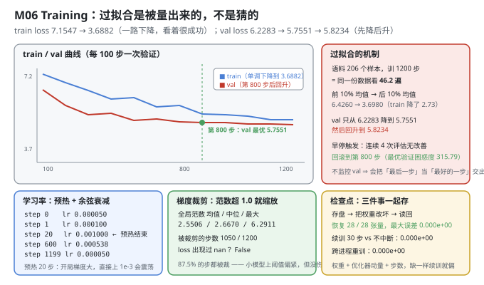
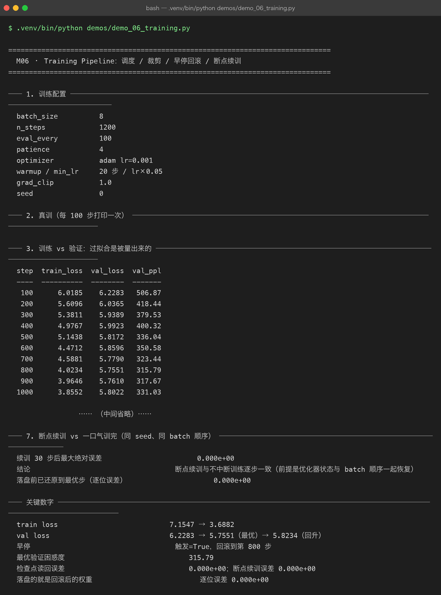

# Milestone 06 — Training：过拟合是被量出来的，不是猜的

M05 证明了这个结构是**可用的**（因果正确、确定性成立）。这一章让它**真的学起来**，并且回答一个训练里最容易自欺的问题：**你交出去的那份权重，是不是"最好"的那份？**

本章的结论有点扎心：train loss 从 7.1547 一路降到 3.6882，看着是个成功故事；但 **val loss 在第 800 步触底后开始回升**。如果不监控验证集，你交付的会是"第 1200 步"而不是"第 800 步"——前者更差。

---

## 1. Why：训练里三个"看着对、其实错"的地方

1. **train loss 单调下降 = 过拟合正在发生。** 它不是好消息，是一个警报。唯一能发现它的手段是**每次评估都在验证集上量一遍**——也就是必须有一套独立、未参与训练的数据。
2. **检查点只存权重是不够的。** Adam 有动量（一阶、二阶），它们携带"过去梯度方向"的信息。只恢复权重、把动量清零，等价于让优化器"失忆"——续训的前几十步会明显偏离不中断训练。
3. **"可复现"必须跨进程验证。** 同一进程里重跑一遍，往往因为内存地址复用而"看起来"一致。真正的判据是**两个独立进程**跑出逐位相同的权重——这正是 P08 那个补丁的来源。

## 2. Design：一条完整的训练闭环

```text
for step in range(n_steps):
    lr = cosine_with_warmup(step)        # 预热 20 步 → 升到 1e-3 → 余弦衰减到 5e-5
    batch = next(batch_iter(...))        # 滑动窗口打包过的 (x, y, mask)
    loss = forward + backward(batch)
    clip_global_norm(grad, max_norm=1.0) # 全局范数超阈就整体缩放
    optimizer.step()
    if step % eval_every == 0:
        val_loss = evaluate(val_examples)
        if val_loss < best:  snapshot()  # 记住"最好那一刻"的权重
        elif patience_exceeded: break    # 连续 4 次无改善 → 早停
restore_best()                           # 关键：回滚到最优步，而不是停在最后一步
```

三个组件各自解决一个问题：

- **预热 + 余弦调度**：开局梯度大，直接上 `1e-3` 容易震荡，所以先线性升；后期余弦平滑降，避免在最优附近来回跳。
- **全局范数裁剪**：把所有参数的梯度拼成一个向量，算它的 L2 范数，超阈就整体按比例缩。**"全局"是关键**——按单个张量裁会破坏各层之间的相对尺度。
- **早停 + 回滚**：早停不是"停下就算完"，而是**回滚到最优检查点**。停在哪一步和交付哪一份权重，是两件事。

`batch_iter` 用的是 M03 的滑动窗口打包：`y = x` 右移一位、样本间插 `<eos>`、padding 位 `mask=0`。所以每次 `train_step` 拿到的都是 `(B, T)` 的 id 和对应 mask。



## 3. Real-run evidence（来自 `demos/out/demo_06_training_terminal.txt`）



### 3.1 训练配置

```text
batch_size    8
n_steps       1200
eval_every    100
patience      4
optimizer     adam lr=0.001
warmup / min_lr  20 步 / lr×0.05
grad_clip     1.0
seed          0
```

### 3.2 train 与 val 的分道扬镳

```text
step  train_loss  val_loss  val_ppl
----  ----------  --------  -------
 100      6.0185    6.2283   506.87
 200      5.6096    6.0365   418.44
 300      5.3811    5.9389   379.53
 400      4.9767    5.9923   400.32
 500      5.1438    5.8172   336.04
 600      4.4712    5.8596   350.58
 700      4.5881    5.7790   323.44
 800      4.0234    5.7551   315.79   ← 验证最优
 900      3.9646    5.7610   317.67
1000      3.8552    5.8022   331.03
1100      3.6491    5.8138   334.88
1200      3.6882    5.8234   338.13
train loss 首 → 末    7.1547 → 3.6882
前 10% 均值 → 后 10% 均值  6.4260 → 3.6980
验证最优出现在第几步      800
验证最优 / 最后一步       5.7551 / 5.8234
```

**两个数字差得越大，过拟合越严重。** train 降了 7.1547 → 3.6882（降幅 3.47），val 只从 6.2283 降到 5.7551（降幅 0.47），然后回升到 5.8234。**第 800 步到第 1200 步这 400 步，train 还在降（4.0234 → 3.6882），但 val 反而涨了（5.7551 → 5.8234）——这段时间模型不是在学语言，是在背语料。**

换句话说：**如果只看 train loss 选检查点，你会交出去一份 PPL 338.13 的模型，而不是 PPL 315.79 的那一份。** 差 7% 的困惑度，纯粹因为"选错了交付时机"。

为什么会过拟合得这么快？语料只有 **206 个训练样本**，训 **1200 步 × batch 8 = 9600 次采样**，等于**把同一份数据看了约 46.2 遍**（9600 / 206）。在这个数据量下，230K 参数的模型几遍就能背下来。

### 3.3 早停与回滚

```text
是否触发早停       True   patience=4
回滚到最优步       800
最优验证困惑度      315.79
训练耗时 / 速度     25.8 s / 46.5 step/s
```

`patience=4` 意味着"连续 4 次评估（即 400 步）没有刷新最优就停"。第 800 步之后，900/1000/1100/1200 四次评估都没能低于 5.7551，早停在第 1200 步触发，然后**回滚到第 800 步**。

**"早停"这个词容易误导**：它真正干的事不是"提前结束训练"，而是"**结束训练并把权重退回到最好那一刻**"。这两件事的差别就是 §3.2 里那 7% 的困惑度。

### 3.4 学习率调度与梯度裁剪

```text
step  lr
----  --------
   0  0.000050
   1  0.000100
  20  0.001000      ← 预热结束，到达峰值
 600  0.000538      ← 余弦衰减到约一半
1199  0.000050      ← 回到 min_lr_ratio 下限
梯度全局范数 均值 / 中位 / 最大   2.5506 / 2.6670 / 6.2911
被裁剪的步数（> clip）        1050
裁剪阈值                  1.0
loss 是否出现过 nan        False
```

两处值得看：

- **调度确实按预想在跑**：0 → 5e-5、20 步升到 1e-3 峰值、600 步衰减到 5.38e-4（约一半）、1199 步回到 5e-5。**预热是一条 20 步的直线，不是"第 20 步突然跳上去"** —— step 0 是 5e-5 而不是 0，因为分母里加了 1 防止除零。
- **87.5%（1050/1200）的步都被裁剪了。** 全局范数中位数 2.6670，是阈值 1.0 的 2.67 倍。这说明 **clip=1.0 对这个模型偏紧**。但它是"无害的紧"——loss 全程无 nan、最终收敛正常。这是个真实的工程取舍：宁可裁得狠一点保稳定，也不为了"让裁剪率好看"把阈值调大而冒发散风险。**记录这个数字的意义在于：以后换模型/换优化器时，能一眼看出"裁剪是不是在过度干预"。**

### 3.5 检查点：存盘 → 改坏 → 读回

```text
恢复的张量数          28 / 28
读回后最大绝对误差       0.000e+00
检查点体积           5421.6 KB   demo06_probe.npz
元数据里记录的步数        1200
是否含优化器状态         True   Adam 的动量也是训练进度的一部分
```

这个实验的做法是故意破坏性的：**先把 28 个张量全部置 0**，再从检查点读回，看能不能逐位还原。

误差 **0.000e+00**（28/28 全恢复），说明检查点是完整的。**但更关键的是最后一行**：检查点里含优化器状态。§3.6 会证明为什么这行不是可有可无。

体积 5.4 MB——对一个 230,400 参数的模型（约 0.88 MB fp64 权重）来说明显偏大，因为**优化器存了两份同尺寸的动量**（m 和 v），加起来就是三份权重。

### 3.6 跨进程可复现 + 断点续训

```text
两次独立进程训练的权重最大绝对误差    0.000e+00
续训 30 步后最大绝对误差          0.000e+00
落盘前已还原到最优步（逐位误差）      0.000e+00
```

三条 0.000e+00 各自对应一件事：

1. **跨进程 0**：`Tensor._prev` 如果是 `set`，反向传播里"先加谁的梯度"取决于对象地址，两个进程就不一致。P08 把它换成**有序 list** 之后，两个独立进程跑出逐位相同的权重。
2. **续训 0**：从检查点恢复（权重 + 动量 + 步数）后接着训 30 步，与"不中断直接训 30 步"完全一致。**前提是三样一起恢复，并且 batch 顺序也要对齐**（demo 里显式保存/恢复了 `rng.getstate()`）。少恢复动量、或 batch 顺序变了，这个数字就不会是 0。
3. **落盘前还原 0**：这是本章最容易被忽略的一处工程细节。为了做对照实验，分支 A 在真实模型上**原地**多训了 30 步，模型已经不在第 800 步了。但 `tiny_lm_best.npz` 是给**后续所有章节**复用的——如果带着"800+30 步"的权重落盘，M07 的 PPL、M11 的评估就全对不上了。所以落盘前先 `load_checkpoint` 把权重+动量+步数还原到起点，**并且验证还原后逐位相同**（0.000e+00），再写盘。

## 4. 踩坑与反直觉发现

1. **train loss 降得越顺，越该警惕。** 7.1547 → 3.6882 是一条漂亮曲线，但它和"模型变强"没有必然关系。**判据只有 val**：同期的 val 只降了 0.47 就开始回升。
2. **"早停"= 停下 + **回滚**。** 只停不回滚，交出去的就是"最后一步"（PPL 338.13）而不是"最好一步"（PPL 315.79）。**两个动作少一个都是错的。**
3. **检查点必须含优化器状态，否则续训会有肉眼可见的偏移。** 这不是"多存了点东西"，是命门。demo 里 5.4 MB 里有约 3/4 是动量。
4. **跨进程复现是检验确定性补丁的唯一方法。** 同进程内重跑"看起来"一致可能只是地址复用。**必须开两个进程**，这才是 P08 补丁真正的验收方式。
5. **87.5% 的步被裁剪，模型照样收敛。** "裁剪率高"不等于"配置错了"——它可能只是阈值保守。**要看的是 loss 有没有发散/NaN**（本次全程 False），而不是裁剪率本身。
6. **落盘前"多余的"那一次还原，是跨章节一致性的保险。** 对照实验污染了内存里的模型，如果直接落盘，后面 5 个章节的数字会集体偏掉。这个坑在写完 demo 后才发现并补上——**凡是 demo 之间共享产物，就必须在写盘前确认内存状态是"该被共享的那个"**。

## 5. Conclusion

1. train loss **7.1547 → 3.6882**（前 10% 均值 6.4260 → 后 10% 均值 3.6980）；val **6.2283 → 5.7551（最优，第 800 步）→ 5.8234（回升）**。
2. **过拟合被量出来了**：语料 206 样本训 1200 步 ≈ **46.2 遍**；第 800→1200 步 train 继续降（4.0234 → 3.6882）而 val 反向上升（5.7551 → 5.8234）。
3. 早停触发（patience=4），**回滚到第 800 步**，最优验证困惑度 **315.79**。不监控 val 会把 PPL 338.13 当作交付物。
4. 调度按预期：预热 20 步到峰值 1e-3，600 步衰减到 5.38e-4，1199 步回落到 5e-5。梯度全局范数均值 **2.5506**、**1050/1200 步被裁剪**、全程无 NaN。
5. 检查点 28/28 张量读回误差 **0.000e+00**，含优化器状态；**跨进程重训误差 0.000e+00**、**断点续训 30 步误差 0.000e+00**、**落盘前还原到最优步误差 0.000e+00**。
6. 训练速度 46.5 step/s，1200 步耗时 25.8 s。

## 6. Code map

| 文件 | 职责 |
|---|---|
| `src/tiny/train.py` | `LMTrainer`（`train_step` / `evaluate` / `lr_at` / `_snapshot_best` / `_restore_best`）/ `evaluate_loss` / `Checkpoint` / `save_checkpoint` / `load_checkpoint` |
| `src/tiny/model.py` | `build_optimizer` / `set_seed` |
| `src/tiny/data.py` | `batch_iter`（滑动窗口打包的批次供应）/ `pad_batch` |
| P08 `src/ft/paths.py` | `enable_deterministic_autograd()`（`_prev` set → 有序 list，跨进程可复现的前提） |
| `demos/demo_06_training.py` | 7 节：配置 / 真训 / 曲线 / 调度与裁剪 / 检查点 / 跨进程 / 断点续训 |
| `demos/out/demo_06_training_terminal.txt` | 本章所有数字的来源 |
| `assets/training.svg` | train/val 曲线 + 过拟合机制 + 调度/裁剪/检查点三卡 |
| `assets/term-06-training.png` | 真实运行截图 |

## 7. Version line

v0.5 → **v0.6**，训练闭环落地并被逐项验真。实测：train loss **7.1547 → 3.6882**、val **6.2283 → 5.7551（最优，第 800 步）→ 5.8234**；1200 步 ≈ **46.2 遍**（206 训练样本）⇒ 早停触发（patience=4）**回滚到第 800 步**，最优验证困惑度 **315.79**（若取最后一步则为 338.13）；调度 20 步预热到 1e-3、1199 步回到 5e-5；梯度全局范数均值 **2.5506**、**1050/1200 步被裁剪**、全程无 NaN；检查点 28/28 张量读回误差 **0.000e+00**、跨进程重训 **0.000e+00**、断点续训 30 步 **0.000e+00**、落盘前还原最优步 **0.000e+00**；训练速度 46.5 step/s。配图 1 张手写 SVG + 1 张真实终端截图。
