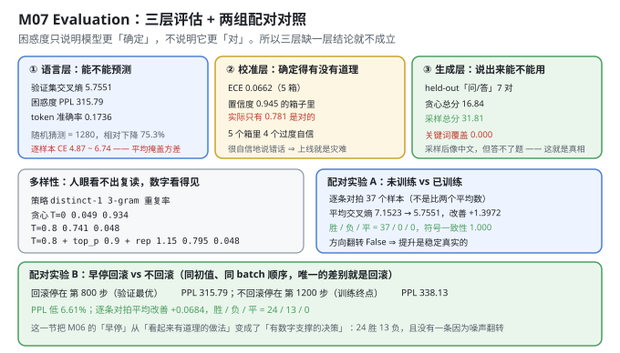
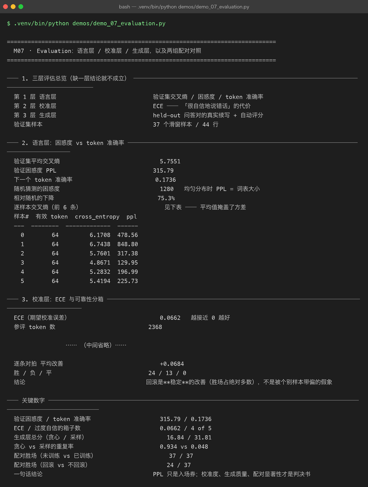

# Milestone 07 — Evaluation：把「训完了」和「训好了」分开

M06 交出了一份权重，并且证明了它是"验证最优"的那一份。但**"比随机初始化好"和"能用"之间隔着一条鸿沟**。这一章就是去量那条鸿沟有多宽。

要做到这一点，需要**三层评估**（缺一层结论就不成立）+ **两组配对实验**（因为平均值上的提升，可能只是被个别样本带偏的假象）。本章的结论是诚实的：困惑度 PPL 315.79 看着还行，但关键词覆盖率是 **0.000**。

---

## 1. Why：困惑度只说明"确定"，不说明"对"

一个 1280 词表上的均匀分布，PPL 就是 1280。我们的模型 PPL 是 315.79，相对下降 75.3%——**这确实说明它学到了东西**。但困惑度有一个致命性质：

> **它只衡量模型给正确答案分配了多少概率，不衡量那个概率对不对得上"语义正确"。**

模型可以给"token token token"这种无意义序列很高的概率，只要语料里这种模式出现过。所以单看 PPL 甚至能骗过你自己：

- **PPL 降了** ⇒ 模型更"确定"了（分布更尖锐）
- **PPL 降了 ≠ 模型更"对"了**

要补上另外两个维度：

1. **校准层（ECE）**：模型说"我有 94% 把握"的时候，实际有多少次是对的？——**"很自信地说错话"比"不知道"更危险**，因为用户会相信那个数字。
2. **生成层**：拿验证集里的"问"去问它（答案它训练时没见过），看它答得怎样。这是**唯一贴近真实使用场景**的一层。

再加**配对实验**，因为两个模型的平均分差 1.4 分，也可能是"37 个样本里 3 个大胜 + 34 个小负"——平均值掩盖了方向。

## 2. Design：三层各自回答一个问题

```text
① 语言层  evaluate_loss()      → CE / PPL / token_accuracy   「能不能预测」
② 校准层  ie.metrics.calibration() → ECE + 5 个可靠性分箱     「确定得有没有道理」
③ 生成层  generation_report()  → 关键词覆盖 / 忠实 / 不重复    「说出来能不能用」
```

配对实验用的是 P09 的 `ie.compare.paired_compare`，它不是比两个平均数，而是**逐条样本对拍**，然后数 `胜 / 负 / 平` 和**符号一致性**（有多少比例样本方向一致）。

**为什么必须逐条对拍**：假设模型 A 平均 CE 比 B 低 0.1，但这个优势全来自一条特别长的样本，其余 36 条 B 都略好——那"平均改善"就是个假象。`symbol consistency = 1.000` 才是"每条都一样好"的证据。



## 3. Real-run evidence（来自 `demos/out/demo_07_evaluation_terminal.txt`）



### 3.1 语言层：平均之下藏着方差

```text
验证集平均交叉熵        5.7551
验证困惑度 PPL        315.79
下一个 token 准确率      0.1736
随机猜测的困惑度         1280
相对随机的下降          75.3%

样本#  有效 token  cross_entropy  ppl
  0        64         6.1708  478.56
  1        64         6.7438  848.80
  2        64         5.7601  317.38
  3        64         4.8671  129.95
  4        64         5.2832  196.99
  5        64         5.4194  225.73
```

**平均 5.7551，逐样本从 4.8671 到 6.7438（PPL 129.95 到 848.80）——最差样本的困惑度是最优样本的 6.5 倍。**

这一行表格的价值在于：**它证明"平均 PPL"是一个会骗人的指标**。如果只看 315.79，你会以为模型"均匀地弱"；实际上它在某些样本上是"可用"（PPL 130），在另一些样本上完全"懵了"（PPL 849）。只报平均值，等于把这些差异全抹平了。

不过话说回来，**75.3% 的相对下降是真实的**——这不是玄学，是量出来的。它说明模型确实学到了东西（哪怕只是字词分布），也说明这套结构是work的。

### 3.2 校准层：模型比它自己以为的更容易错

```text
ECE（期望校准误差）        0.0662
参评 token 数           2368
置信度区间       token 数  平均置信度  实际准确率  置信度−准确率
[0.0, 0.2)     1724  0.060  0.084   -0.024
[0.2, 0.4)      258  0.289  0.151   +0.137
[0.4, 0.6)       98  0.492  0.316   +0.175
[0.6, 0.8)       60  0.711  0.300   +0.411
[0.8, 1.0)      228  0.945  0.781   +0.164
过度自信的箱子数  4 / 5
```

读这张表有个反直觉的点：**72.8%（1724/2368）的 token 都落在最低的置信度箱 [0.0, 0.2) 里**，而且这个箱子是**略微偏保守**的（-0.024，说 6% 把握、实际对了 8.4%）。

真正的问题出在**中高置信度段**：

- **[0.6, 0.8) 箱：模型说"71% 把握"，实际只有 30% 对——高估了 41 个百分点。** 这是全表最严重的一格。
- **[0.8, 1.0) 箱：说"94.5% 把握"，实际 78.1% 对。**

**这就是"上线即灾难"的具体形态**：用户在界面上看到"置信度 0.94"，会当成"基本不会错"；实际 5 次里有 1 次是错的。而 72.8% 的 token 落在"低置信"区，则说明**模型在大部分位置其实是"知道自己不确定"的**——它只在少数位置过度自信，但这些位置恰恰容易被用户当真。

ECE **0.0662**（越接近 0 越好）是这 5 个箱子的**加权平均**（按 token 数）。因为大头（1724 个）的偏差很小，所以整体 ECE 看着还不错；但**分布是不均匀的**——这正是"要看分箱、不能只看 ECE"的原因。

### 3.3 生成层：这是最诚实的一节

```text
held-out 问答对（来自验证集）   7
评分口径   keyword_coverage 40% / 格式 15% / 长度 15% / 忠实 20% / 不重复 10%

解码策略 A（贪心）           总分 16.84
[A1] 问：什么是梯度裁剪？
     生成：什么是 token token token token token token token token token token token
[A2] 问：什么是 QLoRA？
     生成：什么是 token token token token token token token token token token token

解码策略 B（采样 T=0.8/top_p 0.9/rep 1.15）  总分 31.81
[B1] 问：什么是梯度裁剪？
     参考：梯度裁剪按全局范数缩放梯度，避免异常大的梯度把训练带崩。
     生成：什么是 I 上下文链路算问题正故障的 输出m检索于然瓶态然Oje通
     得分：30.2（覆盖 0.00 忠实 0.00 不重复 1.00）
[B2] 问：什么是 QLoRA？
     参考：QLoRA 把基座量化到 4 比特，再在量化权重之上训练 LoRA 适配器。
     生成：什么是 GA确否则模型给步检索的 Agent token Agent 和eO(请。
     得分：33.1（覆盖 0.00 忠实 0.00 不重复 0.91）

关键词覆盖 / 忠实度        0.000 / 0.018
不重复分 / 长度合理性        0.945 / 0.967
```

**这一节必须原样保留，不能美化。** 两个策略各自的失败模式都很典型：

- **贪心（T=0）：复读。** 它直接输出"token token token..."——因为"token"是语料里的高频词，贪心每一步都选概率最大的，就会卡死在一个循环里。形式上它"生成"了 16.84 分（主要靠不重复分之外的项），但语义上什么都没说。
- **采样（T=0.8 + top_p + 惩罚）：看着像中文，实则是词块拼贴。** "什么是 I 上下文链路算问题正故障的 输出m检索于然瓶态然Oje通"——每个片段都是语料里出现过的领域词（"上下文""链路""检索""瓶态"），但拼在一起**不构成任何意思**。关键词覆盖 **0.000**：连"梯度裁剪"这几个字都没答出来。

**⚠ 诚实的结论**（原样引用自运行输出）：

> 230,400 参数 + 6,384 个训练 token 学不会语义。模型只学到了「字词形态 + 领域词表」：采样后看着像中文，但答不了题。这一层的作用恰恰是**把这个真相量化出来**，而不是让 loss 曲线替它遮羞。

**为什么这一节是本项目最有价值的一节**：如果只看 §3.1 的 PPL（相对随机下降 75.3%），你完全可以写一篇"训练成功"的报告。是生成层把这份报告的**真实成色**暴露了出来：**这个模型会拼词、不会答题。**

### 3.4 多样性：人眼看不出复读，数字看得见

```text
采样策略                         distinct-1  distinct-2  3-gram 重复率
贪心 T=0                            0.049       0.057       0.934
T=0.8                               0.741       0.917       0.048
T=0.8 + top_p 0.9 + rep 1.15        0.795       0.930       0.048
```

**distinct-1 从 0.795 断崖式跌到 0.049**——贪心模式下只有 4.9% 的 token 是不同的，93.4% 的 3-gram 是重复的。**这个数字就是 §3.3 里那串"token token token"的另一种表述。**

判据：**distinct-1 断崖式下跌 = 模型开始复读。人眼扫一眼输出可能以为"它就是啰嗦"，但数字能精确定位到"它在循环"。**

采样把 distinct-1 从 0.049 拉回 0.795（16 倍），代价是抛掉了确定性（每次输出不同）。这是一个**必付的取舍**：要么连贯地复读，要么发散地乱说。对 230K 参数的小模型来说，第三个选项（连贯且正确）不存在。

### 3.5 配对实验 A：未训练 vs 已训练

```text
样本数（逐条配对）        37
未训练 / 已训练 平均交叉熵   7.1523 / 5.7551
平均改善              +1.3972
胜 / 负 / 平          37 / 0 / 0
符号一致性             1.000
是否出现方向翻转          False
```

**37 胜 0 负 0 平，符号一致性 1.000。** 这是配对实验的理想结果：不是"平均上更好"，而是**每一条样本单独看都更好**。

对比一下 §3.1 的逐样本方差（4.87 ~ 6.74）就看得出配对的必要性：**平均改善 +1.3972 是个宏观数字，但只有"37/0/0 + 一致性 1.000"才能排除"改善是噪声"的可能。** 如果 50.5% 的样本变好、49.5% 变差，平均可能照样是 +1.4——那这个改善就完全不可信。

### 3.6 配对实验 B：早停回滚到底值多少分（本章最硬的一组数字）

```text
回滚模型停在          第 800 步（验证最优）
不回滚模型停在         第 1200 步（训练终点）
不回滚模型 PPL        338.13
回滚模型 PPL         315.79   低 6.61%
逐条对拍 平均改善        +0.0684
胜 / 负 / 平          24 / 13 / 0
```

这一节把 M06 里"早停"这个做法，从"**看起来有道理**"变成了"**有数字支撑的决策**"：

- PPL 315.79 vs 338.13，**低 6.61%**；
- **但更有说服力的是 24 胜 13 负 0 平**——它不是被一两个超长样本带出来的。37 个样本里 24 个变好、13 个变差、**没有一个打平**。

注意 13 负这一列：**回滚不是"全面碾压"**。有 13 条样本上，多训 400 步的模型反而更准。但因为赢的更多（24 > 13），整体是正的，且平均改善 +0.0684。**这就是"逐条对拍"能给出的、平均值给不出的信息**：我们知道回滚是"多数情况更好"，而不是"所有情况都更好"——后者才是需要警惕的（常常意味着样本太少）。

## 4. 踩坑与反直觉发现

1. **PPL 和"能答题"之间没有必然联系。** 相对随机下降 75.3%（看着很成功）与关键词覆盖 0.000（完全答不了题）**同时成立**。任何"只看 loss 曲线"的评估，都会得出错误结论。
2. **平均 PPL 会掩盖逐样本的方差。** 6 条样本的 PPL 从 129.95 到 848.80，相差 6.5 倍。**报平均值时必须同时报分布**，否则"315.79"这个数字会误导读者以为模型是"均匀地弱"。
3. **"置信度 0.94"实际只有 78% 正确。** 校准层抓的是这类问题：`[0.8,1.0)` 箱里平均置信度 0.945、实际准确率 0.781。**过度自信的 UI 比"低置信度"更危险**，因为用户会信那个数字。
4. **大部分 token 其实落在"低置信"箱（72.8%）。** 所以整体 ECE（0.0662）看着还行，但**分箱后才看得出问题集中在 `[0.6,0.8)`（高估 41 个百分点）**。只看一个 ECE 数字是盲的。
5. **贪心"复读"和采样"乱说"是两个不同的失败，别混为一谈。** 贪心：distinct-1 = 0.049、重复率 0.934（**循环**）；采样：distinct-1 = 0.795、重复率 0.048（**发散**）。**两种都错，但错法不同**，需要用两个指标分开看。
6. **配对实验要报告"负"的那一列。** 回滚 vs 不回滚是 24 胜 **13 负**，不是 37 胜。只报胜场、不报负场的配对实验，是在隐藏信息。**13 负正好说明这个实验样本量够、结论真实**——如果 37 胜 0 负反而要怀疑是不是设置有问题（比如两个模型差别被放大了）。
7. **`gap` 是绝对值，看不出偏的方向。** P09 的 `calibration` 返回的 `gap` 是 `|avg_confidence - accuracy|`，永远 ≥ 0。要判断"过度自信还是过度保守"，必须自己算**有符号差** `avg_confidence - accuracy`。demo 里就是这么做的——否则你会漏掉"低置信箱其实偏保守（-0.024）"这个细节。

## 5. Conclusion

1. **语言层**：验证 CE **5.7551**、PPL **315.79**、token 准确率 **0.1736**，相对随机（1280）下降 **75.3%**。逐样本 CE 从 4.8671 到 6.7438（PPL 129.95 ~ 848.80）。
2. **校准层**：ECE **0.0662**，**5 个箱中 4 个过度自信**；最严重的是 `[0.8,1.0)` 箱——平均置信度 **0.945** 对应实际准确率 **0.781**；同时 **72.8% 的 token 落在低置信箱**。
3. **生成层**：贪心总分 **16.84**（distinct-1 0.049 / 重复率 0.934，复读）、采样总分 **31.81**（**关键词覆盖 0.000** / 忠实 0.018 / 不重复 0.945）。**模型会拼词、不会答题。**
4. **配对 A**（未训练 vs 已训练）：平均 CE 7.1523 → 5.7551，改善 **+1.3972**，**37 胜 0 负 0 平**，符号一致性 **1.000**，无方向翻转。
5. **配对 B**（早停回滚 vs 不回滚）：PPL 338.13 → **315.79（低 6.61%）**，逐条对拍平均改善 **+0.0684**，**24 胜 13 负 0 平** ⇒ 回滚是**稳定的**改善，不是个别样本的假象。
6. 一句话结论：**PPL 只是入场券；校准度、生成质量、配对显著性才是判决书。**

## 6. Code map

| 文件 | 职责 |
|---|---|
| `src/tiny/evaluate.py` | `evaluate_model`（三层入口）/ `per_example_losses` / `compare_models`（走 P09 配对）/ `qa_pairs_from_lines` / `diversity_report` / `generation_report` |
| `src/tiny/train.py` | `evaluate_loss`（CE / PPL / token_accuracy） |
| P09 `src/ie/metrics.py` | `calibration`（ECE + 可靠性分箱，`gap` 为绝对值） |
| P09 `src/ie/compare.py` | `paired_compare`（逐条对拍：胜/负/平 + 符号一致性） |
| P08 `src/ft/autoeval.py` | `generation_report` 的评分口径（关键词覆盖 40% / 格式 15% / 长度 15% / 忠实 20% / 不重复 10%） |
| `demos/demo_07_evaluation.py` | 7 节：三层总览 / 语言 / 校准 / 生成 / 多样性 / 配对 A / 配对 B |
| `demos/out/demo_07_evaluation_terminal.txt` | 本章所有数字的来源 |
| `assets/evaluation.svg` | 三层评估 + 多样性 + 两组配对对照 |
| `assets/term-07-evaluation.png` | 真实运行截图 |

## 7. Version line

v0.6 → **v0.7**，三层评估 + 配对显著性落地。实测：语言层 PPL **315.79** / token 准确率 **0.1736**（相对随机 1280 下降 75.3%），逐样本 PPL 129.95 ~ 848.80；校准层 ECE **0.0662**，**4/5 箱过度自信**（`[0.8,1.0)` 说 0.945 只有 0.781 对，72.8% token 落在低置信箱）；生成层贪心 **16.84**（重复率 0.934）/ 采样 **31.81**（**关键词覆盖 0.000**）；配对 A **37 胜 0 负 0 平**、一致性 **1.000**（改善 +1.3972）；配对 B PPL **低 6.61%**、**24 胜 13 负 0 平**。配图 1 张手写 SVG + 1 张真实终端截图。
