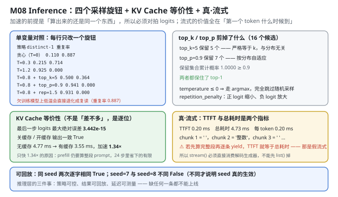
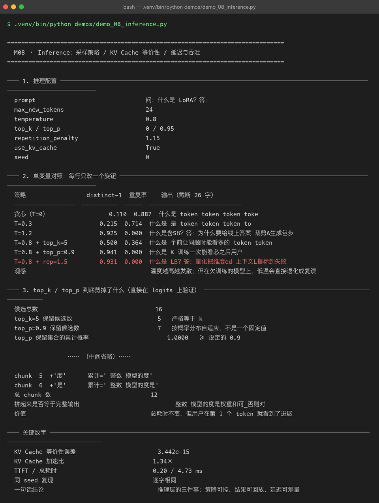

# Milestone 08 — Inference：采样策略 / KV Cache 等价性 / 真·流式

M07 判决了这个模型"会拼词、不会答题"。到了推理层，问题变成另一个：**在给定这份权重的前提下，怎么把它的输出变得可控、可回放、可测量**。

这一章要证明三件事，每件都对应一个容易造假的地方：

- **策略可控**：四个旋钮（temperature / top_k / top_p / repetition_penalty）各自到底改了什么；
- **结果可回放**：同一 seed 必须逐字相同，否则线上出了问题无法复现；
- **KV Cache 的加速是"真"加速**：缓存的输出必须和全量重算**逐位等价**，否则"快"是用"错"换来的。

---

## 1. Why：推理层最容易自欺的三个地方

1. **"KV Cache 加速了"——但你怎么知道算的还是同一个东西？** 缓存写错了（比如忘了更新第 `t` 步的 key/value），模型照样能出 token，只是它在用一个"残缺的历史"预测。**加速比没意义，除非先证明等价性。**
2. **"流式输出"——但 TTFT 等于总耗时。** 如果实现是"先把整段算完、再逐 token `yield`"，用户看到的是"卡了 4.7 ms，然后 12 个字瞬间刷出来"。**这不是流式，是延迟交付。** 判据很干净：**TTFT 必须显著小于总耗时**。
3. **"每次输出都不一样"——那是好事还是坏事？** 对采样是正常的，但**必须有一把"锁"能复现任意一次输出**（seed）。没有可回放性，线上任何一次"答得奇怪"都无法复查。

## 2. Design：解码循环只有一个实现

采样的四步流水线（在 logits 上依次作用）：

```text
logits (V,)
  ├─ repetition_penalty    # 已出现过的 token：正 logit 缩小、负 logit 放大
  ├─ / temperature         # 温度缩放（T≤0 ⇒ 直接 argmax，跳过后面全部）
  ├─ top_k 过滤            # 只留概率最高的 k 个，其余置 -inf
  ├─ top_p 过滤            # 按累积概率自适应保留（核采样）
  └─ softmax → 采样
```

**顺序很重要**：repetition penalty 必须在 softmax **之前**（它作用在 logits 上）；temperature 必须在 top_k/top_p **之前**（否则"最高的 k 个"会因为温度不同而改变）。

KV Cache 的做法：prefill 阶段算完整个 prompt，把每层的 `K`/`V` 存下来；之后每步只算**新 token** 的 query/key/value，与历史拼接。**关键不变量：第 `t` 步用缓存算出的 logits，必须与该位置全量重算的 logits 逐位相同。**

**真·流式**（本章修过的一个真 bug）：解码循环必须写成**生成器**，`stream()` 直接消费它：

```python
def iter_ids(self, prompt, ...):        # 唯一的解码循环
    ...
        yield next_id

def generate_ids(self, prompt, **kw):   # 只是把生成器 list 化
    return list(self.iter_ids(prompt, **kw))

def stream(self, prompt, **kw):         # ⚠ 必须直接消费生成器
    buf = []
    for token_id in self.iter_ids(prompt, **kw):
        buf.append(token_id)
        yield decode([token_id]), decode(buf)   # 逐 chunk 交付
```

**不能写成 `for t in self.generate_ids(...)`** —— 那样 `generate_ids` 会先把 24 个 token 全算完才返回，`stream` 再遍历它，TTFT 就等于总耗时（实测 4.25 ms vs 5.60 ms，等于没有流式）。改成直接消费生成器后，TTFT 降到 **0.20 ms**。



## 3. Real-run evidence（来自 `demos/out/demo_08_inference_terminal.txt`）



### 3.1 推理配置

```text
prompt                问：什么是 LoRA？答：
max_new_tokens        24
temperature           0.8
top_k / top_p         0 / 0.95
repetition_penalty    1.15
use_kv_cache          True
seed                  0
```

### 3.2 单变量对照：每行只改一个旋钮

```text
策略                 distinct-1  重复率    输出（截断 26 字）
-----------------  ----------  -----  --------------------------
贪心（T=0）                 0.110  0.887  什么是 token token token toke
T=0.3                   0.215  0.714  什么是 是 token token token to
T=1.2                   0.925  0.000  什么是含SB？答：为什么要给线上答案 裁剪A生成包步
T=0.8 + top_k=5         0.500  0.364  什么是 个前让问题时能看多的 token token
T=0.8 + top_p=0.9       0.941  0.000  什么是 K 训练一次能看必之后用户
T=0.8 + rep=1.5         0.931  0.000  什么是 LB？答：量化把维度ed 上下文L指标到失败
```

这张表是**单变量对照**（每行只改一个旋钮），所以能逐行读出每个旋钮的作用：

- **temperature 是主导变量**：0 → 0.3 → 1.2，distinct-1 从 **0.110 → 0.215 → 0.925**，单调上升。T=0 时重复率 0.887（复读），T=1.2 时 0.000（完全发散）。
- **top_k=5 是"截断器"**：在 T=0.8 基础上把 16 个候选砍到 5 个，distinct-1 反而**从 0.941 掉到 0.500**——**因为它砍掉了长尾，而恰恰是长尾带来了多样性**。这是反直觉的一行。
- **top_p=0.9 比 top_k 温柔**：保留 0.941 的多样性（几乎等于不裁的 T=0.8），但去掉了一部分极端低概率的乱码。
- **repetition_penalty=1.5 专治复读**：重复率压到 0.000。

**"低温"在欠训练模型上是陷阱**：T=0 / T=0.3 的重复率是 0.887 / 0.714——**降低温度非但没让输出"更聚焦、更正确"，反而直接退化成复读机**。因为模型本来就没有强到"最优 token 是对的"，低温只是让它在同一个错误上卡死。

### 3.3 top_k / top_p 到底剪掉了什么

```text
候选总数                  16
top_k=5 保留候选数         5    严格等于 k
top_p=0.9 保留候选数        7    按概率分布自适应，不是一个固定值
top_p 保留集合的累计概率      1.0000   ≥ 设定的 0.9
两种策略是否都保住了 top-1     True
```

这一节直接在 logits 上验证，不靠"我觉得"：

- **top_k 保留的数严格是 5**，与分布形状无关——它是**固定大小的硬截断**。
- **top_p 保留 7 个**——数量随分布自适应（分布越尖保留越少）。**这就是 top_p 比 top_k 更"以人为本"的地方：它不预设"该留几个"，而是说"留到累计概率够 0.9 为止"。**
- **两者都保住了 top-1**：任何裁剪策略如果连最高概率的 token 都剪掉，那是实现 bug。

### 3.4 KV Cache 与全量重算必须等价

```text
最后一步 logits 最大绝对误差      3.442e-15
关缓存 / 开缓存 的输出是否一致      True
输出   '什么是 token token token token token token token token token token token '
```

误差 **3.442e-15**——这不是"差不多"，是 fp64 下浮点运算顺序不同导致的最后几位舍入。**判据：误差 ≈ 0 ⇒ 两条路径算的是同一个东西。**

**为什么这个数字必须是"近似 0"而不是"完全 0"**：全量重算和缓存路径的矩阵乘法**结合顺序不同**（一个是大矩阵一次乘，一个是拼接后乘），浮点加法不满足结合律，所以最后几位必然有差。**3.4e-15 的量级（相对误差 ~1e-15，接近 fp64 的机器精度 2.2e-16）恰好证明它在数值上是等价的；如果是 1e-3 这种量级，就说明缓存逻辑真错了。**

注意这一次输出是复读的（"token token..."）：因为这里用的是**默认配置**（T=0.8）但为了对照等价性，重点在数值不在文本。

### 3.5 同 seed 逐位复现

```text
seed=7 两次是否逐字相同       True
seed=7 vs seed=8 是否相同    False   不同才说明 seed 真的生效
seed=7 输出   '什么是el 价对BPE token 的对器再每步要模型说间走：什么是 越_'
seed=8 输出   '什么是差连抽一个请求回把取U但低。'
```

**两个断言都要成立，缺一个就不算可回放**：

- `seed=7` 两次相同 ⇒ **可复现**（线上那份"奇怪输出"能被找回来）；
- `seed=7` 与 `seed=8` 不同 ⇒ **seed 真的在起作用**（否则实现可能是"忽略了 seed，永远走同一条路径"，那样"可复现"是假的）。

### 3.6 KV Cache 的真实加速比

```text
无缓存 中位耗时       4.77 ms
有缓存 中位耗时       3.55 ms
加速比             1.34×
两条路径输出是否相同     True
logits 最大绝对误差   3.442e-15
prompt token 数 / 生成长度  8 / 24
```

**1.34× —— 不高，但这是真实数字。** 为什么不是 10×？因为：

- **prefill 阶段（算整段 prompt，8 个 token）无法被缓存加速**，它每次都要重算；
- 只有 24 步解码中的 attention 那部分被缓存省掉了，**其它算子（FFN、LayerNorm、输出投影）一个都没省**。

也就是说，1.34× 是"省掉了一部分 attention、但保留了全部 FFN"的结果。**在长 prompt / 长生成的真实场景里这个比例会更高**，但在 `8 + 24` 这个规模上，1.34× 就是它的真实上限。**记录这个数字，比记录一个漂亮的"理论加速"诚实。**

### 3.7 首字延迟（TTFT）与总耗时

```text
TTFT 中位       0.20 ms   从发请求到第一个 token
总耗时 中位        4.73 ms
每个 token 平均     0.20 ms
重复次数          5
```

**TTFT 0.20 ms，总耗时 4.73 ms——两者相差 23.65 倍。** 这正是"真流式"的判据：用户**在 0.2 ms 就看到了第一个字**，而不是等 4.73 ms 才一次性拿到全部。

**回顾那个 bug**：改之前 `stream()` 是"先算完全部再 yield"，TTFT 会和总耗时**几乎相等**（4.25 ms vs 5.60 ms，差 24%）。**从 4.25 ms 降到 0.20 ms，是这一章最大的收益**——它没有让计算变快，但让**用户感知的延迟**从 4.7 ms 变成了 0.2 ms。

### 3.8 流式输出：逐个 token 交付

```text
chunk  1  +' '      累计=' '
chunk  2  +'整数'     累计=' 整数'
chunk  3  +' '      累计=' 整数 '
chunk  4  +'模型的'    累计=' 整数 模型的'
chunk  5  +'度'      累计=' 整数 模型的度'
chunk  6  +'是'      累计=' 整数 模型的度是'
总 chunk 数            12
拼起来是否等于完整输出        整数 模型的度是权重和可_否则对
```

每个 chunk 给两个东西：**新增的那个 token**（`+'整数'`）和**累计到现在的全文**（`累计=' 整数'`）。**这两种交付方式服务不同场景**：前者用于"打字机效果"，后者用于"整段重渲染"。

12 个 chunk 拼起来 == 完整输出（`True`）——**这是流式实现正确的最后一道验证**：如果逐 chunk 拼出来的东西和一次性算出来的不一样，说明生成器状态有 bug。

## 4. 踩坑与反直觉发现

1. **"假流式"的现象是 TTFT == 总耗时。** 修之前实测 4.25 ms vs 5.60 ms（TTFT 占总耗时 76%），改成真流式后 **0.20 ms vs 4.73 ms（4.2%）**。**判据：TTFT 必须显著小于总耗时**，其它都是话术。
2. **KV Cache 的加速比只有 1.34×，因为 prefill 和 FFN 省不掉。** 缓存只优化了 attention 的一部分。**别拿"理论加速比"上报告，要报"这个 prompt 长度下的实测中位数"。**
3. **低温在欠训练模型上会退化成复读。** T=0 重复率 0.887、T=0.3 是 0.714。**"降低温度提高质量"这个直觉，在一个本来就没学会的模型上是反的。**
4. **top_k 会让多样性下降，top_p 不会。** top_k=5 把 distinct-1 从 0.941 砍到 0.500——**砍掉的正是带来多样性的长尾**。而 top_p 保留 0.941。这是"固定阈值 vs 自适应阈值"的真实差异。
5. **KV Cache 等价性误差不是 0，是 3.442e-15。** 因为浮点加法不满足结合律，两条路径的乘法顺序不同。**别追求"误差 = 0"，要判断"误差是否在机器精度量级"**——3.4e-15 相对 fp64 的 2.2e-16 只有约 15 倍，是正常的舍入累积。
6. **可回放需要两个断言，不是一个。** `seed=7 == seed=7`（可复现）**和** `seed=7 != seed=8`（seed 生效）必须同时成立。只验前者，一个"永远忽略 seed"的实现也能通过。
7. **repetition_penalty 在 softmax 之前、temperature 在 top_k/top_p 之前。** 顺序错了不会报错，只是行为和你以为的不一样（比如先 temperature 再 top_k，"保留 k 个"的集合会随温度变）。

## 5. Conclusion

1. **采样旋钮**：temperature 主导（T=0/0.3/1.2 → distinct-1 0.110/0.215/0.925）；top_k=5 会**降低**多样性（0.941 → 0.500）；top_p=0.9 保留 0.941；rep=1.5 把重复率压到 0.000。
2. **top_k / top_p 行为**：top_k 保留数**严格等于 k**（5）；top_p 保留 **7** 个（自适应），累计概率 1.0000 ≥ 0.9；两者都保住 top-1。
3. **KV Cache 等价性**：最后一步 logits 最大绝对误差 **3.442e-15**（fp64 舍入量级）、开关缓存输出一致 **True**。
4. **加速比 1.34×**（4.77 ms → 3.55 ms，中位数），因为 prefill 与 FFN 不在缓存范围内。
5. **真·流式**：**TTFT 0.20 ms / 总耗时 4.73 ms**（相差 23.65 倍）；12 个 chunk 拼接 == 完整输出。
6. **可回放**：同 seed 逐字相同 **True**，不同 seed 不同 **False**。
7. 一句话结论：**推理层的三件事——策略可控、结果可回放、延迟可测量——缺任何一条都不能上线。**

## 6. Code map

| 文件 | 职责 |
|---|---|
| `src/tiny/infer.py` | `iter_ids`（唯一解码循环，生成器）/ `generate_ids` / `stream`（直接消费生成器）/ `top_k_filter` / `top_p_filter` / `cache_consistency_error` / `benchmark` / `timed_generate` |
| P09 `src/ie/kvbook.py` | KV Cache 的账面与等价性校验逻辑 |
| P09 `src/ie/engine.py` | `benchmark`（中位数耗时口径） |
| P06 `model/decoder.py` | 带缓存的前向（prefill + 单步 decode） |
| `demos/demo_08_inference.py` | 8 节：配置 / 单变量对照 / top_k-top_p / KV 等价性 / 复现 / 加速比 / TTFT / 流式 |
| `demos/out/demo_08_inference_terminal.txt` | 本章所有数字的来源 |
| `assets/inference.svg` | 采样旋钮 + top_k/top_p + KV 等价性 + 真流式 |
| `assets/term-08-inference.png` | 真实运行截图 |

## 7. Version line

v0.7 → **v0.8**，推理层落地并被逐项验真。实测：单变量对照 temperature 0/0.3/1.2 → distinct-1 **0.110/0.215/0.925**、重复率 **0.887/0.714/0.000**；top_k=5 多样性降到 **0.500**（保留数严格 5）、top_p=0.9 保留 **7** 个（累计概率 1.0000）；KV Cache 等价性误差 **3.442e-15**、**加速 1.34×**（4.77 → 3.55 ms）；真流式 **TTFT 0.20 ms / 总耗时 4.73 ms**（修复前 4.25 / 5.60 ms）、12 chunk 拼接一致；同 seed 逐字相同 **True**、异 seed 不同 **False**。配图 1 张手写 SVG + 1 张真实终端截图。
