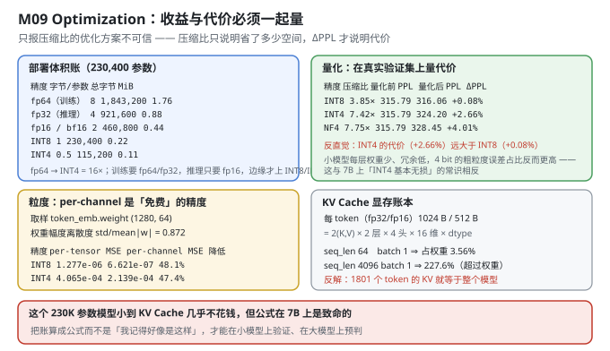
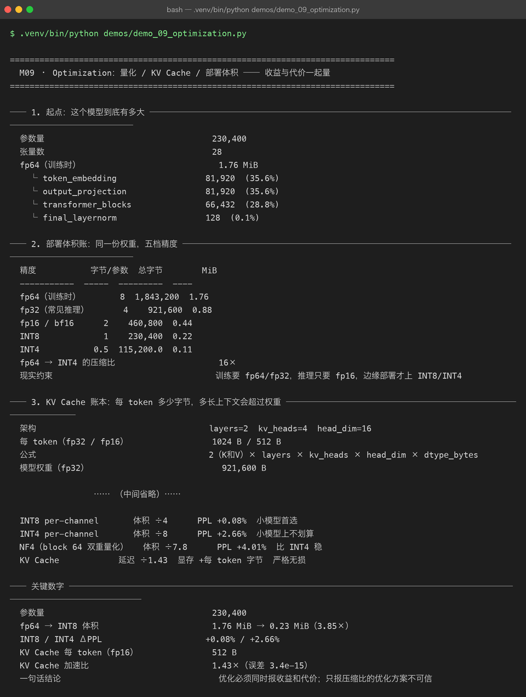

# Milestone 09 — Optimization：收益与代价必须一起量

M08 证明了"能推理"。但能跑不等于跑得起——这一章算两笔账：**这份权重部署时要占多少空间（量化）**，以及**长上下文要额外花多少显存（KV Cache 账本）**。

本章的立场只有一句：**只报压缩比的优化方案不可信。** 压缩比只说明省了多少空间；**ΔPPL 才说明你为此付出了多少代价**。两者必须同时报出来，否则那不是优化方案，是宣传材料。

---

## 1. Why：优化有两个常见的"半边账"

1. **只报压缩比，不报精度损失。** "INT4 压缩 16 倍！"——听起来很美。但如果它让 PPL 从 315.79 涨到 324.20（+2.66%），你就得分清：**这个代价在你的场景里值不值 8 倍空间**。
2. **只报"省了显存"，不报"每 token 到底花多少"。** KV Cache 的显存占用不是常数，它随 `batch × seq_len` 线性增长。**必须把它算成一个公式**，才能回答"多长的上下文会让 KV 超过模型本身"。

## 2. Design：把两个账都算成公式

### 2.1 量化：精度 × 粒度

```text
量化：w → round((w - zero) / scale)，再反量化回浮点参与计算
粒度：
  per-tensor   整个张量共享一组 (scale, zero)     ← 存 1 组，但误差大
  per-channel  每个输出通道一组 (scale, zero)     ← 多存 d_out 组，误差小
  NF4 block=64 每 64 个权重一组 + 二次量化 scale  ← 误差居中，压缩比最高
```

**为什么 per-channel 能让误差明显下降**：神经网络的权重**各通道的尺度往往差很多**（`std/mean|w| = 0.872` 说明幅度很离散）。per-tensor 用一组 scale 覆盖所有通道，就必然在"大通道"上欠拟合、在"小通道"上过拟合。**per-channel 为每个通道单独定标，只多存一点 scale，误差就掉一半。这就是"免费的精度"。**

**代价怎么量**：不看它自己的 MSE，而是在**真实验证集**上跑语言模型评估，记录 `ΔPPL = (量化后 PPL − 量化前 PPL) / 量化前 PPL`。MSE 只是"权重像不像"，ΔPPL 才是"任务坏没坏"。

### 2.2 KV Cache 显存公式

```text
bytes_per_token = 2 × layers × kv_heads × head_dim × dtype_bytes
                = 2 × 2 × 4 × 16 × dtype_bytes      （2 是因为 K 和 V）
                = 256 × dtype_bytes
```

代入 `layers=2, kv_heads=4, head_dim=16`：fp32 = **1024 B/token**、fp16 = **512 B/token**。

**这是一个纯解析公式，不依赖任何运行时**。它的价值在于：**在小模型上验证公式对不对，在大模型上用它做容量预判**。7B 模型的 `bytes_per_token` 会是这个值的几百倍——那时"长上下文吃爆显存"就是一个能提前算出来的数字，而不是上线后才知道的事故。



## 3. Real-run evidence（来自 `demos/out/demo_09_optimization_terminal.txt`）



### 3.1 起点：模型有多大

```text
参数量        230,400
张量数        28
fp64（训练时）  1.76 MiB
  └ token_embedding    81,920  (35.6%)
  └ output_projection  81,920  (35.6%)
  └ transformer_blocks 66,432  (28.8%)
  └ final_layernorm       128  (0.1%)
```

参数分布和 M04 一致：**词嵌入 + 输出投影合计 71.2%**，真正的 Transformer Block 只有 28.8%。这个分布预示了后面的一个反直觉结论：**量化误差主要由少数几块大权重决定。**

### 3.2 部署体积账：同一份权重，五档精度

```text
精度           字节/参数  总字节        MiB
fp64（训练时）        8  1,843,200  1.76
fp32（常见推理）       4    921,600  0.88
fp16 / bf16      2    460,800  0.44
INT8             1    230,400  0.22
INT4           0.5  115,200.0  0.11
fp64 → INT4 的压缩比   16×
```

**从 fp64 到 INT4 是精确的 16 倍**（8 字节 → 0.5 字节）。但这里有个容易忽略的现实约束：**训练通常要 fp64/fp32（累加精度），推理只要 fp16，只有边缘部署才上 INT8/INT4**。所以"压缩 16×"是从**训练精度**起算的；如果基线是 fp32 推理，INT4 只省 8 倍。

### 3.3 KV Cache 账本：每 token 多少字节

```text
架构                    layers=2  kv_heads=4  head_dim=16
每 token（fp32 / fp16）    1024 B / 512 B
公式                    2（K和V）× layers × kv_heads × head_dim × dtype_bytes
模型权重（fp32）            921,600 B

batch  seq_len  KV 字节      KV GiB    占权重比
    1       64     32,768  0.000031    3.5556%
    1      256    131,072  0.000122   14.2222%
    1     1024    524,288  0.000488   56.8889%
    1     4096  2,097,152  0.001953  227.5556%
    4       64    131,072  0.000122   14.2222%
    4     1024  2,097,152  0.001953  227.5556%
KV Cache 追上模型权重所需长度   1801   fp16、batch=1
实测 max_len 下的 KV          65,536 B（64.00 KiB）
```

**这张表的意义是把"显存焦虑"变成一个可算的数字。**

- `seq_len=64`（本项目 `max_len`）时，KV 只占权重的 **3.56%**——**这个模型小到 KV Cache 几乎不花钱**。
- 但 **`seq_len=4096` 时占 227.6%**——KV 比整个模型还大。
- **反解：1801 个 token 的 KV 就等于整个模型。**

记住这个 **1801**。它不是这个项目的实际需求（本项目只用 64），而是**公式给出的一个可迁移的直觉**：当上下文长度增长时，"KV 的开销"会从"可以忽略"迅速变成"比权重还大"。**在 7B 模型上这个临界点会早得多，那才是"长上下文吃爆显存"的数学根源。**

**为什么 batch 和 seq_len 一起乘**：KV 的形状是 `(batch, kv_heads, seq_len, head_dim)`，逐 token、逐样本都要存。所以 `batch=4, seq_len=1024` 和 `batch=1, seq_len=4096` 的 KV 字节数**完全一样**——都是 2,097,152 B。**这两个维度对称，是这张表里唯一需要"看两眼才反应过来"的地方。**

### 3.4 量化：压缩比 vs 精度代价

```text
基线（未量化）   val_loss=5.7551  ppl=315.79  token_acc=0.1736

精度    粒度            压缩比    MSE        量化前 PPL  量化后 PPL  ΔPPL    token_acc
INT8  per_channel   3.85×  9.878e-07   315.79   316.06  +0.08%     0.1731
INT4  per_channel   7.42×  3.175e-04   315.79   324.20  +2.66%     0.1706
NF4   nf4_block_64  7.75×  2.867e-04   315.79   328.45  +4.01%     0.1736
```

**反直觉结论：INT4 的代价（+2.66%）远大于 INT8（+0.08%）——相差 33 倍，而压缩比只多了不到一倍（3.85× → 7.42×）。**

为什么？**小模型每层权重少、冗余度低，4 bit 的粗粒度误差占比反而更高。** 这与"7B 模型上 INT4 基本无损"的常识**相反**——大模型有大量冗余可以吸收量化噪声，而 230K 参数的小模型几乎没有冗余。**所以"INT4 无损"不是一条普适规律，而是"大模型特有"的性质。**

再看 NF4：压缩比最高（7.75×），但 ΔPPL **+4.01%** 反而比 INT4 更差。**"更先进的算法"（NF4 + 双重量化）在这么小的模型上并没有换回精度**——它省了 MSE（2.867e-4 vs INT4 的 3.175e-4），但任务指标更差。**这再次说明：MSE 小 ≠ 任务好。**

### 3.5 粒度：per-channel 是"免费"的精度

```text
取样张量               token_emb.weight
形状                   (1280, 64)
权重幅度离散度 std/mean|w|   0.872

精度    per-tensor MSE  per-channel MSE  MSE 降低  rL2(per-t)  rL2(per-c)
INT8       1.277e-06        6.621e-07   48.1%      0.0160      0.0115
INT4       4.065e-04        2.139e-04   47.4%      0.2859      0.2074
NF4        4.132e-05        4.132e-05    0.0%      0.0911      0.0911
```

**per-channel 把 INT8 的 MSE 降了 48.1%、INT4 降了 47.4%——误差直接砍半，而代价只是多存几组 scale。**

`std/mean|w| = 0.872` 解释了为什么有效：**权重幅度的离散度接近 0.87，说明各通道尺度差异很大**，per-tensor 用一把尺子量所有人必然吃亏。

最后一行的 **NF4：per-tensor 和 per-channel 的 MSE 完全一样（4.132e-05），降低 0.0%**。原因很干净：**NF4 的码本本身就是分块的（block=64），块内已经自带了细粒度的尺度调整**，再叠加 per-channel 就是重复劳动，所以数值完全不变。**这一行不是"NF4 没用"，而是说明 per-channel 的价值只对"全局统一量化的方案"（INT8/INT4）成立。**

### 3.6 另一半优化：KV Cache 的速度收益

```text
无缓存 / 有缓存 中位耗时   5.09 ms / 3.56 ms
加速比              1.43×
输出是否一致           True
logits 最大绝对误差    3.442e-15
```

和 M08 同一个结论（略有波动，1.43× vs 1.34×，因为运行环境噪声）：**KV Cache 是"严格无损"的优化——误差 3.442e-15（浮点舍入量级），输出完全一致。**

**"不等价的速度优化是 bug，不是优化"** 这句话在这一章被重复验证，因为它是量化和 KV Cache 的**根本区别**：

- 量化：**有损**，代价是 ΔPPL（换来体积和算力）；
- KV Cache：**无损**，代价是显存（换来延迟）。

**把这两种"优化"混在一起谈，是优化章节最常见的错误。**

### 3.7 一张表说清楚：每种优化的收益与代价

```text
优化手段                收益        代价              适用判断
INT8 per-channel       体积 ÷4      PPL +0.08%  小模型首选
INT4 per-channel       体积 ÷8      PPL +2.66%  小模型上不划算
NF4（block 64 双重量化）   体积 ÷7.8      PPL +4.01%  比 INT4 稳
KV Cache            延迟 ÷1.43  显存 +每 token 字节  严格无损
```

这张表是本章的**交付物**：**任何一个优化决策，都必须能填进这四列**。填不满"代价"那一列的方案，不许上线。

## 4. 踩坑与反直觉发现

1. **"INT4 基本无损"是小模型上的假命题。** 本项目实测 INT4 **ΔPPL +2.66%**，是 INT8（+0.08%）的 33 倍。**大模型的冗余能吸收量化噪声，小模型不能。** 任何从大模型抄来的"经验值"，都要在小模型上重新量一遍。
2. **MSE 小 ≠ 任务好。** NF4 的 MSE（2.867e-4）比 INT4（3.175e-4）还低，但 ΔPPL 反而更高（+4.01% vs +2.66%）。**量化方案必须用 ΔPPL 验收，不能只看权重重建误差。**
3. **per-channel 是"免费"的精度。** INT8/INT4 的 MSE 都降了约 **48%**，代价只是多存一点 scale。成本几乎为零、收益接近一半，这种优化没有理由不做。
4. **per-channel 对 NF4 完全无效（0.0%）。** 因为 NF4 的 block 量化**已经内置了细粒度尺度**，再叠 per-channel 是重复。**这说明"加粒度"不是越多越好，要看方案本身有没有已经在做这件事。**
5. **KV Cache 的显存公式里 batch 和 seq_len 是乘起来的，彼此对称。** `batch=4, seq=1024` 与 `batch=1, seq=4096` 消耗**完全相同**（2,097,152 B）。这一点不看形状容易忽略。
6. **1801 个 token 的 KV 就等于整个模型（fp16, batch=1）。** 这个数字在 7B 上会小得多。**"长上下文吃爆显存"不是玄学，是可反解的不等式。**
7. **量化（有损）和 KV Cache（无损）是两类优化，别混。** 量化省空间、代价是精度；KV Cache 省延迟、代价是显存。**同一个"优化"标签下，权衡的维度完全不同。**

## 5. Conclusion

1. 模型 **230,400 参数 / 28 张量 / fp64 1.76 MiB**；词嵌入 + 输出投影占 **71.2%**。
2. 部署体积：fp64 1.76 → fp32 0.88 → fp16 **0.44** → INT8 **0.22** → INT4 **0.11** MiB，**fp64→INT4 压缩 16×**。
3. KV Cache 账本：**256 × dtype_bytes**，即 fp32 **1024 B/token**、fp16 **512 B/token**；`seq_len=64` 占权重 **3.56%**，`seq_len=4096` 占 **227.6%**；**1801 token 的 KV = 整个模型**。
4. 量化代价（真实验证集）：**INT8 3.85× / ΔPPL +0.08%**、**INT4 7.42× / +2.66%**、**NF4 7.75× / +4.01%** ⇒ **INT4 的代价是 INT8 的 33 倍，只换来不到 2× 的压缩**。
5. 粒度：per-channel 把 INT8/INT4 的 MSE 降 **48.1% / 47.4%**（近乎免费）；对 NF4 **0.0%**（block 量化已内置）。
6. KV Cache 加速 **1.43×**（5.09 → 3.56 ms），**严格无损**（误差 3.442e-15）。
7. 一句话结论：**优化必须同时报收益和代价；只报压缩比的方案不可信。**

## 6. Code map

| 文件 | 职责 |
|---|---|
| `src/tiny/optimize.py` | `deployment_size_table`（五档体积）/ `kv_cache_report`（每 token 字节 + 追赶长度）/ `quantization_report`（真实验证集 ΔPPL）/ `granularity_report`（per-tensor vs per-channel MSE）/ `optimization_report`（收益代价总表） |
| P09 `src/ie/quantize.py` | INT8 / INT4 / NF4 的量化与反量化实现、per-tensor / per-channel 分支 |
| P09 `src/ie/kvbook.py` | KV Cache 字节公式与账面 |
| `src/tiny/infer.py` | `cache_consistency_error` / `benchmark`（无损性验证） |
| `demos/demo_09_optimization.py` | 7 节：起点体积 / 五档精度 / KV 账本 / 量化 ΔPPL / 粒度 / 速度 / 收益代价总表 |
| `demos/out/demo_09_optimization_terminal.txt` | 本章所有数字的来源 |
| `assets/optimization.svg` | 部署体积 + 量化代价 + 粒度 + KV 账本 |
| `assets/term-09-optimization.png` | 真实运行截图 |

## 7. Version line

v0.8 → **v0.9**，量化与 KV Cache 账本落地并被双向度量。实测：**230,400 参数 / fp64 1.76 MiB**，fp64→INT4 **压缩 16×**；KV 每 token fp32 **1024 B** / fp16 **512 B**，**1801 token 的 KV = 整个模型**；量化（真实验证集）**INT8 3.85× / ΔPPL +0.08%**、**INT4 7.42× / +2.66%**、**NF4 7.75× / +4.01%**；per-channel 让 INT8/INT4 的 MSE 降低 **48.1% / 47.4%**（NF4 为 0.0%）；KV Cache 加速 **1.43×**、误差 **3.442e-15**（严格无损）。配图 1 张手写 SVG + 1 张真实终端截图。
