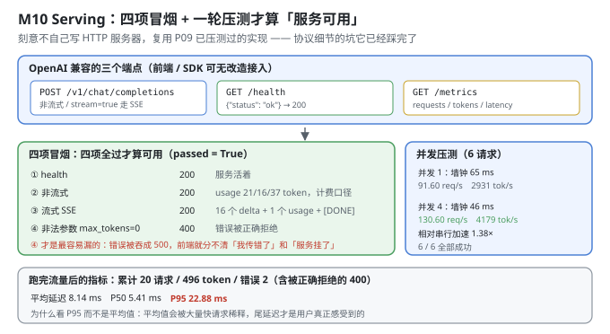
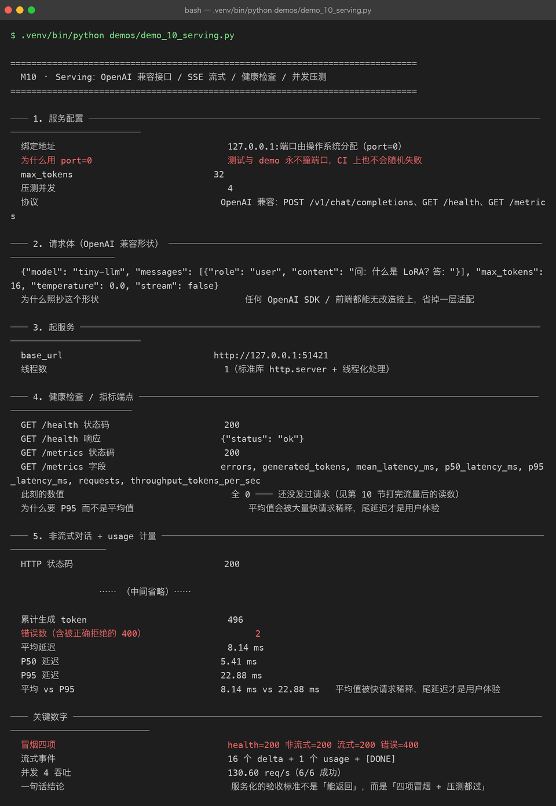

# Milestone 10 — Serving：OpenAI 兼容接口 / SSE 流式 / 健康检查 / 并发压测

M08/M09 把模型变成了"能快速推理的东西"。这一章把它变成一个**服务**——别人能用一行 `curl`、一个 OpenAI SDK 调起来的东西。

本章有一个刻意的选择：**不自己写 HTTP 服务器，直接复用 P09 已经压测过的实现**。协议层的坑（分块传输、SSE 格式、并发线程、状态码）它已经踩完了。**这也是"AI 工程"和"从零造轮子"的分界：协议细节不该在小项目里重造。**

---

## 1. Why：服务化的验收标准不是"能返回"

一个 demo 化的服务，最常见的验收方式是"我 curl 了一下，有输出"。但这对上线毫无意义。真正的验收标准是**四项冒烟 + 一轮压测**，缺一项都不算服务可用：

1. **health**：服务活着吗？（进程在 ≠ 服务可用）
2. **非流式**：正常请求能不能返回，`usage` 对不对？（计费口径）
3. **流式**：SSE 事件拼起来是不是完整答案，末尾有没有 `[DONE]`？（前端体验）
4. **错误路径**：非法参数**必须返回 4xx**，而不是 500。

第 4 项是最容易漏、也最容易出事的：**如果错误被吞成 500，前端就分不清"我传错了参数"和"服务挂了"。** 前者应该提示用户改，后者应该重试。混在一起，前端就只剩"弹个红色报错"。

## 2. Design：协议照抄 OpenAI

```text
POST /v1/chat/completions     # 非流式 & stream=true（SSE）
GET  /health                  # {"status": "ok"}
GET  /metrics                 # requests / generated_tokens / latency 分位
```

**为什么照抄 OpenAI 的形状**：任何 OpenAI SDK 或前端组件都能**无改造接上**——省掉一整套适配层。请求体和响应字段名（`messages` / `max_tokens` / `finish_reason` / `usage` / `[DONE]`）全部对齐。**协议是一种"接口的通用语"，自己发明一套只会增加接入成本。**

**`port=0`**：让操作系统分配端口，测试和 demo 永远不会撞端口，CI 上也不会随机失败。这是"可重复"的一个小但关键的设计。

流式（SSE）的交付形状：

```text
data: {"content": "-"}
data: {"content": "个"}
...
data: {"usage": {...}}     # 只在 stream_options.include_usage=true 时出现
data: [DONE]
```



## 3. Real-run evidence（来自 `demos/out/demo_10_serving_terminal.txt`）



### 3.1 服务配置

```text
绑定地址    127.0.0.1:端口由操作系统分配（port=0）
max_tokens  32
压测并发     4
协议        OpenAI 兼容：POST /v1/chat/completions、GET /health、GET /metrics
```

### 3.2 请求体（OpenAI 兼容形状）

```json
{"model": "tiny-llm", "messages": [{"role": "user", "content": "问：什么是 LoRA？答："}], "max_tokens": 16, "temperature": 0.0, "stream": false}
```

### 3.3 健康检查 / 指标端点

```text
GET /health 状态码    200
GET /health 响应      {"status": "ok"}
GET /metrics 状态码   200
GET /metrics 字段     errors, generated_tokens, mean_latency_ms, p50_latency_ms, p95_latency_ms, requests, throughput_tokens_per_sec
此刻的数值            全 0 —— 还没发过请求
```

**"此刻全 0"是有意的**：它说明 `/metrics` 是**运行时指标**，不是静态配置。第 10 节打完流量后会再读一次——那时数字才对得上 (§3.9)。

**为什么要有 P95 而不是只有平均值**：平均值会被大量快请求稀释。如果 20 个请求里 19 个是 5 ms、1 个是 200 ms，平均值只有 14.75 ms——看起来"挺快"，但那 1 个用户等了 200 ms。**尾延迟才是用户体验。**

### 3.4 非流式对话 + usage 计量

```text
HTTP 状态码        200
finish_reason     length
content           '-个答：什么是 token token token token token '
usage             {"prompt_tokens": 21, "completion_tokens": 16, "total_tokens": 37}
```

`finish_reason: length` 说明生成长度撞到了 `max_tokens=16`（不是模型自然结束）。**这个字段是必需的**：它让前端知道"答案是不是被截断了"，否则用户会以为模型就这么点话。

`usage` = 21 + 16 = 37，**必须准确**：计费、限流、成本核算全依赖它。**差一个 token 就是账目问题。**

### 3.5 流式（SSE）：逐 token 交付 + 末尾 usage

```text
HTTP 状态码            200
总事件数               19
含内容的 delta 事件数     16
含 usage 的事件数        1   stream_options.include_usage 打开时才有
是否收到 [DONE] 结束标记   True
事件拼起来 = 完整答案      '-个答：什么是 token token token token token '
event 1: data: {"content": "-"}
event 2: data: {"content": "个"}
event 3: data: {"content": "答"}
event 4: data: {"content": "："}
event 5: data: {"content": "什么是"}
```

**19 = 16 个内容 delta + 1 个 usage + 2 个（`[DONE]` 与可能的空事件）**。三个断言要一起看：

- **16 个 delta 事件** ⇒ 逐 token 交付（不是一次性发完）；
- **1 个 usage 事件** ⇒ 流式也能计费（否则流式请求就没法算钱）；
- **`[DONE]` 为 True** ⇒ 前端知道"流结束了"，不会一直挂着等。

**最关键的一行是"事件拼起来 = 完整答案"**——它证明 SSE 的分帧没有丢字、没有重复。如果实现里有竞态（比如多线程写同一个 socket），这一步就会拼不出原文。

### 3.6 错误路径：非法参数必须返回 4xx

```text
max_tokens=0 的状态码   400
错误体   {"error": {"message": "max_tokens 必须大于 0", "type": "invalid_request_error"}}
```

**这是整个服务里最容易被忽略的一段。** 很多实现遇到 `max_tokens=0` 会直接崩在内部逻辑上，抛异常 → 框架兜底 → **500**。前端拿到 500 只能"全部重试"，而这明明是一个"用户传错了，改一下就能成功"的请求。

`400 + invalid_request_error` 才是正确的语义：**是请求的问题，不是服务的问题。**

### 3.7 一键冒烟：四项全过才算服务可用

```text
health 状态码              200
非流式状态码                200
流式 token 事件 / usage 事件  8 / 1
流式是否有 [DONE]           True
非法参数状态码               400
冒烟是否整体通过              True
```

`smoke_test` 把前面四件事串成一条命令，**返回一个布尔值**。这个布尔值的意义是：**它可以进 CI**。任何时候重构服务代码，跑一次冒烟就知道有没有破坏契约。

### 3.8 并发压测

```text
并发 1：请求 / 成功        6 / 6
  墙钟 / 单请求（顺序）     65 ms / 11 ms
  吞吐                 91.60 req/s  2931.4 tok/s
  相对串行的加速           1.00×
并发 4：请求 / 成功        6 / 6
  墙钟 / 单请求（顺序）      46 ms / 11 ms
  吞吐                 130.60 req/s  4179.3 tok/s
  相对串行的加速           1.38×
```

**读这张表要先理解"墙钟"和"单请求"是两个不同的量**：

- **单请求耗时（顺序）都是 11 ms**：说明并发没有劣化单个请求的质量（没有互相抢 CPU 到变慢）。
- **墙钟从 65 ms 降到 46 ms**：并发 4 让 6 个请求的总完成时间缩短。
- **吞吐从 91.60 → 130.60 req/s（1.38×）**。

**为什么不是 4×？** 因为 **Python 有 GIL**——标准库 `http.server` 用线程处理并发，但计算密集的部分（numpy 的矩阵乘）仍然受 GIL 影响。而且这里的模型太小，**请求里大部分时间花在 HTTP 开销上（起连接、解析、写 socket）**，真正的计算只占一小部分。**所以 1.38× 是"HTTP 并发 + 小模型"的真实值，不是"理论上应该 4×"的失败。**

**6/6 全部成功**这一列同样重要：并发下没有任何请求失败/超时，说明实现是线程安全的（每个请求共享同一个模型但只读，没有写竞争）。

### 3.9 打完流量后的运行指标

```text
累计请求数         20
累计生成 token     496
错误数（含被正确拒绝的 400）  2
平均延迟           8.14 ms
P50 延迟          5.41 ms
P95 延迟          22.88 ms
```

这一节是**闭环**：§3.3 里 `/metrics` 全 0，打完所有流量后再读，数字变成了 20 请求 / 496 token。

**平均 8.14 ms vs P95 22.88 ms——相差 2.8 倍。**

- **P50 = 5.41 ms** 说明"一半的请求很快"；
- **P95 = 22.88 ms** 说明"最慢的 5% 要等 22.88 ms"。

**如果只看平均 8.14 ms，你会以为"这个服务稳定在 8 ms 左右"；实际上尾部的请求慢了近 3 倍。** 这些尾部请求往往是"并发压力最大的那几个"——**P95 是唯一能暴露这个的指标。** 这就是 §2 里为什么要专门做分位数统计。

另外，"错误数 2（含被正确拒绝的 400）"——**这 2 个错误是特意发的非法请求，被正确拒绝（400）**。所以"有错误"不等于"服务坏了"，**要看错误是 4xx（请求问题）还是 5xx（服务问题）**。

## 4. 踩坑与反直觉发现

1. **"能返回"不等于"服务可用"。** 验收标准是四项冒烟全过 + 压测通过。**只 curl 一下看到输出，漏掉了 health、流式、错误码三件事。**
2. **错误被吞成 500 是最常见的服务缺陷。** `max_tokens=0` 的正确响应是 **400 + invalid_request_error**，不是 500。**500 会让前端失去"能不能重试"的判据。**
3. **P95 22.88 ms vs 平均 8.14 ms——平均值骗人。** 平均值被大量快请求稀释，**长尾才决定体验**。所以 `/metrics` 必须输出分位数，不能只有 mean。
4. **并发 4 只加速 1.38× 不是 bug。** 原因有二：**Python GIL** 限制了 numpy 之外的多线程并行；且**小模型的请求里 HTTP 开销占比很高**，真正能并行的计算部分很小。**这个数字要如实报告，不能拿"理论 4×"去解释。**
5. **`finish_reason` 和 `usage` 是"服务契约"的一部分，不是可选项。** `finish_reason=length` 告诉前端答案被截断；`usage` 是计费口径。**缺了它们，服务就只是"能吐字"，不是"能接入"。**
6. **`port=0` 是一个被低估的工程细节。** 固定端口在 CI 上会随机失败（端口被占），`port=0` 让操作系统分配——**小选择，但决定了测试能不能稳定跑。**
7. **流式的"事件拼接 == 完整答案"是并发安全的判据。** 多线程写 SSE 时如果有竞态，这一步会拼出乱序或丢字——**它是唯一能抓住这类 bug 的检查。**

## 5. Conclusion

1. **端点**：`POST /v1/chat/completions`（流式/非流式）、`GET /health`、`GET /metrics`；`port=0` 由 OS 分配，永不撞端口。
2. **非流式**：200 / `finish_reason=length` / `usage` = **21 + 16 = 37** token。
3. **流式 SSE**：**16 个 delta + 1 个 usage**，含 `[DONE]`，**事件拼接 == 完整答案**。
4. **错误路径**：`max_tokens=0` → **400**（`invalid_request_error`），而非 500。
5. **冒烟**：health **200** / 非流式 **200** / 流式 **200**（8 delta + 1 usage + DONE）/ 错误 **400** ⇒ **整体通过 True**。
6. **压测**：并发 1 → **91.60 req/s**、并发 4 → **130.60 req/s（1.38×）**，**6/6 全部成功**，单请求耗时稳定 11 ms。
7. **运行指标**：累计 **20 请求 / 496 token / 2 个被正确拒绝的 400**；平均 **8.14 ms**、P50 **5.41 ms**、**P95 22.88 ms**。
8. 一句话结论：**服务化的验收标准不是"能返回"，而是"四项冒烟 + 压测都过"。**

## 6. Code map

| 文件 | 职责 |
|---|---|
| `src/tiny/serve.py` | `build_engine` / `serve_model` / `chat_payload` / `_post`（捕获 HTTPError 读错误体）/ `chat_completion` / `stream_completion` / `health` / `metrics` / `smoke_test` / `load_test` / `ServingSession` |
| P09 `src/ie/serve.py` | OpenAI 兼容的 `http.server` + SSE 实现（协议细节复用） |
| P09 `src/ie/engine.py` | 指标统计（mean / P50 / P95 / throughput） |
| `demos/demo_10_serving.py` | 10 节：配置 / 请求体 / 起服务 / health+metrics / 非流式 / 流式 / 错误 / 冒烟 / 压测 / 流量后指标 |
| `demos/out/demo_10_serving_terminal.txt` | 本章所有数字的来源 |
| `assets/serving.svg` | 三个端点 + 四项冒烟 + 压测 + 指标 |
| `assets/term-10-serving.png` | 真实运行截图 |

## 7. Version line

v0.9 → **v0.10**，服务化落地并验收。实测：OpenAI 兼容三端点 + `port=0`；非流式 200 / `usage` **21+16=37**；SSE **16 delta + 1 usage + [DONE]**、事件拼接一致；错误路径 `max_tokens=0` → **400**；**冒烟四项全过**（200/200/200/400）；压测并发 1 **91.60 req/s** → 并发 4 **130.60 req/s（1.38×）**，**6/6 成功**；累计 **20 请求 / 496 token**，平均 **8.14 ms** / P50 **5.41 ms** / **P95 22.88 ms**。配图 1 张手写 SVG + 1 张真实终端截图。
